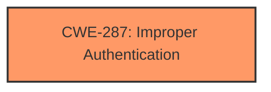

# Raw Analyzer Response for CVE-2020-11301

# Summary
| CWE ID | CWE Name | Confidence | CWE Abstraction Level | CWE Vulnerability Mapping Label | CWE-Vulnerability Mapping Notes |
|---|---|---|---|---|---|
| CWE-287 | Improper Authentication | 0.8 | Class | Primary | Allowed-with-Review |

## Evidence and Confidence

*   **Confidence Score:** 0.8
*   **Evidence Strength:** MEDIUM

## Relationship Analysis
The primary CWE identified is CWE-287, which is a Class-level CWE. While specific Base or Variant level CWEs could potentially provide more granular detail, the vulnerability description focuses primarily on the high-level issue of **improper authentication**. Therefore, focusing on the root cause of **improper authentication** without more information for a specific variant makes CWE-287 the best choice.

## Vulnerability Chain
The vulnerability chain consists of the **improper authentication** of Wi-Fi frames leading to information disclosure.
  - **Root Cause:** **Improper authentication** of un-encrypted plaintext Wi-Fi frames
  - **Impact:** Information disclosure

## Summary of Analysis
The vulnerability description clearly states the root cause as **improper authentication of un-encrypted plaintext Wi-Fi frames in an encrypted network**. This directly aligns with the definition of CWE-287, which covers situations where the product does not adequately verify the identity of an actor, which can be a user, device, or other system. Given the information available, the assessment is primarily based on the vulnerability description, particularly the phrase "**Improper authentication of un-encrypted plaintext Wi-Fi frames in an encrypted network**".

The selection of CWE-287 is at the appropriate level of specificity because the description does not offer enough detail to pinpoint a more specific authentication flaw.

**CWEs Considered But Not Used**
*   CWE-126 (Buffer Over-read): This CWE is about reading beyond the boundaries of a buffer. While information disclosure is mentioned as an impact, the root cause is not related to buffer handling, so this CWE is not applicable.
*   CWE-1314 (Missing Write Protection for Parametric Data Values): This CWE relates to the lack of write protection for parametric data values, which is not directly related to the **improper authentication** described in the vulnerability.
*   CWE-822 (Untrusted Pointer Dereference) and CWE-823 (Use of Out-of-range Pointer Offset): These CWEs are related to pointer handling, which is not mentioned in the vulnerability description.
*   CWE-390 (Detection of Error Condition Without Action): This CWE addresses situations where an error is detected, but no action is taken. The vulnerability description focuses on **improper authentication**, not on error handling.
*   CWE-1285 (Improper Validation of Specified Index, Position, or Offset in Input): This CWE relates to the validation of input indices, positions, or offsets. The root cause, **improper authentication**, is different.
*   CWE-781 (Improper Address Validation in IOCTL with METHOD_NEITHER I/O Control Code): This CWE is specific to IOCTLs and address validation, which is not applicable to the described Wi-Fi frame authentication issue.
*   CWE-367 (Time-of-check Time-of-use (TOCTOU) Race Condition): This CWE involves race conditions, which are not mentioned in the vulnerability description.
*   CWE-252 (Unchecked Return Value): This CWE is about failing to check the return values of functions, which is not relevant to the **improper authentication** issue.
*   CWE-415 (Double Free): This CWE involves freeing the same memory twice, which is unrelated to the authentication issue.