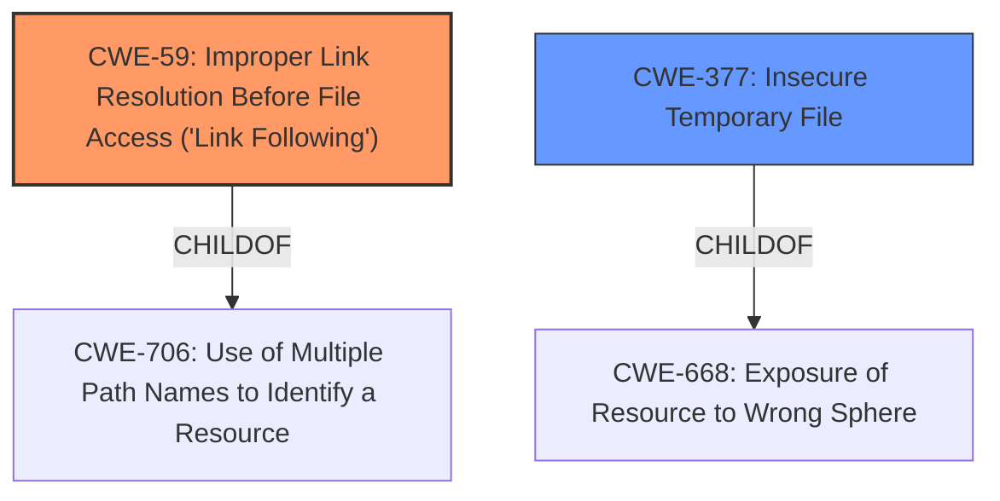

# Analysis Report for CVE-2020-11469

# Vulnerability Analysis Report: CVE-2020-11469

## Description


## Analysis (with Relationship Data)

# Summary
| CWE ID  | CWE Name | Confidence | CWE Abstraction Level | CWE Vulnerability Mapping Label | CWE-Vulnerability Mapping Notes |
|----------------|----------------------------------------------------------------------------|----------------------|--------------------------|------------------------------------|--------------------------------------|
| CWE-59 | Improper Link Resolution Before File Access ('Link Following') | 0.9 | Base | Allowed | Primary CWE |
| CWE-377 | Insecure Temporary File | 0.7 | Class | Allowed-with-Review | Secondary CWE |

## Evidence and Confidence

*   **Confidence Score:** 0.8
*   **Evidence Strength:** HIGH

## Relationship Analysis
The primary CWE selected is CWE-59 (Improper Link Resolution Before File Access ('Link Following')), which is a Base level CWE. CWE-59 is child of CWE-706 (Use of Multiple Path Names to Identify a Resource). A secondary CWE, CWE-377 (Insecure Temporary File), was also considered as the Zoom client copies `runwithroot` to a user-writable temporary directory. CWE-377 is a Class level of abstraction, and might have Base-level children that would be more appropriate.



## Vulnerability Chain
The vulnerability chain starts with the Zoom client copying `runwithroot` to a user-writable temporary directory. A local attacker can then replace this file. When the Zoom client attempts to execute `runwithroot`, it executes the attacker's malicious code with root privileges.

## Summary of Analysis
The initial assessment identified CWE-59 as the primary weakness due to the possibility of replacing a file with a link. The secondary weakness, CWE-377, relates to the insecure use of temporary files.

The vulnerability description states that the Zoom Client for Meetings **copies runwithroot to a user-writable temporary directory** during installation, which allows a local process (with the user's privileges) to obtain root access by replacing `runwithroot`. The CVE Reference Links Content Summary states that the **root cause** is that the Zoom installer uses the deprecated `AuthorizationExecuteWithPrivileges` API to execute a bash script (`runwithroot`) with root privileges. This API **does not validate the executable**, which allows an attacker to replace the script with their own malicious one.

CWE-59 (Improper Link Resolution Before File Access ('Link Following')) is suitable because the attacker replaces the original `runwithroot` file with their own malicious file. When the Zoom client attempts to execute the `runwithroot` script, it executes the attacker's file, achieving privilege escalation to root.

CWE-377 (Insecure Temporary File) is also applicable because the vulnerability involves the insecure creation and use of a temporary file in a user-writable directory.

The selection of CWE-59 and CWE-377 is based on the evidence provided in the vulnerability description and CVE Reference Links Content Summary, focusing on the **root cause** and the specific weakness.

Relevant CWE Information:

# Enhanced Context (25 CWEs)
The following CWEs were identified as potentially relevant to this vulnerability:

## CWE-59: Improper Link Resolution Before File Access ('Link Following')
**Abstraction Level**: Base
**Similarity Score**: 0.78
**Source**: dense

**Description**:
The product attempts to access a file based on the filename, but it **does not properly prevent that filename from identifying a link or shortcut that resolves to an unintended resource.**

**Mapping Guidance**:
- Usage: Allowed
- Rationale: This CWE entry is at the Base level of abstraction, which is a preferred level of abstraction for mapping to the root causes of vulnerabilities.


## CWE-41: Improper Resolution of Path Equivalence
**Abstraction Level**: Base
**Similarity Score**: 0.76
**Source**: dense

**Description**:
The product is vulnerable to file system contents disclosure through path equivalence. Path equivalence involves the use of special characters in file and directory names. The associated manipulations are intended to generate multiple names for the same object.

**Mapping Guidance**:
- Usage: Allowed
- Rationale: This CWE entry is at the Base level of abstraction, which is a preferred level of abstraction for mapping to the root causes of vulnerabilities.


## CWE-667: Improper Locking
**Abstraction Level**: Class
**Similarity Score**: 0.76
**Source**: dense

**Description**:
The product **does not properly acquire or release a lock** on a resource, leading to unexpected resource state changes and behaviors.

**Mapping Guidance**:
- Usage: Allowed-with-Review
- Rationale: This CWE entry is a Class and might have Base-level children that would be more appropriate


## CWE-668: Exposure of Resource to Wrong Sphere
**Abstraction Level**: Class
**Similarity Score**: 0.76
**Source**: dense

**Description**:
The product exposes a resource to the wrong control sphere, providing unintended actors with inappropriate access to the resource.

**Mapping Guidance**:
- Usage: Discouraged
- Rationale: CWE-668 is high-level and is often misused as a catch-all when lower-level CWE IDs might be applicable. It is sometimes used for low-information vulnerability reports [REF-1287]. It is a level-1 Class (i.e., a child of a Pillar). It is not useful for trend analysis.


## CWE-23: Relative Path Traversal
**Abstraction Level**: Base
**Similarity Score**: 0.76
**Source**: dense

**Description**:
The product uses external input to construct a pathname that should be within a restricted directory, but it **does not properly neutralize sequences such as ".."** that can resolve to a location that is outside of that directory.

**Mapping Guidance**:
- Usage: Allowed
- Rationale: This CWE entry is at the Base level of abstraction, which is a preferred level of abstraction for mapping to the root causes of vulnerabilities.


## CWE-73: External Control of File Name or Path
**Abstraction Level**: Base
**Similarity Score**: 0.75
**Source**: dense

**Description**:
The product allows user input to control or influence paths or file names that are used in filesystem operations.

**Mapping Guidance**:
- Usage: Allowed
- Rationale: This CWE entry is at the Base level of abstraction, which is a preferred level of abstraction for mapping to the root causes of vulnerabilities.


## CWE-367: Time-of-check Time-of-use (TOCTOU) Race Condition
**Abstraction Level**: Base
**Similarity Score**: 0.75
**Source**: dense

**Description**:
The product checks the state of a resource before using that resource, but the resource's state can change between the check and the use in a way that invalidates the results of the check. This can cause the product to perform invalid actions when the resource is in an unexpected state.

**Mapping Guidance**:
- Usage: Allowed
- Rationale: This CWE entry is at the Base level of abstraction, which is a preferred level of abstraction for mapping to the root causes of vulnerabilities.


## CWE-552: Files or Directories Accessible to External Parties
**Abstraction Level**: Base
**Similarity Score**: 0.75
**Source**: dense

**Description**:
The product makes files or directories accessible to unauthorized actors, even though they should not be.

**Mapping Guidance**:
- Usage: Allowed
- Rationale: This CWE entry is at the Base level of abstraction, which is a preferred level of abstraction for mapping to the root causes of vulnerabilities.


## CWE-427: Uncontrolled Search Path Element
**Abstraction Level**: Base
**Similarity Score**: 0.74
**Source**: dense

**Description**:
The product uses a fixed or controlled search path to find resources, but one or more locations in that path can be under the control of unintended actors.

**Mapping Guidance**:
- Usage: Allowed
- Rationale: This CWE entry is at the Base level of abstraction, which is a preferred level of abstraction for mapping to the root causes of vulnerabilities.


## CWE-754: Improper Check for Unusual or Exceptional Conditions
**Abstraction Level**: Class
**Similarity Score**: 0.74
**Source**: dense

**Description**:
The product **does not check or incorrectly checks** for unusual or exceptional conditions that are not expected to occur frequently during day to day operation of the product.

**Mapping Guidance**:
- Usage: Allowed-with-Review
- Rationale: This CWE entry is a Class and might have Base-level children that would be more appropriate


## CWE-427: Uncontrolled Search Path Element
**Abstraction Level


## CWE Relationship Analysis

Current CWEs represent these abstraction levels: .


### Vulnerability Chain Analysis

**Chain starting from CWE-667:**
- 667 (Improper Locking) - ROOT


**Chain starting from CWE-754:**
- 754 (Improper Check for Unusual or Exceptional Conditions) - ROOT


### CWE Relationship Diagram

```mermaid
graph TD
    classDef primary fill:#f96,stroke:#333,stroke-width:2px
    classDef secondary fill:#69f,stroke:#333
    classDef tertiary fill:#9e9,stroke:#333
```


*Report generated on 2025-04-02 10:25:15*
