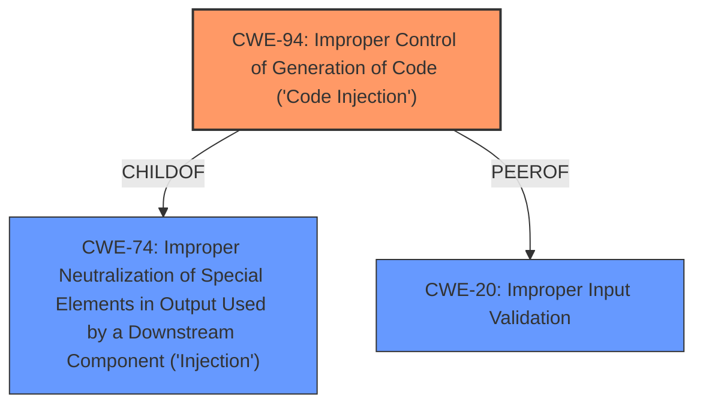

# Enhanced Analysis for CVE-2020-1147

# Summary
| CWE ID | CWE Name | Confidence | CWE Abstraction Level | CWE Vulnerability Mapping Label | CWE-Vulnerability Mapping Notes |
|---|---|---|---|---|---|
| CWE-94 | Improper Control of Generation of Code ('Code Injection') | 0.9 | Base | Allowed-with-Review | Primary CWE |
| CWE-20 | Improper Input Validation | 0.6 | Class | Discouraged | Secondary Candidate |

## Evidence and Confidence

*   **Confidence Score:** 0.75
*   **Evidence Strength:** MEDIUM

## Relationship Analysis
The primary CWE is CWE-94, which falls under the Class CWE-74 (Improper Neutralization of Special Elements in Output Used by a Downstream Component ('Injection')). CWE-94 represents a specific case of code injection where the software constructs a code segment using externally influenced input without proper neutralization.

CWE-20, while a related concern of **improper input validation**, is a higher-level classification. A more specific child of CWE-20 might have been more appropriate, but given the evidence, it appears code generation is the more direct weakness.



## Vulnerability Chain
The vulnerability chain starts with **improper input sanitization**, leading to the ability to inject code, and ultimately resulting in remote code execution.

## Summary of Analysis
The initial analysis focused on the provided vulnerability description, which highlights the **improper input sanitization** as the root cause and remote code execution as the impact. Given this, the retriever results pointed towards CWE-94 (Improper Control of Generation of Code ('Code Injection')) and CWE-20 (Improper Input Validation) as potential candidates.

CWE-94 aligns well with the vulnerability description because it emphasizes the construction of a code segment using externally influenced input, which is the core issue here. The software **fails to check the source markup of XML file input**, leading to code injection. The primary evidence lies in the vulnerability description key phrase "**rootcause: improper input sanitization**" and the overall description of the vulnerability.

While CWE-20 (Improper Input Validation) is also relevant, it is a broader category. The specific issue is not merely a lack of validation but the failure to prevent the construction of malicious code.

Therefore, CWE-94 is the more appropriate and specific classification. The confidence score is 0.9 because the vulnerability description aligns well with the characteristics of CWE-94.

Relevant CWE Information:

# Enhanced Context (25 CWEs)
The following CWEs were identified as potentially relevant to this vulnerability:

## CWE-1289: Improper Validation of Unsafe Equivalence in Input
**Abstraction Level**: Base
**Similarity Score**: 0.75
**Source**: dense

**Description**:
The product receives an input value that is used as a resource identifier or other type of reference, but it does not validate or incorrectly validates that the input is equivalent to a potentially-unsafe value.

**Mapping Guidance**:
- Usage: Allowed
- Rationale: This CWE entry is at the Base level of abstraction, which is a preferred level of abstraction for mapping to the root causes of vulnerabilities.

## CWE-470: Use of Externally-Controlled Input to Select Classes or Code ('Unsafe Reflection')
**Abstraction Level**: Base
**Similarity Score**: 0.74
**Source**: dense

**Description**:
The product uses external input with reflection to select which classes or code to use, but it does not sufficiently prevent the input from selecting improper classes or code.

**Mapping Guidance**:
- Usage: Allowed
- Rationale: This CWE entry is at the Base level of abstraction, which is a preferred level of abstraction for mapping to the root causes of vulnerabilities.

## CWE-74: Improper Neutralization of Special Elements in Output Used by a Downstream Component ('Injection')
**Abstraction Level**: Class
**Similarity Score**: 0.74
**Source**: dense

**Description**:
The product constructs all or part of a command, data structure, or record using externally-influenced input from an upstream component, but it does not neutralize or incorrectly neutralizes special elements that could modify how it is parsed or interpreted when it is sent to a downstream component.

**Mapping Guidance**:
- Usage: Discouraged
- Rationale: CWE-74 is high-level and often misused when lower-level weaknesses are more appropriate.

## CWE-915: Improperly Controlled Modification of Dynamically-Determined Object Attributes
**Abstraction Level**: Base
**Similarity Score**: 0.74
**Source**: dense

**Description**:
The product receives input from an upstream component that specifies multiple attributes, properties, or fields that are to be initialized or updated in an object, but it does not properly control which attributes can be modified.

**Mapping Guidance**:
- Usage: Allowed
- Rationale: This CWE entry is at the Base level of abstraction, which is a preferred level of abstraction for mapping to the root causes of vulnerabilities.

## CWE-838: Inappropriate Encoding for Output Context
**Abstraction Level**: Base
**Similarity Score**: 0.74
**Source**: dense

**Description**:
The product uses or specifies an encoding when generating output to a downstream component, but the specified encoding is not the same as the encoding that is expected by the downstream component.

**Mapping Guidance**:
- Usage: Allowed
- Rationale: This CWE entry is at the Base level of abstraction, which is a preferred level of abstraction for mapping to the root causes of vulnerabilities.

## CWE-80: Improper Neutralization of Script-Related HTML Tags in a Web Page (Basic XSS)
**Abstraction Level**: Variant
**Similarity Score**: 0.74
**Source**: dense

**Description**:
The product receives input from an upstream component, but it does not neutralize or incorrectly neutralizes special characters such as "<", ">", and "&" that could be interpreted as web-scripting elements when they are sent to a downstream component that processes web pages.

**Mapping Guidance**:
- Usage: Allowed
- Rationale: This CWE entry is at the Variant level of abstraction, which is a preferred level of abstraction for mapping to the root causes of vulnerabilities.

## CWE-184: Incomplete List of Disallowed Inputs
**Abstraction Level**: Base
**Similarity Score**: 0.74
**Source**: dense

**Description**:
The product implements a protection mechanism that relies on a list of inputs (or properties of inputs) that are not allowed by policy or otherwise require other action to neutralize before additional processing takes place, but the list is incomplete.

**Mapping Guidance**:
- Usage: Allowed
- Rationale: This CWE entry is at the Base level of abstraction, which is a preferred level of abstraction for mapping to the root causes of vulnerabilities.

## CWE-99: Improper Control of Resource Identifiers ('Resource Injection')
**Abstraction Level**: Class
**Similarity Score**: 0.73
**Source**: dense

**Description**:
The product receives input from an upstream component, but it does not restrict or incorrectly restricts the input before it is used as an identifier for a resource that may be outside the intended sphere of control.

**Mapping Guidance**:
- Usage: Allowed-with-Review
- Rationale: This CWE entry is a Class and might have Base-level children that would be more appropriate

## CWE-917: Improper Neutralization of Special Elements used in an Expression Language Statement ('Expression Language Injection')
**Abstraction Level**: Base
**Similarity Score**: 0.73
**Source**: dense

**Description**:
The product constructs all or part of an expression language (EL) statement in a framework such as a Java Server Page (JSP) using externally-influenced input from an upstream component, but it does not neutralize or incorrectly neutralizes special elements that could modify the intended EL statement before it is executed.

**Mapping Guidance**:
- Usage: Allowed
- Rationale: This CWE entry is at the Base level of abstraction, which is a preferred level of abstraction for mapping to the root causes of vulnerabilities.

## CWE-691: Insufficient Control Flow Management
**Abstraction Level**: Pillar
**Similarity Score**: 0.73
**Source**: dense

**Description**:
The code does not sufficiently manage its control flow during execution, creating conditions in which the control flow can be modified in unexpected ways.

**Mapping Guidance**:
- Usage: Discouraged
- Rationale: This CWE entry is extremely high-level, a Pillar. However, classification research is limited for weaknesses of this type, so there can be gaps or organizational difficulties within CWE that force use of this weakness, even at such a high level of abstraction.

## CWE-116: Improper Encoding or Escaping of Output
**Abstraction


## CWE Relationship Analysis

Current CWEs represent these abstraction levels: .


### Vulnerability Chain Analysis

**Chain starting from CWE-691:**
- 691 (Insufficient Control Flow Management) - ROOT


**Chain starting from CWE-838:**
- 838 (Inappropriate Encoding for Output Context) - ROOT


### CWE Relationship Diagram

```mermaid
graph TD
    classDef primary fill:#f96,stroke:#333,stroke-width:2px
    classDef secondary fill:#69f,stroke:#333
    classDef tertiary fill:#9e9,stroke:#333
```