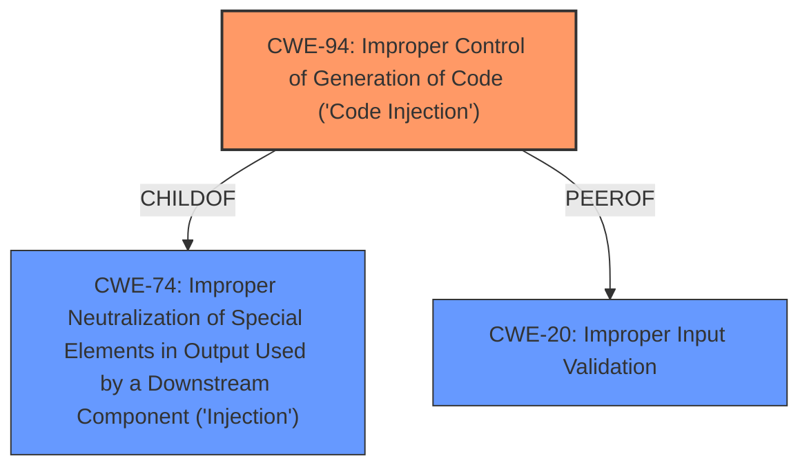

# Analysis for CVE-2020-1147

# Summary
| CWE ID | CWE Name | Confidence | CWE Abstraction Level | CWE Vulnerability Mapping Label | CWE-Vulnerability Mapping Notes |
|---|---|---|---|---|---|
| CWE-94 | Improper Control of Generation of Code ('Code Injection') | 0.9 | Base | Allowed-with-Review | Primary CWE |
| CWE-20 | Improper Input Validation | 0.6 | Class | Discouraged | Secondary Candidate |

## Evidence and Confidence

*   **Confidence Score:** 0.75
*   **Evidence Strength:** MEDIUM

## Relationship Analysis
The primary CWE is CWE-94, which falls under the Class CWE-74 (Improper Neutralization of Special Elements in Output Used by a Downstream Component ('Injection')). CWE-94 represents a specific case of code injection where the software constructs a code segment using externally influenced input without proper neutralization.

CWE-20, while a related concern of **improper input validation**, is a higher-level classification. A more specific child of CWE-20 might have been more appropriate, but given the evidence, it appears code generation is the more direct weakness.

## Vulnerability Chain
The vulnerability chain starts with **improper input sanitization**, leading to the ability to inject code, and ultimately resulting in remote code execution.

## Summary of Analysis
The initial analysis focused on the provided vulnerability description, which highlights the **improper input sanitization** as the root cause and remote code execution as the impact. Given this, the retriever results pointed towards CWE-94 (Improper Control of Generation of Code ('Code Injection')) and CWE-20 (Improper Input Validation) as potential candidates.

CWE-94 aligns well with the vulnerability description because it emphasizes the construction of a code segment using externally influenced input, which is the core issue here. The software **fails to check the source markup of XML file input**, leading to code injection. The primary evidence lies in the vulnerability description key phrase "**rootcause: improper input sanitization**" and the overall description of the vulnerability.

While CWE-20 (Improper Input Validation) is also relevant, it is a broader category. The specific issue is not merely a lack of validation but the failure to prevent the construction of malicious code.

Therefore, CWE-94 is the more appropriate and specific classification. The confidence score is 0.9 because the vulnerability description aligns well with the characteristics of CWE-94.

Relevant CWE Information:

# Enhanced Context (25 CWEs)
The following CWEs were identified as potentially relevant to this vulnerability:

## CWE-1289: Improper Validation of Unsafe Equivalence in Input
**Abstraction Level**: Base
**Similarity Score**: 0.75
**Source**: dense

**Description**:
The product receives an input value that is used as a resource identifier or other type of reference, but it does not validate or incorrectly validates that the input is equivalent to a potentially-unsafe value.

**Mapping Guidance**:
- Usage: Allowed
- Rationale: This CWE entry is at the Base level of abstraction, which is a preferred level of abstraction for mapping to the root causes of vulnerabilities.

## CWE-470: Use of Externally-Controlled Input to Select Classes or Code ('Unsafe Reflection')
**Abstraction Level**: Base
**Similarity Score**: 0.74
**Source**: dense

**Description**:
The product uses external input with reflection to select which classes or code to use, but it does not sufficiently prevent the input from selecting improper classes or code.

**Mapping Guidance**:
- Usage: Allowed
- Rationale: This CWE entry is at the Base level of abstraction, which is a preferred level of abstraction for mapping to the root causes of vulnerabilities.

## CWE-74: Improper Neutralization of Special Elements in Output Used by a Downstream Component ('Injection')
**Abstraction Level**: Class
**Similarity Score**: 0.74
**Source**: dense

**Description**:
The product constructs all or part of a command, data structure, or record using externally-influenced input from an upstream component, but it does not neutralize or incorrectly neutralizes special elements that could modify how it is parsed or interpreted when it is sent to a downstream component.

**Mapping Guidance**:
- Usage: Discouraged
- Rationale: CWE-74 is high-level and often misused when lower-level weaknesses are more appropriate.

## CWE-915: Improperly Controlled Modification of Dynamically-Determined Object Attributes
**Abstraction Level**: Base
**Similarity Score**: 0.74
**Source**: dense

**Description**:
The product receives input from an upstream component that specifies multiple attributes, properties, or fields that are to be initialized or updated in an object, but it does not properly control which attributes can be modified.

**Mapping Guidance**:
- Usage: Allowed
- Rationale: This CWE entry is at the Base level of abstraction, which is a preferred level of abstraction for mapping to the root causes of vulnerabilities.

## CWE-838: Inappropriate Encoding for Output Context
**Abstraction Level**: Base
**Similarity Score**: 0.74
**Source**: dense

**Description**:
The product uses or specifies an encoding when generating output to a downstream component, but the specified encoding is not the same as the encoding that is expected by the downstream component.

**Mapping Guidance**:
- Usage: Allowed
- Rationale: This CWE entry is at the Base level of abstraction, which is a preferred level of abstraction for mapping to the root causes of vulnerabilities.

## CWE-80: Improper Neutralization of Script-Related HTML Tags in a Web Page (Basic XSS)
**Abstraction Level**: Variant
**Similarity Score**: 0.74
**Source**: dense

**Description**:
The product receives input from an upstream component, but it does not neutralize or incorrectly neutralizes special characters such as "<", ">", and "&" that could be interpreted as web-scripting elements when they are sent to a downstream component that processes web pages.

**Mapping Guidance**:
- Usage: Allowed
- Rationale: This CWE entry is at the Variant level of abstraction, which is a preferred level of abstraction for mapping to the root causes of vulnerabilities.

## CWE-184: Incomplete List of Disallowed Inputs
**Abstraction Level**: Base
**Similarity Score**: 0.74
**Source**: dense

**Description**:
The product implements a protection mechanism that relies on a list of inputs (or properties of inputs) that are not allowed by policy or otherwise require other action to neutralize before additional processing takes place, but the list is incomplete.

**Mapping Guidance**:
- Usage: Allowed
- Rationale: This CWE entry is at the Base level of abstraction, which is a preferred level of abstraction for mapping to the root causes of vulnerabilities.

## CWE-99: Improper Control of Resource Identifiers ('Resource Injection')
**Abstraction Level**: Class
**Similarity Score**: 0.73
**Source**: dense

**Description**:
The product receives input from an upstream component, but it does not restrict or incorrectly restricts the input before it is used as an identifier for a resource that may be outside the intended sphere of control.

**Mapping Guidance**:
- Usage: Allowed-with-Review
- Rationale: This CWE entry is a Class and might have Base-level children that would be more appropriate

## CWE-917: Improper Neutralization of Special Elements used in an Expression Language Statement ('Expression Language Injection')
**Abstraction Level**: Base
**Similarity Score**: 0.73
**Source**: dense

**Description**:
The product constructs all or part of an expression language (EL) statement in a framework such as a Java Server Page (JSP) using externally-influenced input from an upstream component, but it does not neutralize or incorrectly neutralizes special elements that could modify the intended EL statement before it is executed.

**Mapping Guidance**:
- Usage: Allowed
- Rationale: This CWE entry is at the Base level of abstraction, which is a preferred level of abstraction for mapping to the root causes of vulnerabilities.

## CWE-691: Insufficient Control Flow Management
**Abstraction Level**: Pillar
**Similarity Score**: 0.73
**Source**: dense

**Description**:
The code does not sufficiently manage its control flow during execution, creating conditions in which the control flow can be modified in unexpected ways.

**Mapping Guidance**:
- Usage: Discouraged
- Rationale: This CWE entry is extremely high-level, a Pillar. However, classification research is limited for weaknesses of this type, so there can be gaps or organizational difficulties within CWE that force use of this weakness, even at such a high level of abstraction.

## CWE-116: Improper Encoding or Escaping of Output
**Abstraction

# Enhanced Query for CVE-2020-1147

## Vulnerability Description
A remote code execution vulnerability exists in .NET Framework, Microsoft SharePoint, and Visual Studio when the software fails to check the source markup of XML file input, aka '.NET Framework, SharePoint Server, and Visual Studio Remote Code Execution Vulnerability'.

### Vulnerability Description Key Phrases
- **rootcause:** **improper input sanitization**
- **impact:** remote code execution
- **product:** ASP.NET and Microsoft SharePoint and Visual Studio

## CVE Reference Links Content Summary
The provided content does not contain any information related to CVE-2020-1147.

NOINFO

## Retriever Results

### Top Combined Results

| Rank | CWE ID | Name | Abstraction | Usage  | Retrievers | Individual Scores |
|------|--------|------|-------------|-------|------------|-------------------|
| 1 | 472 | External Control of Assumed-Immutable Web Parameter | Base | Allowed | sparse | 0.313 |
| 2 | 502 | Deserialization of Untrusted Data | Base | Allowed | sparse | 0.217 |
| 3 | 116 | Improper Encoding or Escaping of Output | Class | Allowed-with-Review | sparse | 0.200 |
| 4 | 119 | Improper Restriction of Operations within the Bounds of a Memory Buffer | Class | Discouraged | sparse | 0.199 |
| 5 | 674 | Uncontrolled Recursion | Class | Allowed-with-Review | sparse | 0.199 |
| 6 | 80 | Improper Neutralization of Script-Related HTML Tags in a Web Page (Basic XSS) | Variant | Allowed | dense | 0.598 |
| 7 | 120 | Buffer Copy without Checking Size of Input ('Classic Buffer Overflow') | Base | Allowed-with-Review | graph | 0.002 |
| 8 | 138 | Improper Neutralization of Special Elements | Class | Discouraged | sparse | 0.199 |
| 9 | 20 | Improper Input Validation | Class | Discouraged | sparse | 0.194 |
| 10 | 94 | Improper Control of Generation of Code ('Code Injection') | Base | Allowed-with-Review | sparse | 0.193 |

# Complete CWE Specifications

## CWE-472: External Control of Assumed-Immutable Web Parameter
**Abstraction:** Base
**Status:** Draft

### Description
The web application does not sufficiently verify inputs that are assumed to be immutable but are actually externally controllable, such as hidden form fields.

### Extended Description

If a web product does not properly protect assumed-immutable values from modification in hidden form fields, parameters, cookies, or URLs, this can lead to modification of critical data. Web applications often mistakenly make the assumption that data passed to the client in hidden fields or cookies is not susceptible to tampering. Improper validation of data that are user-controllable can lead to the application processing incorrect, and often malicious, input.

For example, custom cookies commonly store session data or persistent data across sessions. This kind of session data is normally involved in security related decisions on the server side, such as user authentication and access control. Thus, the cookies might contain sensitive data such as user credentials and privileges. This is a dangerous practice, as it can often lead to improper reliance on the value of the client-provided cookie by the server side application.

### Alternative Terms
Assumed-Immutable Parameter Tampering

### Relationships
ChildOf -> CWE-642
ChildOf -> CWE-471

### Mapping Guidance
**Usage:** Allowed
**Rationale:** This CWE entry is at the Base level of abstraction, which is a preferred level of abstraction for mapping to the root causes of vulnerabilities.
**Comments:** Carefully read both the name and description to ensure that this mapping is an appropriate fit. Do not try to 'force' a mapping to a lower-level Base/Variant simply to comply with this preferred level of abstraction.
**Reasons:**
- Acceptable-Use

### Additional Notes
**[Relationship]** This is a primary weakness for many other weaknesses and functional consequences, including XSS, SQL injection, path disclosure, and file inclusion.

**[Theoretical]** This is a technology-specific MAID problem.

### Observed Examples
- **CVE-2002-0108:** Forum product allows spoofed messages of other users via hidden form fields for name and e-mail address.
- **CVE-2000-0253:** Shopping cart allows price modification via hidden form field.
- **CVE-2000-0254:** Shopping cart allows price modification via hidden form field.

## CWE-502: Deserialization of Untrusted Data
**Abstraction:** Base
**Status:** Draft

### Description
The product deserializes untrusted data without sufficiently ensuring that the resulting data will be valid.

### Extended Description
Not provided

### Alternative Terms
Marshaling, Unmarshaling: Marshaling and unmarshaling are effectively synonyms for serialization and deserialization, respectively.
Pickling, Unpickling: In Python, the "pickle" functionality is used to perform serialization and deserialization.
PHP Object Injection: Some PHP application researchers use this term when attacking unsafe use of the unserialize() function; but it is also used for CWE-915.

### Relationships
ChildOf -> CWE-913
ChildOf -> CWE-913
PeerOf -> CWE-915

### Mapping Guidance
**Usage:** Allowed
**Rationale:** This CWE entry is at the Base level of abstraction, which is a preferred level of abstraction for mapping to the root causes of vulnerabilities.
**Comments:** Carefully read both the name and description to ensure that this mapping is an appropriate fit. Do not try to 'force' a mapping to a lower-level Base/Variant simply to comply with this preferred level of abstraction.
**Reasons:**
- Acceptable-Use

### Additional Notes
**[Maintenance]** The relationships between CWE-502 and CWE-915 need further exploration. CWE-915 is more narrowly scoped to object modification, and is not necessarily used for deserialization.

### Observed Examples
- **CVE-2019-12799:** chain: bypass of untrusted deserialization issue (CWE-502) by using an assumed-trusted class (CWE-183)
- **CVE-2015-8103:** Deserialization issue in commonly-used Java library allows remote execution.
- **CVE-2015-4852:** Deserialization issue in commonly-used Java library allows remote execution.

## CWE-116: Improper Encoding or Escaping of Output
**Abstraction:** Class
**Status:** Draft

### Description
The product prepares a structured message for communication with another component, but encoding or escaping of the data is either missing or done incorrectly. As a result, the intended structure of the message is not preserved.

### Extended Description

Improper encoding or escaping can allow attackers to change the commands that are sent to another component, inserting malicious commands instead.

Most products follow a certain protocol that uses structured messages for communication between components, such as queries or commands. These structured messages can contain raw data interspersed with metadata or control information. For example, "GET /index.html HTTP/1.1" is a structured message containing a command ("GET") with a single argument ("/index.html") and metadata about which protocol version is being used ("HTTP/1.1").

If an application uses attacker-supplied inputs to construct a structured message without properly encoding or escaping, then the attacker could insert special characters that will cause the data to be interpreted as control information or metadata. Consequently, the component that receives the output will perform the wrong operations, or otherwise interpret the data incorrectly.

### Alternative Terms
Output Sanitization
Output Validation
Output Encoding

### Relationships
ChildOf -> CWE-707
CanPrecede -> CWE-74

### Mapping Guidance
**Usage:** Allowed-with-Review
**Rationale:** This CWE entry is a Class and might have Base-level children that would be more appropriate
**Comments:** Examine children of this entry to see if there is a better fit
**Reasons:**
- Abstraction

### Additional Notes
**[Relationship]** This weakness is primary to all weaknesses related to injection (CWE-74) since the inherent nature of injection involves the violation of structured messages.

**[Relationship]** 

CWE-116 and CWE-20 have a close association because, depending on the nature of the structured message, proper input validation can indirectly prevent special characters from changing the meaning of a structured message. For example, by validating that a numeric ID field should only contain the 0-9 characters, the programmer effectively prevents injection attacks.

However, input validation is not always sufficient, especially when less stringent data types must be supported, such as free-form text. Consider a SQL injection scenario in which a last name is inserted into a query. The name "O'Reilly" would likely pass the validation step since it is a common last name in the English language. However, it cannot be directly inserted into the database because it contains the "'" apostrophe character, which would need to be escaped or otherwise neutralized. In this case, stripping the apostrophe might reduce the risk of SQL injection, but it would produce incorrect behavior because the wrong name would be recorded.

**[Terminology]** The usage of the "encoding" and "escaping" terms varies widely. For example, in some programming languages, the terms are used interchangeably, while other languages provide APIs that use both terms for different tasks. This overlapping usage extends to the Web, such as the "escape" JavaScript function whose purpose is stated to be encoding. The concepts of encoding and escaping predate the Web by decades. Given such a context, it is difficult for CWE to adopt a consistent vocabulary that will not be misinterpreted by some constituency.

**[Theoretical]** This is a data/directive boundary error in which data boundaries are not sufficiently enforced before it is sent to a different control sphere.

**[Research Gap]** While many published vulnerabilities are related to insufficient output encoding, there is such an emphasis on input validation as a protection mechanism that the underlying causes are rarely described. Within CVE, the focus is primarily on well-understood issues like cross-site scripting and SQL injection. It is likely that this weakness frequently occurs in custom protocols that support multiple encodings, which are not necessarily detectable with automated techniques.

### Observed Examples
- **CVE-2021-41232:** Chain: authentication routine in Go-based agile development product does not escape user name (CWE-116), allowing LDAP injection (CWE-90)
- **CVE-2008-4636:** OS command injection in backup software using shell metacharacters in a filename; correct behavior would require that this filename could not be changed.
- **CVE-2008-0769:** Web application does not set the charset when sending a page to a browser, allowing for XSS exploitation when a browser chooses an unexpected encoding.

## CWE-119: Improper Restriction of Operations within the Bounds of a Memory Buffer
**Abstraction:** Class
**Status:** Stable

### Description
The product performs operations on a memory buffer, but it reads from or writes to a memory location outside the buffer's intended boundary. This may result in read or write operations on unexpected memory locations that could be linked to other variables, data structures, or internal program data.

### Extended Description
Not provided

### Alternative Terms
Buffer Overflow: This term has many different meanings to different audiences. From a CWE mapping perspective, this term should be avoided where possible. Some researchers, developers, and tools intend for it to mean "write past the end of a buffer," whereas others use the same term to mean "any read or write outside the boundaries of a buffer, whether before the beginning of the buffer or after the end of the buffer." Others could mean "any action after the end of a buffer, whether it is a read or write." Since the term is commonly used for exploitation and for vulnerabilities, it further confuses things.
buffer overrun: Some prominent vendors and researchers use the term "buffer overrun," but most people use "buffer overflow." See the alternate term for "buffer overflow" for context.
memory safety: Generally used for techniques that avoid weaknesses related to memory access, such as those identified by CWE-119 and its descendants. However, the term is not formal, and there is likely disagreement between practitioners as to which weaknesses are implicitly covered by the "memory safety" term.

### Relationships
ChildOf -> CWE-118
ChildOf -> CWE-20

### Mapping Guidance
**Usage:** Discouraged
**Rationale:** CWE-119 is commonly misused in low-information vulnerability reports when lower-level CWEs could be used instead, or when more details about the vulnerability are available.
**Comments:** Look at CWE-119's children and consider mapping to CWEs such as CWE-787: Out-of-bounds Write, CWE-125: Out-of-bounds Read, or others.
**Reasons:**
- Frequent Misuse

### Additional Notes
**[Applicable Platform]** 

It is possible in any programming languages without memory management support to attempt an operation outside of the bounds of a memory buffer, but the consequences will vary widely depending on the language, platform, and chip architecture.

### Observed Examples
- **CVE-2021-22991:** Incorrect URI normalization in application traffic product leads to buffer overflow, as exploited in the wild per CISA KEV.
- **CVE-2020-29557:** Buffer overflow in Wi-Fi router web interface, as exploited in the wild per CISA KEV.
- **CVE-2009-2550:** Classic stack-based buffer overflow in media player using a long entry in a playlist

## CWE-674: Uncontrolled Recursion
**Abstraction:** Class
**Status:** Draft

### Description
The product does not properly control the amount of recursion that takes place,  consuming excessive resources, such as allocated memory or the program stack.

### Extended Description
Not provided

### Alternative Terms
Stack Exhaustion

### Relationships
ChildOf -> CWE-834

### Mapping Guidance
**Usage:** Allowed-with-Review
**Rationale:** This CWE entry is a Class and might have Base-level children that would be more appropriate
**Comments:** Examine children of this entry to see if there is a better fit
**Reasons:**
- Abstraction

### Observed Examples
- **CVE-2007-1285:** Deeply nested arrays trigger stack exhaustion.
- **CVE-2007-3409:** Self-referencing pointers create infinite loop and resultant stack exhaustion.
- **CVE-2016-10707:** Javascript application accidentally changes input in a way that prevents a recursive call from detecting an exit condition.

## CWE-80: Improper Neutralization of Script-Related HTML Tags in a Web Page (Basic XSS)
**Abstraction:** Variant
**Status:** Incomplete

### Description
The product receives input from an upstream component, but it does not neutralize or incorrectly neutralizes special characters such as "<", ">", and "&" that could be interpreted as web-scripting elements when they are sent to a downstream component that processes web pages.

### Extended Description
This may allow such characters to be treated as control characters, which are executed client-side in the context of the user's session. Although this can be classified as an injection problem, the more pertinent issue is the improper conversion of such special characters to respective context-appropriate entities before displaying them to the user.

### Alternative Terms
None

### Relationships
ChildOf -> CWE-79

### Mapping Guidance
**Usage:** Allowed
**Rationale:** This CWE entry is at the Variant level of abstraction, which is a preferred level of abstraction for mapping to the root causes of vulnerabilities.
**Comments:** Carefully read both the name and description to ensure that this mapping is an appropriate fit. Do not try to 'force' a mapping to a lower-level Base/Variant simply to comply with this preferred level of abstraction.
**Reasons:**
- Acceptable-Use

### Observed Examples
- **CVE-2002-0938:** XSS in parameter in a link.
- **CVE-2002-1495:** XSS in web-based email product via attachment filenames.
- **CVE-2003-1136:** HTML injection in posted message.

## CWE-120: Buffer Copy without Checking Size of Input ('Classic Buffer Overflow')
**Abstraction:** Base
**Status:** Incomplete

### Description
The product copies an input buffer to an output buffer without verifying that the size of the input buffer is less than the size of the output buffer, leading to a buffer overflow.

### Extended Description
A buffer overflow condition exists when a product attempts to put more data in a buffer than it can hold, or when it attempts to put data in a memory area outside of the boundaries of a buffer. The simplest type of error, and the most common cause of buffer overflows, is the "classic" case in which the product copies the buffer without restricting how much is copied. Other variants exist, but the existence of a classic overflow strongly suggests that the programmer is not considering even the most basic of security protections.

### Alternative Terms
Classic Buffer Overflow: This term was frequently used by vulnerability researchers during approximately 1995 to 2005 to differentiate buffer copies without length checks (which had been known about for decades) from other emerging weaknesses that still involved invalid accesses of buffers, as vulnerability researchers began to develop advanced exploitation techniques.
Unbounded Transfer

### Relationships
ChildOf -> CWE-119
ChildOf -> CWE-119
ChildOf -> CWE-119
ChildOf -> CWE-119
CanPrecede -> CWE-123
ChildOf -> CWE-20

### Mapping Guidance
**Usage:** Allowed-with-Review
**Rationale:** There are some indications that this CWE ID might be misused and selected simply because it mentions "buffer overflow" - an increasingly vague term. This CWE entry is only appropriate for "Buffer Copy" operations (not buffer reads), in which where there is no "Checking [the] Size of Input", and (by implication of the copy) writing past the end of the buffer.
**Comments:** If the vulnerability being analyzed involves out-of-bounds reads, then consider CWE-125 or descendants. For root cause analysis: if there is any input validation, consider children of CWE-20 such as CWE-1284. If there is a calculation error for buffer sizes, consider CWE-131 or similar.
**Reasons:**
- Frequent Misuse

### Additional Notes
**[Relationship]** At the code level, stack-based and heap-based overflows do not differ significantly, so there usually is not a need to distinguish them. From the attacker perspective, they can be quite different, since different techniques are required to exploit them.

**[Terminology]** Many issues that are now called "buffer overflows" are substantively different than the "classic" overflow, including entirely different bug types that rely on overflow exploit techniques, such as integer signedness errors, integer overflows, and format string bugs. This imprecise terminology can make it difficult to determine which variant is being reported.

### Observed Examples
- **CVE-2000-1094:** buffer overflow using command with long argument
- **CVE-1999-0046:** buffer overflow in local program using long environment variable
- **CVE-2002-1337:** buffer overflow in comment characters, when product increments a counter for a ">" but does not decrement for "<"

## CWE-138: Improper Neutralization of Special Elements
**Abstraction:** Class
**Status:** Draft

### Description
The product receives input from an upstream component, but it does not neutralize or incorrectly neutralizes special elements that could be interpreted as control elements or syntactic markers when they are sent to a downstream component.

### Extended Description
Most languages and protocols have their own special elements such as characters and reserved words. These special elements can carry control implications. If product does not prevent external control or influence over the inclusion of such special elements, the control flow of the program may be altered from what was intended. For example, both Unix and Windows interpret the symbol < ("less than") as meaning "read input from a file".

### Alternative Terms
None

### Relationships
ChildOf -> CWE-707

### Mapping Guidance
**Usage:** Discouraged
**Rationale:** This CWE entry is a level-1 Class (i.e., a child of a Pillar). It might have lower-level children that would be more appropriate
**Comments:** Examine children of this entry to see if there is a better fit
**Reasons:**
- Abstraction

### Additional Notes
**[Relationship]** This weakness can be related to interpretation conflicts or interaction errors in intermediaries (such as proxies or application firewalls) when the intermediary's model of an endpoint does not account for protocol-specific special elements.

**[Relationship]** See this entry's children for different types of special elements that have been observed at one point or another. However, it can be difficult to find suitable CVE examples. In an attempt to be complete, CWE includes some types that do not have any associated observed example.

**[Research Gap]** This weakness is probably under-studied for proprietary or custom formats. It is likely that these issues are fairly common in applications that use their own custom format for configuration files, logs, meta-data, messaging, etc. They would only be found by accident or with a focused effort based on an understanding of the format.

### Observed Examples
- **CVE-2001-0677:** Read arbitrary files from mail client by providing a special MIME header that is internally used to store pathnames for attachments.
- **CVE-2000-0703:** Setuid program does not cleanse special escape sequence before sending data to a mail program, causing the mail program to process those sequences.
- **CVE-2003-0020:** Multi-channel issue. Terminal escape sequences not filtered from log files.

## CWE-20: Improper Input Validation
**Abstraction:** Class
**Status:** Stable

### Description
The product receives input or data, but it does
        not validate or incorrectly validates that the input has the
        properties that are required to process the data safely and
        correctly.

### Extended Description

Input validation is a frequently-used technique for checking potentially dangerous inputs in order to ensure that the inputs are safe for processing within the code, or when communicating with other components. When software does not validate input properly, an attacker is able to craft the input in a form that is not expected by the rest of the application. This will lead to parts of the system receiving unintended input, which may result in altered control flow, arbitrary control of a resource, or arbitrary code execution.

Input validation is not the only technique for processing input, however. Other techniques attempt to transform potentially-dangerous input into something safe, such as filtering (CWE-790) - which attempts to remove dangerous inputs - or encoding/escaping (CWE-116), which attempts to ensure that the input is not misinterpreted when it is included in output to another component. Other techniques exist as well (see CWE-138 for more examples.)

Input validation can be applied to:

  - raw data - strings, numbers, parameters, file contents, etc.

  - metadata - information about the raw data, such as headers or size

Data can be simple or structured. Structured data can be composed of many nested layers, composed of combinations of metadata and raw data, with other simple or structured data.

Many properties of raw data or metadata may need to be validated upon entry into the code, such as:

  - specified quantities such as size, length, frequency, price, rate, number of operations, time, etc.

  - implied or derived quantities, such as the actual size of a file instead of a specified size

  - indexes, offsets, or positions into more complex data structures

  - symbolic keys or other elements into hash tables, associative arrays, etc.

  - well-formedness, i.e. syntactic correctness - compliance with expected syntax 

  - lexical token correctness - compliance with rules for what is treated as a token

  - specified or derived type - the actual type of the input (or what the input appears to be)

  - consistency - between individual data elements, between raw data and metadata, between references, etc.

  - conformance to domain-specific rules, e.g. business logic 

  - equivalence - ensuring that equivalent inputs are treated the same

  - authenticity, ownership, or other attestations about the input, e.g. a cryptographic signature to prove the source of the data

Implied or derived properties of data must often be calculated or inferred by the code itself. Errors in deriving properties may be considered a contributing factor to improper input validation. 

Note that "input validation" has very different meanings to different people, or within different classification schemes. Caution must be used when referencing this CWE entry or mapping to it. For example, some weaknesses might involve inadvertently giving control to an attacker over an input when they should not be able to provide an input at all, but sometimes this is referred to as input validation.

Finally, it is important to emphasize that the distinctions between input validation and output escaping are often blurred, and developers must be careful to understand the difference, including how input validation is not always sufficient to prevent vulnerabilities, especially when less stringent data types must be supported, such as free-form text. Consider a SQL injection scenario in which a person's last name is inserted into a query. The name "O'Reilly" would likely pass the validation step since it is a common last name in the English language. However, this valid name cannot be directly inserted into the database because it contains the "'" apostrophe character, which would need to be escaped or otherwise transformed. In this case, removing the apostrophe might reduce the risk of SQL injection, but it would produce incorrect behavior because the wrong name would be recorded.

### Alternative Terms
None

### Relationships
ChildOf -> CWE-707
PeerOf -> CWE-345
CanPrecede -> CWE-22
CanPrecede -> CWE-41
CanPrecede -> CWE-74
CanPrecede -> CWE-119
CanPrecede -> CWE-770

### Mapping Guidance
**Usage:** Discouraged
**Rationale:** CWE-20 is commonly misused in low-information vulnerability reports when lower-level CWEs could be used instead, or when more details about the vulnerability are available [REF-1287]. It is not useful for trend analysis. It is also a level-1 Class (i.e., a child of a Pillar).
**Comments:** Consider lower-level children such as Improper Use of Validation Framework (CWE-1173) or improper validation involving specific types or properties of input such as Specified Quantity (CWE-1284); Specified Index, Position, or Offset (CWE-1285); Syntactic Correctness (CWE-1286); Specified Type (CWE-1287); Consistency within Input (CWE-1288); or Unsafe Equivalence (CWE-1289).
**Reasons:**
- Frequent Misuse
**Suggested Alternatives:**
- CWE-1284: Specified Quantity
- CWE-1285: Specified Index, Position, or Offset
- CWE-1286: Syntactic Correctness
- CWE-1287: Specified Type
- CWE-1288: Consistency within Input
- CWE-1289: Unsafe Equivalence
- CWE-116: Improper Encoding or Escaping of Output

### Additional Notes
**[Relationship]** 

CWE-116 and CWE-20 have a close association because, depending on the nature of the structured message, proper input validation can indirectly prevent special characters from changing the meaning of a structured message. For example, by validating that a numeric ID field should only contain the 0-9 characters, the programmer effectively prevents injection attacks.

**[Maintenance]** As of 2020, this entry is used more often than preferred, and it is a source of frequent confusion. It is being actively modified for CWE 4.1 and subsequent versions.

**[Maintenance]** Concepts such as validation, data transformation, and neutralization are being refined, so relationships between CWE-20 and other entries such as CWE-707 may change in future versions, along with an update to the Vulnerability Theory document.

**[Maintenance]** Input validation - whether missing or incorrect - is such an essential and widespread part of secure development that it is implicit in many different weaknesses. Traditionally, problems such as buffer overflows and XSS have been classified as input validation problems by many security professionals. However, input validation is not necessarily the only protection mechanism available for avoiding such problems, and in some cases it is not even sufficient. The CWE team has begun capturing these subtleties in chains within the Research Concepts view (CWE-1000), but more work is needed.

**[Terminology]** 

The "input validation" term is extremely common, but it is used in many different ways. In some cases its usage can obscure the real underlying weakness or otherwise hide chaining and composite relationships.

Some people use "input validation" as a general term that covers many different neutralization techniques for ensuring that input is appropriate, such as filtering, canonicalization, and escaping. Others use the term in a more narrow context to simply mean "checking if an input conforms to expectations without changing it." CWE uses this more narrow interpretation.

### Observed Examples
- **CVE-2024-37032:** Large language model (LLM) management tool does not validate the format of a digest value (CWE-1287) from a private, untrusted model registry, enabling relative path traversal (CWE-23), a.k.a. Probllama
- **CVE-2022-45918:** Chain: a learning management tool debugger uses external input to locate previous session logs (CWE-73) and does not properly validate the given path (CWE-20), allowing for filesystem path traversal using "../" sequences (CWE-24)
- **CVE-2021-30860:** Chain: improper input validation (CWE-20) leads to integer overflow (CWE-190) in mobile OS, as exploited in the wild per CISA KEV.

## CWE-94: Improper Control of Generation of Code ('Code Injection')
**Abstraction:** Base
**Status:** Draft

### Description
The product constructs all or part of a code segment using externally-influenced input from an upstream component, but it does not neutralize or incorrectly neutralizes special elements that could modify the syntax or behavior of the intended code segment.

### Extended Description

When a product allows a user's input to contain code syntax, it might be possible for an attacker to craft the code in such a way that it will alter the intended control flow of the product. Such an alteration could lead to arbitrary code execution.

Injection problems encompass a wide variety of issues -- all mitigated in very different ways. For this reason, the most effective way to discuss these weaknesses is to note the distinct features which classify them as injection weaknesses. The most important issue to note is that all injection problems share one thing in common -- i.e., they allow for the injection of control plane data into the user-controlled data plane. This means that the execution of the process may be altered by sending code in through legitimate data channels, using no other mechanism. While buffer overflows, and many other flaws, involve the use of some further issue to gain execution, injection problems need only for the data to be parsed. The most classic instantiations of this category of weakness are SQL injection and format string vulnerabilities.

### Alternative Terms
None

### Relationships
ChildOf -> CWE-74
ChildOf -> CWE-74
ChildOf -> CWE-913

### Mapping Guidance
**Usage:** Allowed-with-Review
**Rationale:** This entry is frequently misused for vulnerabilities with a technical impact of "code execution," which does not by itself indicate a root cause weakness, since dozens of weaknesses can enable code execution.
**Comments:** This weakness only applies when the product's functionality intentionally constructs all or part of a code segment. It could be that executing code could be the result of other weaknesses that do not involve the construction of code segments.
**Reasons:**
- Frequent Misuse
- Frequent Misinterpretation

### Observed Examples
- **CVE-2023-29374:** Math component in an LLM framework translates user input into a Python expression that is input into the Python exec() method, allowing code execution - one variant of a "prompt injection" attack.
- **CVE-2024-5565:** Python-based library uses an LLM prompt containing user input to dynamically generate code that is then fed as input into the Python exec() method, allowing code execution - one variant of a "prompt injection" attack.
- **CVE-2024-4181:** Framework for LLM applications allows eval injection via a crafted response from a hosting provider.

