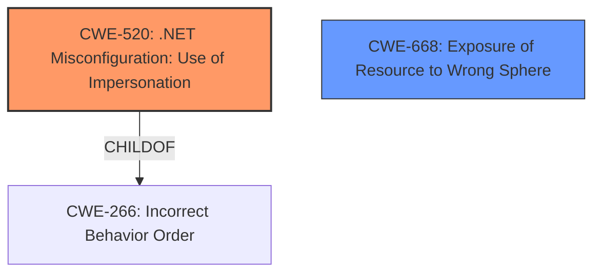

# Analysis for CVE-2020-11492

# Summary
| CWE ID | CWE Name | Confidence | CWE Abstraction Level | CWE Vulnerability Mapping Label | CWE-Vulnerability Mapping Notes |
|---|---|---|---|---|---|
| CWE-520 | .NET Misconfiguration: Use of Impersonation | 0.8 | Variant | Allowed | Primary CWE |
| CWE-668 | Exposure of Resource to Wrong Sphere | 0.5 | Class | Discouraged | Secondary Candidate |

## Evidence and Confidence

*   **Confidence Score:** 0.7
*   **Evidence Strength:** MEDIUM

## Relationship Analysis
The primary relationship influencing the CWE selection is the hierarchical relationship. CWE-520 is a Variant of CWE-266: Incorrect Behavior Order. There is insufficient evidence to determine a vulnerability chain beyond the immediate weakness. Abstraction levels were considered to select the most specific CWE available, leading to the selection of Variant CWE-520 over its Class parent.

## Vulnerability Chain
The chain of weaknesses begins with the **IMPROPER** configuration, leading to privilege escalation through the use of named pipes. The root cause is the **INCORRECT** use of impersonation leading to the impact of privilege escalation.
1.  **Improper** Configuration of Docker Desktop Service
2.  Named pipe connection by high-privilege service
3.  Privilege Escalation

## Summary of Analysis
The analysis is based on the provided vulnerability description and the "CVE Reference Links Content Summary." The key evidence is the **WEAKNESS** of the Docker Desktop Service acting as a client to named pipes without disabling impersonation, allowing a local attacker to **IMPERSONATE** privileges.

The retriever results suggest several CWEs, but the most relevant is CWE-520.

CWE-520 is selected because the vulnerability involves a .NET application (Docker Desktop on Windows) being tricked into **IMPERSONATING** a lower-privileged process, leading to privilege escalation. The "CVE Reference Links Content Summary" states that the "high privilege Docker Desktop Service acts as a client to named pipes, and does not disable impersonation. The server side of a named pipe connection has the ability to **IMPERSONATE** the connecting client account. Since the Docker Desktop Service connects to the malicious pipe, it can be **IMPERSONATED**."

CWE-668 was considered because the vulnerability involves exposing a resource (the Docker service's privileges) to the wrong sphere (a lower-privileged process). However, CWE-520 is a more precise match because it specifically addresses the .NET misconfiguration related to **IMPERSONATION**.

The selected CWEs are at the optimal level of specificity. CWE-520 is a Variant that accurately represents the **WEAKNESS**, while CWE-668 is a Class that is too general. The final selection is based on the evidence provided and the relationships between the CWEs, resulting in a confident mapping to CWE-520.

Relevant CWE Information:

# Enhanced Context (25 CWEs)
The following CWEs were identified as potentially relevant to this vulnerability:

## CWE-59: Improper Link Resolution Before File Access ('Link Following')
**Abstraction Level**: Base
**Similarity Score**: 0.79
**Source**: dense

**Description**:
The product attempts to access a file based on the filename, but it does not properly prevent that filename from identifying a link or shortcut that resolves to an unintended resource.

**Mapping Guidance**:
- Usage: Allowed
- Rationale: This CWE entry is at the Base level of abstraction, which is a preferred level of abstraction for mapping to the root causes of vulnerabilities.

## CWE-1391: Use of Weak Credentials
**Abstraction Level**: Class
**Similarity Score**: 0.79
**Source**: dense

**Description**:
The product uses weak credentials (such as a default key or hard-coded password) that can be calculated, derived, reused, or guessed by an attacker.

**Mapping Guidance**:
- Usage: Allowed-with-Review
- Rationale: This CWE entry is a Class and might have Base-level children that would be more appropriate

## CWE-345: Insufficient Verification of Data Authenticity
**Abstraction Level**: Class
**Similarity Score**: 0.79
**Source**: dense

**Description**:
The product does not sufficiently verify the origin or authenticity of data, in a way that causes it to accept invalid data.

**Mapping Guidance**:
- Usage: Discouraged
- Rationale: This CWE entry is a level-1 Class (i.e., a child of a Pillar). It might have lower-level children that would be more appropriate

## CWE-798: Use of Hard-coded Credentials
**Abstraction Level**: Base
**Similarity Score**: 0.78
**Source**: dense

**Description**:
The product contains hard-coded credentials, such as a password or cryptographic key.

**Mapping Guidance**:
- Usage: Allowed
- Rationale: This CWE entry is at the Base level of abstraction, which is a preferred level of abstraction for mapping to the root causes of vulnerabilities.

## CWE-668: Exposure of Resource to Wrong Sphere
**Abstraction Level**: Class
**Similarity Score**: 0.78
**Source**: dense

**Description**:
The product exposes a resource to the wrong control sphere, providing unintended actors with inappropriate access to the resource.

**Mapping Guidance**:
- Usage: Discouraged
- Rationale: CWE-668 is high-level and is often misused as a catch-all when lower-level CWE IDs might be applicable. It is sometimes used for low-information vulnerability reports [REF-1287]. It is a level-1 Class (i.e., a child of a Pillar). It is not useful for trend analysis.

## CWE-667: Improper Locking
**Abstraction Level**: Class
**Similarity Score**: 0.77
**Source**: dense

**Description**:
The product does not properly acquire or release a lock on a resource, leading to unexpected resource state changes and behaviors.

**Mapping Guidance**:
- Usage: Allowed-with-Review
- Rationale: This CWE entry is a Class and might have Base-level children that would be more appropriate

## CWE-41: Improper Resolution of Path Equivalence
**Abstraction Level**: Base
**Similarity Score**: 0.77
**Source**: dense

**Description**:
The product is vulnerable to file system contents disclosure through path equivalence. Path equivalence involves the use of special characters in file and directory names. The associated manipulations are intended to generate multiple names for the same object.

**Mapping Guidance**:
- Usage: Allowed
- Rationale: This CWE entry is at the Base level of abstraction, which is a preferred level of abstraction for mapping to the root causes of vulnerabilities.

## CWE-280: Improper Handling of Insufficient Permissions or Privileges
**Abstraction Level**: Base
**Similarity Score**: 0.77
**Source**: dense

**Description**:
The product does not handle or incorrectly handles when it has insufficient privileges to access resources or functionality as specified by their permissions. This may cause it to follow unexpected code paths that may leave the product in an invalid state.

**Mapping Guidance**:
- Usage: Allowed
- Rationale: This CWE entry is at the Base level of abstraction, which is a preferred level of abstraction for mapping to the root causes of vulnerabilities.

## CWE-330: Use of Insufficiently Random Values
**Abstraction Level**: Class
**Similarity Score**: 0.77
**Source**: dense

**Description**:
The product uses insufficiently random numbers or values in a security context that depends on unpredictable numbers.

**Mapping Guidance**:
- Usage: Discouraged
- Rationale: This CWE entry is a level-1 Class (i.e., a child of a Pillar). It might have lower-level children that would be more appropriate

## CWE-303: Incorrect Implementation of Authentication Algorithm
**Abstraction Level**: Base
**Similarity Score**: 0.77
**Source**: dense

**Description**:
The requirements for the product dictate the use of an established authentication algorithm, but the implementation of the algorithm is incorrect.

**Mapping Guidance**:
- Usage: Allowed
- Rationale: This CWE entry is at the Base level of abstraction, which is a preferred level of abstraction for mapping to the root causes of vulnerabilities.

## CWE-367: Time-of-check Time-of-use (TOCTOU) Race Condition
**Abstraction Level**: Base
**Similarity Score**: 5703.35
**Source**: sparse

**Description**:
The product checks the state of a resource before using that resource, but the resource's state can change between the check and the use in a way that invalidates the results of the check. This can cause