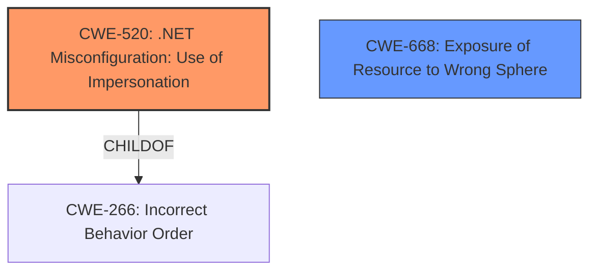

# Analysis for CVE-2020-11492

# Summary
| CWE ID | CWE Name | Confidence | CWE Abstraction Level | CWE Vulnerability Mapping Label | CWE-Vulnerability Mapping Notes |
|---|---|---|---|---|---|
| CWE-520 | .NET Misconfiguration: Use of Impersonation | 0.8 | Variant | Allowed | Primary CWE |
| CWE-668 | Exposure of Resource to Wrong Sphere | 0.5 | Class | Discouraged | Secondary Candidate |

## Evidence and Confidence

*   **Confidence Score:** 0.7
*   **Evidence Strength:** MEDIUM

## Relationship Analysis
The primary relationship influencing the CWE selection is the hierarchical relationship. CWE-520 is a Variant of CWE-266: Incorrect Behavior Order. There is insufficient evidence to determine a vulnerability chain beyond the immediate weakness. Abstraction levels were considered to select the most specific CWE available, leading to the selection of Variant CWE-520 over its Class parent.

## Vulnerability Chain
The chain of weaknesses begins with the **IMPROPER** configuration, leading to privilege escalation through the use of named pipes. The root cause is the **INCORRECT** use of impersonation leading to the impact of privilege escalation.
1.  **Improper** Configuration of Docker Desktop Service
2.  Named pipe connection by high-privilege service
3.  Privilege Escalation

## Summary of Analysis
The analysis is based on the provided vulnerability description and the "CVE Reference Links Content Summary." The key evidence is the **WEAKNESS** of the Docker Desktop Service acting as a client to named pipes without disabling impersonation, allowing a local attacker to **IMPERSONATE** privileges.

The retriever results suggest several CWEs, but the most relevant is CWE-520.

CWE-520 is selected because the vulnerability involves a .NET application (Docker Desktop on Windows) being tricked into **IMPERSONATING** a lower-privileged process, leading to privilege escalation. The "CVE Reference Links Content Summary" states that the "high privilege Docker Desktop Service acts as a client to named pipes, and does not disable impersonation. The server side of a named pipe connection has the ability to **IMPERSONATE** the connecting client account. Since the Docker Desktop Service connects to the malicious pipe, it can be **IMPERSONATED**."

CWE-668 was considered because the vulnerability involves exposing a resource (the Docker service's privileges) to the wrong sphere (a lower-privileged process). However, CWE-520 is a more precise match because it specifically addresses the .NET misconfiguration related to **IMPERSONATION**.

The selected CWEs are at the optimal level of specificity. CWE-520 is a Variant that accurately represents the **WEAKNESS**, while CWE-668 is a Class that is too general. The final selection is based on the evidence provided and the relationships between the CWEs, resulting in a confident mapping to CWE-520.

Relevant CWE Information:

# Enhanced Context (25 CWEs)
The following CWEs were identified as potentially relevant to this vulnerability:

## CWE-59: Improper Link Resolution Before File Access ('Link Following')
**Abstraction Level**: Base
**Similarity Score**: 0.79
**Source**: dense

**Description**:
The product attempts to access a file based on the filename, but it does not properly prevent that filename from identifying a link or shortcut that resolves to an unintended resource.

**Mapping Guidance**:
- Usage: Allowed
- Rationale: This CWE entry is at the Base level of abstraction, which is a preferred level of abstraction for mapping to the root causes of vulnerabilities.

## CWE-1391: Use of Weak Credentials
**Abstraction Level**: Class
**Similarity Score**: 0.79
**Source**: dense

**Description**:
The product uses weak credentials (such as a default key or hard-coded password) that can be calculated, derived, reused, or guessed by an attacker.

**Mapping Guidance**:
- Usage: Allowed-with-Review
- Rationale: This CWE entry is a Class and might have Base-level children that would be more appropriate

## CWE-345: Insufficient Verification of Data Authenticity
**Abstraction Level**: Class
**Similarity Score**: 0.79
**Source**: dense

**Description**:
The product does not sufficiently verify the origin or authenticity of data, in a way that causes it to accept invalid data.

**Mapping Guidance**:
- Usage: Discouraged
- Rationale: This CWE entry is a level-1 Class (i.e., a child of a Pillar). It might have lower-level children that would be more appropriate

## CWE-798: Use of Hard-coded Credentials
**Abstraction Level**: Base
**Similarity Score**: 0.78
**Source**: dense

**Description**:
The product contains hard-coded credentials, such as a password or cryptographic key.

**Mapping Guidance**:
- Usage: Allowed
- Rationale: This CWE entry is at the Base level of abstraction, which is a preferred level of abstraction for mapping to the root causes of vulnerabilities.

## CWE-668: Exposure of Resource to Wrong Sphere
**Abstraction Level**: Class
**Similarity Score**: 0.78
**Source**: dense

**Description**:
The product exposes a resource to the wrong control sphere, providing unintended actors with inappropriate access to the resource.

**Mapping Guidance**:
- Usage: Discouraged
- Rationale: CWE-668 is high-level and is often misused as a catch-all when lower-level CWE IDs might be applicable. It is sometimes used for low-information vulnerability reports [REF-1287]. It is a level-1 Class (i.e., a child of a Pillar). It is not useful for trend analysis.

## CWE-667: Improper Locking
**Abstraction Level**: Class
**Similarity Score**: 0.77
**Source**: dense

**Description**:
The product does not properly acquire or release a lock on a resource, leading to unexpected resource state changes and behaviors.

**Mapping Guidance**:
- Usage: Allowed-with-Review
- Rationale: This CWE entry is a Class and might have Base-level children that would be more appropriate

## CWE-41: Improper Resolution of Path Equivalence
**Abstraction Level**: Base
**Similarity Score**: 0.77
**Source**: dense

**Description**:
The product is vulnerable to file system contents disclosure through path equivalence. Path equivalence involves the use of special characters in file and directory names. The associated manipulations are intended to generate multiple names for the same object.

**Mapping Guidance**:
- Usage: Allowed
- Rationale: This CWE entry is at the Base level of abstraction, which is a preferred level of abstraction for mapping to the root causes of vulnerabilities.

## CWE-280: Improper Handling of Insufficient Permissions or Privileges
**Abstraction Level**: Base
**Similarity Score**: 0.77
**Source**: dense

**Description**:
The product does not handle or incorrectly handles when it has insufficient privileges to access resources or functionality as specified by their permissions. This may cause it to follow unexpected code paths that may leave the product in an invalid state.

**Mapping Guidance**:
- Usage: Allowed
- Rationale: This CWE entry is at the Base level of abstraction, which is a preferred level of abstraction for mapping to the root causes of vulnerabilities.

## CWE-330: Use of Insufficiently Random Values
**Abstraction Level**: Class
**Similarity Score**: 0.77
**Source**: dense

**Description**:
The product uses insufficiently random numbers or values in a security context that depends on unpredictable numbers.

**Mapping Guidance**:
- Usage: Discouraged
- Rationale: This CWE entry is a level-1 Class (i.e., a child of a Pillar). It might have lower-level children that would be more appropriate

## CWE-303: Incorrect Implementation of Authentication Algorithm
**Abstraction Level**: Base
**Similarity Score**: 0.77
**Source**: dense

**Description**:
The requirements for the product dictate the use of an established authentication algorithm, but the implementation of the algorithm is incorrect.

**Mapping Guidance**:
- Usage: Allowed
- Rationale: This CWE entry is at the Base level of abstraction, which is a preferred level of abstraction for mapping to the root causes of vulnerabilities.

## CWE-367: Time-of-check Time-of-use (TOCTOU) Race Condition
**Abstraction Level**: Base
**Similarity Score**: 5703.35
**Source**: sparse

**Description**:
The product checks the state of a resource before using that resource, but the resource's state can change between the check and the use in a way that invalidates the results of the check. This can cause

# Enhanced Query for CVE-2020-11492

## Vulnerability Description
An issue was discovered in Docker Desktop through 2.2.0.5 on Windows. If a local attacker sets up their own named pipe prior to starting Docker with the same name, this attacker can intercept a connection attempt from Docker Service (which runs as SYSTEM), and then impersonate their privileges.

### Vulnerability Description Key Phrases
- **impact:** impersonate privileges
- **vector:** setting up named pipe
- **attacker:** local attacker
- **product:** Docker Desktop
- **version:** through 2.2.0.5

## CVE Reference Links Content Summary
## CVE-2020-11492

Based on the provided content, here's a breakdown of the vulnerability:

*   **Vulnerability:** Privilege Escalation in Docker Desktop for Windows.

*   **Root Cause:** The Docker Desktop Service, which runs with SYSTEM privileges, communicates with child processes using named pipes. This service can be tricked into connecting to a named pipe set up by a lower-privileged malicious process.

*   **Weakness:** The high privilege Docker Desktop Service acts as a client to named pipes, and does not disable impersonation. The server side of a named pipe connection has the ability to impersonate the connecting client account. Since the Docker Desktop Service connects to the malicious pipe, it can be impersonated.

*   **Attack Vector:**
    1.  A malicious process with impersonation privileges creates a named pipe (e.g., `\\.\pipe\dockerLifecycleServer`).
    2.  The high-privilege Docker Desktop Service connects to this malicious pipe as a client.
    3.  The malicious process impersonates the Docker Desktop Service account (SYSTEM).
    4.  The malicious process executes arbitrary system commands with SYSTEM privileges (e.g. using `CreateProcessWithTokenW`).

*   **Attacker Capabilities/Position:**
    *   The attacker needs to execute code under the context of a process that has impersonate privileges ("Impersonate a client after authentication" user right).
    *   One possible attack vector is exploiting a vulnerability in an IIS web application hosted on the same machine. This could allow code execution under the limited IIS App Pool account, which has the required impersonation privileges.

*   **Impact:** Successful exploitation allows a low-privilege attacker to execute arbitrary commands with SYSTEM privileges, achieving full control over the affected system.

*   **Fix:** Docker addressed the vulnerability by configuring the Docker service process to use the `SecurityIdentification` impersonation level when connecting to the named pipes of spawned child processes. This allows the server end of the pipe to get the identity and privileges of the client but not allow impersonation.

## Retriever Results

### Top Combined Results

| Rank | CWE ID | Name | Abstraction | Usage  | Retrievers | Individual Scores |
|------|--------|------|-------------|-------|------------|-------------------|
| 1 | 295 | Improper Certificate Validation | Base | Allowed | sparse | 0.092 |
| 2 | 250 | Execution with Unnecessary Privileges | Base | Allowed | sparse | 0.091 |
| 3 | 923 | Improper Restriction of Communication Channel to Intended Endpoints | Class | Allowed-with-Review | sparse | 0.091 |
| 4 | 362 | Concurrent Execution using Shared Resource with Improper Synchronization ('Race Condition') | Class | Allowed-with-Review | sparse | 0.091 |
| 5 | 277 | Insecure Inherited Permissions | Variant | Allowed | sparse | 0.090 |
| 6 | 520 | .NET Misconfiguration: Use of Impersonation | Variant | Allowed | dense | 0.487 |
| 7 | 322 | Key Exchange without Entity Authentication | Base | Allowed | graph | 0.003 |
| 8 | 61 | UNIX Symbolic Link (Symlink) Following | Compound | Allowed | sparse | 0.089 |
| 9 | 285 | Improper Authorization | Class | Discouraged | sparse | 0.088 |
| 10 | 321 | Use of Hard-coded Cryptographic Key | Variant | Allowed | sparse | 0.088 |

# Complete CWE Specifications

## CWE-295: Improper Certificate Validation
**Abstraction:** Base
**Status:** Draft

### Description
The product does not validate, or incorrectly validates, a certificate.

### Extended Description
When a certificate is invalid or malicious, it might allow an attacker to spoof a trusted entity by interfering in the communication path between the host and client. The product might connect to a malicious host while believing it is a trusted host, or the product might be deceived into accepting spoofed data that appears to originate from a trusted host.

### Alternative Terms
None

### Relationships
ChildOf -> CWE-287
ChildOf -> CWE-287
PeerOf -> CWE-322

### Mapping Guidance
**Usage:** Allowed
**Rationale:** This CWE entry is at the Base level of abstraction, which is a preferred level of abstraction for mapping to the root causes of vulnerabilities.
**Comments:** Carefully read both the name and description to ensure that this mapping is an appropriate fit. Do not try to 'force' a mapping to a lower-level Base/Variant simply to comply with this preferred level of abstraction.
**Reasons:**
- Acceptable-Use

### Observed Examples
- **CVE-2019-12496:** A Go framework for robotics, drones, and IoT devices skips verification of root CA certificates by default.
- **CVE-2014-1266:** chain: incorrect "goto" in Apple SSL product bypasses certificate validation, allowing Adversary-in-the-Middle (AITM) attack (Apple "goto fail" bug). CWE-705 (Incorrect Control Flow Scoping) -> CWE-561 (Dead Code) -> CWE-295 (Improper Certificate Validation) -> CWE-393 (Return of Wrong Status Code) -> CWE-300 (Channel Accessible by Non-Endpoint).
- **CVE-2021-22909:** Chain: router's firmware update procedure uses curl with "-k" (insecure) option that disables certificate validation (CWE-295), allowing adversary-in-the-middle (AITM) compromise with a malicious firmware image (CWE-494).

## CWE-250: Execution with Unnecessary Privileges
**Abstraction:** Base
**Status:** Draft

### Description
The product performs an operation at a privilege level that is higher than the minimum level required, which creates new weaknesses or amplifies the consequences of other weaknesses.

### Extended Description

New weaknesses can be exposed because running with extra privileges, such as root or Administrator, can disable the normal security checks being performed by the operating system or surrounding environment. Other pre-existing weaknesses can turn into security vulnerabilities if they occur while operating at raised privileges.

Privilege management functions can behave in some less-than-obvious ways, and they have different quirks on different platforms. These inconsistencies are particularly pronounced if you are transitioning from one non-root user to another. Signal handlers and spawned processes run at the privilege of the owning process, so if a process is running as root when a signal fires or a sub-process is executed, the signal handler or sub-process will operate with root privileges.

### Alternative Terms
None

### Relationships
ChildOf -> CWE-269
ChildOf -> CWE-657

### Mapping Guidance
**Usage:** Allowed
**Rationale:** This CWE entry is at the Base level of abstraction, which is a preferred level of abstraction for mapping to the root causes of vulnerabilities.
**Comments:** Carefully read both the name and description to ensure that this mapping is an appropriate fit. Do not try to 'force' a mapping to a lower-level Base/Variant simply to comply with this preferred level of abstraction.
**Reasons:**
- Acceptable-Use

### Additional Notes
**[Relationship]** There is a close association with CWE-653 (Insufficient Separation of Privileges). CWE-653 is about providing separate components for each privilege; CWE-250 is about ensuring that each component has the least amount of privileges possible.

**[Maintenance]** CWE-271, CWE-272, and CWE-250 are all closely related and possibly overlapping. CWE-271 is probably better suited as a category. Both CWE-272 and CWE-250 are in active use by the community. The "least privilege" phrase has multiple interpretations.

**[Maintenance]** The Taxonomy_Mappings to ISA/IEC 62443 were added in CWE 4.10, but they are still under review and might change in future CWE versions. These draft mappings were performed by members of the "Mapping CWE to 62443" subgroup of the CWE-CAPEC ICS/OT Special Interest Group (SIG), and their work is incomplete as of CWE 4.10. The mappings are included to facilitate discussion and review by the broader ICS/OT community, and they are likely to change in future CWE versions.

### Observed Examples
- **CVE-2007-4217:** FTP client program on a certain OS runs with setuid privileges and has a buffer overflow. Most clients do not need extra privileges, so an overflow is not a vulnerability for those clients.
- **CVE-2008-1877:** Program runs with privileges and calls another program with the same privileges, which allows read of arbitrary files.
- **CVE-2007-5159:** OS incorrectly installs a program with setuid privileges, allowing users to gain privileges.

## CWE-923: Improper Restriction of Communication Channel to Intended Endpoints
**Abstraction:** Class
**Status:** Incomplete

### Description
The product establishes a communication channel to (or from) an endpoint for privileged or protected operations, but it does not properly ensure that it is communicating with the correct endpoint.

### Extended Description

Attackers might be able to spoof the intended endpoint from a different system or process, thus gaining the same level of access as the intended endpoint.

While this issue frequently involves authentication between network-based clients and servers, other types of communication channels and endpoints can have this weakness.

### Alternative Terms
None

### Relationships
ChildOf -> CWE-284

### Mapping Guidance
**Usage:** Allowed-with-Review
**Rationale:** This CWE entry is a Class and might have Base-level children that would be more appropriate
**Comments:** Examine children of this entry to see if there is a better fit
**Reasons:**
- Abstraction

### Observed Examples
- **CVE-2022-30319:** S-bus functionality in a home automation product performs access control using an IP allowlist, which can be bypassed by a forged IP address.
- **CVE-2022-22547:** A troubleshooting tool exposes a web server on a random port between 9000-65535 that could be used for information gathering
- **CVE-2022-4390:** A WAN interface on a router has firewall restrictions enabled for IPv4, but it does not for IPv6, which is enabled by default

## CWE-362: Concurrent Execution using Shared Resource with Improper Synchronization ('Race Condition')
**Abstraction:** Class
**Status:** Draft

### Description
The product contains a concurrent code sequence that requires temporary, exclusive access to a shared resource, but a timing window exists in which the shared resource can be modified by another code sequence operating concurrently.

### Extended Description

A race condition occurs within concurrent environments, and it is effectively a property of a code sequence. Depending on the context, a code sequence may be in the form of a function call, a small number of instructions, a series of program invocations, etc.

A race condition violates these properties, which are closely related:

  - Exclusivity - the code sequence is given exclusive access to the shared resource, i.e., no other code sequence can modify properties of the shared resource before the original sequence has completed execution.

  - Atomicity - the code sequence is behaviorally atomic, i.e., no other thread or process can concurrently execute the same sequence of instructions (or a subset) against the same resource.

A race condition exists when an "interfering code sequence" can still access the shared resource, violating exclusivity.

The interfering code sequence could be "trusted" or "untrusted." A trusted interfering code sequence occurs within the product; it cannot be modified by the attacker, and it can only be invoked indirectly. An untrusted interfering code sequence can be authored directly by the attacker, and typically it is external to the vulnerable product.

### Alternative Terms
Race Condition

### Relationships
ChildOf -> CWE-691
CanPrecede -> CWE-416
CanPrecede -> CWE-476

### Mapping Guidance
**Usage:** Allowed-with-Review
**Rationale:** This CWE entry is a Class and might have Base-level children that would be more appropriate
**Comments:** Examine children of this entry to see if there is a better fit
**Reasons:**
- Abstraction

### Additional Notes
**[Maintenance]** The relationship between race conditions and synchronization problems (CWE-662) needs to be further developed. They are not necessarily two perspectives of the same core concept, since synchronization is only one technique for avoiding race conditions, and synchronization can be used for other purposes besides race condition prevention.

**[Research Gap]** Race conditions in web applications are under-studied and probably under-reported. However, in 2008 there has been growing interest in this area.

**[Research Gap]** Much of the focus of race condition research has been in Time-of-check Time-of-use (TOCTOU) variants (CWE-367), but many race conditions are related to synchronization problems that do not necessarily require a time-of-check.

**[Research Gap]** From a classification/taxonomy perspective, the relationships between concurrency and program state need closer investigation and may be useful in organizing related issues.

### Observed Examples
- **CVE-2022-29527:** Go application for cloud management creates a world-writable sudoers file that allows local attackers to inject sudo rules and escalate privileges to root by winning a race condition.
- **CVE-2021-1782:** Chain: improper locking (CWE-667) leads to race condition (CWE-362), as exploited in the wild per CISA KEV.
- **CVE-2021-0920:** Chain: mobile platform race condition (CWE-362) leading to use-after-free (CWE-416), as exploited in the wild per CISA KEV.

## CWE-277: Insecure Inherited Permissions
**Abstraction:** Variant
**Status:** Draft

### Description
A product defines a set of insecure permissions that are inherited by objects that are created by the program.

### Extended Description
Not provided

### Alternative Terms
None

### Relationships
ChildOf -> CWE-732

### Mapping Guidance
**Usage:** Allowed
**Rationale:** This CWE entry is at the Variant level of abstraction, which is a preferred level of abstraction for mapping to the root causes of vulnerabilities.
**Comments:** Carefully read both the name and description to ensure that this mapping is an appropriate fit. Do not try to 'force' a mapping to a lower-level Base/Variant simply to comply with this preferred level of abstraction.
**Reasons:**
- Acceptable-Use

### Observed Examples
- **CVE-2005-1841:** User's umask is used when creating temp files.
- **CVE-2002-1786:** Insecure umask for core dumps [is the umask preserved or assigned?].

## CWE-520: .NET Misconfiguration: Use of Impersonation
**Abstraction:** Variant
**Status:** Incomplete

### Description
Allowing a .NET application to run at potentially escalated levels of access to the underlying operating and file systems can be dangerous and result in various forms of attacks.

### Extended Description
.NET server applications can optionally execute using the identity of the user authenticated to the client. The intention of this functionality is to bypass authentication and access control checks within the .NET application code. Authentication is done by the underlying web server (Microsoft Internet Information Service IIS), which passes the authenticated token, or unauthenticated anonymous token, to the .NET application. Using the token to impersonate the client, the application then relies on the settings within the NTFS directories and files to control access. Impersonation enables the application, on the server running the .NET application, to both execute code and access resources in the context of the authenticated and authorized user.

### Alternative Terms
None

### Relationships
ChildOf -> CWE-266

### Mapping Guidance
**Usage:** Allowed
**Rationale:** This CWE entry is at the Variant level of abstraction, which is a preferred level of abstraction for mapping to the root causes of vulnerabilities.
**Comments:** Carefully read both the name and description to ensure that this mapping is an appropriate fit. Do not try to 'force' a mapping to a lower-level Base/Variant simply to comply with this preferred level of abstraction.
**Reasons:**
- Acceptable-Use

## CWE-322: Key Exchange without Entity Authentication
**Abstraction:** Base
**Status:** Draft

### Description
The product performs a key exchange with an actor without verifying the identity of that actor.

### Extended Description
Performing a key exchange will preserve the integrity of the information sent between two entities, but this will not guarantee that the entities are who they claim they are. This may enable an attacker to impersonate an actor by modifying traffic between the two entities. Typically, this involves a victim client that contacts a malicious server that is impersonating a trusted server. If the client skips authentication or ignores an authentication failure, the malicious server may request authentication information from the user. The malicious server can then use this authentication information to log in to the trusted server using the victim's credentials, sniff traffic between the victim and trusted server, etc.

### Alternative Terms
None

### Relationships
ChildOf -> CWE-306
CanPrecede -> CWE-923
PeerOf -> CWE-295

### Mapping Guidance
**Usage:** Allowed
**Rationale:** This CWE entry is at the Base level of abstraction, which is a preferred level of abstraction for mapping to the root causes of vulnerabilities.
**Comments:** Carefully read both the name and description to ensure that this mapping is an appropriate fit. Do not try to 'force' a mapping to a lower-level Base/Variant simply to comply with this preferred level of abstraction.
**Reasons:**
- Acceptable-Use

## CWE-61: UNIX Symbolic Link (Symlink) Following
**Abstraction:** Compound
**Status:** Incomplete

### Description
The product, when opening a file or directory, does not sufficiently account for when the file is a symbolic link that resolves to a target outside of the intended control sphere. This could allow an attacker to cause the product to operate on unauthorized files.

### Extended Description
A product that allows UNIX symbolic links (symlink) as part of paths whether in internal code or through user input can allow an attacker to spoof the symbolic link and traverse the file system to unintended locations or access arbitrary files. The symbolic link can permit an attacker to read/write/corrupt a file that they originally did not have permissions to access.

### Alternative Terms
Symlink following
symlink vulnerability

### Relationships
ChildOf -> CWE-59
Requires -> CWE-362
Requires -> CWE-340
Requires -> CWE-386
Requires -> CWE-732

### Mapping Guidance
**Usage:** Allowed
**Rationale:** This is a well-known Composite of multiple weaknesses that must all occur simultaneously, although it is attack-oriented in nature.
**Comments:** While attack-oriented composites are supported in CWE, they have not been a focus of research. There is a chance that future research or CWE scope clarifications will change or deprecate them. Perform root-cause analysis to determine which weaknesses allow symlink following to occur, and map to those weaknesses. For example, predictable file names might be intended functionality, but creation in a directory with insecure permissions might not.
**Reasons:**
- Other

### Additional Notes
**[Research Gap]** 

Symlink vulnerabilities are regularly found in C and shell programs, but all programming languages can have this problem. Even shell programs are probably under-reported.

"Second-order symlink vulnerabilities" may exist in programs that invoke other programs that follow symlinks. They are rarely reported but are likely to be fairly common when process invocation is used [REF-493].

### Observed Examples
- **CVE-1999-1386:** Some versions of Perl follow symbolic links when running with the -e option, which allows local users to overwrite arbitrary files via a symlink attack.
- **CVE-2000-1178:** Text editor follows symbolic links when creating a rescue copy during an abnormal exit, which allows local users to overwrite the files of other users.
- **CVE-2004-0217:** Antivirus update allows local users to create or append to arbitrary files via a symlink attack on a logfile.

## CWE-285: Improper Authorization
**Abstraction:** Class
**Status:** Draft

### Description
The product does not perform or incorrectly performs an authorization check when an actor attempts to access a resource or perform an action.

### Extended Description

Assuming a user with a given identity, authorization is the process of determining whether that user can access a given resource, based on the user's privileges and any permissions or other access-control specifications that apply to the resource.

When access control checks are not applied consistently - or not at all - users are able to access data or perform actions that they should not be allowed to perform. This can lead to a wide range of problems, including information exposures, denial of service, and arbitrary code execution.

### Alternative Terms
AuthZ: "AuthZ" is typically used as an abbreviation of "authorization" within the web application security community. It is distinct from "AuthN" (or, sometimes, "AuthC") which is an abbreviation of "authentication." The use of "Auth" as an abbreviation is discouraged, since it could be used for either authentication or authorization.

### Relationships
ChildOf -> CWE-284
ChildOf -> CWE-284

### Mapping Guidance
**Usage:** Discouraged
**Rationale:** CWE-285 is high-level and lower-level CWEs can frequently be used instead. It is a level-1 Class (i.e., a child of a Pillar).
**Comments:** Look at CWE-285's children and consider mapping to CWEs such as CWE-862: Missing Authorization, CWE-863: Incorrect Authorization, CWE-732: Incorrect Permission Assignment for Critical Resource, or others.
**Reasons:**
- Abstraction
**Suggested Alternatives:**
- CWE-862: Missing Authorization
- CWE-863: Incorrect Authorization
- CWE-732: Incorrect Permission Assignment for Critical Resource

### Observed Examples
- **CVE-2022-24730:** Go-based continuous deployment product does not check that a user has certain privileges to update or create an app, allowing adversaries to read sensitive repository information
- **CVE-2009-3168:** Web application does not restrict access to admin scripts, allowing authenticated users to reset administrative passwords.
- **CVE-2009-2960:** Web application does not restrict access to admin scripts, allowing authenticated users to modify passwords of other users.

## CWE-321: Use of Hard-coded Cryptographic Key
**Abstraction:** Variant
**Status:** Draft

### Description
The use of a hard-coded cryptographic key significantly increases the possibility that encrypted data may be recovered.

### Extended Description
Not provided

### Alternative Terms
None

### Relationships
ChildOf -> CWE-798
ChildOf -> CWE-798
ChildOf -> CWE-798

### Mapping Guidance
**Usage:** Allowed
**Rationale:** This CWE entry is at the Variant level of abstraction, which is a preferred level of abstraction for mapping to the root causes of vulnerabilities.
**Comments:** Carefully read both the name and description to ensure that this mapping is an appropriate fit. Do not try to 'force' a mapping to a lower-level Base/Variant simply to comply with this preferred level of abstraction.
**Reasons:**
- Acceptable-Use

### Additional Notes
**[Other]** The main difference between the use of hard-coded passwords and the use of hard-coded cryptographic keys is the false sense of security that the former conveys. Many people believe that simply hashing a hard-coded password before storage will protect the information from malicious users. However, many hashes are reversible (or at least vulnerable to brute force attacks) -- and further, many authentication protocols simply request the hash itself, making it no better than a password.

**[Maintenance]** The Taxonomy_Mappings to ISA/IEC 62443 were added in CWE 4.10, but they are still under review and might change in future CWE versions. These draft mappings were performed by members of the "Mapping CWE to 62443" subgroup of the CWE-CAPEC ICS/OT Special Interest Group (SIG), and their work is incomplete as of CWE 4.10. The mappings are included to facilitate discussion and review by the broader ICS/OT community, and they are likely to change in future CWE versions.

### Observed Examples
- **CVE-2022-29960:** Engineering Workstation uses hard-coded cryptographic keys that could allow for unathorized filesystem access and privilege escalation
- **CVE-2022-30271:** Remote Terminal Unit (RTU) uses a hard-coded SSH private key that is likely to be used by default.
- **CVE-2020-10884:** WiFi router service has a hard-coded encryption key, allowing root access

