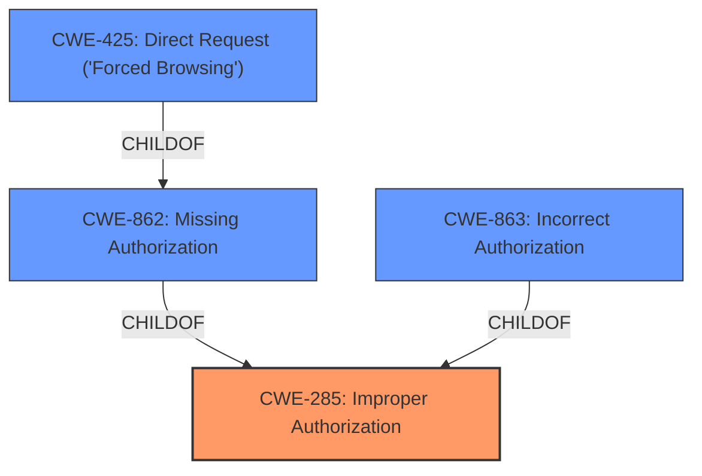

# Enhanced Analysis for CVE-2020-11511

# Summary
| CWE ID | CWE Name | Confidence | CWE Abstraction Level | CWE Vulnerability Mapping Label | CWE-Vulnerability Mapping Notes |
|---|---|---|---|---|---|
| CWE-285 | Improper Authorization | 0.9 | Class | Primary | Allowed-with-Review |
| CWE-862 | Missing Authorization | 0.8 | Class | Secondary | Allowed-with-Review |
| CWE-863 | Incorrect Authorization | 0.7 | Class | Secondary | Allowed-with-Review |
| CWE-425 | Direct Request ('Forced Browsing') | 0.6 | Base | Secondary | Allowed |

## Evidence and Confidence

*   **Confidence Score:** 0.9
*   **Evidence Strength:** HIGH

## Relationship Analysis
The primary CWE is CWE-285 **Improper Authorization**, a class-level weakness indicating a general failure in authorization checks. CWE-862 **Missing Authorization** and CWE-863 **Incorrect Authorization** are children of CWE-285, representing more specific cases. Since the vulnerability description mentions a lack of proper authorization checks, CWE-862 is considered. If the checks were present but flawed, CWE-863 would be more appropriate. CWE-425 **Direct Request ('Forced Browsing')** is a related weakness where authorization is not adequately enforced on specific URLs. The class-level CWE-285 is selected as a reasonable starting point as it encompasses the general authorization issues.



## Vulnerability Chain
The vulnerability chain begins with the **missing authorization** checks in the `learn_press_accept_become_a_teacher()` function, leading to an unauthenticated attacker being able to escalate privileges to 'LP Instructor'. This role has permissions to create posts containing unfiltered HTML, leading to potential site takeover or redirection to malicious sites.
1.  **Root Cause:** **Missing authorization checks** in `learn_press_accept_become_a_teacher()` function.
2.  **Weakness:** Unauthenticated users can trigger the function with any user ID.
3.  **Impact:** Privilege escalation to 'LP Instructor'.
4.  **Impact:** Creation of posts containing unfiltered HTML.
5.  **Impact:** Potential site takeover or redirection to malicious sites.

## Summary of Analysis
The initial analysis focused on identifying the root cause of the privilege escalation vulnerability in the LearnPress plugin. The key evidence comes from the "CVE Reference Links Content Summary" which states that the `learn_press_accept_become_a_teacher()` function **lacks proper input validation and authorization checks**. This **allows unauthenticated users to trigger the function with any user id** and **escalate privileges of any user to LP Instructor**.

The relationship analysis highlights the hierarchical structure of authorization-related CWEs, with CWE-285 **Improper Authorization** being a parent class encompassing both **missing** and **incorrect authorization**.

The final selection of CWE-285 is justified by its broad applicability to authorization failures. While CWE-862 and CWE-863 are more specific, the description covers both possibilities as the root cause indicates a general lack of proper authorization checks. Thus, CWE-285 provides a suitable initial classification.

Relevant CWE Information:

# Enhanced Context (25 CWEs)
The following CWEs were identified as potentially relevant to this vulnerability:

## CWE-472: External Control of Assumed-Immutable Web Parameter
**Abstraction Level**: Base
**Similarity Score**: 0.78
**Source**: dense

**Description**:
The web application does not sufficiently verify inputs that are assumed to be immutable but are actually externally controllable, such as hidden form fields.
**Rationale for not selecting**: Not directly related to the authorization **weakness**, although it could be a contributing factor if the user ID was passed as a hidden form field without validation.

## CWE-74: Improper Neutralization of Special Elements in Output Used by a Downstream Component ('Injection')
**Abstraction Level**: Class
**Similarity Score**: 0.78
**Source**: dense

**Description**:
The product constructs all or part of a command, data structure, or record using externally-influenced input from an upstream component, but it does not neutralize or incorrectly neutralizes special elements that could modify how it is parsed or interpreted when it is sent to a downstream component.
**Rationale for not selecting**: This CWE is focused on injection vulnerabilities. It's not the primary issue here, which is authorization.

## CWE-184: Incomplete List of Disallowed Inputs
**Abstraction Level**: Base
**Similarity Score**: 0.77
**Source**: dense

**Description**:
The product implements a protection mechanism that relies on a list of inputs (or properties of inputs) that are not allowed by policy or otherwise require other action to neutralize before additional processing takes place, but the list is incomplete.
**Rationale for not selecting**: Input validation is mentioned, but the core issue is the **missing authorization** check.

## CWE-639: Authorization Bypass Through User-Controlled Key
**Abstraction Level**: Base
**Similarity Score**: 0.77
**Source**: dense

**Description**:
The system's authorization functionality does not prevent one user from gaining access to another user's data or record by modifying the key value identifying the data.
**Rationale for not selecting**: This is a more specific scenario than the general **missing authorization**.

## CWE-425: Direct Request ('Forced Browsing')
**Abstraction Level**: Base
**Similarity Score**: 0.77
**Source**: dense

**Description**:
The web application does not adequately enforce appropriate authorization on all restricted URLs, scripts, or files.
**Rationale for selecting**: Applicable because the function is accessible without proper authorization, allowing direct access to a sensitive action.

## CWE-807: Reliance on Untrusted Inputs in a Security Decision
**Abstraction Level**: Base
**Similarity Score**: 0.76
**Source**: dense

**Description**:
The product uses a protection mechanism that relies on the existence or values of an input, but the input can be modified by an untrusted actor in a way that bypasses the protection mechanism.
**Rationale for not selecting**: This is a contributing factor but not the primary issue. The primary issue is the **missing authorization**.

## CWE-1289: Improper Validation of Unsafe Equivalence in Input
**Abstraction Level**: Base
**Similarity Score**: 0.76
**Source**: dense

**Description**:
The product receives an input value that is used as a resource identifier or other type of reference, but it does not validate or incorrectly validates that the input is equivalent to a potentially-unsafe value.
**Rationale for not selecting**: Similar to CWE-807, a contributing factor but not the root cause.

## CWE-41: Improper Resolution of Path Equivalence
**Abstraction Level**: Base
**Similarity Score**: 0.76
**Source**: dense

**Description**:
The product is vulnerable to file system contents disclosure through path equivalence. Path equivalence involves the use of special characters in file and directory names. The associated manipulations are intended to generate multiple names for the same object.
**Rationale for not selecting**: Not relevant to the authorization issue.

## CWE-80: Improper Neutralization of Script-Related HTML Tags in a Web Page (Basic XSS)
**Abstraction Level**: Variant
**Similarity Score**: 0.76
**Source**: dense

**Description**:
The product receives input from an upstream component, but it does not neutralize or incorrectly neutralizes special characters such as "<", ">", and "&" that could be interpreted as web-scripting elements when they are sent to a downstream component that processes web pages.
**Rationale for not selecting**: XSS is an impact of the privilege escalation, not the root cause.

## CWE-23: Relative Path Traversal
**Abstraction Level**: Base
**Similarity Score**: 0.76
**Source**: dense

**Description**:
The product uses external input to construct a pathname that should be within a restricted directory, but it does not properly neutralize sequences such as ".." that can resolve to a location that is outside of that directory.
**Rationale for not selecting**: Not relevant to the authorization issue.


## CWE Relationship Analysis

Current CWEs represent these abstraction levels: .


### Vulnerability Chain Analysis

**Chain starting from CWE-862:**
- 862 (Missing Authorization) - ROOT


**Chain starting from CWE-41:**
- 41 (Improper Resolution of Path Equivalence) - ROOT


### CWE Relationship Diagram

```mermaid
graph TD
    classDef primary fill:#f96,stroke:#333,stroke-width:2px
    classDef secondary fill:#69f,stroke:#333
    classDef tertiary fill:#9e9,stroke:#333
```