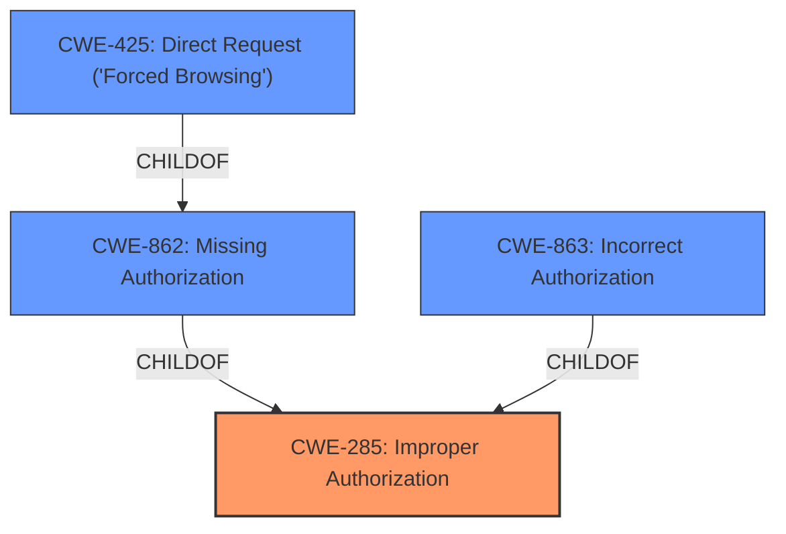

# Analysis for CVE-2020-11511

# Summary
| CWE ID | CWE Name | Confidence | CWE Abstraction Level | CWE Vulnerability Mapping Label | CWE-Vulnerability Mapping Notes |
|---|---|---|---|---|---|
| CWE-285 | Improper Authorization | 0.9 | Class | Primary | Allowed-with-Review |
| CWE-862 | Missing Authorization | 0.8 | Class | Secondary | Allowed-with-Review |
| CWE-863 | Incorrect Authorization | 0.7 | Class | Secondary | Allowed-with-Review |
| CWE-425 | Direct Request ('Forced Browsing') | 0.6 | Base | Secondary | Allowed |

## Evidence and Confidence

*   **Confidence Score:** 0.9
*   **Evidence Strength:** HIGH

## Relationship Analysis
The primary CWE is CWE-285 **Improper Authorization**, a class-level weakness indicating a general failure in authorization checks. CWE-862 **Missing Authorization** and CWE-863 **Incorrect Authorization** are children of CWE-285, representing more specific cases. Since the vulnerability description mentions a lack of proper authorization checks, CWE-862 is considered. If the checks were present but flawed, CWE-863 would be more appropriate. CWE-425 **Direct Request ('Forced Browsing')** is a related weakness where authorization is not adequately enforced on specific URLs. The class-level CWE-285 is selected as a reasonable starting point as it encompasses the general authorization issues.



## Vulnerability Chain
The vulnerability chain begins with the **missing authorization** checks in the `learn_press_accept_become_a_teacher()` function, leading to an unauthenticated attacker being able to escalate privileges to 'LP Instructor'. This role has permissions to create posts containing unfiltered HTML, leading to potential site takeover or redirection to malicious sites.
1.  **Root Cause:** **Missing authorization checks** in `learn_press_accept_become_a_teacher()` function.
2.  **Weakness:** Unauthenticated users can trigger the function with any user ID.
3.  **Impact:** Privilege escalation to 'LP Instructor'.
4.  **Impact:** Creation of posts containing unfiltered HTML.
5.  **Impact:** Potential site takeover or redirection to malicious sites.

## Summary of Analysis
The initial analysis focused on identifying the root cause of the privilege escalation vulnerability in the LearnPress plugin. The key evidence comes from the "CVE Reference Links Content Summary" which states that the `learn_press_accept_become_a_teacher()` function **lacks proper input validation and authorization checks**. This **allows unauthenticated users to trigger the function with any user id** and **escalate privileges of any user to LP Instructor**.

The relationship analysis highlights the hierarchical structure of authorization-related CWEs, with CWE-285 **Improper Authorization** being a parent class encompassing both **missing** and **incorrect authorization**.

The final selection of CWE-285 is justified by its broad applicability to authorization failures. While CWE-862 and CWE-863 are more specific, the description covers both possibilities as the root cause indicates a general lack of proper authorization checks. Thus, CWE-285 provides a suitable initial classification.

Relevant CWE Information:

# Enhanced Context (25 CWEs)
The following CWEs were identified as potentially relevant to this vulnerability:

## CWE-472: External Control of Assumed-Immutable Web Parameter
**Abstraction Level**: Base
**Similarity Score**: 0.78
**Source**: dense

**Description**:
The web application does not sufficiently verify inputs that are assumed to be immutable but are actually externally controllable, such as hidden form fields.
**Rationale for not selecting**: Not directly related to the authorization **weakness**, although it could be a contributing factor if the user ID was passed as a hidden form field without validation.

## CWE-74: Improper Neutralization of Special Elements in Output Used by a Downstream Component ('Injection')
**Abstraction Level**: Class
**Similarity Score**: 0.78
**Source**: dense

**Description**:
The product constructs all or part of a command, data structure, or record using externally-influenced input from an upstream component, but it does not neutralize or incorrectly neutralizes special elements that could modify how it is parsed or interpreted when it is sent to a downstream component.
**Rationale for not selecting**: This CWE is focused on injection vulnerabilities. It's not the primary issue here, which is authorization.

## CWE-184: Incomplete List of Disallowed Inputs
**Abstraction Level**: Base
**Similarity Score**: 0.77
**Source**: dense

**Description**:
The product implements a protection mechanism that relies on a list of inputs (or properties of inputs) that are not allowed by policy or otherwise require other action to neutralize before additional processing takes place, but the list is incomplete.
**Rationale for not selecting**: Input validation is mentioned, but the core issue is the **missing authorization** check.

## CWE-639: Authorization Bypass Through User-Controlled Key
**Abstraction Level**: Base
**Similarity Score**: 0.77
**Source**: dense

**Description**:
The system's authorization functionality does not prevent one user from gaining access to another user's data or record by modifying the key value identifying the data.
**Rationale for not selecting**: This is a more specific scenario than the general **missing authorization**.

## CWE-425: Direct Request ('Forced Browsing')
**Abstraction Level**: Base
**Similarity Score**: 0.77
**Source**: dense

**Description**:
The web application does not adequately enforce appropriate authorization on all restricted URLs, scripts, or files.
**Rationale for selecting**: Applicable because the function is accessible without proper authorization, allowing direct access to a sensitive action.

## CWE-807: Reliance on Untrusted Inputs in a Security Decision
**Abstraction Level**: Base
**Similarity Score**: 0.76
**Source**: dense

**Description**:
The product uses a protection mechanism that relies on the existence or values of an input, but the input can be modified by an untrusted actor in a way that bypasses the protection mechanism.
**Rationale for not selecting**: This is a contributing factor but not the primary issue. The primary issue is the **missing authorization**.

## CWE-1289: Improper Validation of Unsafe Equivalence in Input
**Abstraction Level**: Base
**Similarity Score**: 0.76
**Source**: dense

**Description**:
The product receives an input value that is used as a resource identifier or other type of reference, but it does not validate or incorrectly validates that the input is equivalent to a potentially-unsafe value.
**Rationale for not selecting**: Similar to CWE-807, a contributing factor but not the root cause.

## CWE-41: Improper Resolution of Path Equivalence
**Abstraction Level**: Base
**Similarity Score**: 0.76
**Source**: dense

**Description**:
The product is vulnerable to file system contents disclosure through path equivalence. Path equivalence involves the use of special characters in file and directory names. The associated manipulations are intended to generate multiple names for the same object.
**Rationale for not selecting**: Not relevant to the authorization issue.

## CWE-80: Improper Neutralization of Script-Related HTML Tags in a Web Page (Basic XSS)
**Abstraction Level**: Variant
**Similarity Score**: 0.76
**Source**: dense

**Description**:
The product receives input from an upstream component, but it does not neutralize or incorrectly neutralizes special characters such as "<", ">", and "&" that could be interpreted as web-scripting elements when they are sent to a downstream component that processes web pages.
**Rationale for not selecting**: XSS is an impact of the privilege escalation, not the root cause.

## CWE-23: Relative Path Traversal
**Abstraction Level**: Base
**Similarity Score**: 0.76
**Source**: dense

**Description**:
The product uses external input to construct a pathname that should be within a restricted directory, but it does not properly neutralize sequences such as ".." that can resolve to a location that is outside of that directory.
**Rationale for not selecting**: Not relevant to the authorization issue.

# Enhanced Query for CVE-2020-11511

## Vulnerability Description
The LearnPress plugin before 3.2.6.9 for WordPress allows remote attackers to escalate the privileges of any user to LP Instructor via the accept-to-be-teacher action parameter.

### Vulnerability Description Key Phrases
- **impact:** escalate privileges of any user to LP Instructor
- **vector:** accept-to-be-teacher action parameter
- **attacker:** remote attackers
- **product:** LearnPress plugin
- **version:** before 3.2.6.9

## CVE Reference Links Content Summary
```
{
  "cve": "CVE-2020-11511",
  "affected_plugin": "LearnPress",
  "affected_versions": "< 3.2.6.9",
  "vulnerability_details": [
    {
      "root_cause": "The LearnPress plugin's function `learn_press_accept_become_a_teacher()` is vulnerable because it automatically executes upon plugin load and lacks proper input validation and authorization checks. It is designed to process requests to make a user an instructor via a link. However, the function doesn't check if the request is coming from a legitimate source or if the user has the required permissions to do so. This allows unauthenticated users to trigger the function with any user id.",
      "weaknesses": [
        "Improper input validation",
        "Missing authorization checks",
        "Unprotected endpoint",
         "Privilege Escalation"
      ],
      "impact": "An unauthenticated attacker can elevate any user's privileges to 'LP Instructor'. This role has permissions to create posts containing unfiltered HTML, leading to potential site takeover or redirection to malicious sites. ",
      "attack_vectors": "Sending a crafted request to wp-admin/admin-post.php with 'action' set to 'accept-to-be-teacher' and the 'user_id' parameter set to the ID of the target user.",
       "required_attacker_capabilities": "Ability to send HTTP requests to the vulnerable WordPress instance.  No authentication is required to exploit this vulnerability.",
        "additional_details": "The function is executed upon plugin load via `add_action( 'plugins_loaded', 'learn_press_accept_become_a_teacher' );`, making it always available. The attacker needs to know the user ID of the account to be promoted to 'LP Instructor'"
    }
   ]
}
```

## Retriever Results

### Top Combined Results

| Rank | CWE ID | Name | Abstraction | Usage  | Retrievers | Individual Scores |
|------|--------|------|-------------|-------|------------|-------------------|
| 1 | 352 | Cross-Site Request Forgery (CSRF) | Compound | Allowed | sparse | 0.062 |
| 2 | 862 | Missing Authorization | Class | Allowed-with-Review | sparse | 0.061 |
| 3 | 863 | Incorrect Authorization | Class | Allowed-with-Review | sparse | 0.058 |
| 4 | 285 | Improper Authorization | Class | Discouraged | sparse | 0.058 |
| 5 | 434 | Unrestricted Upload of File with Dangerous Type | Base | Allowed | sparse | 0.058 |
| 6 | 472 | External Control of Assumed-Immutable Web Parameter | Base | Allowed | dense | 0.457 |
| 7 | 183 | Permissive List of Allowed Inputs | Base | Allowed | graph | 0.002 |
| 8 | 306 | Missing Authentication for Critical Function | Base | Allowed | sparse | 0.057 |
| 9 | 425 | Direct Request ('Forced Browsing') | Base | Allowed | sparse | 0.056 |
| 10 | 89 | Improper Neutralization of Special Elements used in an SQL Command ('SQL Injection') | Base | Allowed | sparse | 0.056 |


# Complete CWE Specifications


## CWE-352: Cross-Site Request Forgery (CSRF)
**Abstraction:** Compound
**Status:** Stable

### Description
The web application does not, or can not, sufficiently verify whether a well-formed, valid, consistent request was intentionally provided by the user who submitted the request.

### Extended Description
When a web server is designed to receive a request from a client without any mechanism for verifying that it was intentionally sent, then it might be possible for an attacker to trick a client into making an unintentional request to the web server which will be treated as an authentic request. This can be done via a URL, image load, XMLHttpRequest, etc. and can result in exposure of data or unintended code execution.

### Alternative Terms
Session Riding
Cross Site Reference Forgery
XSRF

### Relationships
ChildOf -> CWE-345
ChildOf -> CWE-345
Requires -> CWE-346
Requires -> CWE-441
Requires -> CWE-642
Requires -> CWE-613

### Mapping Guidance
**Usage:** Allowed
**Rationale:** This is a well-known Composite of multiple weaknesses that must all occur simultaneously, although it is attack-oriented in nature.
**Comments:** While attack-oriented composites are supported in CWE, they have not been a focus of research. There is a chance that future research or CWE scope clarifications will change or deprecate them. Perform root-cause analysis to determine if other weaknesses allow CSRF attacks to occur, and map to those weaknesses. For example, predictable CSRF tokens might allow bypass of CSRF protection mechanisms; if this occurs, they might be better characterized as randomness/predictability weaknesses.
**Reasons:**
- Other


### Additional Notes
**[Relationship]** 

There can be a close relationship between XSS and CSRF (CWE-352). An attacker might use CSRF in order to trick the victim into submitting requests to the server in which the requests contain an XSS payload. A well-known example of this was the Samy worm on MySpace [REF-956]. The worm used XSS to insert malicious HTML sequences into a user's profile and add the attacker as a MySpace friend. MySpace friends of that victim would then execute the payload to modify their own profiles, causing the worm to propagate exponentially. Since the victims did not intentionally insert the malicious script themselves, CSRF was a root cause.


**[Theoretical]** 

The CSRF topology is multi-channel:


  - Attacker (as outsider) to intermediary (as user). The interaction point is either an external or internal channel.

  - Intermediary (as user) to server (as victim). The activation point is an internal channel.


### Observed Examples
- **CVE-2004-1703:** Add user accounts via a URL in an img tag
- **CVE-2004-1995:** Add user accounts via a URL in an img tag
- **CVE-2004-1967:** Arbitrary code execution by specifying the code in a crafted img tag or URL


## CWE-862: Missing Authorization
**Abstraction:** Class
**Status:** Incomplete

### Description
The product does not perform an authorization check when an actor attempts to access a resource or perform an action.

### Extended Description
Not provided

### Alternative Terms
AuthZ: "AuthZ" is typically used as an abbreviation of "authorization" within the web application security community. It is distinct from "AuthN" (or, sometimes, "AuthC") which is an abbreviation of "authentication." The use of "Auth" as an abbreviation is discouraged, since it could be used for either authentication or authorization.

### Relationships
ChildOf -> CWE-285
ChildOf -> CWE-284

### Mapping Guidance
**Usage:** Allowed-with-Review
**Rationale:** This CWE entry is a Class and might have Base-level children that would be more appropriate
**Comments:** Examine children of this entry to see if there is a better fit
**Reasons:**
- Abstraction


### Additional Notes
**[Terminology]** Assuming a user with a given identity, authorization is the process of determining whether that user can access a given resource, based on the user's privileges and any permissions or other access-control specifications that apply to the resource.


### Observed Examples
- **CVE-2022-24730:** Go-based continuous deployment product does not check that a user has certain privileges to update or create an app, allowing adversaries to read sensitive repository information
- **CVE-2009-3168:** Web application does not restrict access to admin scripts, allowing authenticated users to reset administrative passwords.
- **CVE-2009-3597:** Web application stores database file under the web root with insufficient access control (CWE-219), allowing direct request.


## CWE-863: Incorrect Authorization
**Abstraction:** Class
**Status:** Incomplete

### Description
The product performs an authorization check when an actor attempts to access a resource or perform an action, but it does not correctly perform the check.

### Extended Description
Not provided

### Alternative Terms
AuthZ: "AuthZ" is typically used as an abbreviation of "authorization" within the web application security community. It is distinct from "AuthN" (or, sometimes, "AuthC") which is an abbreviation of "authentication." The use of "Auth" as an abbreviation is discouraged, since it could be used for either authentication or authorization.

### Relationships
ChildOf -> CWE-285
ChildOf -> CWE-284

### Mapping Guidance
**Usage:** Allowed-with-Review
**Rationale:** This CWE entry is a Class and might have Base-level children that would be more appropriate
**Comments:** Examine children of this entry to see if there is a better fit
**Reasons:**
- Abstraction


### Additional Notes
**[Terminology]** 

Assuming a user with a given identity, authorization is the process of determining whether that user can access a given resource, based on the user's privileges and any permissions or other access-control specifications that apply to the resource.


### Observed Examples
- **CVE-2021-39155:** Chain: A microservice integration and management platform compares the hostname in the HTTP Host header in a case-sensitive way (CWE-178, CWE-1289), allowing bypass of the authorization policy (CWE-863) using a hostname with mixed case or other variations.
- **CVE-2019-15900:** Chain: sscanf() call is used to check if a username and group exists, but the return value of sscanf() call is not checked (CWE-252), causing an uninitialized variable to be checked (CWE-457), returning success to allow authorization bypass for executing a privileged (CWE-863).
- **CVE-2009-2213:** Gateway uses default "Allow" configuration for its authorization settings.


## CWE-285: Improper Authorization
**Abstraction:** Class
**Status:** Draft

### Description
The product does not perform or incorrectly performs an authorization check when an actor attempts to access a resource or perform an action.

### Extended Description


Assuming a user with a given identity, authorization is the process of determining whether that user can access a given resource, based on the user's privileges and any permissions or other access-control specifications that apply to the resource.


When access control checks are not applied consistently - or not at all - users are able to access data or perform actions that they should not be allowed to perform. This can lead to a wide range of problems, including information exposures, denial of service, and arbitrary code execution.


### Alternative Terms
AuthZ: "AuthZ" is typically used as an abbreviation of "authorization" within the web application security community. It is distinct from "AuthN" (or, sometimes, "AuthC") which is an abbreviation of "authentication." The use of "Auth" as an abbreviation is discouraged, since it could be used for either authentication or authorization.

### Relationships
ChildOf -> CWE-284
ChildOf -> CWE-284

### Mapping Guidance
**Usage:** Discouraged
**Rationale:** CWE-285 is high-level and lower-level CWEs can frequently be used instead. It is a level-1 Class (i.e., a child of a Pillar).
**Comments:** Look at CWE-285's children and consider mapping to CWEs such as CWE-862: Missing Authorization, CWE-863: Incorrect Authorization, CWE-732: Incorrect Permission Assignment for Critical Resource, or others.
**Reasons:**
- Abstraction
**Suggested Alternatives:**
- CWE-862: Missing Authorization
- CWE-863: Incorrect Authorization
- CWE-732: Incorrect Permission Assignment for Critical Resource


### Observed Examples
- **CVE-2022-24730:** Go-based continuous deployment product does not check that a user has certain privileges to update or create an app, allowing adversaries to read sensitive repository information
- **CVE-2009-3168:** Web application does not restrict access to admin scripts, allowing authenticated users to reset administrative passwords.
- **CVE-2009-2960:** Web application does not restrict access to admin scripts, allowing authenticated users to modify passwords of other users.


## CWE-434: Unrestricted Upload of File with Dangerous Type
**Abstraction:** Base
**Status:** Draft

### Description
The product allows the upload or transfer of dangerous file types that are automatically processed within its environment.

### Extended Description
Not provided

### Alternative Terms
Unrestricted File Upload: Used in vulnerability databases and elsewhere, but it is insufficiently precise. The phrase could be interpreted as the lack of restrictions on the size or number of uploaded files, which is a resource consumption issue.

### Relationships
ChildOf -> CWE-669
ChildOf -> CWE-669
PeerOf -> CWE-351
PeerOf -> CWE-436
PeerOf -> CWE-430

### Mapping Guidance
**Usage:** Allowed
**Rationale:** This CWE entry is at the Base level of abstraction, which is a preferred level of abstraction for mapping to the root causes of vulnerabilities.
**Comments:** Carefully read both the name and description to ensure that this mapping is an appropriate fit. Do not try to 'force' a mapping to a lower-level Base/Variant simply to comply with this preferred level of abstraction.
**Reasons:**
- Acceptable-Use


### Additional Notes
**[Relationship]** 

This can have a chaining relationship with incomplete denylist / permissive allowlist errors when the product tries, but fails, to properly limit which types of files are allowed (CWE-183, CWE-184).


This can also overlap multiple interpretation errors for intermediaries, e.g. anti-virus products that do not remove or quarantine attachments with certain file extensions that can be processed by client systems.


### Observed Examples
- **CVE-2023-5227:** PHP-based FAQ management app does not check the MIME type for uploaded images
- **CVE-2001-0901:** Web-based mail product stores ".shtml" attachments that could contain SSI
- **CVE-2002-1841:** PHP upload does not restrict file types


## CWE-472: External Control of Assumed-Immutable Web Parameter
**Abstraction:** Base
**Status:** Draft

### Description
The web application does not sufficiently verify inputs that are assumed to be immutable but are actually externally controllable, such as hidden form fields.

### Extended Description


If a web product does not properly protect assumed-immutable values from modification in hidden form fields, parameters, cookies, or URLs, this can lead to modification of critical data. Web applications often mistakenly make the assumption that data passed to the client in hidden fields or cookies is not susceptible to tampering. Improper validation of data that are user-controllable can lead to the application processing incorrect, and often malicious, input.


For example, custom cookies commonly store session data or persistent data across sessions. This kind of session data is normally involved in security related decisions on the server side, such as user authentication and access control. Thus, the cookies might contain sensitive data such as user credentials and privileges. This is a dangerous practice, as it can often lead to improper reliance on the value of the client-provided cookie by the server side application.


### Alternative Terms
Assumed-Immutable Parameter Tampering

### Relationships
ChildOf -> CWE-642
ChildOf -> CWE-471

### Mapping Guidance
**Usage:** Allowed
**Rationale:** This CWE entry is at the Base level of abstraction, which is a preferred level of abstraction for mapping to the root causes of vulnerabilities.
**Comments:** Carefully read both the name and description to ensure that this mapping is an appropriate fit. Do not try to 'force' a mapping to a lower-level Base/Variant simply to comply with this preferred level of abstraction.
**Reasons:**
- Acceptable-Use


### Additional Notes
**[Relationship]** This is a primary weakness for many other weaknesses and functional consequences, including XSS, SQL injection, path disclosure, and file inclusion.

**[Theoretical]** This is a technology-specific MAID problem.


### Observed Examples
- **CVE-2002-0108:** Forum product allows spoofed messages of other users via hidden form fields for name and e-mail address.
- **CVE-2000-0253:** Shopping cart allows price modification via hidden form field.
- **CVE-2000-0254:** Shopping cart allows price modification via hidden form field.


## CWE-183: Permissive List of Allowed Inputs
**Abstraction:** Base
**Status:** Draft

### Description
The product implements a protection mechanism that relies on a list of inputs (or properties of inputs) that are explicitly allowed by policy because the inputs are assumed to be safe, but the list is too permissive - that is, it allows an input that is unsafe, leading to resultant weaknesses.

### Extended Description
Not provided

### Alternative Terms
Allowlist / Allow List: This is used by CWE and CAPEC instead of other commonly-used terms. Its counterpart is denylist.
Safelist / Safe List: This is often used by security tools such as firewalls, email or web gateways, proxies, etc.
Whitelist / White List: This term is frequently used, but usage has been declining as organizations have started to adopt other terms.

### Relationships
ChildOf -> CWE-697
CanPrecede -> CWE-434

### Mapping Guidance
**Usage:** Allowed
**Rationale:** This CWE entry is at the Base level of abstraction, which is a preferred level of abstraction for mapping to the root causes of vulnerabilities.
**Comments:** Carefully read both the name and description to ensure that this mapping is an appropriate fit. Do not try to 'force' a mapping to a lower-level Base/Variant simply to comply with this preferred level of abstraction.
**Reasons:**
- Acceptable-Use


### Observed Examples
- **CVE-2019-12799:** chain: bypass of untrusted deserialization issue (CWE-502) by using an assumed-trusted class (CWE-183)
- **CVE-2019-10458:** sandbox bypass using a method that is on an allowlist
- **CVE-2017-1000095:** sandbox bypass using unsafe methods that are on an allowlist


## CWE-306: Missing Authentication for Critical Function
**Abstraction:** Base
**Status:** Draft

### Description
The product does not perform any authentication for functionality that requires a provable user identity or consumes a significant amount of resources.

### Extended Description
Not provided

### Alternative Terms
None

### Relationships
ChildOf -> CWE-287
ChildOf -> CWE-287

### Mapping Guidance
**Usage:** Allowed
**Rationale:** This CWE entry is at the Base level of abstraction, which is a preferred level of abstraction for mapping to the root causes of vulnerabilities.
**Comments:** Carefully read both the name and description to ensure that this mapping is an appropriate fit. Do not try to 'force' a mapping to a lower-level Base/Variant simply to comply with this preferred level of abstraction.
**Reasons:**
- Acceptable-Use


### Observed Examples
- **CVE-2022-31260:** Chain: a digital asset management program has an undisclosed backdoor in the legacy version of a PHP script (CWE-912) that could allow an unauthenticated user to export metadata (CWE-306)
- **CVE-2022-29951:** TCP-based protocol in Programmable Logic Controller (PLC) has no authentication.
- **CVE-2022-29952:** Condition Monitor firmware uses a protocol that does not require authentication.


## CWE-425: Direct Request ('Forced Browsing')
**Abstraction:** Base
**Status:** Incomplete

### Description
The web application does not adequately enforce appropriate authorization on all restricted URLs, scripts, or files.

### Extended Description
Web applications susceptible to direct request attacks often make the false assumption that such resources can only be reached through a given navigation path and so only apply authorization at certain points in the path.

### Alternative Terms
forced browsing: The "forced browsing" term could be misinterpreted to include weaknesses such as CSRF or XSS, so its use is discouraged.

### Relationships
ChildOf -> CWE-862
ChildOf -> CWE-862
ChildOf -> CWE-288
ChildOf -> CWE-424
CanPrecede -> CWE-471
CanPrecede -> CWE-98

### Mapping Guidance
**Usage:** Allowed
**Rationale:** This CWE entry is at the Base level of abstraction, which is a preferred level of abstraction for mapping to the root causes of vulnerabilities.
**Comments:** Carefully read both the name and description to ensure that this mapping is an appropriate fit. Do not try to 'force' a mapping to a lower-level Base/Variant simply to comply with this preferred level of abstraction.
**Reasons:**
- Acceptable-Use


### Additional Notes
**[Relationship]** Overlaps Modification of Assumed-Immutable Data (MAID), authorization errors, container errors; often primary to other weaknesses such as XSS and SQL injection.

**[Theoretical]** "Forced browsing" is a step-based manipulation involving the omission of one or more steps, whose order is assumed to be immutable. The application does not verify that the first step was performed successfully before the second step. The consequence is typically "authentication bypass" or "path disclosure," although it can be primary to all kinds of weaknesses, especially in languages such as PHP, which allow external modification of assumed-immutable variables.


### Observed Examples
- **CVE-2022-29238:** Access-control setting in web-based document collaboration tool is not properly implemented by the code, which prevents listing hidden directories but does not prevent direct requests to files in those directories.
- **CVE-2022-23607:** Python-based HTTP library did not scope cookies to a particular domain such that "supercookies" could be sent to any domain on redirect.
- **CVE-2004-2144:** Bypass authentication via direct request.


## CWE-89: Improper Neutralization of Special Elements used in an SQL Command ('SQL Injection')
**Abstraction:** Base
**Status:** Stable

### Description
The product constructs all or part of an SQL command using externally-influenced input from an upstream component, but it does not neutralize or incorrectly neutralizes special elements that could modify the intended SQL command when it is sent to a downstream component. Without sufficient removal or quoting of SQL syntax in user-controllable inputs, the generated SQL query can cause those inputs to be interpreted as SQL instead of ordinary user data.

### Extended Description
Not provided

### Alternative Terms
SQL injection: a common attack-oriented phrase
SQLi: a common abbreviation for "SQL injection"

### Relationships
ChildOf -> CWE-943
ChildOf -> CWE-74

### Mapping Guidance
**Usage:** Allowed
**Rationale:** This CWE entry is at the Base level of abstraction, which is a preferred level of abstraction for mapping to the root causes of vulnerabilities.
**Comments:** Carefully read both the name and description to ensure that this mapping is an appropriate fit. Do not try to 'force' a mapping to a lower-level Base/Variant simply to comply with this preferred level of abstraction.
**Reasons:**
- Acceptable-Use


### Additional Notes
**[Relationship]** SQL injection can be resultant from special character mismanagement, MAID, or denylist/allowlist problems. It can be primary to authentication errors.


### Observed Examples
- **CVE-2023-32530:** SQL injection in security product dashboard using crafted certificate fields
- **CVE-2021-42258:** SQL injection in time and billing software, as exploited in the wild per CISA KEV.
- **CVE-2021-27101:** SQL injection in file-transfer system via a crafted Host header, as exploited in the wild per CISA KEV.

