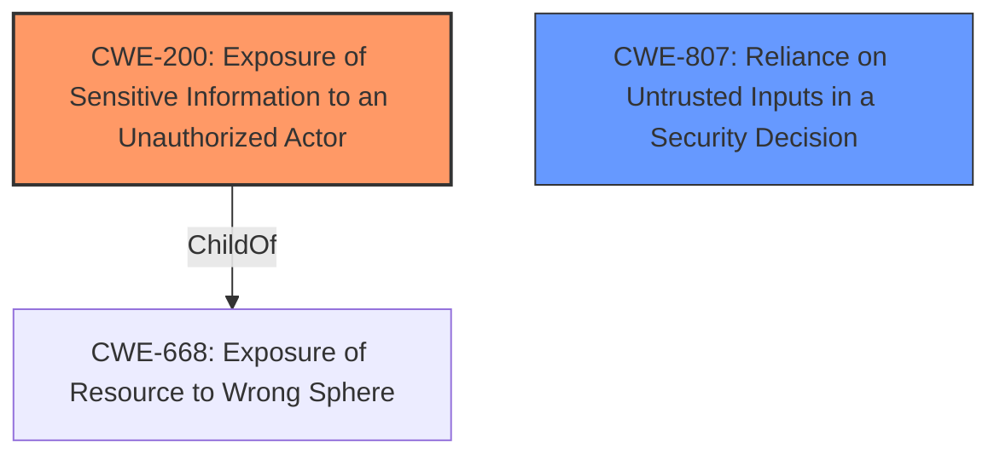

# Analysis for CVE-2020-11547

# Summary
| CWE ID | CWE Name | Confidence | CWE Abstraction Level | CWE Vulnerability Mapping Label | CWE-Vulnerability Mapping Notes |
|---|---|---|---|---|---|
| CWE-200 | Exposure of Sensitive Information to an Unauthorized Actor | 0.9 | Class | Primary | Discouraged |
| CWE-807 | Reliance on Untrusted Inputs in a Security Decision | 0.7 | Base | Secondary | Allowed |

## Evidence and Confidence

*   **Confidence Score:** 0.8
*   **Evidence Strength:** HIGH

## Relationship Analysis
The primary CWE is CWE-200, which is a class-level CWE and a child of CWE-668. The relationship analysis shows that CWE-200 is often misused as a general catch-all. Therefore, a more specific CWE should be considered if possible. Several base-level CWEs were considered, including CWE-807, which was ultimately chosen as a secondary CWE candidate.



## Vulnerability Chain
The chain of events starts with the application **relying on untrusted inputs** in a security decision (CWE-807). This leads to the **exposure of sensitive information** to unauthorized actors (CWE-200).

## Summary of Analysis
The initial assessment identified CWE-200 as a possible candidate because the vulnerability description states that the application allows remote unauthenticated attackers to **obtain information about probes running or the server itself**. However, CWE-200 is a Class-level CWE and is often misused. The CVE Reference Links Content Summary states that "The application **fails to properly sanitize user-supplied input** within the 'type' parameter of HTTP requests" - this provides more information about the root cause of the vulnerability. CWE-807 (Reliance on Untrusted Inputs in a Security Decision) captures this root cause.

The final selection is based on the provided evidence, relationship analysis, and mapping guidance. The selected CWEs are at the optimal level of specificity.

Relevant CWE Information:

# Enhanced Context (25 CWEs)
The following CWEs were identified as potentially relevant to this vulnerability:

## CWE-807: Reliance on Untrusted Inputs in a Security Decision
**Abstraction Level**: Base
**Similarity Score**: 0.78
**Source**: dense

**Description**:
The product uses a protection mechanism that relies on the existence or values of an input, but the input can be modified by an untrusted actor in a way that bypasses the protection mechanism.

**Mapping Guidance**:
- Usage: Allowed
- Rationale: This CWE entry is at the Base level of abstraction, which is a preferred level of abstraction for mapping to the root causes of vulnerabilities.

### Technical Explanation for CWE-200: Exposure of Sensitive Information to an Unauthorized Actor
*   **How the vulnerability's details match the CWE's characteristics:** The vulnerability allows remote unauthenticated attackers to **obtain information about probes running or the server itself** (CPU usage, memory, Windows version, and internal statistics) via an HTTP request. This aligns with CWE-200, as it directly involves the exposure of sensitive information (system statistics, version details) to an unauthorized actor (remote unauthenticated attackers).
*   **The security implications and potential impact:** The security implication is a loss of confidentiality, potentially leading to further attacks based on the disclosed information (e.g., identifying known vulnerabilities in the disclosed Windows version).
*   **Any parent-child relationships or chain patterns that influenced your mapping:** CWE-200 is a child of CWE-668 (Exposure of Resource to Wrong Sphere), but the description of the vulnerability does not fit CWE-668.
*   **Whether the weakness is primary or secondary in the vulnerability:** This is the primary impact of the vulnerability, but not the root cause.
*   **How the official MITRE mapping guidance influenced your decision:** The mapping guidance for CWE-200 states that it is discouraged and is commonly misused to represent the loss of confidentiality in a vulnerability, but confidentiality loss is a technical impact - not a root cause error. As a result, CWE-200 is a reasonable high level assessment, but a root cause should also be included.

### Technical Explanation for CWE-807: Reliance on Untrusted Inputs in a Security Decision
*   **How the vulnerability's details match the CWE's characteristics:** The application **fails to properly sanitize user-supplied input** within the 'type' parameter of HTTP requests to /public/login.htm or /index.htm. The application uses the 'type' parameter to determine what information to display. The application is **relying on the input** to make a security decision - what information to provide to the user.
*   **The security implications and potential impact:** The security implication is that an attacker can craft a request with a specific 'type' parameter that leads to the disclosure of sensitive information.
*   **Any parent-child relationships or chain patterns that influenced your mapping:** No relationships influenced the mapping.
*   **Whether the weakness is primary or secondary in the vulnerability:** This is the root cause.
*   **How the official MITRE mapping guidance influenced your decision:** The mapping guidance for CWE-807 states that it is allowed because it is at the Base level of abstraction, which is a preferred level of abstraction for mapping to the root causes of vulnerabilities.

### Other CWEs Considered but Not Used:
*   **CWE-306: Missing Authentication for Critical Function:** While the vulnerability involves unauthenticated access, the core issue is not a complete lack of authentication, but rather **improper handling of inputs** that leads to information disclosure.
*   **CWE-918: Server-Side Request Forgery (SSRF):** SSRF is not applicable here because the application is not making requests to other servers based on user input.
*   **CWE-400: Uncontrolled Resource Consumption:** Resource consumption is not the primary issue.
*   **CWE-23: Relative Path Traversal:** Path traversal is not involved in this vulnerability.
*   **CWE-78: Improper Neutralization of Special Elements used in an OS Command ('OS Command Injection'):** OS Command Injection is not involved in this vulnerability.
*   **CWE-184: Incomplete List of Disallowed Inputs:** While the application could be using a list of disallowed inputs, there is no evidence of this.
*   **CWE-319: Cleartext Transmission of Sensitive Information:** The vulnerability does not involve cleartext transmission.
*   **CWE-287: Improper Authentication:** While the vulnerability involves unauthenticated access, the core issue is not a complete lack of authentication, but rather **improper handling of inputs** that leads to information disclosure.
*   **CWE-321: Use of Hard-coded Cryptographic Key:** This vulnerability does not involve cryptographic keys.

# Enhanced Query for CVE-2020-11547

## Vulnerability Description
PRTG Network Monitor before 20.1.57.1745 allows remote unauthenticated attackers to obtain information about probes running or the server itself (CPU usage, memory, Windows version, and internal statistics) via an HTTP request, as demonstrated by type=probes to login.htm or index.htm.

### Vulnerability Description Key Phrases
- **impact:** obtain information about probes running or the server itself
- **vector:** type=probes to login.htm or index.htm
- **attacker:** remote unauthenticated attackers
- **product:** PRTG Network Monitor
- **version:** before 20.1.57.1745

## CVE Reference Links Content Summary
```
{
  "vulnerability_details": {
    "root_cause": "The application fails to properly sanitize user-supplied input within the 'type' parameter of HTTP requests to /public/login.htm or /index.htm.",
    "weaknesses": [
      "Information Disclosure",
      "Improper Input Sanitization"
    ],
    "impact": "An unauthenticated remote attacker can obtain sensitive information about the target system by crafting a specific HTTP request with a particular value for the 'type' parameter. This information includes the system version, CPU load, DNS name, server HTTP URL, Windows version, system ID, tree statistics, memory usage, request details, screenshot, last sync time, probe information, and warnings.",
    "attack_vectors": [
      "HTTP request manipulation"
    ],
    "attacker_capabilities": "An attacker needs the ability to send crafted HTTP requests to the vulnerable server. No authentication is required."
  }
}
```

## Retriever Results

### Top Combined Results

| Rank | CWE ID | Name | Abstraction | Usage  | Retrievers | Individual Scores |
|------|--------|------|-------------|-------|------------|-------------------|
| 1 | 306 | Missing Authentication for Critical Function | Base | Allowed | sparse | 0.082 |
| 2 | 200 | Exposure of Sensitive Information to an Unauthorized Actor | Class | Discouraged | sparse | 0.065 |
| 3 | 918 | Server-Side Request Forgery (SSRF) | Base | Allowed | sparse | 0.065 |
| 4 | 400 | Uncontrolled Resource Consumption | Class | Discouraged | sparse | 0.063 |
| 5 | 23 | Relative Path Traversal | Base | Allowed | sparse | 0.063 |
| 6 | 78 | Improper Neutralization of Special Elements used in an OS Command ('OS Command Injection') | Base | Allowed | dense | 0.484 |
| 7 | 184 | Incomplete List of Disallowed Inputs | Base | Allowed | graph | 0.002 |
| 8 | 319 | Cleartext Transmission of Sensitive Information | Base | Allowed | sparse | 0.062 |
| 9 | 287 | Improper Authentication | Class | Discouraged | sparse | 0.060 |
| 10 | 321 | Use of Hard-coded Cryptographic Key | Variant | Allowed | sparse | 0.060 |


# Complete CWE Specifications


## CWE-306: Missing Authentication for Critical Function
**Abstraction:** Base
**Status:** Draft

### Description
The product does not perform any authentication for functionality that requires a provable user identity or consumes a significant amount of resources.

### Extended Description
Not provided

### Alternative Terms
None

### Relationships
ChildOf -> CWE-287
ChildOf -> CWE-287

### Mapping Guidance
**Usage:** Allowed
**Rationale:** This CWE entry is at the Base level of abstraction, which is a preferred level of abstraction for mapping to the root causes of vulnerabilities.
**Comments:** Carefully read both the name and description to ensure that this mapping is an appropriate fit. Do not try to 'force' a mapping to a lower-level Base/Variant simply to comply with this preferred level of abstraction.
**Reasons:**
- Acceptable-Use


### Observed Examples
- **CVE-2022-31260:** Chain: a digital asset management program has an undisclosed backdoor in the legacy version of a PHP script (CWE-912) that could allow an unauthenticated user to export metadata (CWE-306)
- **CVE-2022-29951:** TCP-based protocol in Programmable Logic Controller (PLC) has no authentication.
- **CVE-2022-29952:** Condition Monitor firmware uses a protocol that does not require authentication.


## CWE-200: Exposure of Sensitive Information to an Unauthorized Actor
**Abstraction:** Class
**Status:** Draft

### Description
The product exposes sensitive information to an actor that is not explicitly authorized to have access to that information.

### Extended Description


There are many different kinds of mistakes that introduce information exposures. The severity of the error can range widely, depending on the context in which the product operates, the type of sensitive information that is revealed, and the benefits it may provide to an attacker. Some kinds of sensitive information include:


  - private, personal information, such as personal messages, financial data, health records, geographic location, or contact details

  - system status and environment, such as the operating system and installed packages

  - business secrets and intellectual property

  - network status and configuration

  - the product's own code or internal state

  - metadata, e.g. logging of connections or message headers

  - indirect information, such as a discrepancy between two internal operations that can be observed by an outsider

Information might be sensitive to different parties, each of which may have their own expectations for whether the information should be protected. These parties include:

  - the product's own users

  - people or organizations whose information is created or used by the product, even if they are not direct product users

  - the product's administrators, including the admins of the system(s) and/or networks on which the product operates

  - the developer

Information exposures can occur in different ways:

  - the code  **explicitly inserts**  sensitive information into resources or messages that are intentionally made accessible to unauthorized actors, but should not contain the information - i.e., the information should have been "scrubbed" or "sanitized"

  - a different weakness or mistake  **indirectly inserts**  the sensitive information into resources, such as a web script error revealing the full system path of the program.

  - the code manages resources that intentionally contain sensitive information, but the resources are  **unintentionally made accessible**  to unauthorized actors. In this case, the information exposure is resultant - i.e., a different weakness enabled the access to the information in the first place.

It is common practice to describe any loss of confidentiality as an "information exposure," but this can lead to overuse of CWE-200 in CWE mapping. From the CWE perspective, loss of confidentiality is a technical impact that can arise from dozens of different weaknesses, such as insecure file permissions or out-of-bounds read. CWE-200 and its lower-level descendants are intended to cover the mistakes that occur in behaviors that explicitly manage, store, transfer, or cleanse sensitive information.

### Alternative Terms
Information Disclosure: This term is frequently used in vulnerability advisories to describe a consequence or technical impact, for any vulnerability that has a loss of confidentiality. Often, CWE-200 can be misused to represent the loss of confidentiality, even when the mistake - i.e., the weakness - is not directly related to the mishandling of the information itself, such as an out-of-bounds read that accesses sensitive memory contents; here, the out-of-bounds read is the primary weakness, not the disclosure of the memory. In addition, this phrase is also used frequently in policies and legal documents, but it does not refer to any disclosure of security-relevant information.
Information Leak: This is a frequently used term, however the "leak" term has multiple uses within security. In some cases it deals with the accidental exposure of information from a different weakness, but in other cases (such as "memory leak"), this deals with improper tracking of resources, which can lead to exhaustion. As a result, CWE is actively avoiding usage of the "leak" term.

### Relationships
ChildOf -> CWE-668

### Mapping Guidance
**Usage:** Discouraged
**Rationale:** CWE-200 is commonly misused to represent the loss of confidentiality in a vulnerability, but confidentiality loss is a technical impact - not a root cause error. As of CWE 4.9, over 400 CWE entries can lead to a loss of confidentiality. Other options are often available. [REF-1287].
**Comments:** If an error or mistake causes information to be disclosed, then use the CWE ID for that error. Consider starting with improper authorization (CWE-285), insecure permissions (CWE-732), improper authentication (CWE-287), etc. Also consider children such as Insertion of Sensitive Information Into Sent Data (CWE-201), Observable Discrepancy (CWE-203), Insertion of Sensitive Information into Externally-Accessible File or Directory (CWE-538), or others.
**Reasons:**
- Frequent Misuse


### Additional Notes
**[Maintenance]** As a result of mapping analysis in the 2020 Top 25 and more recent versions, this weakness is under review, since it is frequently misused in mapping to cover many problems that lead to loss of confidentiality. See Mapping Notes, Extended Description, and Alternate Terms.


### Observed Examples
- **CVE-2022-31162:** Rust library leaks Oauth client details in application debug logs
- **CVE-2021-25476:** Digital Rights Management (DRM) capability for mobile platform leaks pointer information, simplifying ASLR bypass
- **CVE-2001-1483:** Enumeration of valid usernames based on inconsistent responses


## CWE-918: Server-Side Request Forgery (SSRF)
**Abstraction:** Base
**Status:** Incomplete

### Description
The web server receives a URL or similar request from an upstream component and retrieves the contents of this URL, but it does not sufficiently ensure that the request is being sent to the expected destination.

### Extended Description
Not provided

### Alternative Terms
XSPA: Cross Site Port Attack
SSRF: Server-Side Request Forgery

### Relationships
ChildOf -> CWE-441
ChildOf -> CWE-610

### Mapping Guidance
**Usage:** Allowed
**Rationale:** This CWE entry is at the Base level of abstraction, which is a preferred level of abstraction for mapping to the root causes of vulnerabilities.
**Comments:** Carefully read both the name and description to ensure that this mapping is an appropriate fit. Do not try to 'force' a mapping to a lower-level Base/Variant simply to comply with this preferred level of abstraction.
**Reasons:**
- Acceptable-Use


### Additional Notes
**[Relationship]** CWE-918 (SSRF) and CWE-611 (XXE) are closely related, because they both involve web-related technologies and can launch outbound requests to unexpected destinations. However, XXE can be performed client-side, or in other contexts in which the software is not acting directly as a server, so the "Server" portion of the SSRF acronym does not necessarily apply.


### Observed Examples
- **CVE-2023-32786:** Chain: LLM integration framework has prompt injection (CWE-1427) that allows an attacker to force the service to retrieve data from an arbitrary URL, essentially providing SSRF (CWE-918) and potentially injecting content into downstream tasks.
- **CVE-2021-26855:** Server Side Request Forgery (SSRF) in mail server, as exploited in the wild per CISA KEV.
- **CVE-2021-21973:** Server Side Request Forgery in cloud platform, as exploited in the wild per CISA KEV.


## CWE-400: Uncontrolled Resource Consumption
**Abstraction:** Class
**Status:** Draft

### Description
The product does not properly control the allocation and maintenance of a limited resource, thereby enabling an actor to influence the amount of resources consumed, eventually leading to the exhaustion of available resources.

### Extended Description


Limited resources include memory, file system storage, database connection pool entries, and CPU. If an attacker can trigger the allocation of these limited resources, but the number or size of the resources is not controlled, then the attacker could cause a denial of service that consumes all available resources. This would prevent valid users from accessing the product, and it could potentially have an impact on the surrounding environment. For example, a memory exhaustion attack against an application could slow down the application as well as its host operating system.


There are at least three distinct scenarios which can commonly lead to resource exhaustion:


  - Lack of throttling for the number of allocated resources

  - Losing all references to a resource before reaching the shutdown stage

  - Not closing/returning a resource after processing

Resource exhaustion problems are often result due to an incorrect implementation of the following situations:

  - Error conditions and other exceptional circumstances.

  - Confusion over which part of the program is responsible for releasing the resource.


### Alternative Terms
Resource Exhaustion

### Relationships
ChildOf -> CWE-664

### Mapping Guidance
**Usage:** Discouraged
**Rationale:** CWE-400 is intended for incorrect behaviors in which the product is expected to track and restrict how many resources it consumes, but CWE-400 is often misused because it is conflated with the "technical impact" of vulnerabilities in which resource consumption occurs. It is sometimes used for low-information vulnerability reports. It is a level-1 Class (i.e., a child of a Pillar).
**Comments:** Closely analyze the specific mistake that is causing resource consumption, and perform a CWE mapping for that mistake. Consider children/descendants such as CWE-770: Allocation of Resources Without Limits or Throttling, CWE-771: Missing Reference to Active Allocated Resource, CWE-410: Insufficient Resource Pool, CWE-772: Missing Release of Resource after Effective Lifetime, CWE-834: Excessive Iteration, CWE-405: Asymmetric Resource Consumption (Amplification), and others.
**Reasons:**
- Frequent Misuse


### Additional Notes
**[Maintenance]** "Resource consumption" could be interpreted as a consequence instead of an insecure behavior, so this entry is being considered for modification. It appears to be referenced too frequently when more precise mappings are available. Some of its children, such as CWE-771, might be better considered as a chain.

**[Theoretical]** Vulnerability theory is largely about how behaviors and resources interact. "Resource exhaustion" can be regarded as either a consequence or an attack, depending on the perspective. This entry is an attempt to reflect the underlying weaknesses that enable these attacks (or consequences) to take place.

**[Other]** 

Database queries that take a long time to process are good DoS targets. An attacker would have to write a few lines of Perl code to generate enough traffic to exceed the site's ability to keep up. This would effectively prevent authorized users from using the site at all. Resources can be exploited simply by ensuring that the target machine must do much more work and consume more resources in order to service a request than the attacker must do to initiate a request.


A prime example of this can be found in old switches that were vulnerable to "macof" attacks (so named for a tool developed by Dugsong). These attacks flooded a switch with random IP and MAC address combinations, therefore exhausting the switch's cache, which held the information of which port corresponded to which MAC addresses. Once this cache was exhausted, the switch would fail in an insecure way and would begin to act simply as a hub, broadcasting all traffic on all ports and allowing for basic sniffing attacks.


**[Maintenance]** The Taxonomy_Mappings to ISA/IEC 62443 were added in CWE 4.10, but they are still under review and might change in future CWE versions. These draft mappings were performed by members of the "Mapping CWE to 62443" subgroup of the CWE-CAPEC ICS/OT Special Interest Group (SIG), and their work is incomplete as of CWE 4.10. The mappings are included to facilitate discussion and review by the broader ICS/OT community, and they are likely to change in future CWE versions.


### Observed Examples
- **CVE-2022-21668:** Chain: Python library does not limit the resources used to process images that specify a very large number of bands (CWE-1284), leading to excessive memory consumption (CWE-789) or an integer overflow (CWE-190).
- **CVE-2020-7218:** Go-based workload orchestrator does not limit resource usage with unauthenticated connections, allowing a DoS by flooding the service
- **CVE-2020-3566:** Resource exhaustion in distributed OS because of "insufficient" IGMP queue management, as exploited in the wild per CISA KEV.


## CWE-23: Relative Path Traversal
**Abstraction:** Base
**Status:** Draft

### Description
The product uses external input to construct a pathname that should be within a restricted directory, but it does not properly neutralize sequences such as ".." that can resolve to a location that is outside of that directory.

### Extended Description
This allows attackers to traverse the file system to access files or directories that are outside of the restricted directory.

### Alternative Terms
Zip Slip: "Zip slip" is an attack that uses file archives (e.g., ZIP, tar, rar, etc.) that contain filenames with path traversal sequences that cause the files to be written outside of the directory under which the archive is expected to be extracted [REF-1282]. It is most commonly used for relative path traversal (CWE-23) and link following (CWE-59).

### Relationships
ChildOf -> CWE-22
ChildOf -> CWE-22
ChildOf -> CWE-22

### Mapping Guidance
**Usage:** Allowed
**Rationale:** This CWE entry is at the Base level of abstraction, which is a preferred level of abstraction for mapping to the root causes of vulnerabilities.
**Comments:** Carefully read both the name and description to ensure that this mapping is an appropriate fit. Do not try to 'force' a mapping to a lower-level Base/Variant simply to comply with this preferred level of abstraction.
**Reasons:**
- Acceptable-Use


### Observed Examples
- **CVE-2024-37032:** Large language model (LLM) management tool does not validate the format of a digest value (CWE-1287) from a private, untrusted model registry, enabling relative path traversal (CWE-23), a.k.a. Probllama
- **CVE-2022-45918:** Chain: a learning management tool debugger uses external input to locate previous session logs (CWE-73) and does not properly validate the given path (CWE-20), allowing for filesystem path traversal using "../" sequences (CWE-24)
- **CVE-2019-20916:** Python package manager does not correctly restrict the filename specified in a Content-Disposition header, allowing arbitrary file read using path traversal sequences such as "../"


## CWE-78: Improper Neutralization of Special Elements used in an OS Command ('OS Command Injection')
**Abstraction:** Base
**Status:** Stable

### Description
The product constructs all or part of an OS command using externally-influenced input from an upstream component, but it does not neutralize or incorrectly neutralizes special elements that could modify the intended OS command when it is sent to a downstream component.

### Extended Description


This weakness can lead to a vulnerability in environments in which the attacker does not have direct access to the operating system, such as in web applications. Alternately, if the weakness occurs in a privileged program, it could allow the attacker to specify commands that normally would not be accessible, or to call alternate commands with privileges that the attacker does not have. The problem is exacerbated if the compromised process does not follow the principle of least privilege, because the attacker-controlled commands may run with special system privileges that increases the amount of damage.


There are at least two subtypes of OS command injection:


  - The application intends to execute a single, fixed program that is under its own control. It intends to use externally-supplied inputs as arguments to that program. For example, the program might use system("nslookup [HOSTNAME]") to run nslookup and allow the user to supply a HOSTNAME, which is used as an argument. Attackers cannot prevent nslookup from executing. However, if the program does not remove command separators from the HOSTNAME argument, attackers could place the separators into the arguments, which allows them to execute their own program after nslookup has finished executing.

  - The application accepts an input that it uses to fully select which program to run, as well as which commands to use. The application simply redirects this entire command to the operating system. For example, the program might use "exec([COMMAND])" to execute the [COMMAND] that was supplied by the user. If the COMMAND is under attacker control, then the attacker can execute arbitrary commands or programs. If the command is being executed using functions like exec() and CreateProcess(), the attacker might not be able to combine multiple commands together in the same line.

From a weakness standpoint, these variants represent distinct programmer errors. In the first variant, the programmer clearly intends that input from untrusted parties will be part of the arguments in the command to be executed. In the second variant, the programmer does not intend for the command to be accessible to any untrusted party, but the programmer probably has not accounted for alternate ways in which malicious attackers can provide input.

### Alternative Terms
Shell injection
Shell metacharacters
OS Command Injection

### Relationships
ChildOf -> CWE-77
ChildOf -> CWE-74
ChildOf -> CWE-77
ChildOf -> CWE-77
CanAlsoBe -> CWE-88

### Mapping Guidance
**Usage:** Allowed
**Rationale:** This CWE entry is at the Base level of abstraction, which is a preferred level of abstraction for mapping to the root causes of vulnerabilities.
**Comments:** Carefully read both the name and description to ensure that this mapping is an appropriate fit. Do not try to 'force' a mapping to a lower-level Base/Variant simply to comply with this preferred level of abstraction.
**Reasons:**
- Acceptable-Use


### Additional Notes
**[Terminology]** The "OS command injection" phrase carries different meanings to different people. For some people, it only refers to cases in which the attacker injects command separators into arguments for an application-controlled program that is being invoked. For some people, it refers to any type of attack that can allow the attacker to execute OS commands of their own choosing. This usage could include untrusted search path weaknesses (CWE-426) that cause the application to find and execute an attacker-controlled program. Further complicating the issue is the case when argument injection (CWE-88) allows alternate command-line switches or options to be inserted into the command line, such as an "-exec" switch whose purpose may be to execute the subsequent argument as a command (this -exec switch exists in the UNIX "find" command, for example). In this latter case, however, CWE-88 could be regarded as the primary weakness in a chain with CWE-78.

**[Research Gap]** More investigation is needed into the distinction between the OS command injection variants, including the role with argument injection (CWE-88). Equivalent distinctions may exist in other injection-related problems such as SQL injection.


### Observed Examples
- **CVE-2020-10987:** OS command injection in Wi-Fi router, as exploited in the wild per CISA KEV.
- **CVE-2020-10221:** Template functionality in network configuration management tool allows OS command injection, as exploited in the wild per CISA KEV.
- **CVE-2020-9054:** Chain: improper input validation (CWE-20) in username parameter, leading to OS command injection (CWE-78), as exploited in the wild per CISA KEV.


## CWE-184: Incomplete List of Disallowed Inputs
**Abstraction:** Base
**Status:** Draft

### Description
The product implements a protection mechanism that relies on a list of inputs (or properties of inputs) that are not allowed by policy or otherwise require other action to neutralize before additional processing takes place, but the list is incomplete.

### Extended Description
Not provided

### Alternative Terms
Denylist / Deny List: This is used by CWE and CAPEC instead of other commonly-used terms. Its counterpart is allowlist.
Blocklist / Block List: This is often used by security tools such as firewalls, email or web gateways, proxies, etc.
Blacklist / Black List: This term is frequently used, but usage has been declining as organizations have started to adopt other terms.

### Relationships
ChildOf -> CWE-693
ChildOf -> CWE-1023
CanPrecede -> CWE-79
CanPrecede -> CWE-78
CanPrecede -> CWE-434
CanPrecede -> CWE-98

### Mapping Guidance
**Usage:** Allowed
**Rationale:** This CWE entry is at the Base level of abstraction, which is a preferred level of abstraction for mapping to the root causes of vulnerabilities.
**Comments:** Carefully read both the name and description to ensure that this mapping is an appropriate fit. Do not try to 'force' a mapping to a lower-level Base/Variant simply to comply with this preferred level of abstraction.
**Reasons:**
- Acceptable-Use


### Additional Notes
**[Relationship]** 

Multiple interpretation errors can indirectly introduce inputs that should be disallowed. For example, a list of dangerous shell metacharacters might not include a metacharacter that only has meaning in one particular shell, not all of them; or a check for XSS manipulations might ignore an unusual construct that is supported by one web browser, but not others.


### Observed Examples
- **CVE-2024-4315:** Chain: API for text generation using Large Language Models (LLMs) does not include the "\" Windows folder separator in its denylist (CWE-184) when attempting to prevent Local File Inclusion via path traversal (CWE-22), allowing deletion of arbitrary files on Windows systems.
- **CVE-2008-2309:** product uses a denylist to identify potentially dangerous content, allowing attacker to bypass a warning
- **CVE-2005-2782:** PHP remote file inclusion in web application that filters "http" and "https" URLs, but not "ftp".


## CWE-319: Cleartext Transmission of Sensitive Information
**Abstraction:** Base
**Status:** Draft

### Description
The product transmits sensitive or security-critical data in cleartext in a communication channel that can be sniffed by unauthorized actors.

### Extended Description


Many communication channels can be "sniffed" (monitored) by adversaries during data transmission. For example, in networking, packets can traverse many intermediary nodes from the source to the destination, whether across the internet, an internal network, the cloud, etc. Some actors might have privileged access to a network interface or any link along the channel, such as a router, but they might not be authorized to collect the underlying data. As a result, network traffic could be sniffed by adversaries, spilling security-critical data.


Applicable communication channels are not limited to software products. Applicable channels include hardware-specific technologies such as internal hardware networks and external debug channels, supporting remote JTAG debugging. When mitigations are not applied to combat adversaries within the product's threat model, this weakness significantly lowers the difficulty of exploitation by such adversaries.


When full communications are recorded or logged, such as with a packet dump, an adversary could attempt to obtain the dump long after the transmission has occurred and try to "sniff" the cleartext from the recorded communications in the dump itself. Even if the information is encoded in a way that is not human-readable, certain techniques could determine which encoding is being used, then decode the information. 


### Alternative Terms
None

### Relationships
ChildOf -> CWE-311
ChildOf -> CWE-311

### Mapping Guidance
**Usage:** Allowed
**Rationale:** This CWE entry is at the Base level of abstraction, which is a preferred level of abstraction for mapping to the root causes of vulnerabilities.
**Comments:** Carefully read both the name and description to ensure that this mapping is an appropriate fit. Do not try to 'force' a mapping to a lower-level Base/Variant simply to comply with this preferred level of abstraction.
**Reasons:**
- Acceptable-Use


### Additional Notes
**[Maintenance]** The Taxonomy_Mappings to ISA/IEC 62443 were added in CWE 4.10, but they are still under review and might change in future CWE versions. These draft mappings were performed by members of the "Mapping CWE to 62443" subgroup of the CWE-CAPEC ICS/OT Special Interest Group (SIG), and their work is incomplete as of CWE 4.10. The mappings are included to facilitate discussion and review by the broader ICS/OT community, and they are likely to change in future CWE versions.


### Observed Examples
- **CVE-2022-29519:** Programmable Logic Controller (PLC) sends sensitive information in plaintext, including passwords and session tokens.
- **CVE-2022-30312:** Building Controller uses a protocol that transmits authentication credentials in plaintext.
- **CVE-2022-31204:** Programmable Logic Controller (PLC) sends password in plaintext.


## CWE-287: Improper Authentication
**Abstraction:** Class
**Status:** Draft

### Description
When an actor claims to have a given identity, the product does not prove or insufficiently proves that the claim is correct.

### Extended Description
Not provided

### Alternative Terms
authentification: An alternate term is "authentification", which appears to be most commonly used by people from non-English-speaking countries.
AuthN: "AuthN" is typically used as an abbreviation of "authentication" within the web application security community. It is also distinct from "AuthZ," which is an abbreviation of "authorization." The use of "Auth" as an abbreviation is discouraged, since it could be used for either authentication or authorization.
AuthC: "AuthC" is used as an abbreviation of "authentication," but it appears to used less frequently than "AuthN."

### Relationships
ChildOf -> CWE-284
ChildOf -> CWE-284

### Mapping Guidance
**Usage:** Discouraged
**Rationale:** This CWE entry might be misused when lower-level CWE entries are likely to be applicable. It is a level-1 Class (i.e., a child of a Pillar).
**Comments:** Consider children or descendants, beginning with CWE-1390: Weak Authentication or CWE-306: Missing Authentication for Critical Function.
**Reasons:**
- Frequent Misuse
**Suggested Alternatives:**
- CWE-1390: Weak Authentication
- CWE-306: Missing Authentication for Critical Function


### Additional Notes
**[Relationship]** This can be resultant from SQL injection vulnerabilities and other issues.

**[Maintenance]** The Taxonomy_Mappings to ISA/IEC 62443 were added in CWE 4.10, but they are still under review and might change in future CWE versions. These draft mappings were performed by members of the "Mapping CWE to 62443" subgroup of the CWE-CAPEC ICS/OT Special Interest Group (SIG), and their work is incomplete as of CWE 4.10. The mappings are included to facilitate discussion and review by the broader ICS/OT community, and they are likely to change in future CWE versions.


### Observed Examples
- **CVE-2022-35248:** Chat application skips validation when Central Authentication Service (CAS) is enabled, effectively removing the second factor from two-factor authentication
- **CVE-2022-36436:** Python-based authentication proxy does not enforce password authentication during the initial handshake, allowing the client to bypass authentication by specifying a 'None' authentication type.
- **CVE-2022-30034:** Chain: Web UI for a Python RPC framework does not use regex anchors to validate user login emails (CWE-777), potentially allowing bypass of OAuth (CWE-1390).


## CWE-321: Use of Hard-coded Cryptographic Key
**Abstraction:** Variant
**Status:** Draft

### Description
The use of a hard-coded cryptographic key significantly increases the possibility that encrypted data may be recovered.

### Extended Description
Not provided

### Alternative Terms
None

### Relationships
ChildOf -> CWE-798
ChildOf -> CWE-798
ChildOf -> CWE-798

### Mapping Guidance
**Usage:** Allowed
**Rationale:** This CWE entry is at the Variant level of abstraction, which is a preferred level of abstraction for mapping to the root causes of vulnerabilities.
**Comments:** Carefully read both the name and description to ensure that this mapping is an appropriate fit. Do not try to 'force' a mapping to a lower-level Base/Variant simply to comply with this preferred level of abstraction.
**Reasons:**
- Acceptable-Use


### Additional Notes
**[Other]** The main difference between the use of hard-coded passwords and the use of hard-coded cryptographic keys is the false sense of security that the former conveys. Many people believe that simply hashing a hard-coded password before storage will protect the information from malicious users. However, many hashes are reversible (or at least vulnerable to brute force attacks) -- and further, many authentication protocols simply request the hash itself, making it no better than a password.

**[Maintenance]** The Taxonomy_Mappings to ISA/IEC 62443 were added in CWE 4.10, but they are still under review and might change in future CWE versions. These draft mappings were performed by members of the "Mapping CWE to 62443" subgroup of the CWE-CAPEC ICS/OT Special Interest Group (SIG), and their work is incomplete as of CWE 4.10. The mappings are included to facilitate discussion and review by the broader ICS/OT community, and they are likely to change in future CWE versions.


### Observed Examples
- **CVE-2022-29960:** Engineering Workstation uses hard-coded cryptographic keys that could allow for unathorized filesystem access and privilege escalation
- **CVE-2022-30271:** Remote Terminal Unit (RTU) uses a hard-coded SSH private key that is likely to be used by default.
- **CVE-2020-10884:** WiFi router service has a hard-coded encryption key, allowing root access

