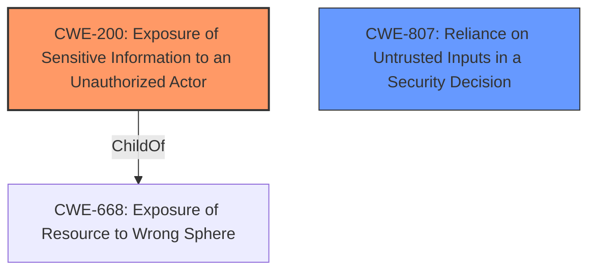

# Analysis Report for CVE-2020-11547

# Vulnerability Analysis Report: CVE-2020-11547

## Description


## Analysis (with Relationship Data)

# Summary
| CWE ID | CWE Name | Confidence | CWE Abstraction Level | CWE Vulnerability Mapping Label | CWE-Vulnerability Mapping Notes |
|---|---|---|---|---|---|
| CWE-200 | Exposure of Sensitive Information to an Unauthorized Actor | 0.9 | Class | Primary | Discouraged |
| CWE-807 | Reliance on Untrusted Inputs in a Security Decision | 0.7 | Base | Secondary | Allowed |

## Evidence and Confidence

*   **Confidence Score:** 0.8
*   **Evidence Strength:** HIGH

## Relationship Analysis
The primary CWE is CWE-200, which is a class-level CWE and a child of CWE-668. The relationship analysis shows that CWE-200 is often misused as a general catch-all. Therefore, a more specific CWE should be considered if possible. Several base-level CWEs were considered, including CWE-807, which was ultimately chosen as a secondary CWE candidate.



## Vulnerability Chain
The chain of events starts with the application **relying on untrusted inputs** in a security decision (CWE-807). This leads to the **exposure of sensitive information** to unauthorized actors (CWE-200).

## Summary of Analysis
The initial assessment identified CWE-200 as a possible candidate because the vulnerability description states that the application allows remote unauthenticated attackers to **obtain information about probes running or the server itself**. However, CWE-200 is a Class-level CWE and is often misused. The CVE Reference Links Content Summary states that "The application **fails to properly sanitize user-supplied input** within the 'type' parameter of HTTP requests" - this provides more information about the root cause of the vulnerability. CWE-807 (Reliance on Untrusted Inputs in a Security Decision) captures this root cause.

The final selection is based on the provided evidence, relationship analysis, and mapping guidance. The selected CWEs are at the optimal level of specificity.

Relevant CWE Information:

# Enhanced Context (25 CWEs)
The following CWEs were identified as potentially relevant to this vulnerability:

## CWE-807: Reliance on Untrusted Inputs in a Security Decision
**Abstraction Level**: Base
**Similarity Score**: 0.78
**Source**: dense

**Description**:
The product uses a protection mechanism that relies on the existence or values of an input, but the input can be modified by an untrusted actor in a way that bypasses the protection mechanism.

**Mapping Guidance**:
- Usage: Allowed
- Rationale: This CWE entry is at the Base level of abstraction, which is a preferred level of abstraction for mapping to the root causes of vulnerabilities.

### Technical Explanation for CWE-200: Exposure of Sensitive Information to an Unauthorized Actor
*   **How the vulnerability's details match the CWE's characteristics:** The vulnerability allows remote unauthenticated attackers to **obtain information about probes running or the server itself** (CPU usage, memory, Windows version, and internal statistics) via an HTTP request. This aligns with CWE-200, as it directly involves the exposure of sensitive information (system statistics, version details) to an unauthorized actor (remote unauthenticated attackers).
*   **The security implications and potential impact:** The security implication is a loss of confidentiality, potentially leading to further attacks based on the disclosed information (e.g., identifying known vulnerabilities in the disclosed Windows version).
*   **Any parent-child relationships or chain patterns that influenced your mapping:** CWE-200 is a child of CWE-668 (Exposure of Resource to Wrong Sphere), but the description of the vulnerability does not fit CWE-668.
*   **Whether the weakness is primary or secondary in the vulnerability:** This is the primary impact of the vulnerability, but not the root cause.
*   **How the official MITRE mapping guidance influenced your decision:** The mapping guidance for CWE-200 states that it is discouraged and is commonly misused to represent the loss of confidentiality in a vulnerability, but confidentiality loss is a technical impact - not a root cause error. As a result, CWE-200 is a reasonable high level assessment, but a root cause should also be included.

### Technical Explanation for CWE-807: Reliance on Untrusted Inputs in a Security Decision
*   **How the vulnerability's details match the CWE's characteristics:** The application **fails to properly sanitize user-supplied input** within the 'type' parameter of HTTP requests to /public/login.htm or /index.htm. The application uses the 'type' parameter to determine what information to display. The application is **relying on the input** to make a security decision - what information to provide to the user.
*   **The security implications and potential impact:** The security implication is that an attacker can craft a request with a specific 'type' parameter that leads to the disclosure of sensitive information.
*   **Any parent-child relationships or chain patterns that influenced your mapping:** No relationships influenced the mapping.
*   **Whether the weakness is primary or secondary in the vulnerability:** This is the root cause.
*   **How the official MITRE mapping guidance influenced your decision:** The mapping guidance for CWE-807 states that it is allowed because it is at the Base level of abstraction, which is a preferred level of abstraction for mapping to the root causes of vulnerabilities.

### Other CWEs Considered but Not Used:
*   **CWE-306: Missing Authentication for Critical Function:** While the vulnerability involves unauthenticated access, the core issue is not a complete lack of authentication, but rather **improper handling of inputs** that leads to information disclosure.
*   **CWE-918: Server-Side Request Forgery (SSRF):** SSRF is not applicable here because the application is not making requests to other servers based on user input.
*   **CWE-400: Uncontrolled Resource Consumption:** Resource consumption is not the primary issue.
*   **CWE-23: Relative Path Traversal:** Path traversal is not involved in this vulnerability.
*   **CWE-78: Improper Neutralization of Special Elements used in an OS Command ('OS Command Injection'):** OS Command Injection is not involved in this vulnerability.
*   **CWE-184: Incomplete List of Disallowed Inputs:** While the application could be using a list of disallowed inputs, there is no evidence of this.
*   **CWE-319: Cleartext Transmission of Sensitive Information:** The vulnerability does not involve cleartext transmission.
*   **CWE-287: Improper Authentication:** While the vulnerability involves unauthenticated access, the core issue is not a complete lack of authentication, but rather **improper handling of inputs** that leads to information disclosure.
*   **CWE-321: Use of Hard-coded Cryptographic Key:** This vulnerability does not involve cryptographic keys.


## CWE Relationship Analysis

Current CWEs represent these abstraction levels: .


### Vulnerability Chain Analysis

**Chain starting from CWE-306:**
- 306 (Missing Authentication for Critical Function) - ROOT


**Chain starting from CWE-807:**
- 807 (Reliance on Untrusted Inputs in a Security Decision) - ROOT


### CWE Relationship Diagram

```mermaid
graph TD
    classDef primary fill:#f96,stroke:#333,stroke-width:2px
    classDef secondary fill:#69f,stroke:#333
    classDef tertiary fill:#9e9,stroke:#333
```


*Report generated on 2025-04-02 13:40:32*
