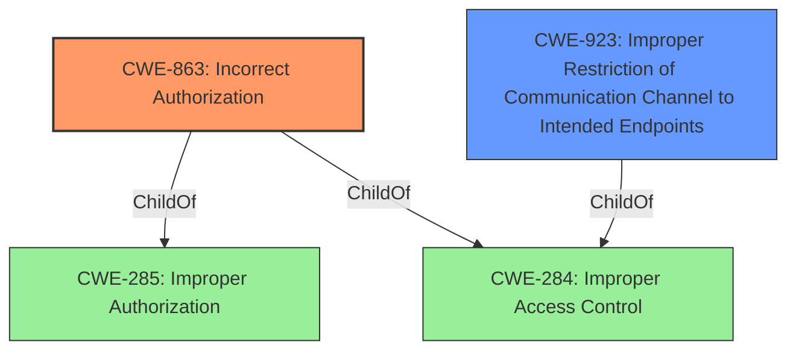

# Raw Analyzer Response for CVE-2020-11628

# Summary
| CWE ID | CWE Name | Confidence | CWE Abstraction Level | CWE Vulnerability Mapping Label | CWE-Vulnerability Mapping Notes |
|---|---|---|---|---|---|
| CWE-863 | Incorrect Authorization | 0.8 | Class | Primary | Allowed-with-Review |
| CWE-923 | Improper Restriction of Communication Channel to Intended Endpoints | 0.7 | Class | Secondary | Allowed-with-Review |

## Evidence and Confidence

*   **Confidence Score:** 0.75
*   **Evidence Strength:** MEDIUM

## Relationship Analysis
The primary CWE is CWE-863, which is a class-level CWE. It has child relationships to more specific CWEs, indicating there may be a more specific weakness, but the description doesn't give enough information. CWE-923 is a peer of CWE-863.

## Vulnerability Chain
The vulnerability starts with the ability to modify the URI string from a client. This leads to bypassing intended restrictions on remote protocols. The final impact is unauthorized access or actions due to the **incorrect authorization**.

## Summary of Analysis
The initial analysis identified **incorrect authorization** as the primary weakness due to the bypass of protocol restrictions. The vulnerability description states that "These restrictions can be bypassed by modifying the URI string from a client." This indicates a problem in how the system authorizes access based on the URI.

The retriever results and complete CWE specifications support this conclusion. CWE-863 (Incorrect Authorization) is a strong candidate, though it is a Class level CWE. CWE-923 (Improper Restriction of Communication Channel to Intended Endpoints) is also a good candidate.

The choice of CWE-863 is based on the fact that the core issue is that the system's authorization mechanism is not functioning correctly, allowing the bypass of intended restrictions. The evidence for this is "These restrictions can be bypassed by modifying the URI string from a client."

CWE-923 is a secondary candidate because the vulnerability involves a communication channel and the bypass of intended endpoints restrictions, but the core issue is **incorrect authorization**.

Relevant CWE Information:

# Enhanced Context (25 CWEs)
The following CWEs were identified as potentially relevant to this vulnerability:

## CWE-807: Reliance on Untrusted Inputs in a Security Decision
**Abstraction Level**: Base
**Similarity Score**: 0.78
**Source**: dense

**Description**:
The product uses a protection mechanism that relies on the existence or values of an input, but the input can be modified by an untrusted actor in a way that bypasses the protection mechanism.

**Mapping Guidance**:
- Usage: Allowed
- Rationale: This CWE entry is at the Base level of abstraction, which is a preferred level of abstraction for mapping to the root causes of vulnerabilities.

## CWE-863: Incorrect Authorization
**Abstraction:** Class
**Status:** Incomplete

### Description
The product performs an authorization check when an actor attempts to access a resource or perform an action, but it does not correctly perform the check.

### Extended Description
Not provided

### Alternative Terms
AuthZ: "AuthZ" is typically used as an abbreviation of "authorization" within the web application security community. It is distinct from "AuthN" (or, sometimes, "AuthC") which is an abbreviation of "authentication." The use of "Auth" as an abbreviation is discouraged, since it could be used for either authentication or authorization.

### Relationships
ChildOf -> CWE-285
ChildOf -> CWE-284

### Mapping Guidance
**Usage:** Allowed-with-Review
**Rationale:** This CWE entry is a Class and might have Base-level children that would be more appropriate
**Comments:** Examine children of this entry to see if there is a better fit
**Reasons:**
- Abstraction

### Observed Examples
- **CVE-2021-39155:** Chain: A microservice integration and management platform compares the hostname in the HTTP Host header in a case-sensitive way (CWE-178, CWE-1289), allowing bypass of the authorization policy (CWE-863) using a hostname with mixed case or other variations.

## CWE-923: Improper Restriction of Communication Channel to Intended Endpoints
**Abstraction:** Class
**Status:** Incomplete

### Description
The product establishes a communication channel to (or from) an endpoint for privileged or protected operations, but it does not properly ensure that it is communicating with the correct endpoint.

### Extended Description
Attackers might be able to spoof the intended endpoint from a different system or process, thus gaining the same level of access as the intended endpoint.

### Alternative Terms
None

### Relationships
ChildOf -> CWE-284

### Mapping Guidance
**Usage:** Allowed-with-Review
**Rationale:** This CWE entry is a Class and might have Base-level children that would be more appropriate
**Comments:** Examine children of this entry to see if there is a better fit
**Reasons:**
- Abstraction