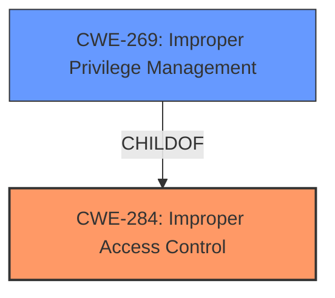

# Raw Analyzer Response for CVE-2020-11651

# Summary
| CWE ID | CWE Name | Confidence | CWE Abstraction Level | CWE Vulnerability Mapping Label | CWE-Vulnerability Mapping Notes |
|---|---|---|---|---|---|
| CWE-284 | Improper Access Control | 0.9 | Class | Primary | Allowed |
| CWE-269 | Improper Privilege Management | 0.7 | Class | Secondary | Allowed |

## Evidence and Confidence

*   **Confidence Score:** 0.8
*   **Evidence Strength:** HIGH

## Relationship Analysis
The primary relationship influencing the selection of CWE-284 is its hierarchical positioning as a Class-level CWE, which encompasses various specific access control issues. The vulnerability's description indicates a failure to properly validate method calls, leading to unauthorized access, aligning with the broad scope of CWE-284. Further, the relationship between CWE-284 and its child CWE-269, Improper Privilege Management, suggests that the access control issue could stem from problems with privilege assignment or management.

## Vulnerability Chain
The vulnerability chain starts with the **improper validation of method calls** (CWE-Other). This leads to **improper access control** (CWE-284), allowing a remote user to **access some methods without authentication**. This, in turn, enables the attacker to **retrieve user tokens from the salt master and/or run arbitrary commands on salt minions.**

## Summary of Analysis
The initial analysis focused on the **root cause** of the vulnerability, which is the **improper validation of method calls** in the `salt-master` process's `ClearFuncs` class. This allows remote users to bypass authentication and access sensitive methods. The provided evidence strongly supports the selection of CWE-284 (Improper Access Control) as the primary CWE, because the description directly states that the **improper validation** leads to unauthorized access to methods. The CVE Reference Links Content Summary explicitly mentions "Authentication bypass" as a weakness.

The retriever results suggested several CWEs, including CWE-22 (Improper Limitation of a Pathname to a Restricted Directory ('Path Traversal')), CWE-613 (Insufficient Session Expiration), and CWE-116 (Improper Encoding or Escaping of Output). However, these CWEs do not directly address the **root cause** of the vulnerability, which is related to **access control**. CWE-22 is related to path traversal vulnerabilities, which is not the case here. CWE-613 is related to session management, and CWE-116 is related to output encoding, neither of which are directly relevant to the **improper validation of method calls** leading to authentication bypass.

CWE-285 (Improper Authorization) was also considered, but it is a Class-level CWE, and its description is similar to that of CWE-284. The mapping guidance for CWE-285 discourages its use and suggests mapping to more specific CWEs, such as CWE-862 (Missing Authorization) or CWE-863 (Incorrect Authorization). However, given the available information, it is not clear whether the authorization is missing or incorrect, so a broader term is more appropriate.

CWE-284 (Improper Access Control) is selected as the primary CWE because it directly addresses the **root cause** of the vulnerability, which is the **improper validation of method calls** leading to unauthorized access. It is at the appropriate level of abstraction, as it captures the general weakness without being overly specific.

CWE-269 (Improper Privilege Management) is selected as a secondary CWE because the **improper access control** could be due to **improper privilege management.**

Relevant CWE Information:

# Enhanced Context (25 CWEs)
The following CWEs were identified as potentially relevant to this vulnerability:

## CWE-274: Improper Handling of Insufficient Privileges
**Abstraction Level**: Base
**Similarity Score**: 0.77
**Source**: dense

**Description**:
The product does not handle or incorrectly handles when it has insufficient privileges to perform an operation, leading to resultant weaknesses.

**Mapping Guidance**:
- Usage: Discouraged
- Rationale: This CWE entry could be deprecated in a future version of CWE.

## CWE-653: Improper Isolation or Compartmentalization
**Abstraction Level**: Class
**Similarity Score**: 0.77
**Source**: dense

**Description**:
The product does not properly compartmentalize or isolate functionality, processes, or resources that require different privilege levels, rights, or permissions.

**Mapping Guidance**:
- Usage: Allowed
- Rationale: This CWE entry is at the Base level of abstraction, which is a preferred level of abstraction for mapping to the root causes of vulnerabilities.

## CWE-668: Exposure of Resource to Wrong Sphere
**Abstraction Level**: Class
**Similarity Score**: 0.77
**Source**: dense

**Description**:
The product exposes a resource to the wrong control sphere, providing unintended actors with inappropriate access to the resource.

**Mapping Guidance**:
- Usage: Discouraged
- Rationale: CWE-668 is high-level and is often misused as a catch-all when lower-level CWE IDs might be applicable. It is sometimes used for low-information vulnerability reports [REF-1287]. It is a level-1 Class (i.e., a child of a Pillar). It is not useful for trend analysis.

## CWE-41: Improper Resolution of Path Equivalence
**Abstraction Level**: Base
**Similarity Score**: 0.77
**Source**: dense

**Description**:
The product is vulnerable to file system contents disclosure through path equivalence. Path equivalence involves the use of special characters in file and directory names. The associated manipulations are intended to generate multiple names for the same object.

**Mapping Guidance**:
- Usage: Allowed
- Rationale: This CWE entry is at the Base level of abstraction, which is a preferred level of abstraction for mapping to the root causes of vulnerabilities.

## CWE-267: Privilege Defined With Unsafe Actions
**Abstraction Level**: Base
**Similarity Score**: 0.77
**Source**: dense

**Description**:
A particular privilege, role, capability, or right can be used to perform unsafe actions that were not intended, even when it is assigned to the correct entity.

**Mapping Guidance**:
- Usage: Allowed
- Rationale: This CWE entry is at the Base level of abstraction, which is a preferred level of abstraction for mapping to the root causes of vulnerabilities.

## CWE-23: Relative Path Traversal
**Abstraction Level**: Base
**Similarity Score**: 0.76
**Source**: dense

**Description**:
The product uses external input to construct a pathname that should be within a restricted directory, but it does not properly neutralize sequences such as ".." that can resolve to a location that is outside of that directory.

**Mapping Guidance**:
- Usage: Allowed
- Rationale: This CWE entry is at the Base level of abstraction, which is a preferred level of abstraction for mapping to the root causes of vulnerabilities.

## CWE-807: Reliance on Untrusted Inputs in a Security Decision
**Abstraction Level**: Base
**Similarity Score**: 0.76
**Source**: dense

**Description**:
The product uses a protection mechanism that relies on the existence or values of an input, but the input can be modified by an untrusted actor in a way that bypasses the protection mechanism.

**Mapping Guidance**:
- Usage: Allowed
- Rationale: This CWE entry is at the Base level of abstraction, which is a preferred level of abstraction for mapping to the root causes of vulnerabilities.

## CWE-1390: Weak Authentication
**Abstraction Level**: Class
**Similarity Score**: 0.76
**Source**: dense

**Description**:
The product uses an authentication mechanism to restrict access to specific users or identities, but the mechanism does not sufficiently prove that the claimed identity is correct.

**Mapping Guidance**:
- Usage: Allowed-with-Review
- Rationale: This CWE entry is a Class and might have Base-level children that would be more appropriate

## CWE-266: Incorrect Privilege Assignment
**Abstraction Level**: Base
**Similarity Score**: 0.76
**Source**: dense

**Description**:
A product incorrectly assigns a privilege to a particular actor, creating an unintended sphere of control for that actor.

**Mapping Guidance**:
- Usage: Allowed
- Rationale: This CWE entry is at the Base level of abstraction, which is a preferred level of abstraction for mapping to the root causes of vulnerabilities.

## CWE-280: Improper Handling of Insufficient Permissions or Privileges 
**Abstraction Level**: Base
**Similarity Score**: 0.75
**Source**: dense

**Description**:
The product does not handle or incorrectly handles when it has insufficient privileges to access resources or functionality as specified by their permissions. This may cause it to follow unexpected code paths that may leave the product in an invalid state.

**