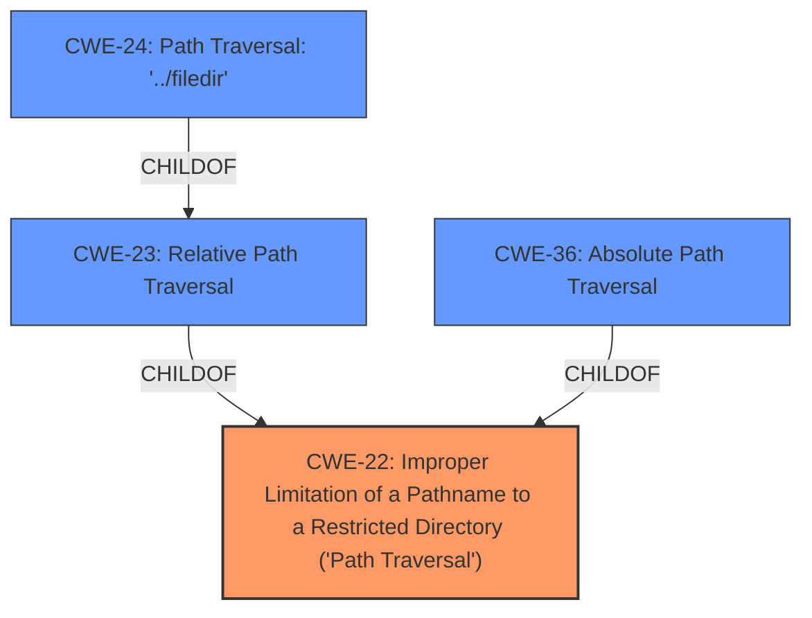

# Analysis Report for CVE-2020-11738

# Vulnerability Analysis Report: CVE-2020-11738

## Description


## Analysis (with Relationship Data)

# Summary
| CWE ID | CWE Name | Confidence | CWE Abstraction Level | CWE Vulnerability Mapping Label | CWE-Vulnerability Mapping Notes |
|---|---|---|---|---|---|
| CWE-22 | Improper Limitation of a Pathname to a Restricted Directory ('Path Traversal') | 1.0 | Base | Allowed | Primary CWE |

## Evidence and Confidence

*   **Confidence Score:** 1.0
*   **Evidence Strength:** HIGH

## Relationship Analysis
The primary relationship impacting the CWE selection is the hierarchical relationship. CWE-22 is a base-level CWE that encompasses the **directory traversal** **weakness** described in the vulnerability. The other relationships did not impact the decision because they were not as relevant to the specific vulnerability. The abstraction level of CWE-22 (Base) is the preferred level, providing a balance between specificity and generality.



## Vulnerability Chain
The chain of events for this vulnerability is as follows:
1.  **Root Cause:** **Improper limitation of pathname to a restricted directory** (CWE-22) due to **lack of** input validation.
2.  **Weakness:** **Directory traversal** via `../` in the file parameter.
3.  **Impact:** Arbitrary file download, exposure of sensitive data (e.g., `wp-config.php` containing database credentials), potential complete site compromise.

## Summary of Analysis
The initial analysis correctly identified **directory traversal** as the core issue. The final conclusion maps this to CWE-22 because the plugin **does not properly neutralize** special elements within the pathname, allowing the path to resolve outside the restricted directory.

The evidence supporting this decision comes directly from the vulnerability description: "allows **Directory Traversal** via ../ in the file parameter to duplicator_download or duplicator_init." The CVE Reference Links Content Summary further clarifies that the **lack of** input validation on the `file` parameter is the **root cause**, leading to the directory traversal vulnerability. The retriever results also list CWE-22 as the top candidate, further supporting this decision. The provided information clearly indicates that the vulnerability stems from the **improper handling** of pathnames, making CWE-22 the most accurate and specific classification.

CWE-23, CWE-24, and CWE-36 were considered but deemed less specific than CWE-22. CWE-23 (Relative Path Traversal) and CWE-36 (Absolute Path Traversal) are more specific types of path traversal, but the description **does not explicitly specify** whether the traversal is relative or absolute. CWE-24 (Path Traversal: '../filedir') is a variant of CWE-23 and thus even more specific. Since the description simply mentions "../" without further context, it's most accurate to use the base CWE, which is CWE-22. CWE-434 (Unrestricted Upload of File with Dangerous Type) is irrelevant because the vulnerability is not about uploading files. CWE-79 (Improper Neutralization of Input During Web Page Generation ('Cross-site Scripting')) is also not applicable since the vulnerability does not involve cross-site scripting. CWE-352 (Cross-Site Request Forgery (CSRF)) is also not applicable, as the vulnerability is related to file access not CSRF.


## CWE Relationship Analysis

Current CWEs represent these abstraction levels: .


### Vulnerability Chain Analysis

**Chain starting from CWE-36:**
- 36 (Absolute Path Traversal) - ROOT


**Chain starting from CWE-79:**
- 79 (Improper Neutralization of Input During Web Page Generation ('Cross-site Scripting')) - ROOT


### CWE Relationship Diagram

```mermaid
graph TD
    classDef primary fill:#f96,stroke:#333,stroke-width:2px
    classDef secondary fill:#69f,stroke:#333
    classDef tertiary fill:#9e9,stroke:#333
```


*Report generated on 2025-04-01 17:48:53*
