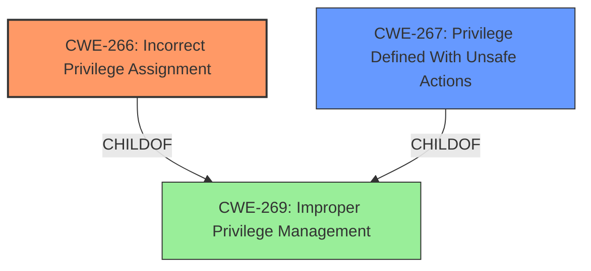

# Analysis for CVE-2020-11753

# Summary
| CWE ID | CWE Name | Confidence | CWE Abstraction Level | CWE Vulnerability Mapping Label | CWE-Vulnerability Mapping Notes |
|---|---|---|---|---|---|
| CWE-266 | Incorrect Privilege Assignment | 0.8 | Base | Allowed | Primary CWE: The vulnerability allows a user with **appropriate privileges** to perform actions they should not normally be able to do, indicating an **incorrect assignment** of those privileges. |
| CWE-267 | Privilege Defined With Unsafe Actions | 0.7 | Base | Allowed | Secondary CWE: The ability to **create, modify, and execute scripting tasks** suggests the assigned privilege allows for actions that are inherently unsafe. |

## Evidence and Confidence

*   **Confidence Score:** 0.75
*   **Evidence Strength:** MEDIUM

## Relationship Analysis
The relationship analysis reveals the following:

*   CWE-266 and CWE-267 are both at the Base level, which is desirable.
*   CWE-266 focuses on the incorrect assignment of privileges, while CWE-267 emphasizes that the privilege allows unsafe actions.
*   CWE-269 is a Class-level CWE for Improper Privilege Management, which is a parent of both CWE-266 and CWE-267.

## Vulnerability Chain
The vulnerability chain starts with the **incorrect assignment of privilege** (CWE-266) or a **privilege defined with unsafe actions** (CWE-267), allowing a user to **create, modify, and execute scripting tasks**, leading to potential compromise of the system.

## Summary of Analysis
The initial assessment, based on the vulnerability description, points to an issue with privilege management in Sonatype Nexus Repository Manager. The description states that a user with **appropriate privileges** can **create, modify, and execute scripting tasks** without using the UI or API. This suggests a flaw in how privileges are assigned or managed within the system.

The evidence, while concise, directly supports the selection of CWE-266 and CWE-267. The phrase **"appropriate privileges"** implies that the user already possesses some level of authorization, but the ability to **"create, modify, and execute scripting tasks"** indicates that these privileges are either incorrectly assigned (CWE-266) or the privilege itself allows for unsafe actions (CWE-267).

The graph relationships confirm that these CWEs are at the appropriate level of specificity (Base level), providing a more detailed description of the vulnerability compared to the more general CWE-269.

Other CWEs Considered:
*   CWE-79 (Improper Neutralization of Input During Web Page Generation ('Cross-site Scripting')), CWE-116 (Improper Encoding or Escaping of Output), CWE-918 (Server-Side Request Forgery (SSRF)), CWE-22 (Improper Limitation of a Pathname to a Restricted Directory ('Path Traversal')), CWE-285 (Improper Authorization), CWE-527 (Exposure of Version-Control Repository to an Unauthorized Control Sphere), CWE-73 (External Control of File Name or Path), CWE-306 (Missing Authentication for Critical Function), CWE-863 (Incorrect Authorization), CWE-269 (Improper Privilege Management): These were not selected as they do not directly relate to the core issue of privilege management.
*   CWE-285 (Improper Authorization), CWE-863 (Incorrect Authorization), and CWE-269 (Improper Privilege Management) are at Class level, and the description provides enough specificity to choose a Base level CWE instead.