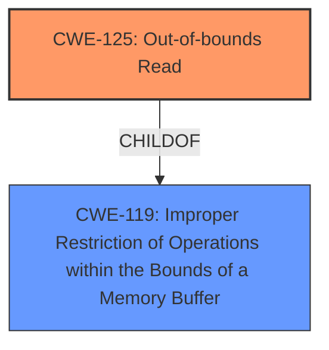

# Analysis for CVE-2020-11899

# Summary
| CWE ID | CWE Name | Confidence | CWE Abstraction Level | CWE Vulnerability Mapping Label | CWE-Vulnerability Mapping Notes |
|---|---|---|---|---|---|
| CWE-125 | Out-of-bounds Read | 1.0 | Base | Allowed | Primary CWE |
| CWE-119 | Improper Restriction of Operations within the Bounds of a Memory Buffer | 0.5 | Class | Discouraged | Secondary Candidate |

## Evidence and Confidence

*   **Confidence Score:** 1.0
*   **Evidence Strength:** HIGH

## Relationship Analysis
The primary relationship influencing the CWE selection is the hierarchical relationship between CWE-125 and CWE-119. CWE-125 (Out-of-bounds Read) is a child of CWE-119 (Improper Restriction of Operations within the Bounds of a Memory Buffer). Since the vulnerability description specifically mentions an "Out-of-bounds Read", CWE-125 is the more specific and appropriate choice.



## Vulnerability Chain
The vulnerability chain is relatively simple:
1.  Improper Input Validation (CWE-20) in IPv6 component as stated in CVE Reference Links Content Summary.
2.  Out-of-bounds Read (CWE-125) leading to information disclosure or denial of service.

## Summary of Analysis
The initial analysis focused on the **weakness** explicitly stated in the vulnerability description: "**Out-of-bounds Read**". The CVE Reference Links Content Summary also indicates that the Root cause is "Improper Input Validation in the IPv6 component" and can lead to an out-of-bounds read.

The Retriever Results also strongly support this, with CWE-125 being the top match.

The graph relationships reinforced the decision to choose the more specific CWE-125 over its parent CWE-119.

The final selection is based on the clear evidence of an out-of-bounds read, the supporting retriever results, and the hierarchical relationship analysis, all of which indicate that CWE-125 is the most appropriate and specific classification.

Relevant CWE Information:

# Enhanced Context (25 CWEs)
The following CWEs were identified as potentially relevant to this vulnerability:

## CWE-191: Integer Underflow (Wrap or Wraparound)
**Abstraction Level**: Base
**Similarity Score**: 0.80
**Source**: dense

**Description**:
The product subtracts one value from another, such that the result is less than the minimum allowable integer value, which produces a value that is not equal to the correct result.

**Mapping Guidance**:
- Usage: Allowed
- Rationale: This CWE entry is at the Base level of abstraction, which is a preferred level of abstraction for mapping to the root causes of vulnerabilities.

## CWE-823: Use of Out-of-range Pointer Offset
**Abstraction Level**: Base
**Similarity Score**: 0.80
**Source**: dense

**Description**:
The product performs pointer arithmetic on a valid pointer, but it uses an offset that can point outside of the intended range of valid memory locations for the resulting pointer.

**Mapping Guidance**:
- Usage: Allowed
- Rationale: This CWE entry is at the Base level of abstraction, which is a preferred level of abstraction for mapping to the root causes of vulnerabilities.

## CWE-193: Off-by-one Error
**Abstraction Level**: Base
**Similarity Score**: 0.79
**Source**: dense

**Description**:
A product calculates or uses an incorrect maximum or minimum value that is 1 more, or 1 less, than the correct value.

**Mapping Guidance**:
- Usage: Allowed
- Rationale: This CWE entry is at the Base level of abstraction, which is a preferred level of abstraction for mapping to the root causes of vulnerabilities.

## CWE-131: Incorrect Calculation of Buffer Size
**Abstraction Level**: Base
**Similarity Score**: 0.79
**Source**: dense

**Description**:
The product does not correctly calculate the size to be used when allocating a buffer, which could lead to a buffer overflow.

**Mapping Guidance**:
- Usage: Allowed
- Rationale: This CWE entry is at the Base level of abstraction, which is a preferred level of abstraction for mapping to the root causes of vulnerabilities.

## CWE-824: Access of Uninitialized Pointer
**Abstraction Level**: Base
**Similarity Score**: 0.78
**Source**: dense

**Description**:
The product accesses or uses a pointer that has not been initialized.

**Mapping Guidance**:
- Usage: Allowed
- Rationale: This CWE entry is at the Base level of abstraction, which is a preferred level of abstraction for mapping to the root causes of vulnerabilities.

## CWE-805: Buffer Access with Incorrect Length Value
**Abstraction Level**: Base
**Similarity Score**: 0.78
**Source**: dense

**Description**:
The product uses a sequential operation to read or write a buffer, but it uses an incorrect length value that causes it to access memory that is outside of the bounds of the buffer.

**Mapping Guidance**:
- Usage: Allowed
- Rationale: This CWE entry is at the Base level of abstraction, which is a preferred level of abstraction for mapping to the root causes of vulnerabilities.

## CWE-197: Numeric Truncation Error
**Abstraction Level**: Base
**Similarity Score**: 0.78
**Source**: dense

**Description**:
Truncation errors occur when a primitive is cast to a primitive of a smaller size and data is lost in the conversion.

**Mapping Guidance**:
- Usage: Allowed
- Rationale: This CWE entry is at the Base level of abstraction, which is a preferred level of abstraction for mapping to the root causes of vulnerabilities.

## CWE-822: Untrusted Pointer Dereference
**Abstraction Level**: Base
**Similarity Score**: 0.77
**Source**: dense

**Description**:
The product obtains a value from an untrusted source, converts this value to a pointer, and dereferences the resulting pointer.

**Mapping Guidance**:
- Usage: Allowed
- Rationale: This CWE entry is at the Base level of abstraction, which is a preferred level of abstraction for mapping to the root causes of vulnerabilities.

## CWE-124: Buffer Underwrite ('Buffer Underflow')
**Abstraction Level**: Base
**Similarity Score**: 0.77
**Source**: dense

**Description**:
The product writes to a buffer using an index or pointer that references a memory location prior to the beginning of the buffer.

**Mapping Guidance**:
- Usage: Allowed
- Rationale: This CWE entry is at the Base level of abstraction, which is a preferred level of abstraction for mapping to the root causes of vulnerabilities.

## CWE-125: Out-of-bounds Read
**Abstraction Level**: Base
**Similarity Score**: 0.77
**Source**: dense

**Description**:
The product reads data past the end, or before the beginning, of the intended buffer.

**Mapping Guidance**:
- Usage: Allowed
- Rationale: This CWE entry is at the Base level of abstraction, which is a preferred level of abstraction for mapping to the root causes of vulnerabilities.

## CWE-125: Out-of-bounds Read
**Abstraction Level**: Base
**Similarity Score**: 5540.19
**Source**: sparse

**Description**:
The product reads data past the end, or before the beginning, of the intended buffer.

**Mapping Guidance**:
- Usage: Allowed
- Rationale: This CWE entry is at the Base level of abstraction, which is a preferred level of abstraction for mapping to the root causes of vulnerabilities.

## CWE-119: Improper Restriction of Operations within the Bounds of a Memory Buffer
**Abstraction Level**: Class
**Similarity Score**: 5432.35
**Source**: sparse

**Description**:
The product performs operations on a memory buffer, but it reads from or writes to a memory location outside the buffer's intended boundary. This may result in read or write operations on unexpected memory locations that could be linked to other variables, data structures, or internal program data.

**Mapping Guidance**:
- Usage: Discouraged
- Rationale: CWE-119 is commonly misused in low-information vulnerability reports when lower-level CWEs could be used instead, or when more details about the vulnerability are available.

## CWE-823: Use of Out-of-range Pointer Offset
**Abstraction Level**: Base
**Similarity Score**: 5391.82
**Source**: sparse

**Description**:
The product performs pointer arithmetic on a valid pointer, but it uses an offset that can point outside of the intended range of valid memory locations for the resulting pointer.

**Mapping Guidance**:
- Usage: Allowed
- Rationale: This CWE

# Enhanced Query for CVE-2020-11899

## Vulnerability Description
The Treck TCP/IP stack before 6.0.1.66 has an IPv6 **Out-of-bounds Read**.

### Vulnerability Description Key Phrases
- **weakness:** **Out-of-bounds Read**
- **product:** Treck TCP/IP stack
- **version:** before 6.0.1.66
- **component:** IPv6

### CWE for similar CVE Descriptions
### Primary CWE Match
CWE-125

#### Top CWEs
- CWE-125 (Count: 36)
- CWE-415 (Count: 2)
- CWE-787 (Count: 1)

## CVE Reference Links Content Summary
```
{
  "CVE-2020-11899": {
    "Root cause": "Improper Input Validation in the IPv6 component",
    "Weaknesses": [
      "CWE-20"
    ],
    "Impact": "A remote, unauthenticated attacker may be able to disclose information or cause a denial of service.  Specifically, the vulnerability can lead to an out-of-bounds read.",
    "Attack vectors": "Specially crafted network packets.",
     "Required attacker capabilities/position": "A remote, unauthenticated attacker can send a crafted IPv6 packet to an affected device."
  }
}
```

## Retriever Results

### Top Combined Results

| Rank | CWE ID | Name | Abstraction | Usage  | Retrievers | Individual Scores |
|------|--------|------|-------------|-------|------------|-------------------|
| 1 | 125 | Out-of-bounds Read | Base | Allowed | sparse | 0.152 |
| 2 | 191 | Integer Underflow (Wrap or Wraparound) | Base | Allowed | sparse | 0.122 |
| 3 | 119 | Improper Restriction of Operations within the Bounds of a Memory Buffer | Class | Discouraged | sparse | 0.118 |
| 4 | 908 | Use of Uninitialized Resource | Base | Allowed | sparse | 0.118 |
| 5 | 129 | Improper Validation of Array Index | Variant | Allowed | sparse | 0.116 |
| 6 | 121 | Stack-based Buffer Overflow | Variant | Allowed | dense | 0.554 |
| 7 | 822 | Untrusted Pointer Dereference | Base | Allowed | graph | 0.003 |
| 8 | 787 | Out-of-bounds Write | Base | Allowed | sparse | 0.115 |
| 9 | 824 | Access of Uninitialized Pointer | Base | Allowed | sparse | 0.114 |
| 10 | 193 | Off-by-one Error | Base | Allowed | sparse | 0.113 |


# Complete CWE Specifications


## CWE-125: Out-of-bounds Read
**Abstraction:** Base
**Status:** Draft

### Description
The product reads data past the end, or before the beginning, of the intended buffer.

### Extended Description
Not provided

### Alternative Terms
OOB read: Shorthand for "Out of bounds" read

### Relationships
ChildOf -> CWE-119
ChildOf -> CWE-119
ChildOf -> CWE-119
ChildOf -> CWE-119

### Mapping Guidance
**Usage:** Allowed
**Rationale:** This CWE entry is at the Base level of abstraction, which is a preferred level of abstraction for mapping to the root causes of vulnerabilities.
**Comments:** Carefully read both the name and description to ensure that this mapping is an appropriate fit. Do not try to 'force' a mapping to a lower-level Base/Variant simply to comply with this preferred level of abstraction.
**Reasons:**
- Acceptable-Use


### Observed Examples
- **CVE-2023-1018:** The reference implementation code for a Trusted Platform Module does not implement length checks on data, allowing for an attacker to read 2 bytes past the end of a buffer.
- **CVE-2020-11899:** Out-of-bounds read in IP stack used in embedded systems, as exploited in the wild per CISA KEV.
- **CVE-2014-0160:** Chain: "Heartbleed" bug receives an inconsistent length parameter (CWE-130) enabling an out-of-bounds read (CWE-126), returning memory that could include private cryptographic keys and other sensitive data.


## CWE-191: Integer Underflow (Wrap or Wraparound)
**Abstraction:** Base
**Status:** Draft

### Description
The product subtracts one value from another, such that the result is less than the minimum allowable integer value, which produces a value that is not equal to the correct result.

### Extended Description
This can happen in signed and unsigned cases.

### Alternative Terms
Integer underflow: 

"Integer underflow" is sometimes used to identify signedness errors in which an originally positive number becomes negative as a result of subtraction. However, there are cases of bad subtraction in which unsigned integers are involved, so it's not always a signedness issue.


"Integer underflow" is occasionally used to describe array index errors in which the index is negative.


### Relationships
ChildOf -> CWE-682
ChildOf -> CWE-682

### Mapping Guidance
**Usage:** Allowed
**Rationale:** This CWE entry is at the Base level of abstraction, which is a preferred level of abstraction for mapping to the root causes of vulnerabilities.
**Comments:** Carefully read both the name and description to ensure that this mapping is an appropriate fit. Do not try to 'force' a mapping to a lower-level Base/Variant simply to comply with this preferred level of abstraction.
**Reasons:**
- Acceptable-Use


### Observed Examples
- **CVE-2004-0816:** Integer underflow in firewall via malformed packet.
- **CVE-2004-1002:** Integer underflow by packet with invalid length.
- **CVE-2005-0199:** Long input causes incorrect length calculation.


## CWE-119: Improper Restriction of Operations within the Bounds of a Memory Buffer
**Abstraction:** Class
**Status:** Stable

### Description
The product performs operations on a memory buffer, but it reads from or writes to a memory location outside the buffer's intended boundary. This may result in read or write operations on unexpected memory locations that could be linked to other variables, data structures, or internal program data.

### Extended Description
Not provided

### Alternative Terms
Buffer Overflow: This term has many different meanings to different audiences. From a CWE mapping perspective, this term should be avoided where possible. Some researchers, developers, and tools intend for it to mean "write past the end of a buffer," whereas others use the same term to mean "any read or write outside the boundaries of a buffer, whether before the beginning of the buffer or after the end of the buffer." Others could mean "any action after the end of a buffer, whether it is a read or write." Since the term is commonly used for exploitation and for vulnerabilities, it further confuses things.
buffer overrun: Some prominent vendors and researchers use the term "buffer overrun," but most people use "buffer overflow." See the alternate term for "buffer overflow" for context.
memory safety: Generally used for techniques that avoid weaknesses related to memory access, such as those identified by CWE-119 and its descendants. However, the term is not formal, and there is likely disagreement between practitioners as to which weaknesses are implicitly covered by the "memory safety" term.

### Relationships
ChildOf -> CWE-118
ChildOf -> CWE-20

### Mapping Guidance
**Usage:** Discouraged
**Rationale:** CWE-119 is commonly misused in low-information vulnerability reports when lower-level CWEs could be used instead, or when more details about the vulnerability are available.
**Comments:** Look at CWE-119's children and consider mapping to CWEs such as CWE-787: Out-of-bounds Write, CWE-125: Out-of-bounds Read, or others.
**Reasons:**
- Frequent Misuse


### Additional Notes
**[Applicable Platform]** 

It is possible in any programming languages without memory management support to attempt an operation outside of the bounds of a memory buffer, but the consequences will vary widely depending on the language, platform, and chip architecture.


### Observed Examples
- **CVE-2021-22991:** Incorrect URI normalization in application traffic product leads to buffer overflow, as exploited in the wild per CISA KEV.
- **CVE-2020-29557:** Buffer overflow in Wi-Fi router web interface, as exploited in the wild per CISA KEV.
- **CVE-2009-2550:** Classic stack-based buffer overflow in media player using a long entry in a playlist


## CWE-908: Use of Uninitialized Resource
**Abstraction:** Base
**Status:** Incomplete

### Description
The product uses or accesses a resource that has not been initialized.

### Extended Description
When a resource has not been properly initialized, the product may behave unexpectedly. This may lead to a crash or invalid memory access, but the consequences vary depending on the type of resource and how it is used within the product.

### Alternative Terms
None

### Relationships
ChildOf -> CWE-665
ChildOf -> CWE-665

### Mapping Guidance
**Usage:** Allowed
**Rationale:** This CWE entry is at the Base level of abstraction, which is a preferred level of abstraction for mapping to the root causes of vulnerabilities.
**Comments:** Carefully read both the name and description to ensure that this mapping is an appropriate fit. Do not try to 'force' a mapping to a lower-level Base/Variant simply to comply with this preferred level of abstraction.
**Reasons:**
- Acceptable-Use


### Observed Examples
- **CVE-2019-9805:** Chain: Creation of the packet client occurs before initialization is complete (CWE-696) resulting in a read from uninitialized memory (CWE-908), causing memory corruption.
- **CVE-2008-4197:** Use of uninitialized memory may allow code execution.
- **CVE-2008-2934:** Free of an uninitialized pointer leads to crash and possible code execution.


## CWE-129: Improper Validation of Array Index
**Abstraction:** Variant
**Status:** Draft

### Description
The product uses untrusted input when calculating or using an array index, but the product does not validate or incorrectly validates the index to ensure the index references a valid position within the array.

### Extended Description
Not provided

### Alternative Terms
out-of-bounds array index
index-out-of-range
array index underflow

### Relationships
ChildOf -> CWE-1285
ChildOf -> CWE-20
CanPrecede -> CWE-119
CanPrecede -> CWE-823
CanPrecede -> CWE-789

### Mapping Guidance
**Usage:** Allowed
**Rationale:** This CWE entry is at the Variant level of abstraction, which is a preferred level of abstraction for mapping to the root causes of vulnerabilities.
**Comments:** Carefully read both the name and description to ensure that this mapping is an appropriate fit. Do not try to 'force' a mapping to a lower-level Base/Variant simply to comply with this preferred level of abstraction.
**Reasons:**
- Acceptable-Use


### Additional Notes
**[Relationship]** This weakness can precede uncontrolled memory allocation (CWE-789) in languages that automatically expand an array when an index is used that is larger than the size of the array, such as JavaScript.

**[Theoretical]** An improperly validated array index might lead directly to the always-incorrect behavior of "access of array using out-of-bounds index."


### Observed Examples
- **CVE-2005-0369:** large ID in packet used as array index
- **CVE-2001-1009:** negative array index as argument to POP LIST command
- **CVE-2003-0721:** Integer signedness error leads to negative array index


## CWE-121: Stack-based Buffer Overflow
**Abstraction:** Variant
**Status:** Draft

### Description
A stack-based buffer overflow condition is a condition where the buffer being overwritten is allocated on the stack (i.e., is a local variable or, rarely, a parameter to a function).

### Extended Description
Not provided

### Alternative Terms
Stack Overflow: "Stack Overflow" is often used to mean the same thing as stack-based buffer overflow, however it is also used on occasion to mean stack exhaustion, usually a result from an excessively recursive function call. Due to the ambiguity of the term, use of stack overflow to describe either circumstance is discouraged.

### Relationships
ChildOf -> CWE-788
ChildOf -> CWE-787

### Mapping Guidance
**Usage:** Allowed
**Rationale:** This CWE entry is at the Variant level of abstraction, which is a preferred level of abstraction for mapping to the root causes of vulnerabilities.
**Comments:** Carefully read both the name and description to ensure that this mapping is an appropriate fit. Do not try to 'force' a mapping to a lower-level Base/Variant simply to comply with this preferred level of abstraction.
**Reasons:**
- Acceptable-Use


### Additional Notes
**[Other]** Stack-based buffer overflows can instantiate in return address overwrites, stack pointer overwrites or frame pointer overwrites. They can also be considered function pointer overwrites, array indexer overwrites or write-what-where condition, etc.


### Observed Examples
- **CVE-2021-35395:** Stack-based buffer overflows in SFK for wifi chipset used for IoT/embedded devices, as exploited in the wild per CISA KEV.


## CWE-822: Untrusted Pointer Dereference
**Abstraction:** Base
**Status:** Incomplete

### Description
The product obtains a value from an untrusted source, converts this value to a pointer, and dereferences the resulting pointer.

### Extended Description


An attacker can supply a pointer for memory locations that the product is not expecting. If the pointer is dereferenced for a write operation, the attack might allow modification of critical state variables, cause a crash, or execute code. If the dereferencing operation is for a read, then the attack might allow reading of sensitive data, cause a crash, or set a variable to an unexpected value (since the value will be read from an unexpected memory location).


There are several variants of this weakness, including but not necessarily limited to:


  - The untrusted value is directly invoked as a function call.

  - In OS kernels or drivers where there is a boundary between "userland" and privileged memory spaces, an untrusted pointer might enter through an API or system call (see CWE-781 for one such example).

  - Inadvertently accepting the value from an untrusted control sphere when it did not have to be accepted as input at all. This might occur when the code was originally developed to be run by a single user in a non-networked environment, and the code is then ported to or otherwise exposed to a networked environment.


### Alternative Terms
None

### Relationships
ChildOf -> CWE-119
ChildOf -> CWE-119
ChildOf -> CWE-119
CanPrecede -> CWE-125
CanPrecede -> CWE-787

### Mapping Guidance
**Usage:** Allowed
**Rationale:** This CWE entry is at the Base level of abstraction, which is a preferred level of abstraction for mapping to the root causes of vulnerabilities.
**Comments:** Carefully read both the name and description to ensure that this mapping is an appropriate fit. Do not try to 'force' a mapping to a lower-level Base/Variant simply to comply with this preferred level of abstraction.
**Reasons:**
- Acceptable-Use


### Additional Notes
**[Maintenance]** There are close relationships between incorrect pointer dereferences and other weaknesses related to buffer operations. There may not be sufficient community agreement regarding these relationships. Further study is needed to determine when these relationships are chains, composites, perspective/layering, or other types of relationships. As of September 2010, most of the relationships are being captured as chains.

**[Terminology]** Many weaknesses related to pointer dereferences fall under the general term of "memory corruption" or "memory safety." As of September 2010, there is no commonly-used terminology that covers the lower-level variants.


### Observed Examples
- **CVE-2007-5655:** message-passing framework interprets values in packets as pointers, causing a crash.
- **CVE-2010-2299:** labeled as a "type confusion" issue, also referred to as a "stale pointer." However, the bug ID says "contents are simply interpreted as a pointer... renderer ordinarily doesn't supply this pointer directly". The "handle" in the untrusted area is replaced in one function, but not another - thus also, effectively, exposure to wrong sphere (CWE-668).
- **CVE-2009-1719:** Untrusted dereference using undocumented constructor.


## CWE-787: Out-of-bounds Write
**Abstraction:** Base
**Status:** Draft

### Description
The product writes data past the end, or before the beginning, of the intended buffer.

### Extended Description
Not provided

### Alternative Terms
Memory Corruption: Often used to describe the consequences of writing to memory outside the bounds of a buffer, or to memory that is otherwise invalid.

### Relationships
ChildOf -> CWE-119
ChildOf -> CWE-119
ChildOf -> CWE-119
ChildOf -> CWE-119

### Mapping Guidance
**Usage:** Allowed
**Rationale:** This CWE entry is at the Base level of abstraction, which is a preferred level of abstraction for mapping to the root causes of vulnerabilities.
**Comments:** Carefully read both the name and description to ensure that this mapping is an appropriate fit. Do not try to 'force' a mapping to a lower-level Base/Variant simply to comply with this preferred level of abstraction.
**Reasons:**
- Acceptable-Use


### Observed Examples
- **CVE-2023-1017:** The reference implementation code for a Trusted Platform Module does not implement length checks on data, allowing for an attacker to write 2 bytes past the end of a buffer.
- **CVE-2021-21220:** Chain: insufficient input validation (CWE-20) in browser allows heap corruption (CWE-787), as exploited in the wild per CISA KEV.
- **CVE-2021-28664:** GPU kernel driver allows memory corruption because a user can obtain read/write access to read-only pages, as exploited in the wild per CISA KEV.


## CWE-824: Access of Uninitialized Pointer
**Abstraction:** Base
**Status:** Incomplete

### Description
The product accesses or uses a pointer that has not been initialized.

### Extended Description


If the pointer contains an uninitialized value, then the value might not point to a valid memory location. This could cause the product to read from or write to unexpected memory locations, leading to a denial of service. If the uninitialized pointer is used as a function call, then arbitrary functions could be invoked. If an attacker can influence the portion of uninitialized memory that is contained in the pointer, this weakness could be leveraged to execute code or perform other attacks.


Depending on memory layout, associated memory management behaviors, and product operation, the attacker might be able to influence the contents of the uninitialized pointer, thus gaining more fine-grained control of the memory location to be accessed.


### Alternative Terms
None

### Relationships
ChildOf -> CWE-119
ChildOf -> CWE-119
ChildOf -> CWE-119
ChildOf -> CWE-119
CanPrecede -> CWE-125
CanPrecede -> CWE-787

### Mapping Guidance
**Usage:** Allowed
**Rationale:** This CWE entry is at the Base level of abstraction, which is a preferred level of abstraction for mapping to the root causes of vulnerabilities.
**Comments:** Carefully read both the name and description to ensure that this mapping is an appropriate fit. Do not try to 'force' a mapping to a lower-level Base/Variant simply to comply with this preferred level of abstraction.
**Reasons:**
- Acceptable-Use


### Additional Notes
**[Maintenance]** There are close relationships between incorrect pointer dereferences and other weaknesses related to buffer operations. There may not be sufficient community agreement regarding these relationships. Further study is needed to determine when these relationships are chains, composites, perspective/layering, or other types of relationships. As of September 2010, most of the relationships are being captured as chains.

**[Terminology]** Many weaknesses related to pointer dereferences fall under the general term of "memory corruption" or "memory safety." As of September 2010, there is no commonly-used terminology that covers the lower-level variants.


### Observed Examples
- **CVE-2024-32878:** LLM product has a free of an uninitialized pointer
- **CVE-2010-0211:** chain: unchecked return value (CWE-252) leads to free of invalid, uninitialized pointer (CWE-824).
- **CVE-2009-2768:** Pointer in structure is not initialized, leading to NULL pointer dereference (CWE-476) and system crash.


## CWE-193: Off-by-one Error
**Abstraction:** Base
**Status:** Draft

### Description
A product calculates or uses an incorrect maximum or minimum value that is 1 more, or 1 less, than the correct value.

### Extended Description
Not provided

### Alternative Terms
off-by-five: An "off-by-five" error was reported for sudo in 2002 (CVE-2002-0184), but that is more like a "length calculation" error.

### Relationships
ChildOf -> CWE-682
ChildOf -> CWE-682
CanPrecede -> CWE-617
CanPrecede -> CWE-170
CanPrecede -> CWE-119

### Mapping Guidance
**Usage:** Allowed
**Rationale:** This CWE entry is at the Base level of abstraction, which is a preferred level of abstraction for mapping to the root causes of vulnerabilities.
**Comments:** Carefully read both the name and description to ensure that this mapping is an appropriate fit. Do not try to 'force' a mapping to a lower-level Base/Variant simply to comply with this preferred level of abstraction.
**Reasons:**
- Acceptable-Use


### Additional Notes
**[Relationship]** This is not always a buffer overflow. For example, an off-by-one error could be a factor in a partial comparison, a read from the wrong memory location, an incorrect conditional, etc.


### Observed Examples
- **CVE-2003-0252:** Off-by-one error allows remote attackers to cause a denial of service and possibly execute arbitrary code via requests that do not contain newlines.
- **CVE-2001-1391:** Off-by-one vulnerability in driver allows users to modify kernel memory.
- **CVE-2002-0083:** Off-by-one error allows local users or remote malicious servers to gain privileges.

