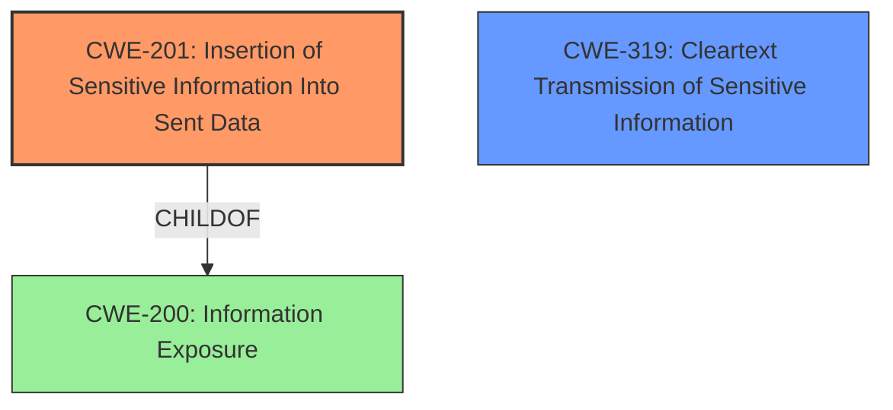

# Analysis Report for CVE-2020-11922

# Vulnerability Analysis Report: CVE-2020-11922

## Description


## Analysis (with Relationship Data)

# Summary

| CWE ID  | CWE Name                                               | Confidence | CWE Abstraction Level | CWE Vulnerability Mapping Label | CWE-Vulnerability Mapping Notes |
| :------- | :----------------------------------------------------- | :--------- | :-------------------- | :------------------------------ | :------------------------------ |
| CWE-201  | Insertion of Sensitive Information Into Sent Data    | 0.8        | Base                  | Primary                         | Allowed                       |
| CWE-319  | Cleartext Transmission of Sensitive Information      | 0.6        | Base                  | Secondary                       | Allowed                       |

## Evidence and Confidence

*   **Confidence Score:** 0.7
*   **Evidence Strength:** MEDIUM

## Relationship Analysis

The primary relationship that impacted the decision was the ChildOf relationship between CWE-201 and CWE-200 (Information Exposure). While CWE-200 is more general, the specific nature of the vulnerability, where sensitive data is inserted into sent data, makes CWE-201 a more fitting choice. CWE-319 was considered due to the mention of encryption.



## Vulnerability Chain

The vulnerability chain starts with the **insertion of sensitive information** (local IP address and Wi-Fi SSID) into the data being sent to the cloud controller server. This **insertion** leads to potential **information disclosure**, which then **decreases the privacy of the end user**.
The root cause is the **unnecessary inclusion of sensitive information** in the transmitted data, and the impact is the decreased privacy.

## Summary of Analysis

Initial analysis considered CWE-319 since the vulnerability description mentions that the information is sent *encrypted*. However, the core issue is the **inclusion of sensitive data**, regardless of encryption. Even though the information is encrypted, the fact that it is sent at all constitutes a privacy risk, as noted in the vulnerability description.

The primary basis for this assessment is the vulnerability description, which states: "The device sends unnecessary information to the cloud controller server... The information sent includes the local IP address being used and the SSID of the Wi-Fi network the device is connected to... it decreases the privacy of the end user." The inclusion of this specific information, even if encrypted, is the core weakness. The "CVE Reference Links Content Summary" mentions "Information Disclosure" as one of the weaknesses, which supports the selection of CWE-201.

CWE-201 is the optimal level of specificity because it directly addresses the **insertion of sensitive information into sent data**, which is the **root cause** of the privacy issue.

Relevant CWE Information:

# Enhanced Context (25 CWEs)

## CWE-226: Sensitive Information in Resource Not Removed Before Reuse
**Abstraction Level**: Base
**Similarity Score**: 0.80
**Source**: dense

**Description**:
The product releases a resource such as memory or a file so that it can be made available for reuse, but it does not clear or "zeroize" the information contained in the resource before the product performs a critical state transition or makes the resource available for reuse by other entities.

**Mapping Guidance**:
- Usage: Allowed
- Rationale: This CWE entry is at the Base level of abstraction, which is a preferred level of abstraction for mapping to the root causes of vulnerabilities.

## CWE-131: Incorrect Calculation of Buffer Size
**Abstraction Level**: Base
**Similarity Score**: 0.78
**Source**: dense

**Description**:
The product does not correctly calculate the size to be used when allocating a buffer, which could lead to a buffer overflow.

**Mapping Guidance**:
- Usage: Allowed
- Rationale: This CWE entry is at the Base level of abstraction, which is a preferred level of abstraction for mapping to the root causes of vulnerabilities.

## CWE-119: Improper Restriction of Operations within the Bounds of a Memory Buffer
**Abstraction Level**: Class
**Similarity Score**: 0.78
**Source**: dense

**Description**:
The product performs operations on a memory buffer, but it reads from or writes to a memory location outside the buffer's intended boundary. This may result in read or write operations on unexpected memory locations that could be linked to other variables, data structures, or internal program data.

**Mapping Guidance**:
- Usage: Discouraged
- Rationale: CWE-119 is commonly misused in low-information vulnerability reports when lower-level CWEs could be used instead, or when more details about the vulnerability are available.

## CWE-667: Improper Locking
**Abstraction Level**: Class
**Similarity Score**: 0.77
**Source**: dense

**Description**:
The product does not properly acquire or release a lock on a resource, leading to unexpected resource state changes and behaviors.

**Mapping Guidance**:
- Usage: Allowed-with-Review
- Rationale: This CWE entry is a Class and might have Base-level children that would be more appropriate

## CWE-126: Buffer Over-read
**Abstraction Level**: Variant
**Similarity Score**: 0.77
**Source**: dense

**Description**:
The product reads from a buffer using buffer access mechanisms such as indexes or pointers that reference memory locations after the targeted buffer.

**Mapping Guidance**:
- Usage: Allowed
- Rationale: This CWE entry is at the Variant level of abstraction, which is a preferred level of abstraction for mapping to the root causes of vulnerabilities.

## CWE-212: Improper Removal of Sensitive Information Before Storage or Transfer
**Abstraction Level**: Base
**Similarity Score**: 0.77
**Source**: dense

**Description**:
The product stores, transfers, or shares a resource that contains sensitive information, but it does not properly remove that information before the product makes the resource available to unauthorized actors.

**Mapping Guidance**:
- Usage: Allowed
- Rationale: This CWE entry is at the Base level of abstraction, which is a preferred level of abstraction for mapping to the root causes of vulnerabilities.

## CWE-754: Improper Check for Unusual or Exceptional Conditions
**Abstraction Level**: Class
**Similarity Score**: 0.77
**Source**: dense

**Description**:
The product does not check or incorrectly checks for unusual or exceptional conditions that are not expected to occur frequently during day to day operation of the product.

**Mapping Guidance**:
- Usage: Allowed-with-Review
- Rationale: This CWE entry is a Class and might have Base-level children that would be more appropriate

## CWE-125: Out-of-bounds Read
**Abstraction Level**: Base
**Similarity Score**: 0.77
**Source**: dense

**Description**:
The product reads data past the end, or before the beginning, of the intended buffer.

**Mapping Guidance**:
- Usage: Allowed
- Rationale: This CWE entry is at the Base level of abstraction, which is a preferred level of abstraction for mapping to the root causes of vulnerabilities.

## CWE-191: Integer Underflow (Wrap or Wraparound)
**Abstraction Level**: Base
**Similarity Score**: 0.77
**Source**: dense

**Description**:
The product subtracts one value from another, such that the result is less than the minimum allowable integer value, which produces a value that is not equal to the correct result.

**Mapping Guidance**:
- Usage: Allowed
- Rationale: This CWE entry is at the Base level of abstraction, which is a preferred level of abstraction for mapping to the root causes of vulnerabilities.

## CWE-319: Cleartext Transmission of Sensitive Information
**Abstraction Level**: Base
**Similarity Score**: 0.77
**Source**: dense

**Description**:
The product transmits sensitive or security-critical data in cleartext in a communication channel that can be sniffed by unauthorized actors.

**Mapping Guidance**:
- Usage: Allowed
- Rationale: This CWE entry is at the Base level of abstraction, which is a preferred level of abstraction for mapping to the root causes of vulnerabilities.

## CWE-319: Cleartext Transmission of Sensitive Information
**Abstraction Level**: Base
**Similarity Score**: 5297.08
**Source**: sparse

**Description**:
The product transmits sensitive or security-critical data in cleartext in a communication channel that can be sniffed by unauthorized actors.

**Mapping Guidance**:
- Usage: Allowed
- Rationale: This CWE entry is at the Base level of abstraction, which is a preferred level of abstraction for mapping to the root causes of vulnerabilities.

## CWE-327: Use of a Broken or Risky Cryptographic Algorithm
**Abstraction Level**: Class
**Similarity Score**: 5271.40
**Source**: sparse

**Description**:
The product uses a broken or risky cryptographic algorithm or protocol.

**Mapping


## CWE Relationship Analysis

Current CWEs represent these abstraction levels: .


### Vulnerability Chain Analysis

**Chain starting from CWE-667:**
- 667 (Improper Locking) - ROOT


**Chain starting from CWE-754:**
- 754 (Improper Check for Unusual or Exceptional Conditions) - ROOT


### CWE Relationship Diagram

```mermaid
graph TD
    classDef primary fill:#f96,stroke:#333,stroke-width:2px
    classDef secondary fill:#69f,stroke:#333
    classDef tertiary fill:#9e9,stroke:#333
```


*Report generated on 2025-04-01 23:24:19*
