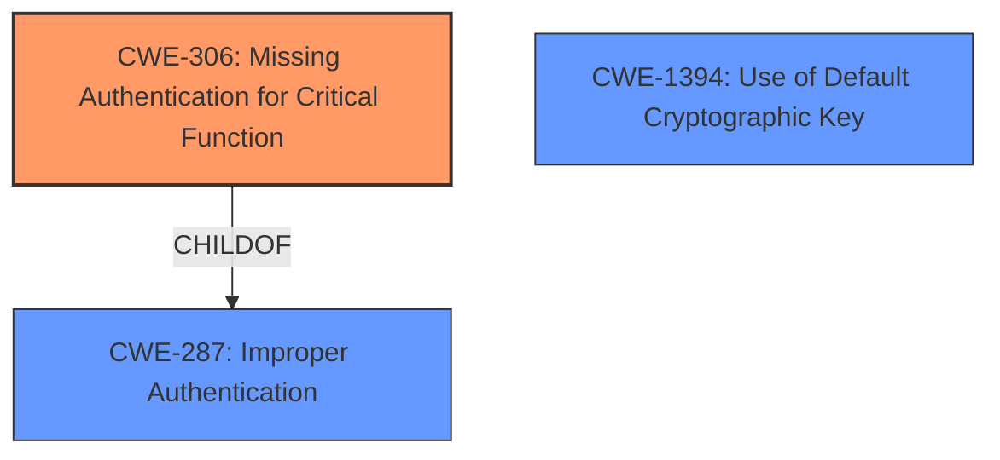

# Enhanced Analysis for CVE-2020-11946

# Summary
| CWE ID | CWE Name | Confidence | CWE Abstraction Level | CWE Vulnerability Mapping Label | CWE-Vulnerability Mapping Notes |
|---|---|---|---|---|---|
| CWE-306 | Missing Authentication for Critical Function | 1.0 | Base | Primary | Allowed |
| CWE-1394 | Use of Default Cryptographic Key | 0.7 | Base | Secondary | Allowed |

## Evidence and Confidence

*   **Confidence Score:** 0.9
*   **Evidence Strength:** MEDIUM

## Relationship Analysis
The primary CWE is CWE-306, which indicates a **lack of authentication** for critical functions. It is a base-level CWE, providing a specific description of the vulnerability. CWE-306 is a child of CWE-287 (Improper Authentication), which is a more general class. The secondary CWE candidate is CWE-1394 (Use of Default Cryptographic Key).



## Vulnerability Chain
The vulnerability chain starts with a **missing authentication** check (CWE-306) for a servlet call, which leads to the **impact** of an unauthenticated user being able to retrieve an API key.

## Summary of Analysis
The vulnerability description clearly states that an unauthenticated user can retrieve an API key via a servlet call in Zoho ManageEngine OpManager.

The primary weakness is the **missing authentication** (CWE-306) for a critical function (retrieving the API key). The key phrase "unauthenticated user to retrieve an API key" directly supports this. The retriever results also list CWE-306 as the top candidate. The CWE description matches the vulnerability, as the product "does not perform any authentication for functionality that requires a provable user identity".

CWE-1394 (Use of Default Cryptographic Key) was also considered as a secondary weakness. While the description mentions retrieving an API key, it doesn't explicitly state that a default key is being used, but it is a reasonable assumption that the retrievable API key could be a default one.

CWE-287 (Improper Authentication) was considered but rejected as it's a Class-level CWE, and CWE-306 is a more specific Base-level CWE that accurately represents the vulnerability.

CWE-425 (Direct Request ('Forced Browsing')) was considered because the attack vector is a direct servlet call. However, the root cause is the **missing authentication**, not the direct request itself.

CWE-639 (Authorization Bypass Through User-Controlled Key) was considered but rejected as the vulnerability is exploitable by an unauthenticated user, whereas CWE-639 requires an authenticated user to modify a key.

The final decision is to map the vulnerability to CWE-306, with a secondary consideration of CWE-1394. This decision is based on the evidence from the vulnerability description, the retriever results, and the CWE specifications. The chosen CWEs are at the optimal level of specificity, providing a clear and accurate representation of the vulnerability.

Relevant CWE Information:


## CWE Relationship Analysis

Current CWEs represent these abstraction levels: .


### Vulnerability Chain Analysis

**Chain starting from CWE-306:**
- 306 (Missing Authentication for Critical Function) - ROOT


**Chain starting from CWE-287:**
- 287 (Improper Authentication) - ROOT


### CWE Relationship Diagram

```mermaid
graph TD
    classDef primary fill:#f96,stroke:#333,stroke-width:2px
    classDef secondary fill:#69f,stroke:#333
    classDef tertiary fill:#9e9,stroke:#333
```