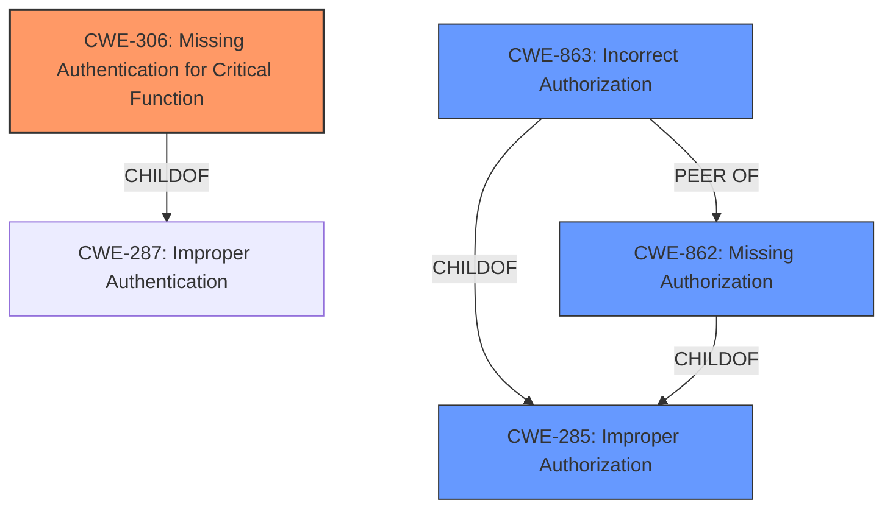

# Raw Analyzer Response for CVE-2020-12028

# Summary
| CWE ID | CWE Name | Confidence | CWE Abstraction Level | CWE Vulnerability Mapping Label | CWE-Vulnerability Mapping Notes |
|---|---|---|---|---|---|
| CWE-306 | Missing Authentication for Critical Function | 0.8 | Base | Allowed | Primary CWE |
| CWE-863 | Incorrect Authorization | 0.6 | Class | Allowed-with-Review | Secondary Candidate |
| CWE-285 | Improper Authorization | 0.5 | Class | Discouraged | Secondary Candidate |

## Evidence and Confidence

*   **Confidence Score:** 0.7
*   **Evidence Strength:** MEDIUM

## Relationship Analysis
The primary relationship influencing the decision is the ChildOf relationship where CWE-306 (Missing Authentication for Critical Function) is a child of CWE-287 (Improper Authentication). Additionally, CWE-863 (Incorrect Authorization) is a sibling to CWE-862 (Missing Authorization). Since the vulnerability description mentioned that the handlers "do not enforce appropriate permissions", it aligns more precisely with missing authentication rather than incorrect authorization, but both are related. The base abstraction level of CWE-306 is also preferred over the Class level of CWE-863.

## Vulnerability Chain
The chain of weaknesses is relatively straightforward: **missing authentication** leads to the ability of an authenticated attacker to interact with data on a remote endpoint. The handlers **do not enforce appropriate permissions** leading to the **impact:** interact with the data on the remote endpoint.

## Summary of Analysis
The initial assessment pointed to CWE-306 (Missing Authentication for Critical Function) as the primary weakness, because the vulnerability description explicitly states that certain handlers "do not enforce appropriate permissions". This indicates a lack of authentication for those handlers.

The key piece of evidence is: "an authenticated attacker may be able to utilize certain handlers to interact with the data on the remote endpoint since those handlers **do not enforce appropriate permissions**."

The relationship graph and the definitions support the selection of CWE-306 at the base level of abstraction. It directly reflects the **root cause** of the vulnerability.

CWE-863 (Incorrect Authorization) and CWE-285 (Improper Authorization) were considered but deemed less appropriate because the issue is not that authorization is performed incorrectly, but that it is completely missing for critical functions.

Relevant CWE Information:

# Enhanced Context (25 CWEs)

## CWE-306: Missing Authentication for Critical Function
**Abstraction:** Base
**Status:** Draft

### Description
The product does not perform any authentication for functionality that requires a provable user identity or consumes a significant amount of resources.

**Mapping Guidance**
**Usage:** Allowed

## CWE-863: Incorrect Authorization
**Abstraction:** Class
**Status:** Incomplete

### Description
The product performs an authorization check when an actor attempts to access a resource or perform an action, but it does not correctly perform the check.

**Mapping Guidance**
**Usage:** Allowed-with-Review

## CWE-285: Improper Authorization
**Abstraction:** Class
**Status:** Draft

### Description
The product does not perform or incorrectly performs an authorization check when an actor attempts to access a resource or perform an action.

**Mapping Guidance**
**Usage:** Discouraged