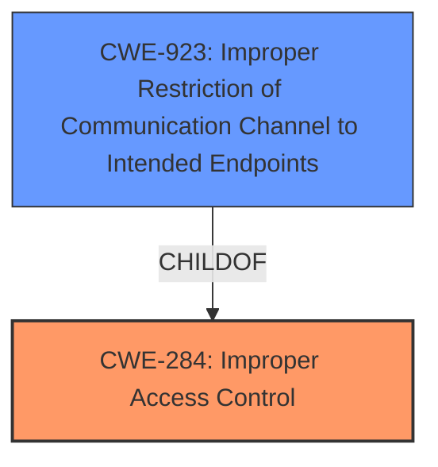

# Analysis for CVE-2020-12030

# Summary
| CWE ID | CWE Name | Confidence | CWE Abstraction Level | CWE Vulnerability Mapping Label | CWE-Vulnerability Mapping Notes |
|---|---|---|---|---|---|
| CWE-284 | Improper Access Control | 0.75 | Pillar | Discouraged | Primary CWE. The product does not restrict or incorrectly restricts access to a resource from an unauthorized actor. |
| CWE-923 | Improper Restriction of Communication Channel to Intended Endpoints | 0.60 | Class | Allowed-with-Review | Secondary candidate. The product establishes a communication channel to (or from) an endpoint for privileged or protected operations, but it does not properly ensure that it is communicating with the correct endpoint. |

## Evidence and Confidence

*   **Confidence Score:** 0.70
*   **Evidence Strength:** MEDIUM

## Relationship Analysis
The primary CWE selected is CWE-284, "Improper Access Control", which is a high-level Pillar. While it broadly captures the essence of the vulnerability, it's discouraged due to its generality. CWE-923, "Improper Restriction of Communication Channel to Intended Endpoints," is a Class-level CWE and a child of CWE-284, offering a more specific classification related to communication channels. However, the description doesn't explicitly detail issues with endpoint validation, making CWE-923 a less confident selection.

## Vulnerability Chain
The vulnerability chain starts with a **flaw in the code** that configures the internal gateway firewall when the gateway's VLAN feature is enabled. This **flaw** leads to the internal gateway firewall being disabled when the VLAN setting is enabled, resulting in **exposure of all ports used by the gateway**. The final impact is the potential compromise of devices on the network and disruption of operations. The primary root cause is a **failure in access control**, as the system **fails to properly** restrict access to the gateway's ports.

## Summary of Analysis
Initial assessment indicated CWE-284 as the primary weakness, supported by the evidence: "When the VLAN setting is enabled, the internal gateway firewall is disabled, exposing all ports used by the gateway." This clearly indicates an access control issue. The retriever results also list CWE-284 as a candidate. However, CWE-284 is a very high-level "Pillar" and the guidance recommends using more specific descendants if possible.

CWE-923 was considered because it is a child of CWE-284 and focuses on communication channel restrictions, which aligns with the network-based nature of the vulnerability. However, the description doesn't explicitly state that the communication channel is being directed to the wrong endpoint; rather, the firewall is simply disabled, removing any restrictions. Therefore, while related, it's not a perfect fit.

Ultimately, CWE-284 remains the most appropriate primary mapping despite its high level of abstraction, as the core issue is the **improper** restriction of access. Further investigation might reveal a more specific cause related to the firewall configuration logic, but based on the available evidence, CWE-284 is the most accurate representation.

Relevant CWE Information:

# Enhanced Context (25 CWEs)

## CWE-668: Exposure of Resource to Wrong Sphere
**Abstraction Level**: Class
**Similarity Score**: 0.76
**Source**: dense

**Description**:
The product exposes a resource to the wrong control sphere, providing unintended actors with inappropriate access to the resource.

**Mapping Guidance**:
- Usage: Discouraged
- Rationale: CWE-668 is high-level and is often misused as a catch-all when lower-level CWE IDs might be applicable. It is sometimes used for low-information vulnerability reports [REF-1287]. It is a level-1 Class (i.e., a child of a Pillar). It is not useful for trend analysis.

**Why Not Used**: While the vulnerability does result in the exposure of ports, the root cause is the disabling of the firewall, rather than the resource being inherently exposed to the wrong sphere.

## CWE-807: Reliance on Untrusted Inputs in a Security Decision
**Abstraction Level**: Base
**Similarity Score**: 0.76
**Source**: dense

**Description**:
The product uses a protection mechanism that relies on the existence or values of an input, but the input can be modified by an untrusted actor in a way that bypasses the protection mechanism.

**Mapping Guidance**:
- Usage: Allowed
- Rationale: This CWE entry is at the Base level of abstraction, which is a preferred level of abstraction for mapping to the root causes of vulnerabilities.

**Why Not Used**: There is no clear indication that the vulnerability stems from reliance on untrusted inputs in making security decisions.

## CWE-665: Improper Initialization
**Abstraction Level**: Class
**Similarity Score**: 0.76
**Source**: dense

**Description**:
The product does not initialize or incorrectly initializes a resource, which might leave the resource in an unexpected state when it is accessed or used.

**Mapping Guidance**:
- Usage: Discouraged
- Rationale: This CWE entry is a level-1 Class (i.e., a child of a Pillar). It might have lower-level children that would be more appropriate

**Why Not Used**: The issue is not directly related to improper initialization, but rather a flaw in the configuration logic when VLAN is enabled.

## CWE-1188: Initialization of a Resource with an Insecure Default
**Abstraction Level**: Base
**Similarity Score**: 0.76
**Source**: dense

**Description**:
The product initializes or sets a resource with a default that is intended to be changed by the administrator, but the default is not secure.

**Mapping Guidance**:
- Usage: Allowed
- Rationale: This CWE entry is at the Base level of abstraction, which is a preferred level of abstraction for mapping to the root causes of vulnerabilities.

**Why Not Used**: The issue doesn't involve insecure defaults, but rather the disabling of a security feature (firewall) upon enabling another feature (VLAN).

## CWE-345: Insufficient Verification of Data Authenticity
**Abstraction Level**: Class
**Similarity Score**: 0.75
**Source**: dense

**Description**:
The product does not sufficiently verify the origin or authenticity of data, in a way that causes it to accept invalid data.

**Mapping Guidance**:
- Usage: Discouraged
- Rationale: This CWE entry is a level-1 Class (i.e., a child of a Pillar). It might have lower-level children that would be more appropriate

**Why Not Used**: The vulnerability does not revolve around the verification of data authenticity.

## CWE-74: Improper Neutralization of Special Elements in Output Used by a Downstream Component ('Injection')
**Abstraction Level**: Class
**Similarity Score**: 0.75
**Source**: dense

**Description**:
The product constructs all or part of a command, data structure, or record using externally-influenced input from an upstream component, but it does not neutralize or incorrectly neutralizes special elements that could modify how it is parsed or interpreted when it is sent to a downstream component.

**Mapping Guidance**:
- Usage: Discouraged
- Rationale: CWE-74 is high-level and often misused when lower-level weaknesses are more appropriate.

**Why Not Used**: Injection is not involved in this vulnerability.

## CWE-404: Improper Resource Shutdown or Release
**Abstraction Level**: Class
**Similarity Score**: 0.75
**Source**: dense

**Description**:
The product does not release or incorrectly releases a resource before it is made available for re-use.

**Mapping Guidance**:
- Usage: Allowed-with-Review
- Rationale: This CWE entry is a Class and might have Base-level children that would be more appropriate

**Why Not Used**: The issue is not related to resource management.

## CWE-1391: Use of Weak Credentials
**Abstraction Level**: Class
**Similarity Score**: 0.75
**Source**: dense

**Description**:
The product uses weak credentials (such as a default key or hard-coded password) that can be calculated, derived, reused, or guessed by an attacker.

**Mapping Guidance**:
- Usage: Allowed-with-Review
- Rationale: This CWE entry is a Class and might have Base-level children that would be more appropriate

**Why Not Used**: Credentials are not involved in this vulnerability.

## CWE-41: Improper Resolution of Path Equivalence
**Abstraction Level**: Base
**Similarity Score**: 0.75
**Source**: dense

**Description**:
The product is vulnerable to file system contents disclosure through path equivalence. Path equivalence involves the use of special characters in file and directory names. The associated manipulations are intended to generate multiple names for the same object.

**Mapping Guidance**:
- Usage: Allowed
- Rationale: This