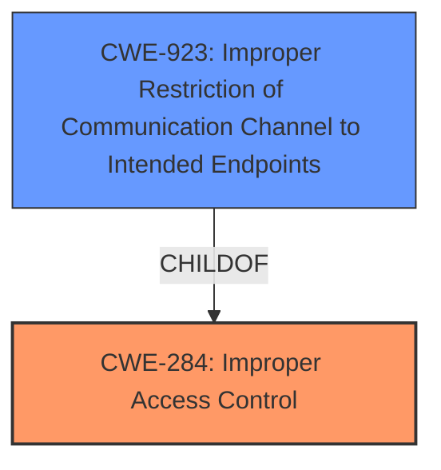

# Analysis for CVE-2020-12030

# Summary
| CWE ID | CWE Name | Confidence | CWE Abstraction Level | CWE Vulnerability Mapping Label | CWE-Vulnerability Mapping Notes |
|---|---|---|---|---|---|
| CWE-284 | Improper Access Control | 0.75 | Pillar | Discouraged | Primary CWE. The product does not restrict or incorrectly restricts access to a resource from an unauthorized actor. |
| CWE-923 | Improper Restriction of Communication Channel to Intended Endpoints | 0.60 | Class | Allowed-with-Review | Secondary candidate. The product establishes a communication channel to (or from) an endpoint for privileged or protected operations, but it does not properly ensure that it is communicating with the correct endpoint. |

## Evidence and Confidence

*   **Confidence Score:** 0.70
*   **Evidence Strength:** MEDIUM

## Relationship Analysis
The primary CWE selected is CWE-284, "Improper Access Control", which is a high-level Pillar. While it broadly captures the essence of the vulnerability, it's discouraged due to its generality. CWE-923, "Improper Restriction of Communication Channel to Intended Endpoints," is a Class-level CWE and a child of CWE-284, offering a more specific classification related to communication channels. However, the description doesn't explicitly detail issues with endpoint validation, making CWE-923 a less confident selection.

## Vulnerability Chain
The vulnerability chain starts with a **flaw in the code** that configures the internal gateway firewall when the gateway's VLAN feature is enabled. This **flaw** leads to the internal gateway firewall being disabled when the VLAN setting is enabled, resulting in **exposure of all ports used by the gateway**. The final impact is the potential compromise of devices on the network and disruption of operations. The primary root cause is a **failure in access control**, as the system **fails to properly** restrict access to the gateway's ports.

## Summary of Analysis
Initial assessment indicated CWE-284 as the primary weakness, supported by the evidence: "When the VLAN setting is enabled, the internal gateway firewall is disabled, exposing all ports used by the gateway." This clearly indicates an access control issue. The retriever results also list CWE-284 as a candidate. However, CWE-284 is a very high-level "Pillar" and the guidance recommends using more specific descendants if possible.

CWE-923 was considered because it is a child of CWE-284 and focuses on communication channel restrictions, which aligns with the network-based nature of the vulnerability. However, the description doesn't explicitly state that the communication channel is being directed to the wrong endpoint; rather, the firewall is simply disabled, removing any restrictions. Therefore, while related, it's not a perfect fit.

Ultimately, CWE-284 remains the most appropriate primary mapping despite its high level of abstraction, as the core issue is the **improper** restriction of access. Further investigation might reveal a more specific cause related to the firewall configuration logic, but based on the available evidence, CWE-284 is the most accurate representation.

Relevant CWE Information:

# Enhanced Context (25 CWEs)

## CWE-668: Exposure of Resource to Wrong Sphere
**Abstraction Level**: Class
**Similarity Score**: 0.76
**Source**: dense

**Description**:
The product exposes a resource to the wrong control sphere, providing unintended actors with inappropriate access to the resource.

**Mapping Guidance**:
- Usage: Discouraged
- Rationale: CWE-668 is high-level and is often misused as a catch-all when lower-level CWE IDs might be applicable. It is sometimes used for low-information vulnerability reports [REF-1287]. It is a level-1 Class (i.e., a child of a Pillar). It is not useful for trend analysis.

**Why Not Used**: While the vulnerability does result in the exposure of ports, the root cause is the disabling of the firewall, rather than the resource being inherently exposed to the wrong sphere.

## CWE-807: Reliance on Untrusted Inputs in a Security Decision
**Abstraction Level**: Base
**Similarity Score**: 0.76
**Source**: dense

**Description**:
The product uses a protection mechanism that relies on the existence or values of an input, but the input can be modified by an untrusted actor in a way that bypasses the protection mechanism.

**Mapping Guidance**:
- Usage: Allowed
- Rationale: This CWE entry is at the Base level of abstraction, which is a preferred level of abstraction for mapping to the root causes of vulnerabilities.

**Why Not Used**: There is no clear indication that the vulnerability stems from reliance on untrusted inputs in making security decisions.

## CWE-665: Improper Initialization
**Abstraction Level**: Class
**Similarity Score**: 0.76
**Source**: dense

**Description**:
The product does not initialize or incorrectly initializes a resource, which might leave the resource in an unexpected state when it is accessed or used.

**Mapping Guidance**:
- Usage: Discouraged
- Rationale: This CWE entry is a level-1 Class (i.e., a child of a Pillar). It might have lower-level children that would be more appropriate

**Why Not Used**: The issue is not directly related to improper initialization, but rather a flaw in the configuration logic when VLAN is enabled.

## CWE-1188: Initialization of a Resource with an Insecure Default
**Abstraction Level**: Base
**Similarity Score**: 0.76
**Source**: dense

**Description**:
The product initializes or sets a resource with a default that is intended to be changed by the administrator, but the default is not secure.

**Mapping Guidance**:
- Usage: Allowed
- Rationale: This CWE entry is at the Base level of abstraction, which is a preferred level of abstraction for mapping to the root causes of vulnerabilities.

**Why Not Used**: The issue doesn't involve insecure defaults, but rather the disabling of a security feature (firewall) upon enabling another feature (VLAN).

## CWE-345: Insufficient Verification of Data Authenticity
**Abstraction Level**: Class
**Similarity Score**: 0.75
**Source**: dense

**Description**:
The product does not sufficiently verify the origin or authenticity of data, in a way that causes it to accept invalid data.

**Mapping Guidance**:
- Usage: Discouraged
- Rationale: This CWE entry is a level-1 Class (i.e., a child of a Pillar). It might have lower-level children that would be more appropriate

**Why Not Used**: The vulnerability does not revolve around the verification of data authenticity.

## CWE-74: Improper Neutralization of Special Elements in Output Used by a Downstream Component ('Injection')
**Abstraction Level**: Class
**Similarity Score**: 0.75
**Source**: dense

**Description**:
The product constructs all or part of a command, data structure, or record using externally-influenced input from an upstream component, but it does not neutralize or incorrectly neutralizes special elements that could modify how it is parsed or interpreted when it is sent to a downstream component.

**Mapping Guidance**:
- Usage: Discouraged
- Rationale: CWE-74 is high-level and often misused when lower-level weaknesses are more appropriate.

**Why Not Used**: Injection is not involved in this vulnerability.

## CWE-404: Improper Resource Shutdown or Release
**Abstraction Level**: Class
**Similarity Score**: 0.75
**Source**: dense

**Description**:
The product does not release or incorrectly releases a resource before it is made available for re-use.

**Mapping Guidance**:
- Usage: Allowed-with-Review
- Rationale: This CWE entry is a Class and might have Base-level children that would be more appropriate

**Why Not Used**: The issue is not related to resource management.

## CWE-1391: Use of Weak Credentials
**Abstraction Level**: Class
**Similarity Score**: 0.75
**Source**: dense

**Description**:
The product uses weak credentials (such as a default key or hard-coded password) that can be calculated, derived, reused, or guessed by an attacker.

**Mapping Guidance**:
- Usage: Allowed-with-Review
- Rationale: This CWE entry is a Class and might have Base-level children that would be more appropriate

**Why Not Used**: Credentials are not involved in this vulnerability.

## CWE-41: Improper Resolution of Path Equivalence
**Abstraction Level**: Base
**Similarity Score**: 0.75
**Source**: dense

**Description**:
The product is vulnerable to file system contents disclosure through path equivalence. Path equivalence involves the use of special characters in file and directory names. The associated manipulations are intended to generate multiple names for the same object.

**Mapping Guidance**:
- Usage: Allowed
- Rationale: This

# Enhanced Query for CVE-2020-12030

## Vulnerability Description
There is a flaw in the code used to configure the internal gateway firewall when the gateways VLAN feature is enabled. If a user enables the VLAN setting, the internal gateway firewall becomes disabled resulting in exposure of all ports used by the gateway.

### Vulnerability Description Key Phrases
- **impact:** exposure of all ports used by the gateway
- **vector:** enabling the VLAN setting

## CVE Reference Links Content Summary
- **Root cause of vulnerability**: A flaw in the code used to configure the internal gateway firewall when the gateway's VLAN feature is enabled.
- **Weaknesses/vulnerabilities present**: Improper access control (CWE-284). When the VLAN setting is enabled, the internal gateway firewall is disabled, exposing all ports used by the gateway.
- **Impact of exploitation**: Successful exploitation can disable the internal gateway firewall. Once disabled, a malicious user can send specific commands to the gateway, which could then be forwarded to end-user wireless devices. This could lead to a compromise of the devices on the network and potential disruption of operations.
- **Attack vectors**: The vulnerability is remotely exploitable over the network.
- **Required attacker capabilities/position**: No specific user privileges are required to exploit this vulnerability, and it can be exploited with a low skill level. An attacker would need network access to the affected gateway.

The provided content gives more detailed information than the basic CVE description, including the specific affected product versions, the mechanism of the vulnerability, and the potential impact.

## Retriever Results

### Top Combined Results

| Rank | CWE ID | Name | Abstraction | Usage  | Retrievers | Individual Scores |
|------|--------|------|-------------|-------|------------|-------------------|
| 1 | 346 | Origin Validation Error | Class | Allowed-with-Review | sparse | 0.101 |
| 2 | 923 | Improper Restriction of Communication Channel to Intended Endpoints | Class | Allowed-with-Review | sparse | 0.089 |
| 3 | 284 | Improper Access Control | Pillar | Discouraged | sparse | 0.089 |
| 4 | 917 | Improper Neutralization of Special Elements used in an Expression Language Statement ('Expression Language Injection') | Base | Allowed | sparse | 0.089 |
| 5 | 863 | Incorrect Authorization | Class | Allowed-with-Review | sparse | 0.087 |
| 6 | 912 | Hidden Functionality | Class | Allowed-with-Review | dense | 0.464 |
| 7 | 1275 | Sensitive Cookie with Improper SameSite Attribute | Variant | Allowed | graph | 0.002 |
| 8 | 204 | Observable Response Discrepancy | Base | Allowed | sparse | 0.086 |
| 9 | 502 | Deserialization of Untrusted Data | Base | Allowed | sparse | 0.085 |
| 10 | 1188 | Initialization of a Resource with an Insecure Default | Base | Allowed | sparse | 0.083 |

# Complete CWE Specifications

## CWE-346: Origin Validation Error
**Abstraction:** Class
**Status:** Draft

### Description
The product does not properly verify that the source of data or communication is valid.

### Extended Description
Not provided

### Alternative Terms
None

### Relationships
ChildOf -> CWE-345
ChildOf -> CWE-345
ChildOf -> CWE-284

### Mapping Guidance
**Usage:** Allowed-with-Review
**Rationale:** This CWE entry is a Class and might have Base-level children that would be more appropriate
**Comments:** Examine children of this entry to see if there is a better fit
**Reasons:**
- Abstraction

### Additional Notes
**[Maintenance]** This entry has some significant overlap with other CWE entries and may need some clarification. See terminology notes.

**[Terminology]** The "Origin Validation Error" term was originally used in a 1995 thesis [REF-324]. Although not formally defined, an issue is considered to be an origin validation error if either (1) "an object [accepts] input from an unauthorized subject," or (2) "the system [fails] to properly or completely authenticate a subject." A later section says that an origin validation error can occur when the system (1) "does not properly authenticate a user or process" or (2) "does not properly authenticate the shared data or libraries." The only example provided in the thesis (covered by OSVDB:57615) involves a setuid program running command-line arguments without dropping privileges. So, this definition (and its examples in the thesis) effectively cover other weaknesses such as CWE-287 (Improper Authentication), CWE-285 (Improper Authorization), and CWE-250 (Execution with Unnecessary Privileges). There appears to be little usage of this term today, except in the SecurityFocus vulnerability database, where the term is used for a variety of issues, including web-browser problems that allow violation of the Same Origin Policy and improper validation of the source of an incoming message.

### Observed Examples
- **CVE-2000-1218:** DNS server can accept DNS updates from hosts that it did not query, leading to cache poisoning
- **CVE-2005-0877:** DNS server can accept DNS updates from hosts that it did not query, leading to cache poisoning
- **CVE-2001-1452:** DNS server caches glue records received from non-delegated name servers

## CWE-923: Improper Restriction of Communication Channel to Intended Endpoints
**Abstraction:** Class
**Status:** Incomplete

### Description
The product establishes a communication channel to (or from) an endpoint for privileged or protected operations, but it does not properly ensure that it is communicating with the correct endpoint.

### Extended Description

Attackers might be able to spoof the intended endpoint from a different system or process, thus gaining the same level of access as the intended endpoint.

While this issue frequently involves authentication between network-based clients and servers, other types of communication channels and endpoints can have this weakness.

### Alternative Terms
None

### Relationships
ChildOf -> CWE-284

### Mapping Guidance
**Usage:** Allowed-with-Review
**Rationale:** This CWE entry is a Class and might have Base-level children that would be more appropriate
**Comments:** Examine children of this entry to see if there is a better fit
**Reasons:**
- Abstraction

### Observed Examples
- **CVE-2022-30319:** S-bus functionality in a home automation product performs access control using an IP allowlist, which can be bypassed by a forged IP address.
- **CVE-2022-22547:** A troubleshooting tool exposes a web server on a random port between 9000-65535 that could be used for information gathering
- **CVE-2022-4390:** A WAN interface on a router has firewall restrictions enabled for IPv4, but it does not for IPv6, which is enabled by default

## CWE-284: Improper Access Control
**Abstraction:** Pillar
**Status:** Incomplete

### Description
The product does not restrict or incorrectly restricts access to a resource from an unauthorized actor.

### Extended Description

Access control involves the use of several protection mechanisms such as:

  - Authentication (proving the identity of an actor)

  - Authorization (ensuring that a given actor can access a resource), and

  - Accountability (tracking of activities that were performed)

When any mechanism is not applied or otherwise fails, attackers can compromise the security of the product by gaining privileges, reading sensitive information, executing commands, evading detection, etc.

There are two distinct behaviors that can introduce access control weaknesses:

  - Specification: incorrect privileges, permissions, ownership, etc. are explicitly specified for either the user or the resource (for example, setting a password file to be world-writable, or giving administrator capabilities to a guest user). This action could be performed by the program or the administrator.

  - Enforcement: the mechanism contains errors that prevent it from properly enforcing the specified access control requirements (e.g., allowing the user to specify their own privileges, or allowing a syntactically-incorrect ACL to produce insecure settings). This problem occurs within the program itself, in that it does not actually enforce the intended security policy that the administrator specifies.

### Alternative Terms
Authorization: The terms "access control" and "authorization" are often used interchangeably, although many people have distinct definitions. The CWE usage of "access control" is intended as a general term for the various mechanisms that restrict which users can access which resources, and "authorization" is more narrowly defined. It is unlikely that there will be community consensus on the use of these terms.

### Relationships
None

### Mapping Guidance
**Usage:** Discouraged
**Rationale:** CWE-284 is extremely high-level, a Pillar. Its name, "Improper Access Control," is often misused in low-information vulnerability reports [REF-1287] or by active use of the OWASP Top Ten, such as "A01:2021-Broken Access Control". It is not useful for trend analysis.
**Comments:** Consider using descendants of CWE-284 that are more specific to the kind of access control involved, such as those involving authorization (Missing Authorization (CWE-862), Incorrect Authorization (CWE-863), Incorrect Permission Assignment for Critical Resource (CWE-732), etc.); authentication (Missing Authentication (CWE-306) or Weak Authentication (CWE-1390)); Incorrect User Management (CWE-286); Improper Restriction of Communication Channel to Intended Endpoints (CWE-923); etc.
**Reasons:**
- Frequent Misuse
- Abstraction
**Suggested Alternatives:**
- CWE-862: Missing Authorization
- CWE-863: Incorrect Authorization
- CWE-732: Incorrect Permission Assignment for Critical Resource
- CWE-306: Missing Authentication
- CWE-1390: Weak Authentication
- CWE-923: Improper Restriction of Communication Channel to Intended Endpoints

### Additional Notes
**[Maintenance]** 

This entry needs more work. Possible sub-categories include:

  - Trusted group includes undesired entities (partially covered by CWE-286)

  - Group can perform undesired actions

  - ACL parse error does not fail closed

### Observed Examples
- **CVE-2022-24985:** A form hosting website only checks the session authentication status for a single form, making it possible to bypass authentication when there are multiple forms
- **CVE-2022-29238:** Access-control setting in web-based document collaboration tool is not properly implemented by the code, which prevents listing hidden directories but does not prevent direct requests to files in those directories.
- **CVE-2022-23607:** Python-based HTTP library did not scope cookies to a particular domain such that "supercookies" could be sent to any domain on redirect

## CWE-917: Improper Neutralization of Special Elements used in an Expression Language Statement ('Expression Language Injection')
**Abstraction:** Base
**Status:** Incomplete

### Description
The product constructs all or part of an expression language (EL) statement in a framework such as a Java Server Page (JSP) using externally-influenced input from an upstream component, but it does not neutralize or incorrectly neutralizes special elements that could modify the intended EL statement before it is executed.

### Extended Description
Frameworks such as Java Server Page (JSP) allow a developer to insert executable expressions within otherwise-static content. When the developer is not aware of the executable nature of these expressions and/or does not disable them, then if an attacker can inject expressions, this could lead to code execution or other unexpected behaviors.

### Alternative Terms
EL Injection

### Relationships
ChildOf -> CWE-77
PeerOf -> CWE-1336
ChildOf -> CWE-74
ChildOf -> CWE-77
ChildOf -> CWE-77

### Mapping Guidance
**Usage:** Allowed
**Rationale:** This CWE entry is at the Base level of abstraction, which is a preferred level of abstraction for mapping to the root causes of vulnerabilities.
**Comments:** Carefully read both the name and description to ensure that this mapping is an appropriate fit. Do not try to 'force' a mapping to a lower-level Base/Variant simply to comply with this preferred level of abstraction.
**Reasons:**
- Acceptable-Use

### Additional Notes
**[Maintenance]** The interrelationships and differences between CWE-917 and CWE-1336 need to be further clarified.

**[Relationship]** In certain versions of Spring 3.0.5 and earlier, there was a vulnerability (CVE-2011-2730) in which Expression Language tags would be evaluated twice, which effectively exposed any application to EL injection. However, even for later versions, this weakness is still possible depending on configuration.

### Observed Examples
- **CVE-2021-44228:** Product does not neutralize ${xyz} style expressions, allowing remote code execution. (log4shell vulnerability in log4j)

## CWE-863: Incorrect Authorization
**Abstraction:** Class
**Status:** Incomplete

### Description
The product performs an authorization check when an actor attempts to access a resource or perform an action, but it does not correctly perform the check.

### Extended Description
Not provided

### Alternative Terms
AuthZ: "AuthZ" is typically used as an abbreviation of "authorization" within the web application security community. It is distinct from "AuthN" (or, sometimes, "AuthC") which is an abbreviation of "authentication." The use of "Auth" as an abbreviation is discouraged, since it could be used for either authentication or authorization.

### Relationships
ChildOf -> CWE-285
ChildOf -> CWE-284

### Mapping Guidance
**Usage:** Allowed-with-Review
**Rationale:** This CWE entry is a Class and might have Base-level children that would be more appropriate
**Comments:** Examine children of this entry to see if there is a better fit
**Reasons:**
- Abstraction

### Additional Notes
**[Terminology]** 

Assuming a user with a given identity, authorization is the process of determining whether that user can access a given resource, based on the user's privileges and any permissions or other access-control specifications that apply to the resource.

### Observed Examples
- **CVE-2021-39155:** Chain: A microservice integration and management platform compares the hostname in the HTTP Host header in a case-sensitive way (CWE-178, CWE-1289), allowing bypass of the authorization policy (CWE-863) using a hostname with mixed case or other variations.
- **CVE-2019-15900:** Chain: sscanf() call is used to check if a username and group exists, but the return value of sscanf() call is not checked (CWE-252), causing an uninitialized variable to be checked (CWE-457), returning success to allow authorization bypass for executing a privileged (CWE-863).
- **CVE-2009-2213:** Gateway uses default "Allow" configuration for its authorization settings.

## CWE-912: Hidden Functionality
**Abstraction:** Class
**Status:** Incomplete

### Description
The product contains functionality that is not documented, not part of the specification, and not accessible through an interface or command sequence that is obvious to the product's users or administrators.

### Extended Description
Hidden functionality can take many forms, such as intentionally malicious code, "Easter Eggs" that contain extraneous functionality such as games, developer-friendly shortcuts that reduce maintenance or support costs such as hard-coded accounts, etc. From a security perspective, even when the functionality is not intentionally malicious or damaging, it can increase the product's attack surface and expose additional weaknesses beyond what is already exposed by the intended functionality. Even if it is not easily accessible, the hidden functionality could be useful for attacks that modify the control flow of the application.

### Alternative Terms
None

### Relationships
ChildOf -> CWE-684

### Mapping Guidance
**Usage:** Allowed-with-Review
**Rationale:** This CWE entry is a Class and might have Base-level children that would be more appropriate
**Comments:** Examine children of this entry to see if there is a better fit
**Reasons:**
- Abstraction

### Observed Examples
- **CVE-2022-31260:** Chain: a digital asset management program has an undisclosed backdoor in the legacy version of a PHP script (CWE-912) that could allow an unauthenticated user to export metadata (CWE-306)
- **CVE-2022-3203:** A wireless access point manual specifies that the only method of configuration is via web interface (CWE-1059), but there is an undisclosed telnet server that was activated by default (CWE-912).

## CWE-1275: Sensitive Cookie with Improper SameSite Attribute
**Abstraction:** Variant
**Status:** Incomplete

### Description
The SameSite attribute for sensitive cookies is not set, or an insecure value is used.

### Extended Description
The SameSite attribute controls how cookies are sent for cross-domain requests. This attribute may have three values: 'Lax', 'Strict', or 'None'. If the 'None' value is used, a website may create a cross-domain POST HTTP request to another website, and the browser automatically adds cookies to this request. This may lead to Cross-Site-Request-Forgery (CSRF) attacks if there are no additional protections in place (such as Anti-CSRF tokens).

### Alternative Terms
None

### Relationships
ChildOf -> CWE-923
CanPrecede -> CWE-352

### Mapping Guidance
**Usage:** Allowed
**Rationale:** This CWE entry is at the Variant level of abstraction, which is a preferred level of abstraction for mapping to the root causes of vulnerabilities.
**Comments:** Carefully read both the name and description to ensure that this mapping is an appropriate fit. Do not try to 'force' a mapping to a lower-level Base/Variant simply to comply with this preferred level of abstraction.
**Reasons:**
- Acceptable-Use

### Observed Examples
- **CVE-2022-24045:** Web application for a room automation system has client-side JavaScript that sets a sensitive cookie without the SameSite security attribute, allowing the cookie to be sniffed

## CWE-204: Observable Response Discrepancy
**Abstraction:** Base
**Status:** Incomplete

### Description
The product provides different responses to incoming requests in a way that reveals internal state information to an unauthorized actor outside of the intended control sphere.

### Extended Description
This issue frequently occurs during authentication, where a difference in failed-login messages could allow an attacker to determine if the username is valid or not. These exposures can be inadvertent (bug) or intentional (design).

### Alternative Terms
None

### Relationships
ChildOf -> CWE-203

### Mapping Guidance
**Usage:** Allowed
**Rationale:** This CWE entry is at the Base level of abstraction, which is a preferred level of abstraction for mapping to the root causes of vulnerabilities.
**Comments:** Carefully read both the name and description to ensure that this mapping is an appropriate fit. Do not try to 'force' a mapping to a lower-level Base/Variant simply to comply with this preferred level of abstraction.
**Reasons:**
- Acceptable-Use

### Additional Notes
**[Relationship]** can overlap errors related to escalated privileges

### Observed Examples
- **CVE-2002-2094:** This, and others, use ".." attacks and monitor error responses, so there is overlap with directory traversal.
- **CVE-2001-1483:** Enumeration of valid usernames based on inconsistent responses
- **CVE-2001-1528:** Account number enumeration via inconsistent responses.

## CWE-502: Deserialization of Untrusted Data
**Abstraction:** Base
**Status:** Draft

### Description
The product deserializes untrusted data without sufficiently ensuring that the resulting data will be valid.

### Extended Description
Not provided

### Alternative Terms
Marshaling, Unmarshaling: Marshaling and unmarshaling are effectively synonyms for serialization and deserialization, respectively.
Pickling, Unpickling: In Python, the "pickle" functionality is used to perform serialization and deserialization.
PHP Object Injection: Some PHP application researchers use this term when attacking unsafe use of the unserialize() function; but it is also used for CWE-915.

### Relationships
ChildOf -> CWE-913
ChildOf -> CWE-913
PeerOf -> CWE-915

### Mapping Guidance
**Usage:** Allowed
**Rationale:** This CWE entry is at the Base level of abstraction, which is a preferred level of abstraction for mapping to the root causes of vulnerabilities.
**Comments:** Carefully read both the name and description to ensure that this mapping is an appropriate fit. Do not try to 'force' a mapping to a lower-level Base/Variant simply to comply with this preferred level of abstraction.
**Reasons:**
- Acceptable-Use

### Additional Notes
**[Maintenance]** The relationships between CWE-502 and CWE-915 need further exploration. CWE-915 is more narrowly scoped to object modification, and is not necessarily used for deserialization.

### Observed Examples
- **CVE-2019-12799:** chain: bypass of untrusted deserialization issue (CWE-502) by using an assumed-trusted class (CWE-183)
- **CVE-2015-8103:** Deserialization issue in commonly-used Java library allows remote execution.
- **CVE-2015-4852:** Deserialization issue in commonly-used Java library allows remote execution.

## CWE-1188: Initialization of a Resource with an Insecure Default
**Abstraction:** Base
**Status:** Incomplete

### Description
The product initializes or sets a resource with a default that is intended to be changed by the administrator, but the default is not secure.

### Extended Description

Developers often choose default values that leave the product as open and easy to use as possible out-of-the-box, under the assumption that the administrator can (or should) change the default value. However, this ease-of-use comes at a cost when the default is insecure and the administrator does not change it.

### Alternative Terms
None

### Relationships
ChildOf -> CWE-1419
ChildOf -> CWE-665

### Mapping Guidance
**Usage:** Allowed
**Rationale:** This CWE entry is at the Base level of abstraction, which is a preferred level of abstraction for mapping to the root causes of vulnerabilities.
**Comments:** Carefully read both the name and description to ensure that this mapping is an appropriate fit. Do not try to 'force' a mapping to a lower-level Base/Variant simply to comply with this preferred level of abstraction.
**Reasons:**
- Acceptable-Use

### Additional Notes
**[Maintenance]** This entry improves organization of concepts under initialization. The typical CWE model is to cover "Missing" and "Incorrect" behaviors. Arguably, this entry could be named as "Incorrect" instead of "Insecure." This might be changed in the near future.

### Observed Examples
- **CVE-2022-36349:** insecure default variable initialization in BIOS firmware for a hardware board allows DoS
- **CVE-2022-42467:** A generic database browser interface has a default mode that exposes a web server to the network, allowing queries to the database.

