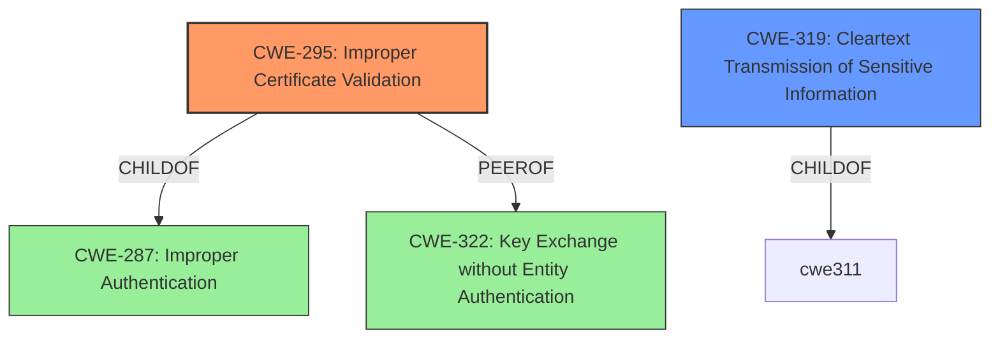

# Enhanced Analysis for CVE-2020-12053

# Summary
| CWE ID    | CWE Name                                   | Confidence | CWE Abstraction Level | CWE Vulnerability Mapping Label | CWE-Vulnerability Mapping Notes |
| :-------- | :----------------------------------------- | :--------- | :-------------------- | :------------------------------ | :------------------------------ |
| CWE-295   | Improper Certificate Validation            | 1.0        | Base                  | Primary CWE                     | Allowed                       |
| CWE-319   | Cleartext Transmission of Sensitive Information | 0.75       | Base                  | Secondary CWE                   | Allowed                       |

## Evidence and Confidence

*   **Confidence Score:** 0.9
*   **Evidence Strength:** HIGH

## Relationship Analysis
The primary CWE, CWE-295 (**CWE-295: Improper Certificate Validation**), is a Base level CWE that directly addresses the **missing private key for certificate-based authorization without HTTPS**. CWE-295 is a PeerOf CWE-322 (**CWE-322: Key Exchange without Entity Authentication**), and a ChildOf CWE-287 (**CWE-287: Improper Authentication**), reflecting the validation issues that can occur with certificates. CWE-319 (**CWE-319: Cleartext Transmission of Sensitive Information**) is included as a secondary concern, since the **missing private key for certificate-based authorization without HTTPS** uses HTTP instead of HTTPS.



## Vulnerability Chain
The vulnerability chain begins with the **rootcause missing private key for certificate-based authorization without HTTPS**. This leads to **improper certificate validation using HTTP instead of HTTPS**, potentially leading to **an unauthorized user to become authorized as a valid user**.

## Summary of Analysis
The initial assessment identified CWE-295 (**CWE-295: Improper Certificate Validation**) as the primary weakness because the vulnerability description specifically states that if certificate-based authorization is used without HTTPS, an endpoint could be authorized without a private key. The CVE Reference Links Content Summary confirms this by stating the root cause is that "Endpoint certificate validation using HTTP may erroneously succeed" and the weaknesses include "Improper certificate validation using HTTP instead of HTTPS."

CWE-284 (**CWE-284: Improper Access Control**) was considered, but the MITRE mapping guidance discourages its use due to its high-level nature. Instead, the suggested alternatives were reviewed, and CWE-295 (**CWE-295: Improper Certificate Validation**) was selected.

CWE-319 (**CWE-319: Cleartext Transmission of Sensitive Information**) was added as a secondary concern. Although the vulnerability description focuses on certificate validation, the fact that HTTP is used instead of HTTPS implies that sensitive information could be transmitted in cleartext.

The selected CWEs are at the optimal level of specificity. CWE-295 (**CWE-295: Improper Certificate Validation**) accurately represents the certificate validation **weakness**, while CWE-319 (**CWE-319: Cleartext Transmission of Sensitive Information**) addresses the use of HTTP without encryption. These choices are based on the provided evidence and align with MITRE's mapping guidance.

Relevant CWE Information:

# Enhanced Context (25 CWEs)
The following CWEs were identified as potentially relevant to this vulnerability:

## CWE-312: Cleartext Storage of Sensitive Information
**Abstraction Level**: Base
**Similarity Score**: 0.79
**Source**: dense

**Description**:
The product stores sensitive information in cleartext within a resource that might be accessible to another control sphere.

**Mapping Guidance**:
- Usage: Allowed
- Rationale: This CWE entry is at the Base level of abstraction, which is a preferred level of abstraction for mapping to the root causes of vulnerabilities.


## CWE-311: Missing Encryption of Sensitive Data
**Abstraction Level**: Class
**Similarity Score**: 0.78
**Source**: dense

**Description**:
The product does not encrypt sensitive or critical information before storage or transmission.

**Mapping Guidance**:
- Usage: Discouraged
- Rationale: CWE-311 is high-level with more precise children available. It is a level-1 Class (i.e., a child of a Pillar).


## CWE-319: Cleartext Transmission of Sensitive Information
**Abstraction Level**: Base
**Similarity Score**: 0.78
**Source**: dense

**Description**:
The product transmits sensitive or security-critical data in cleartext in a communication channel that can be sniffed by unauthorized actors.

**Mapping Guidance**:
- Usage: Allowed
- Rationale: This CWE entry is at the Base level of abstraction, which is a preferred level of abstraction for mapping to the root causes of vulnerabilities.


## CWE-345: Insufficient Verification of Data Authenticity
**Abstraction Level**: Class
**Similarity Score**: 0.78
**Source**: dense

**Description**:
The product does not sufficiently verify the origin or authenticity of data, in a way that causes it to accept invalid data.

**Mapping Guidance**:
- Usage: Discouraged
- Rationale: This CWE entry is a level-1 Class (i.e., a child of a Pillar). It might have lower-level children that would be more appropriate


## CWE-807: Reliance on Untrusted Inputs in a Security Decision
**Abstraction Level**: Base
**Similarity Score**: 0.77
**Source**: dense

**Description**:
The product uses a protection mechanism that relies on the existence or values of an input, but the input can be modified by an untrusted actor in a way that bypasses the protection mechanism.

**Mapping Guidance**:
- Usage: Allowed
- Rationale: This CWE entry is at the Base level of abstraction, which is a preferred level of abstraction for mapping to the root causes of vulnerabilities.


## CWE-1391: Use of Weak Credentials
**Abstraction Level**: Class
**Similarity Score**: 0.77
**Source**: dense

**Description**:
The product uses weak credentials (such as a default key or hard-coded password) that can be calculated, derived, reused, or guessed by an attacker.

**Mapping Guidance**:
- Usage: Allowed-with-Review
- Rationale: This CWE entry is a Class and might have Base-level children that would be more appropriate


## CWE-303: Incorrect Implementation of Authentication Algorithm
**Abstraction Level**: Base
**Similarity Score**: 0.76
**Source**: dense

**Description**:
The requirements for the product dictate the use of an established authentication algorithm, but the implementation of the algorithm is incorrect.

**Mapping Guidance**:
- Usage: Allowed
- Rationale: This CWE entry is at the Base level of abstraction, which is a preferred level of abstraction for mapping to the root causes of vulnerabilities.


## CWE-668: Exposure of Resource to Wrong Sphere
**Abstraction Level**: Class
**Similarity Score**: 0.76
**Source**: dense

**Description**:
The product exposes a resource to the wrong control sphere, providing unintended actors with inappropriate access to the resource.

**Mapping Guidance**:
- Usage: Discouraged
- Rationale: CWE-668 is high-level and is often misused as a catch-all when lower-level CWE IDs might be applicable. It is sometimes used for low-information vulnerability reports [REF-1287]. It is a level-1 Class (i.e., a child of a Pillar). It is not useful for trend analysis.


## CWE-203: Observable Discrepancy
**Abstraction Level**: Base
**Similarity Score**: 0.76
**Source**: dense

**Description**:
The product behaves differently or sends different responses under different circumstances in a way that is observable to an unauthorized actor, which exposes security-relevant information about the state of the product, such as whether a particular operation was successful or not.

**Mapping Guidance**:
- Usage: Allowed
- Rationale: This CWE entry is at the Base level of abstraction, which is a preferred level of abstraction for mapping to the root causes of vulnerabilities.


## CWE-212: Improper Removal of Sensitive Information Before Storage or Transfer
**Abstraction Level**: Base
**Similarity Score**: 0.76
**Source**: dense

**Description**:
The product stores, transfers, or shares a resource that contains sensitive information, but it does not properly remove that information before the product makes the resource available to unauthorized actors.

**Mapping Guidance


## CWE Relationship Analysis

Current CWEs represent these abstraction levels: .


### Vulnerability Chain Analysis

**Chain starting from CWE-303:**
- 303 (Incorrect Implementation of Authentication Algorithm) - ROOT


**Chain starting from CWE-284:**
- 284 (Improper Access Control) - ROOT


### CWE Relationship Diagram

```mermaid
graph TD
    classDef primary fill:#f96,stroke:#333,stroke-width:2px
    classDef secondary fill:#69f,stroke:#333
    classDef tertiary fill:#9e9,stroke:#333
```