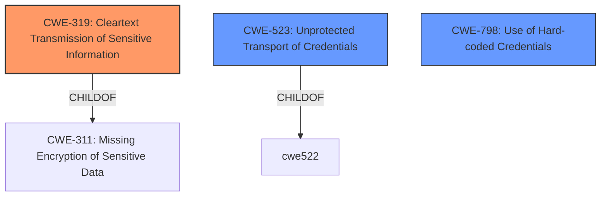

# Analysis for CVE-2020-12061

# Summary
| CWE ID | CWE Name | Confidence | CWE Abstraction Level | CWE Vulnerability Mapping Label | CWE-Vulnerability Mapping Notes |
|---|---|---|---|---|---|
| CWE-319 | Cleartext Transmission of Sensitive Information | 1.0 | Base | Primary | Allowed |
| CWE-523 | Unprotected Transport of Credentials | 0.8 | Base | Secondary | Allowed |
| CWE-798 | Use of Hard-coded Credentials | 0.6 | Base | Secondary | Allowed |

## Evidence and Confidence

*   **Confidence Score:** 0.9
*   **Evidence Strength:** HIGH

## Relationship Analysis
The primary relationship that influenced the selection was the ChildOf relationship, as CWE-319 [CWE-319: Cleartext Transmission of Sensitive Information] is a specific type of CWE-311. While CWE-523 [CWE-523: Unprotected Transport of Credentials] is also relevant, CWE-319 [CWE-319: Cleartext Transmission of Sensitive Information] more precisely captures the vulnerability of transmitting credentials in plain text. CWE-798 [CWE-798: Use of Hard-coded Credentials] was considered because the plaintext transmission involved secrets and keys, but the focus is more on the transmission itself rather than the presence of hard-coded credentials.

## Vulnerability Chain
The chain of events starts with the **weakness** of transmitting credentials in plain text over I2C. This allows an attacker to eavesdrop on the communication and derive the secrets stored in the microcontroller. The impact is the ability to manipulate the firmware.

## Summary of Analysis
The primary assessment is based on the provided evidence, specifically the **weakness** that the communication between the microcontroller and the secure element **transmits credentials in plain**. This is directly supported by the CVE Reference Links Content Summary, which states, "Specifically, the WKEY and service key are sent in plain text over I2C during a MAC generation process." The graph relationships helped narrow the selection to CWE-319 [CWE-319: Cleartext Transmission of Sensitive Information], as it is a specific instance of transmitting sensitive data without encryption.

The selected CWEs are at the optimal level of specificity. CWE-319 [CWE-319: Cleartext Transmission of Sensitive Information] accurately describes the vulnerability, while CWE-523 [CWE-523: Unprotected Transport of Credentials] is a broader category that applies but is less specific. CWE-798 [CWE-798: Use of Hard-coded Credentials] is a possible contributing factor, since plaintext credentials could originate from hardcoded values, but that's not the main weakness being exploited.

Relevant CWE Information:

# Enhanced Context (25 CWEs)
The following CWEs were identified as potentially relevant to this vulnerability:

## CWE-345: Insufficient Verification of Data Authenticity
**Abstraction Level**: Class
**Similarity Score**: 0.80
**Source**: dense

**Description**:
The product does not sufficiently verify the origin or authenticity of data, in a way that causes it to accept invalid data.

**Mapping Guidance**:
- Usage: Discouraged
- Rationale: This CWE entry is a level-1 Class (i.e., a child of a Pillar). It might have lower-level children that would be more appropriate

## CWE-312: Cleartext Storage of Sensitive Information
**Abstraction Level**: Base
**Similarity Score**: 0.79
**Source**: dense

**Description**:
The product stores sensitive information in cleartext within a resource that might be accessible to another control sphere.

**Mapping Guidance**:
- Usage: Allowed
- Rationale: This CWE entry is at the Base level of abstraction, which is a preferred level of abstraction for mapping to the root causes of vulnerabilities.

## CWE-1240: Use of a Cryptographic Primitive with a Risky Implementation
**Abstraction Level**: Base
**Similarity Score**: 0.79
**Source**: dense

**Description**:
To fulfill the need for a cryptographic primitive, the product implements a cryptographic algorithm using a non-standard, unproven, or disallowed/non-compliant cryptographic implementation.

**Mapping Guidance**:
- Usage: Allowed
- Rationale: This CWE entry is at the Base level of abstraction, which is a preferred level of abstraction for mapping to the root causes of vulnerabilities.

## CWE-1391: Use of Weak Credentials
**Abstraction Level**: Class
**Similarity Score**: 0.79
**Source**: dense

**Description**:
The product uses weak credentials (such as a default key or hard-coded password) that can be calculated, derived, reused, or guessed by an attacker.

**Mapping Guidance**:
- Usage: Allowed-with-Review
- Rationale: This CWE entry is a Class and might have Base-level children that would be more appropriate

## CWE-319: Cleartext Transmission of Sensitive Information
**Abstraction Level**: Base
**Similarity Score**: 0.79
**Source**: dense

**Description**:
The product transmits sensitive or security-critical data in cleartext in a communication channel that can be sniffed by unauthorized actors.

**Mapping Guidance**:
- Usage: Allowed
- Rationale: This CWE entry is at the Base level of abstraction, which is a preferred level of abstraction for mapping to the root causes of vulnerabilities.

## CWE-798: Use of Hard-coded Credentials
**Abstraction Level**: Base
**Similarity Score**: 0.78
**Source**: dense

**Description**:
The product contains hard-coded credentials, such as a password or cryptographic key.

**Mapping Guidance**:
- Usage: Allowed
- Rationale: This CWE entry is at the Base level of abstraction, which is a preferred level of abstraction for mapping to the root causes of vulnerabilities.

## CWE-295: Improper Certificate Validation
**Abstraction Level**: Base
**Similarity Score**: 0.77
**Source**: dense

**Description**:
The product does not validate, or incorrectly validates, a certificate.

**Mapping Guidance**:
- Usage: Allowed
- Rationale: This CWE entry is at the Base level of abstraction, which is a preferred level of abstraction for mapping to the root causes of vulnerabilities.

## CWE-330: Use of Insufficiently Random Values
**Abstraction Level**: Class
**Similarity Score**: 0.77
**Source**: dense

**Description**:
The product uses insufficiently random numbers or values in a security context that depends on unpredictable numbers.

**Mapping Guidance**:
- Usage: Discouraged
- Rationale: This CWE entry is a level-1 Class (i.e., a child of a Pillar). It might have lower-level children that would be more appropriate

## CWE-321: Use of Hard-coded Cryptographic Key
**Abstraction Level**: Variant
**Similarity Score**: 0.77
**Source**: dense

**Description**:
The use of a hard-coded cryptographic key significantly increases the possibility that encrypted data may be recovered.

**Mapping Guidance**:
- Usage: Allowed
- Rationale: This CWE entry is at the Variant level of abstraction, which is a preferred level of abstraction for mapping to the root causes of vulnerabilities.

## CWE-807: Reliance on Untrusted Inputs in a Security Decision
**Abstraction Level**: Base
**Similarity Score**: 0.77
**Source**: dense

**Description**:
The product uses a protection mechanism that relies on the existence or values of an input, but the input can be modified by an untrusted actor in a way that bypasses the protection mechanism.

**Mapping Guidance**:
- Usage: Allowed
- Rationale: This CWE entry is at the Base level of abstraction, which is a preferred level of abstraction for mapping to the root causes of vulnerabilities.

## CWE-327: Use of a Broken or Risky Cryptographic Algorithm
**Abstraction Level**: Class
**Similarity Score**: 5848.58
**Source**: sparse

**Description**:
The product uses a broken or risky cryptographic algorithm or protocol.

**Mapping Guidance**:
- Usage: Allowed-with-Review
- Rationale: This CWE entry is a Class and might have Base-level children that would be more appropriate

## CWE-319: Cleartext Transmission of Sensitive Information
**Abstraction Level**: Base
**Similarity Score**: 5801.87
**Source**: sparse

**Description**:
The product transmits sensitive or

# Enhanced Query for CVE-2020-12061

## Vulnerability Description
An issue was discovered in Nitrokey FIDO U2F firmware through 1.1. Communication between the microcontroller and the secure element transmits credentials in plain. This allows an adversary to eavesdrop the communication and derive the secrets stored in the microcontroller. As a result, the attacker is able to arbitrarily manipulate the firmware of the microcontroller.

### Vulnerability Description Key Phrases
- **weakness:** **transmit credentials in plain**
- **impact:** derive the secrets stored in the microcontroller
- **vector:** eavesdrop the communication
- **attacker:** adversary
- **product:** Nitrokey FIDO U2F
- **version:** through 1.1
- **component:** firmware

## CVE Reference Links Content Summary
Based on the provided content, here's an analysis of CVE-2020-12061:

**1. Verification of CVE Relevance:**

The provided documents describe a vulnerability in the Nitrokey FIDO U2F device. The vulnerability detailed in the eprint.iacr.org document (and cross-referenced in the GitHub commit history with the tag `33-test-firmware-1`) corresponds to **CVE-2020-12061**, as listed in the coordinated disclosure section of the research paper.

**2. Vulnerability Details:**

*   **Root Cause:** The vulnerability lies in the insecure I2C communication protocol between the EFM8UB microcontroller and the ATECC508A secure element on the Nitrokey FIDO U2F token. Specifically, the WKEY and service key are sent in plain text over I2C during a MAC generation process which was outsourced to the secure element, instead of performing the MAC calculation on the microcontroller.
*   **Weaknesses/Vulnerabilities:**
    *   **Plaintext Transmission:** Sending the WKEY and service key in plaintext over the I2C bus allows an attacker to intercept these secrets by eavesdropping the communication using a logic analyzer.
    *   **Outsourced MAC calculation:** The MAC calculation is outsourced to the secure element, which requires the microcontroller to transmit the necessary information to perform the calculation. This design choice is the root cause of the vulnerability.
*   **Impact of Exploitation:**
    *   **Firmware Manipulation:** An attacker who has acquired both the WKEY and RKEY can erase the microcontroller's firmware and reprogram it with malicious code which can be used for arbitrary manipulation of the device, such as exfiltrating secret keys or generating weak keys.
    *   **Secret Key Extraction:** An attacker can extract all secrets (WKEY, RKEY) and service keys. This allows the attacker to clone the token which enables the adversary to log in to services without being detected.
    *   **Supply Chain Attacks:** This vulnerability can be exploited in supply chain attacks, where compromised tokens can be distributed to end-users without their knowledge.
    *  **Evil Maid Attacks:** The vulnerability can also be exploited in evil maid scenarios, where the attacker has temporary physical access to the device.
*   **Attack Vectors:**
    *   **I2C Bus Eavesdropping:** The attacker needs to intercept the I2C communication between the microcontroller and the secure element using a logic analyzer.
    *   **Physical Access:** The attacker needs physical access to the token to open the casing (which can be done without tools and without leaving traces), connect the logic analyzer, and eventually reprogram the microcontroller.
*   **Required Attacker Capabilities/Position:**
    *   **Physical Access:** The attacker needs physical access to the Nitrokey FIDO U2F device.
    *   **Technical Knowledge:** The attacker needs knowledge of the I2C protocol and how the Nitrokey FIDO U2F works. They must also be able to use a logic analyzer to capture I2C traffic.
    *   **Equipment:** The attacker requires a logic analyzer and a device to reprogram the microcontroller.
    *   **Time:** The attack can be performed within minutes.

**3. Additional Details (from the provided content):**

*   The vulnerability is present in the Nitrokey FIDO U2F device because the hash calculation and the resulting MAC are outsourced to the secure element.
*   The eprint.iacr.org document explains the messages exchanged on the I2C bus, highlighting the messages which need to be intercepted to extract the WKEY and RKEY.
*   The Nitrokey FIDO U2F uses an EFM8UB microcontroller from Silicon Labs and an ATECC508A secure element from Microchip.
*   The Github content shows a commit with the tag `33-test-firmware-1`, which is related to the identified vulnerability.
*   The github.com document contains release information and commits related to the `nitrokey-fido-u2f-firmware` project. Specifically, version `nk-v1.1` is mentioned, and is the first version released to the market. The client version command output example shows that the firmware version is `nk-v1.1`.

**4. Countermeasures and Mitigations (from the research paper):**

*   The research paper recommends performing the hash calculation on the microcontroller instead of the secure element. This prevents the transmission of sensitive data over the I2C bus and mitigates the described vulnerability.

**In summary:** This CVE describes a serious vulnerability in the Nitrokey FIDO U2F device where the WKEY and service keys are transmitted in plaintext over the I2C bus, allowing for key extraction and firmware manipulation.

## Retriever Results

### Top Combined Results

| Rank | CWE ID | Name | Abstraction | Usage  | Retrievers | Individual Scores |
|------|--------|------|-------------|-------|------------|-------------------|
| 1 | 523 | Unprotected Transport of Credentials | Base | Allowed | sparse | 0.638 |
| 2 | 319 | Cleartext Transmission of Sensitive Information | Base | Allowed | sparse | 0.370 |
| 3 | 256 | Plaintext Storage of a Password | Base | Allowed | sparse | 0.354 |
| 4 | 522 | Insufficiently Protected Credentials | Class | Allowed-with-Review | sparse | 0.353 |
| 5 | 532 | Insertion of Sensitive Information into Log File | Base | Allowed | sparse | 0.335 |
| 6 | 1319 | Improper Protection against Electromagnetic Fault Injection (EM-FI) | Base | Allowed | dense | 0.542 |
| 7 | 257 | Storing Passwords in a Recoverable Format | Base | Allowed | graph | 0.002 |
| 8 | 327 | Use of a Broken or Risky Cryptographic Algorithm | Class | Allowed-with-Review | sparse | 0.332 |
| 9 | 321 | Use of Hard-coded Cryptographic Key | Variant | Allowed | sparse | 0.329 |
| 10 | 295 | Improper Certificate Validation | Base | Allowed | sparse | 0.326 |

# Complete CWE Specifications

## CWE-523: Unprotected Transport of Credentials
**Abstraction:** Base
**Status:** Incomplete

### Description
Login pages do not use adequate measures to protect the user name and password while they are in transit from the client to the server.

### Extended Description
Not provided

### Alternative Terms
None

### Relationships
ChildOf -> CWE-522
CanAlsoBe -> CWE-312

### Mapping Guidance
**Usage:** Allowed
**Rationale:** This CWE entry is at the Base level of abstraction, which is a preferred level of abstraction for mapping to the root causes of vulnerabilities.
**Comments:** Carefully read both the name and description to ensure that this mapping is an appropriate fit. Do not try to 'force' a mapping to a lower-level Base/Variant simply to comply with this preferred level of abstraction.
**Reasons:**
- Acceptable-Use

## CWE-319: Cleartext Transmission of Sensitive Information
**Abstraction:** Base
**Status:** Draft

### Description
The product transmits sensitive or security-critical data in cleartext in a communication channel that can be sniffed by unauthorized actors.

### Extended Description

Many communication channels can be "sniffed" (monitored) by adversaries during data transmission. For example, in networking, packets can traverse many intermediary nodes from the source to the destination, whether across the internet, an internal network, the cloud, etc. Some actors might have privileged access to a network interface or any link along the channel, such as a router, but they might not be authorized to collect the underlying data. As a result, network traffic could be sniffed by adversaries, spilling security-critical data.

Applicable communication channels are not limited to software products. Applicable channels include hardware-specific technologies such as internal hardware networks and external debug channels, supporting remote JTAG debugging. When mitigations are not applied to combat adversaries within the product's threat model, this weakness significantly lowers the difficulty of exploitation by such adversaries.

When full communications are recorded or logged, such as with a packet dump, an adversary could attempt to obtain the dump long after the transmission has occurred and try to "sniff" the cleartext from the recorded communications in the dump itself. Even if the information is encoded in a way that is not human-readable, certain techniques could determine which encoding is being used, then decode the information. 

### Alternative Terms
None

### Relationships
ChildOf -> CWE-311
ChildOf -> CWE-311

### Mapping Guidance
**Usage:** Allowed
**Rationale:** This CWE entry is at the Base level of abstraction, which is a preferred level of abstraction for mapping to the root causes of vulnerabilities.
**Comments:** Carefully read both the name and description to ensure that this mapping is an appropriate fit. Do not try to 'force' a mapping to a lower-level Base/Variant simply to comply with this preferred level of abstraction.
**Reasons:**
- Acceptable-Use

### Additional Notes
**[Maintenance]** The Taxonomy_Mappings to ISA/IEC 62443 were added in CWE 4.10, but they are still under review and might change in future CWE versions. These draft mappings were performed by members of the "Mapping CWE to 62443" subgroup of the CWE-CAPEC ICS/OT Special Interest Group (SIG), and their work is incomplete as of CWE 4.10. The mappings are included to facilitate discussion and review by the broader ICS/OT community, and they are likely to change in future CWE versions.

### Observed Examples
- **CVE-2022-29519:** Programmable Logic Controller (PLC) sends sensitive information in plaintext, including passwords and session tokens.
- **CVE-2022-30312:** Building Controller uses a protocol that transmits authentication credentials in plaintext.
- **CVE-2022-31204:** Programmable Logic Controller (PLC) sends password in plaintext.

## CWE-256: Plaintext Storage of a Password
**Abstraction:** Base
**Status:** Incomplete

### Description
Storing a password in plaintext may result in a system compromise.

### Extended Description
Password management issues occur when a password is stored in plaintext in an application's properties, configuration file, or memory. Storing a plaintext password in a configuration file allows anyone who can read the file access to the password-protected resource. In some contexts, even storage of a plaintext password in memory is considered a security risk if the password is not cleared immediately after it is used.

### Alternative Terms
None

### Relationships
ChildOf -> CWE-522

### Mapping Guidance
**Usage:** Allowed
**Rationale:** This CWE entry is at the Base level of abstraction, which is a preferred level of abstraction for mapping to the root causes of vulnerabilities.
**Comments:** Carefully read both the name and description to ensure that this mapping is an appropriate fit. Do not try to 'force' a mapping to a lower-level Base/Variant simply to comply with this preferred level of abstraction.
**Reasons:**
- Acceptable-Use

### Observed Examples
- **CVE-2022-30275:** Remote Terminal Unit (RTU) uses a driver that relies on a password stored in plaintext.

## CWE-522: Insufficiently Protected Credentials
**Abstraction:** Class
**Status:** Incomplete

### Description
The product transmits or stores authentication credentials, but it uses an insecure method that is susceptible to unauthorized interception and/or retrieval.

### Extended Description
Not provided

### Alternative Terms
None

### Relationships
ChildOf -> CWE-1390
ChildOf -> CWE-287
ChildOf -> CWE-668

### Mapping Guidance
**Usage:** Allowed-with-Review
**Rationale:** This CWE entry is a Class and might have Base-level children that would be more appropriate
**Comments:** Examine children of this entry to see if there is a better fit
**Reasons:**
- Abstraction

### Observed Examples
- **CVE-2022-30018:** A messaging platform serializes all elements of User/Group objects, making private information available to adversaries
- **CVE-2022-29959:** Initialization file contains credentials that can be decoded using a "simple string transformation"
- **CVE-2022-35411:** Python-based RPC framework enables pickle functionality by default, allowing clients to unpickle untrusted data.

## CWE-532: Insertion of Sensitive Information into Log File
**Abstraction:** Base
**Status:** Incomplete

### Description
The product writes sensitive information to a log file.

### Extended Description
Not provided

### Alternative Terms
None

### Relationships
ChildOf -> CWE-538
ChildOf -> CWE-200

### Mapping Guidance
**Usage:** Allowed
**Rationale:** This CWE entry is at the Base level of abstraction, which is a preferred level of abstraction for mapping to the root causes of vulnerabilities.
**Comments:** Carefully read both the name and description to ensure that this mapping is an appropriate fit. Do not try to 'force' a mapping to a lower-level Base/Variant simply to comply with this preferred level of abstraction.
**Reasons:**
- Acceptable-Use

### Observed Examples
- **CVE-2017-9615:** verbose logging stores admin credentials in a world-readable log file
- **CVE-2018-1999036:** SSH password for private key stored in build log

## CWE-1319: Improper Protection against Electromagnetic Fault Injection (EM-FI)
**Abstraction:** Base
**Status:** Incomplete

### Description
The device is susceptible to electromagnetic fault injection attacks, causing device internal information to be compromised or security mechanisms to be bypassed.

### Extended Description

Electromagnetic fault injection may allow an attacker to locally and dynamically modify the signals (both internal and external) of an integrated circuit. EM-FI attacks consist of producing a local, transient magnetic field near the device, inducing current in the device wires. A typical EMFI setup is made up of a pulse injection circuit that generates a high current transient in an EMI coil, producing an abrupt magnetic pulse which couples to the target producing faults in the device, which can lead to:

  - Bypassing security mechanisms such as secure JTAG or Secure Boot

  - Leaking device information

  - Modifying program flow

  - Perturbing secure hardware modules (e.g. random number generators)

### Alternative Terms
None

### Relationships
ChildOf -> CWE-693

### Mapping Guidance
**Usage:** Allowed
**Rationale:** This CWE entry is at the Base level of abstraction, which is a preferred level of abstraction for mapping to the root causes of vulnerabilities.
**Comments:** Carefully read both the name and description to ensure that this mapping is an appropriate fit. Do not try to 'force' a mapping to a lower-level Base/Variant simply to comply with this preferred level of abstraction.
**Reasons:**
- Acceptable-Use

### Additional Notes
**[Maintenance]** This entry is attack-oriented and may require significant modification in future versions, or even deprecation. It is not clear whether there is really a design "mistake" that enables such attacks, so this is not necessarily a weakness and may be more appropriate for CAPEC.

### Observed Examples
- **CVE-2020-27211:** Chain: microcontroller system-on-chip uses a register value stored in flash to set product protection state on the memory bus and does not contain protection against fault injection (CWE-1319) which leads to an incorrect initialization of the memory bus (CWE-1419) causing the product to be in an unprotected state.

## CWE-257: Storing Passwords in a Recoverable Format
**Abstraction:** Base
**Status:** Incomplete

### Description
The storage of passwords in a recoverable format makes them subject to password reuse attacks by malicious users. In fact, it should be noted that recoverable encrypted passwords provide no significant benefit over plaintext passwords since they are subject not only to reuse by malicious attackers but also by malicious insiders. If a system administrator can recover a password directly, or use a brute force search on the available information, the administrator can use the password on other accounts.

### Extended Description
Not provided

### Alternative Terms
None

### Relationships
ChildOf -> CWE-522
PeerOf -> CWE-259

### Mapping Guidance
**Usage:** Allowed
**Rationale:** This CWE entry is at the Base level of abstraction, which is a preferred level of abstraction for mapping to the root causes of vulnerabilities.
**Comments:** Carefully read both the name and description to ensure that this mapping is an appropriate fit. Do not try to 'force' a mapping to a lower-level Base/Variant simply to comply with this preferred level of abstraction.
**Reasons:**
- Acceptable-Use

### Additional Notes
**[Maintenance]** The meaning of this entry needs to be investigated more closely, especially with respect to what is meant by "recoverable."

### Observed Examples
- **CVE-2022-30018:** A messaging platform serializes all elements of User/Group objects, making private information available to adversaries

## CWE-327: Use of a Broken or Risky Cryptographic Algorithm
**Abstraction:** Class
**Status:** Draft

### Description
The product uses a broken or risky cryptographic algorithm or protocol.

### Extended Description

Cryptographic algorithms are the methods by which data is scrambled to prevent observation or influence by unauthorized actors. Insecure cryptography can be exploited to expose sensitive information, modify data in unexpected ways, spoof identities of other users or devices, or other impacts.

It is very difficult to produce a secure algorithm, and even high-profile algorithms by accomplished cryptographic experts have been broken. Well-known techniques exist to break or weaken various kinds of cryptography. Accordingly, there are a small number of well-understood and heavily studied algorithms that should be used by most products. Using a non-standard or known-insecure algorithm is dangerous because a determined adversary may be able to break the algorithm and compromise whatever data has been protected.

Since the state of cryptography advances so rapidly, it is common for an algorithm to be considered "unsafe" even if it was once thought to be strong. This can happen when new attacks are discovered, or if computing power increases so much that the cryptographic algorithm no longer provides the amount of protection that was originally thought.

For a number of reasons, this weakness is even more challenging to manage with hardware deployment of cryptographic algorithms as opposed to software implementation. First, if a flaw is discovered with hardware-implemented cryptography, the flaw cannot be fixed in most cases without a recall of the product, because hardware is not easily replaceable like software. Second, because the hardware product is expected to work for years, the adversary's computing power will only increase over time.

### Alternative Terms
None

### Relationships
ChildOf -> CWE-693
PeerOf -> CWE-311

### Mapping Guidance
**Usage:** Allowed-with-Review
**Rationale:** This CWE entry is a Class and might have Base-level children that would be more appropriate
**Comments:** Examine children of this entry to see if there is a better fit
**Reasons:**
- Abstraction

### Additional Notes
**[Maintenance]** Since CWE 4.4, various cryptography-related entries, including CWE-327 and CWE-1240, have been slated for extensive research, analysis, and community consultation to define consistent terminology, improve relationships, and reduce overlap or duplication. As of CWE 4.6, this work is still ongoing.

**[Maintenance]** The Taxonomy_Mappings to ISA/IEC 62443 were added in CWE 4.10, but they are still under review and might change in future CWE versions. These draft mappings were performed by members of the "Mapping CWE to 62443" subgroup of the CWE-CAPEC ICS/OT Special Interest Group (SIG), and their work is incomplete as of CWE 4.10. The mappings are included to facilitate discussion and review by the broader ICS/OT community, and they are likely to change in future CWE versions.

### Observed Examples
- **CVE-2022-30273:** SCADA-based protocol supports a legacy encryption mode that uses Tiny Encryption Algorithm (TEA) in ECB mode, which leaks patterns in messages and cannot protect integrity
- **CVE-2022-30320:** Programmable Logic Controller (PLC) uses a protocol with a cryptographically insecure hashing algorithm for passwords.
- **CVE-2008-3775:** Product uses "ROT-25" to obfuscate the password in the registry.

## CWE-321: Use of Hard-coded Cryptographic Key
**Abstraction:** Variant
**Status:** Draft

### Description
The use of a hard-coded cryptographic key significantly increases the possibility that encrypted data may be recovered.

### Extended Description
Not provided

### Alternative Terms
None

### Relationships
ChildOf -> CWE-798
ChildOf -> CWE-798
ChildOf -> CWE-798

### Mapping Guidance
**Usage:** Allowed
**Rationale:** This CWE entry is at the Variant level of abstraction, which is a preferred level of abstraction for mapping to the root causes of vulnerabilities.
**Comments:** Carefully read both the name and description to ensure that this mapping is an appropriate fit. Do not try to 'force' a mapping to a lower-level Base/Variant simply to comply with this preferred level of abstraction.
**Reasons:**
- Acceptable-Use

### Additional Notes
**[Other]** The main difference between the use of hard-coded passwords and the use of hard-coded cryptographic keys is the false sense of security that the former conveys. Many people believe that simply hashing a hard-coded password before storage will protect the information from malicious users. However, many hashes are reversible (or at least vulnerable to brute force attacks) -- and further, many authentication protocols simply request the hash itself, making it no better than a password.

**[Maintenance]** The Taxonomy_Mappings to ISA/IEC 62443 were added in CWE 4.10, but they are still under review and might change in future CWE versions. These draft mappings were performed by members of the "Mapping CWE to 62443" subgroup of the CWE-CAPEC ICS/OT Special Interest Group (SIG), and their work is incomplete as of CWE 4.10. The mappings are included to facilitate discussion and review by the broader ICS/OT community, and they are likely to change in future CWE versions.

### Observed Examples
- **CVE-2022-29960:** Engineering Workstation uses hard-coded cryptographic keys that could allow for unathorized filesystem access and privilege escalation
- **CVE-2022-30271:** Remote Terminal Unit (RTU) uses a hard-coded SSH private key that is likely to be used by default.
- **CVE-2020-10884:** WiFi router service has a hard-coded encryption key, allowing root access

## CWE-295: Improper Certificate Validation
**Abstraction:** Base
**Status:** Draft

### Description
The product does not validate, or incorrectly validates, a certificate.

### Extended Description
When a certificate is invalid or malicious, it might allow an attacker to spoof a trusted entity by interfering in the communication path between the host and client. The product might connect to a malicious host while believing it is a trusted host, or the product might be deceived into accepting spoofed data that appears to originate from a trusted host.

### Alternative Terms
None

### Relationships
ChildOf -> CWE-287
ChildOf -> CWE-287
PeerOf -> CWE-322

### Mapping Guidance
**Usage:** Allowed
**Rationale:** This CWE entry is at the Base level of abstraction, which is a preferred level of abstraction for mapping to the root causes of vulnerabilities.
**Comments:** Carefully read both the name and description to ensure that this mapping is an appropriate fit. Do not try to 'force' a mapping to a lower-level Base/Variant simply to comply with this preferred level of abstraction.
**Reasons:**
- Acceptable-Use

### Observed Examples
- **CVE-2019-12496:** A Go framework for robotics, drones, and IoT devices skips verification of root CA certificates by default.
- **CVE-2014-1266:** chain: incorrect "goto" in Apple SSL product bypasses certificate validation, allowing Adversary-in-the-Middle (AITM) attack (Apple "goto fail" bug). CWE-705 (Incorrect Control Flow Scoping) -> CWE-561 (Dead Code) -> CWE-295 (Improper Certificate Validation) -> CWE-393 (Return of Wrong Status Code) -> CWE-300 (Channel Accessible by Non-Endpoint).
- **CVE-2021-22909:** Chain: router's firmware update procedure uses curl with "-k" (insecure) option that disables certificate validation (CWE-295), allowing adversary-in-the-middle (AITM) compromise with a malicious firmware image (CWE-494).

