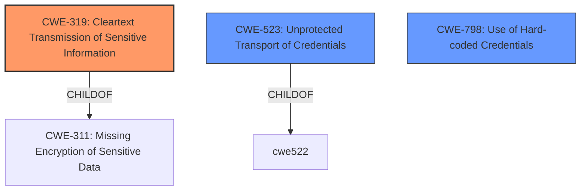

# Analysis Report for CVE-2020-12061

# Vulnerability Analysis Report: CVE-2020-12061

## Description


## Analysis (with Relationship Data)

# Summary
| CWE ID | CWE Name | Confidence | CWE Abstraction Level | CWE Vulnerability Mapping Label | CWE-Vulnerability Mapping Notes |
|---|---|---|---|---|---|
| CWE-319 | Cleartext Transmission of Sensitive Information | 1.0 | Base | Primary | Allowed |
| CWE-523 | Unprotected Transport of Credentials | 0.8 | Base | Secondary | Allowed |
| CWE-798 | Use of Hard-coded Credentials | 0.6 | Base | Secondary | Allowed |

## Evidence and Confidence

*   **Confidence Score:** 0.9
*   **Evidence Strength:** HIGH

## Relationship Analysis
The primary relationship that influenced the selection was the ChildOf relationship, as CWE-319 [CWE-319: Cleartext Transmission of Sensitive Information] is a specific type of CWE-311. While CWE-523 [CWE-523: Unprotected Transport of Credentials] is also relevant, CWE-319 [CWE-319: Cleartext Transmission of Sensitive Information] more precisely captures the vulnerability of transmitting credentials in plain text. CWE-798 [CWE-798: Use of Hard-coded Credentials] was considered because the plaintext transmission involved secrets and keys, but the focus is more on the transmission itself rather than the presence of hard-coded credentials.



## Vulnerability Chain
The chain of events starts with the **weakness** of transmitting credentials in plain text over I2C. This allows an attacker to eavesdrop on the communication and derive the secrets stored in the microcontroller. The impact is the ability to manipulate the firmware.

## Summary of Analysis
The primary assessment is based on the provided evidence, specifically the **weakness** that the communication between the microcontroller and the secure element **transmits credentials in plain**. This is directly supported by the CVE Reference Links Content Summary, which states, "Specifically, the WKEY and service key are sent in plain text over I2C during a MAC generation process." The graph relationships helped narrow the selection to CWE-319 [CWE-319: Cleartext Transmission of Sensitive Information], as it is a specific instance of transmitting sensitive data without encryption.

The selected CWEs are at the optimal level of specificity. CWE-319 [CWE-319: Cleartext Transmission of Sensitive Information] accurately describes the vulnerability, while CWE-523 [CWE-523: Unprotected Transport of Credentials] is a broader category that applies but is less specific. CWE-798 [CWE-798: Use of Hard-coded Credentials] is a possible contributing factor, since plaintext credentials could originate from hardcoded values, but that's not the main weakness being exploited.

Relevant CWE Information:

# Enhanced Context (25 CWEs)
The following CWEs were identified as potentially relevant to this vulnerability:

## CWE-345: Insufficient Verification of Data Authenticity
**Abstraction Level**: Class
**Similarity Score**: 0.80
**Source**: dense

**Description**:
The product does not sufficiently verify the origin or authenticity of data, in a way that causes it to accept invalid data.

**Mapping Guidance**:
- Usage: Discouraged
- Rationale: This CWE entry is a level-1 Class (i.e., a child of a Pillar). It might have lower-level children that would be more appropriate

## CWE-312: Cleartext Storage of Sensitive Information
**Abstraction Level**: Base
**Similarity Score**: 0.79
**Source**: dense

**Description**:
The product stores sensitive information in cleartext within a resource that might be accessible to another control sphere.

**Mapping Guidance**:
- Usage: Allowed
- Rationale: This CWE entry is at the Base level of abstraction, which is a preferred level of abstraction for mapping to the root causes of vulnerabilities.

## CWE-1240: Use of a Cryptographic Primitive with a Risky Implementation
**Abstraction Level**: Base
**Similarity Score**: 0.79
**Source**: dense

**Description**:
To fulfill the need for a cryptographic primitive, the product implements a cryptographic algorithm using a non-standard, unproven, or disallowed/non-compliant cryptographic implementation.

**Mapping Guidance**:
- Usage: Allowed
- Rationale: This CWE entry is at the Base level of abstraction, which is a preferred level of abstraction for mapping to the root causes of vulnerabilities.

## CWE-1391: Use of Weak Credentials
**Abstraction Level**: Class
**Similarity Score**: 0.79
**Source**: dense

**Description**:
The product uses weak credentials (such as a default key or hard-coded password) that can be calculated, derived, reused, or guessed by an attacker.

**Mapping Guidance**:
- Usage: Allowed-with-Review
- Rationale: This CWE entry is a Class and might have Base-level children that would be more appropriate

## CWE-319: Cleartext Transmission of Sensitive Information
**Abstraction Level**: Base
**Similarity Score**: 0.79
**Source**: dense

**Description**:
The product transmits sensitive or security-critical data in cleartext in a communication channel that can be sniffed by unauthorized actors.

**Mapping Guidance**:
- Usage: Allowed
- Rationale: This CWE entry is at the Base level of abstraction, which is a preferred level of abstraction for mapping to the root causes of vulnerabilities.

## CWE-798: Use of Hard-coded Credentials
**Abstraction Level**: Base
**Similarity Score**: 0.78
**Source**: dense

**Description**:
The product contains hard-coded credentials, such as a password or cryptographic key.

**Mapping Guidance**:
- Usage: Allowed
- Rationale: This CWE entry is at the Base level of abstraction, which is a preferred level of abstraction for mapping to the root causes of vulnerabilities.

## CWE-295: Improper Certificate Validation
**Abstraction Level**: Base
**Similarity Score**: 0.77
**Source**: dense

**Description**:
The product does not validate, or incorrectly validates, a certificate.

**Mapping Guidance**:
- Usage: Allowed
- Rationale: This CWE entry is at the Base level of abstraction, which is a preferred level of abstraction for mapping to the root causes of vulnerabilities.

## CWE-330: Use of Insufficiently Random Values
**Abstraction Level**: Class
**Similarity Score**: 0.77
**Source**: dense

**Description**:
The product uses insufficiently random numbers or values in a security context that depends on unpredictable numbers.

**Mapping Guidance**:
- Usage: Discouraged
- Rationale: This CWE entry is a level-1 Class (i.e., a child of a Pillar). It might have lower-level children that would be more appropriate

## CWE-321: Use of Hard-coded Cryptographic Key
**Abstraction Level**: Variant
**Similarity Score**: 0.77
**Source**: dense

**Description**:
The use of a hard-coded cryptographic key significantly increases the possibility that encrypted data may be recovered.

**Mapping Guidance**:
- Usage: Allowed
- Rationale: This CWE entry is at the Variant level of abstraction, which is a preferred level of abstraction for mapping to the root causes of vulnerabilities.

## CWE-807: Reliance on Untrusted Inputs in a Security Decision
**Abstraction Level**: Base
**Similarity Score**: 0.77
**Source**: dense

**Description**:
The product uses a protection mechanism that relies on the existence or values of an input, but the input can be modified by an untrusted actor in a way that bypasses the protection mechanism.

**Mapping Guidance**:
- Usage: Allowed
- Rationale: This CWE entry is at the Base level of abstraction, which is a preferred level of abstraction for mapping to the root causes of vulnerabilities.

## CWE-327: Use of a Broken or Risky Cryptographic Algorithm
**Abstraction Level**: Class
**Similarity Score**: 5848.58
**Source**: sparse

**Description**:
The product uses a broken or risky cryptographic algorithm or protocol.

**Mapping Guidance**:
- Usage: Allowed-with-Review
- Rationale: This CWE entry is a Class and might have Base-level children that would be more appropriate

## CWE-319: Cleartext Transmission of Sensitive Information
**Abstraction Level**: Base
**Similarity Score**: 5801.87
**Source**: sparse

**Description**:
The product transmits sensitive or


## CWE Relationship Analysis

Current CWEs represent these abstraction levels: .


### Vulnerability Chain Analysis

**Chain starting from CWE-321:**
- 321 (Use of Hard-coded Cryptographic Key) - ROOT


**Chain starting from CWE-312:**
- 312 (Cleartext Storage of Sensitive Information) - ROOT


### CWE Relationship Diagram

```mermaid
graph TD
    classDef primary fill:#f96,stroke:#333,stroke-width:2px
    classDef secondary fill:#69f,stroke:#333
    classDef tertiary fill:#9e9,stroke:#333
```


*Report generated on 2025-04-02 05:30:15*
