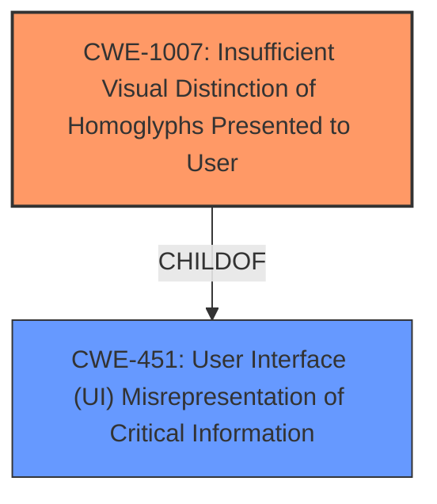

# Raw Analyzer Response for CVE-2020-12063

# Summary
| CWE ID  | CWE Name                                                        | Confidence | CWE Abstraction Level | CWE Vulnerability Mapping Label | CWE-Vulnerability Mapping Notes |
| :-------- | :-------------------------------------------------------------- | :--------- | :---------------------- | :------------------------------ | :------------------------------ |
| CWE-1007 | Insufficient Visual Distinction of Homoglyphs Presented to User | 0.9        | Base                    | Primary                         | Allowed                       |

## Evidence and Confidence

*   **Confidence Score:** 0.9
*   **Evidence Strength:** HIGH

## Relationship Analysis
The primary relationship influencing the decision is that CWE-1007 is a child of CWE-451, User Interface (UI) Misrepresentation of Critical Information. This indicates that the **homoglyph attack** is a specific type of UI misrepresentation. However, since the vulnerability is specifically related to the insufficient distinction of homoglyphs, CWE-1007 is more appropriate and at the preferred Base level of abstraction.

## Vulnerability Chain
The vulnerability chain starts with the **lack of proper input sanitization**, which leads to the use of **homoglyphs** in sender addresses, and finally results in **email spoofing** and the **bypassing of sender restrictions**.

## Summary of Analysis
The analysis is based on the provided vulnerability description, which explicitly mentions the **homoglyph attack** and its impact on bypassing sender restrictions in Postfix. The CVE Reference Links Content Summary provides further evidence, stating that Postfix **does not prevent the use of homoglyphs** in sender addresses, leading to the bypass of sender authentication checks.

The retriever results also support this analysis, with CWE-1007 being the top-ranked CWE. The description of CWE-1007 perfectly matches the vulnerability description: "The product displays information or identifiers to a user, but the display mechanism does not make it easy for the user to distinguish between visually similar or identical glyphs (homoglyphs), which may cause the user to misinterpret a glyph and perform an unintended, insecure action."

The selected CWE, CWE-1007, is at the optimal level of specificity because it directly addresses the **root cause** of the vulnerability, which is the insufficient visual distinction of homoglyphs.

Relevant CWE Information:

# Enhanced Context (25 CWEs)
The following CWEs were identified as potentially relevant to this vulnerability:

## CWE-941: Incorrectly Specified Destination in a Communication Channel
**Abstraction Level**: Base
**Similarity Score**: 0.78
**Source**: dense

**Description**:
The product creates a communication channel to initiate an outgoing request to an actor, but it does not correctly specify the intended destination for that actor.

**Mapping Guidance**:
- Usage: Allowed
- Rationale: This CWE entry is at the Base level of abstraction, which is a preferred level of abstraction for mapping to the root causes of vulnerabilities.

## CWE-297: Improper Validation of Certificate with Host Mismatch
**Abstraction Level**: Variant
**Similarity Score**: 0.78
**Source**: dense

**Description**:
The product communicates with a host that provides a certificate, but the product does not properly ensure that the certificate is actually associated with that host.

**Mapping Guidance**:
- Usage: Allowed
- Rationale: This CWE entry is at the Variant level of abstraction, which is a preferred level of abstraction for mapping to the root causes of vulnerabilities.

## CWE-1289: Improper Validation of Unsafe Equivalence in Input
**Abstraction Level**: Base
**Similarity Score**: 0.77
**Source**: dense

**Description**:
The product receives an input value that is used as a resource identifier or other type of reference, but it does not validate or incorrectly validates that the input is equivalent to a potentially-unsafe value.

**Mapping Guidance**:
- Usage: Allowed
- Rationale: This CWE entry is at the Base level of abstraction, which is a preferred level of abstraction for mapping to the root causes of vulnerabilities.

## CWE-300: Channel Accessible by Non-Endpoint
**Abstraction Level**: Class
**Similarity Score**: 0.77
**Source**: dense

**Description**:
The product does not adequately verify the identity of actors at both ends of a communication channel, or does not adequately ensure the integrity of the channel, in a way that allows the channel to be accessed or influenced by an actor that is not an endpoint.

**Mapping Guidance**:
- Usage: Discouraged
- Rationale: CWE-300 is commonly misused for vulnerabilities in which the prerequisites for exploitation require the adversary to be in a privileged "in-the-middle" position.

## CWE-345: Insufficient Verification of Data Authenticity
**Abstraction Level**: Class
**Similarity Score**: 0.77
**Source**: dense

**Description**:
The product does not sufficiently verify the origin or authenticity of data, in a way that causes it to accept invalid data.

**Mapping Guidance**:
- Usage: Discouraged
- Rationale: This CWE entry is a level-1 Class (i.e., a child of a Pillar). It might have lower-level children that would be more appropriate

## CWE-451: User Interface (UI) Misrepresentation of Critical Information
**Abstraction Level**: Class
**Similarity Score**: 0.76
**Source**: dense

**Description**:
The user interface (UI) does not properly represent critical information to the user, allowing the information - or its source - to be obscured or spoofed. This is often a component in phishing attacks.

**Mapping Guidance**:
- Usage: Allowed-with-Review
- Rationale: This CWE entry is a Class and might have Base-level children that would be more appropriate

## CWE-319: Cleartext Transmission of Sensitive Information
**Abstraction Level**: Base
**Similarity Score**: 0.76
**Source**: dense

**Description**:
The product transmits sensitive or security-critical data in cleartext in a communication channel that can be sniffed by unauthorized actors.

**Mapping Guidance**:
- Usage: Allowed
- Rationale: This CWE entry is at the Base level of abstraction, which is a preferred level of abstraction for mapping to the root causes of vulnerabilities.

## CWE-295: Improper Certificate Validation
**Abstraction Level**: Base
**Similarity Score**: 0.76
**Source**: dense

**Description**:
The product does not validate, or incorrectly validates, a certificate.

**Mapping Guidance**:
- Usage: Allowed
- Rationale: This CWE entry is at the Base level of abstraction, which is a preferred level of abstraction for mapping to the root causes of vulnerabilities.

## CWE-799: Improper Control of Interaction Frequency
**Abstraction Level**: Class
**Similarity Score**: 0.76
**Source**: dense

**Description**:
The product does not properly limit the number or frequency of interactions that it has with an actor, such as the number of incoming requests.

**Mapping Guidance**:
- Usage: Allowed-with-Review
- Rationale: This CWE entry is a Class and might have Base-level children that would be more appropriate

## CWE-203: Observable Discrepancy
**Abstraction Level**: Base
**Similarity Score**: 0.76
**Source**: dense

**Description**:
The product behaves differently or sends different responses under different circumstances in a way that is observable to an unauthorized actor, which exposes security-relevant information about the state of the product, such as whether a particular operation was successful or not.

**Mapping Guidance**:
- Usage: Allowed
- Rationale: This CWE entry is at the Base level of abstraction, which is a preferred level of abstraction for mapping to the root causes of vulnerabilities.

## CWE-1007: Insufficient Visual Distinction of Homoglyphs Presented to User
**Abstraction Level**: Base
**Similarity Score**: 7579.55
**Source**: sparse

**Description**:
The product displays information or identifiers to a user, but the display mechanism does not make it easy for the user to distinguish between visually similar or identical glyphs (homoglyphs), which may cause the user to misinterpret a glyph and perform an unintended, insecure action.

**Mapping Guidance**:
- Usage: Allowed
- Rationale: This CWE entry is at the Base level of abstraction, which is a preferred level of abstraction for mapping to the root causes of vulnerabilities.

## CWE-941: Incorrectly Specified Destination in a Communication Channel
**Abstraction Level**: Base
**Similarity Score**: 6946.02
**Source**: sparse

**Description**:
The product creates a communication channel to initiate an outgoing request to an actor, but it does not correctly specify the intended destination for that actor.

**Mapping Guidance**:
- Usage: Allowed
- Rationale: This CWE entry is at the Base level of abstraction, which is a preferred