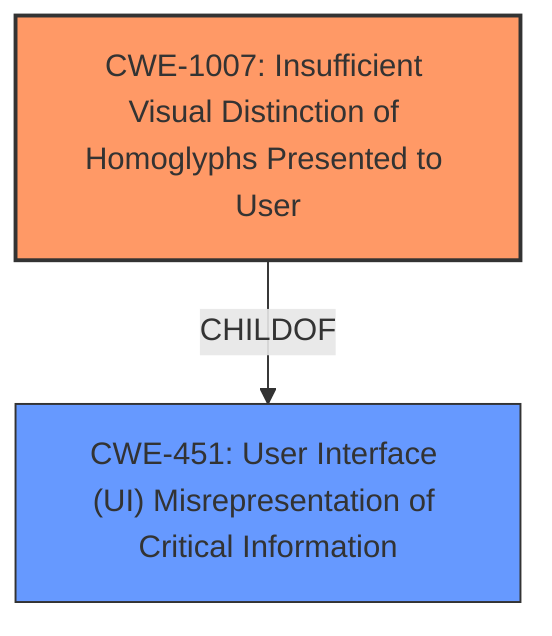

# Analysis for CVE-2020-12063

# Summary
| CWE ID  | CWE Name                                                        | Confidence | CWE Abstraction Level | CWE Vulnerability Mapping Label | CWE-Vulnerability Mapping Notes |
| :-------- | :-------------------------------------------------------------- | :--------- | :---------------------- | :------------------------------ | :------------------------------ |
| CWE-1007 | Insufficient Visual Distinction of Homoglyphs Presented to User | 0.9        | Base                    | Primary                         | Allowed                       |

## Evidence and Confidence

*   **Confidence Score:** 0.9
*   **Evidence Strength:** HIGH

## Relationship Analysis
The primary relationship influencing the decision is that CWE-1007 is a child of CWE-451, User Interface (UI) Misrepresentation of Critical Information. This indicates that the **homoglyph attack** is a specific type of UI misrepresentation. However, since the vulnerability is specifically related to the insufficient distinction of homoglyphs, CWE-1007 is more appropriate and at the preferred Base level of abstraction.

## Vulnerability Chain
The vulnerability chain starts with the **lack of proper input sanitization**, which leads to the use of **homoglyphs** in sender addresses, and finally results in **email spoofing** and the **bypassing of sender restrictions**.

## Summary of Analysis
The analysis is based on the provided vulnerability description, which explicitly mentions the **homoglyph attack** and its impact on bypassing sender restrictions in Postfix. The CVE Reference Links Content Summary provides further evidence, stating that Postfix **does not prevent the use of homoglyphs** in sender addresses, leading to the bypass of sender authentication checks.

The retriever results also support this analysis, with CWE-1007 being the top-ranked CWE. The description of CWE-1007 perfectly matches the vulnerability description: "The product displays information or identifiers to a user, but the display mechanism does not make it easy for the user to distinguish between visually similar or identical glyphs (homoglyphs), which may cause the user to misinterpret a glyph and perform an unintended, insecure action."

The selected CWE, CWE-1007, is at the optimal level of specificity because it directly addresses the **root cause** of the vulnerability, which is the insufficient visual distinction of homoglyphs.

Relevant CWE Information:

# Enhanced Context (25 CWEs)
The following CWEs were identified as potentially relevant to this vulnerability:

## CWE-941: Incorrectly Specified Destination in a Communication Channel
**Abstraction Level**: Base
**Similarity Score**: 0.78
**Source**: dense

**Description**:
The product creates a communication channel to initiate an outgoing request to an actor, but it does not correctly specify the intended destination for that actor.

**Mapping Guidance**:
- Usage: Allowed
- Rationale: This CWE entry is at the Base level of abstraction, which is a preferred level of abstraction for mapping to the root causes of vulnerabilities.

## CWE-297: Improper Validation of Certificate with Host Mismatch
**Abstraction Level**: Variant
**Similarity Score**: 0.78
**Source**: dense

**Description**:
The product communicates with a host that provides a certificate, but the product does not properly ensure that the certificate is actually associated with that host.

**Mapping Guidance**:
- Usage: Allowed
- Rationale: This CWE entry is at the Variant level of abstraction, which is a preferred level of abstraction for mapping to the root causes of vulnerabilities.

## CWE-1289: Improper Validation of Unsafe Equivalence in Input
**Abstraction Level**: Base
**Similarity Score**: 0.77
**Source**: dense

**Description**:
The product receives an input value that is used as a resource identifier or other type of reference, but it does not validate or incorrectly validates that the input is equivalent to a potentially-unsafe value.

**Mapping Guidance**:
- Usage: Allowed
- Rationale: This CWE entry is at the Base level of abstraction, which is a preferred level of abstraction for mapping to the root causes of vulnerabilities.

## CWE-300: Channel Accessible by Non-Endpoint
**Abstraction Level**: Class
**Similarity Score**: 0.77
**Source**: dense

**Description**:
The product does not adequately verify the identity of actors at both ends of a communication channel, or does not adequately ensure the integrity of the channel, in a way that allows the channel to be accessed or influenced by an actor that is not an endpoint.

**Mapping Guidance**:
- Usage: Discouraged
- Rationale: CWE-300 is commonly misused for vulnerabilities in which the prerequisites for exploitation require the adversary to be in a privileged "in-the-middle" position.

## CWE-345: Insufficient Verification of Data Authenticity
**Abstraction Level**: Class
**Similarity Score**: 0.77
**Source**: dense

**Description**:
The product does not sufficiently verify the origin or authenticity of data, in a way that causes it to accept invalid data.

**Mapping Guidance**:
- Usage: Discouraged
- Rationale: This CWE entry is a level-1 Class (i.e., a child of a Pillar). It might have lower-level children that would be more appropriate

## CWE-451: User Interface (UI) Misrepresentation of Critical Information
**Abstraction Level**: Class
**Similarity Score**: 0.76
**Source**: dense

**Description**:
The user interface (UI) does not properly represent critical information to the user, allowing the information - or its source - to be obscured or spoofed. This is often a component in phishing attacks.

**Mapping Guidance**:
- Usage: Allowed-with-Review
- Rationale: This CWE entry is a Class and might have Base-level children that would be more appropriate

## CWE-319: Cleartext Transmission of Sensitive Information
**Abstraction Level**: Base
**Similarity Score**: 0.76
**Source**: dense

**Description**:
The product transmits sensitive or security-critical data in cleartext in a communication channel that can be sniffed by unauthorized actors.

**Mapping Guidance**:
- Usage: Allowed
- Rationale: This CWE entry is at the Base level of abstraction, which is a preferred level of abstraction for mapping to the root causes of vulnerabilities.

## CWE-295: Improper Certificate Validation
**Abstraction Level**: Base
**Similarity Score**: 0.76
**Source**: dense

**Description**:
The product does not validate, or incorrectly validates, a certificate.

**Mapping Guidance**:
- Usage: Allowed
- Rationale: This CWE entry is at the Base level of abstraction, which is a preferred level of abstraction for mapping to the root causes of vulnerabilities.

## CWE-799: Improper Control of Interaction Frequency
**Abstraction Level**: Class
**Similarity Score**: 0.76
**Source**: dense

**Description**:
The product does not properly limit the number or frequency of interactions that it has with an actor, such as the number of incoming requests.

**Mapping Guidance**:
- Usage: Allowed-with-Review
- Rationale: This CWE entry is a Class and might have Base-level children that would be more appropriate

## CWE-203: Observable Discrepancy
**Abstraction Level**: Base
**Similarity Score**: 0.76
**Source**: dense

**Description**:
The product behaves differently or sends different responses under different circumstances in a way that is observable to an unauthorized actor, which exposes security-relevant information about the state of the product, such as whether a particular operation was successful or not.

**Mapping Guidance**:
- Usage: Allowed
- Rationale: This CWE entry is at the Base level of abstraction, which is a preferred level of abstraction for mapping to the root causes of vulnerabilities.

## CWE-1007: Insufficient Visual Distinction of Homoglyphs Presented to User
**Abstraction Level**: Base
**Similarity Score**: 7579.55
**Source**: sparse

**Description**:
The product displays information or identifiers to a user, but the display mechanism does not make it easy for the user to distinguish between visually similar or identical glyphs (homoglyphs), which may cause the user to misinterpret a glyph and perform an unintended, insecure action.

**Mapping Guidance**:
- Usage: Allowed
- Rationale: This CWE entry is at the Base level of abstraction, which is a preferred level of abstraction for mapping to the root causes of vulnerabilities.

## CWE-941: Incorrectly Specified Destination in a Communication Channel
**Abstraction Level**: Base
**Similarity Score**: 6946.02
**Source**: sparse

**Description**:
The product creates a communication channel to initiate an outgoing request to an actor, but it does not correctly specify the intended destination for that actor.

**Mapping Guidance**:
- Usage: Allowed
- Rationale: This CWE entry is at the Base level of abstraction, which is a preferred

# Enhanced Query for CVE-2020-12063

## Vulnerability Description
A certain Postfix 2.10.1-7 package could allow an attacker to send an email from an arbitrary-looking sender via a **homoglyph attack**, as demonstrated by the similarity of \xce\xbf to the o character. This is potentially relevant when the /etc/postfix/sender_login feature is used, because a spoofed outbound message that uses a configured sender address is blocked with a Sender address rejected not logged in error message, but a spoofed outbound message that uses a homoglyph of a configured sender address is not blocked. NOTE some third parties argue that any missed blocking of spoofed outbound messages - except for exact matches to a sender address in the /etc/postfix/sender_login file - is outside the design goals of Postfix and thus cannot be considered a Postfix vulnerability

### Vulnerability Description Key Phrases
- **weakness:** **homoglyph attack**
- **impact:** send an email from an arbitrary-looking sender
- **attacker:** attacker
- **product:** Postfix
- **version:** 2.10.1-7
- **component:** /etc/postfix/sender_login feature

## CVE Reference Links Content Summary
Based on the provided content, here's an analysis of the CVE-2020-12063 vulnerability:

**Root Cause of Vulnerability:**

The root cause is the lack of proper input sanitization in Postfix when handling email sender addresses. Specifically, Postfix does not prevent the use of homoglyphs (characters that look similar to other characters) in sender addresses.

**Weaknesses/Vulnerabilities Present:**

*   **Homoglyph Attack:**  An attacker can substitute a character in a legitimate sender address with a homoglyph character. For example, replacing the letter "o" with the Greek lowercase omicron "ο" (\xce\xbf), which visually appears the same.
*   **Insufficient Input Validation:** Postfix fails to recognize these homoglyph characters as different from their visually similar counterparts, leading to bypass of sender authentication checks.
*   **Bypassing sender restrictions:** The vulnerability makes it possible for an attacker to send emails that appear to originate from a user that is configured in the system. The attacker can spoof email senders with homoglyphs, bypassing security controls put in place by configurations such as `smtpd_sender_login_maps`.

**Impact of Exploitation:**

*   **Email Spoofing:** An attacker can send emails with a forged "From" address, making it appear as though the email came from a legitimate user on the system.
*   **Social Engineering:** This spoofing capability can be used to launch more credible social engineering attacks, tricking recipients into believing they are receiving messages from a trusted source. This could lead to phishing or malware distribution.
*  **Bypassing access controls**: The attacker can potentially circumvent restrictions placed on authorized senders. 

**Attack Vectors:**

*   **Remote SMTP Connection:** The attacker connects to the SMTP server remotely (e.g., using netcat or a similar tool).
*   **Crafted Sender Address:** The attacker specifies a sender address in the `MAIL FROM` command which includes homoglyphs.

**Required Attacker Capabilities/Position:**

*   **Network Access:** The attacker needs network access to the target mail server's SMTP port (typically port 25).
*   **Knowledge of Target Users:** The attacker benefits from knowledge of valid local users on the target mail server for effective spoofing. No authentication required.

**Additional Details:**

*   The initial report incorrectly stated the vulnerable version as `3.3.0-1`.  The reporter later clarified the vulnerability was found in version `2.10.1-7.el7.x86_64`.
*   The vulnerability is not directly related to the `smtpd_sender_login_maps` configuration. While this setting is a security control to restrict who can send mail as a specific user, the homoglyph attack allows bypassing that control by creating a sender address that appears legitimate, yet is not in the table.
* Wietse Venema, a Postfix developer, confirmed that the "Sender address rejected: not logged in" error message is generated when the client attempts to send an email with an envelope sender that is listed in `smtpd_sender_login_maps` but is not properly authenticated. The vulnerability lies in the fact that it is possible to bypass this check by creating a visually similar address via homoglyphs.

This information provides more context and detail than the placeholder description provided in the initial CVE information.

## Retriever Results

### Top Combined Results

| Rank | CWE ID | Name | Abstraction | Usage  | Retrievers | Individual Scores |
|------|--------|------|-------------|-------|------------|-------------------|
| 1 | 1007 | Insufficient Visual Distinction of Homoglyphs Presented to User | Base | Allowed | sparse | 1.515 |
| 2 | 941 | Incorrectly Specified Destination in a Communication Channel | Base | Allowed | sparse | 0.629 |
| 3 | 327 | Use of a Broken or Risky Cryptographic Algorithm | Class | Allowed-with-Review | sparse | 0.628 |
| 4 | 319 | Cleartext Transmission of Sensitive Information | Base | Allowed | sparse | 0.603 |
| 5 | 406 | Insufficient Control of Network Message Volume (Network Amplification) | Class | Allowed-with-Review | sparse | 0.601 |
| 6 | 150 | Improper Neutralization of Escape, Meta, or Control Sequences | Variant | Allowed | dense | 0.482 |
| 7 | 208 | Observable Timing Discrepancy | Base | Allowed | graph | 0.002 |
| 8 | 295 | Improper Certificate Validation | Base | Allowed | sparse | 0.598 |
| 9 | 923 | Improper Restriction of Communication Channel to Intended Endpoints | Class | Allowed-with-Review | sparse | 0.593 |
| 10 | 346 | Origin Validation Error | Class | Allowed-with-Review | sparse | 0.593 |

# Complete CWE Specifications

## CWE-1007: Insufficient Visual Distinction of Homoglyphs Presented to User
**Abstraction:** Base
**Status:** Incomplete

### Description
The product displays information or identifiers to a user, but the display mechanism does not make it easy for the user to distinguish between visually similar or identical glyphs (homoglyphs), which may cause the user to misinterpret a glyph and perform an unintended, insecure action.

### Extended Description

Some glyphs, pictures, or icons can be semantically distinct to a program, while appearing very similar or identical to a human user. These are referred to as homoglyphs. For example, the lowercase "l" (ell) and uppercase "I" (eye) have different character codes, but these characters can be displayed in exactly the same way to a user, depending on the font. This can also occur between different character sets. For example, the Latin capital letter "A" and the Greek capital letter "Α" (Alpha) are treated as distinct by programs, but may be displayed in exactly the same way to a user. Accent marks may also cause letters to appear very similar, such as the Latin capital letter grave mark "À" and its equivalent "Á" with the acute accent.

Adversaries can exploit this visual similarity for attacks such as phishing, e.g. by providing a link to an attacker-controlled hostname that looks like a hostname that the victim trusts. In a different use of homoglyphs, an adversary may create a back door username that is visually similar to the username of a regular user, which then makes it more difficult for a system administrator to detect the malicious username while reviewing logs.

### Alternative Terms
Homograph Attack: "Homograph" is often used as a synonym of "homoglyph" by researchers, but according to Wikipedia, a homograph is a word that has multiple, distinct meanings.

### Relationships
ChildOf -> CWE-451

### Mapping Guidance
**Usage:** Allowed
**Rationale:** This CWE entry is at the Base level of abstraction, which is a preferred level of abstraction for mapping to the root causes of vulnerabilities.
**Comments:** Carefully read both the name and description to ensure that this mapping is an appropriate fit. Do not try to 'force' a mapping to a lower-level Base/Variant simply to comply with this preferred level of abstraction.
**Reasons:**
- Acceptable-Use

### Observed Examples
- **CVE-2013-7236:** web forum allows impersonation of users with homoglyphs in account names
- **CVE-2012-0584:** Improper character restriction in URLs in web browser
- **CVE-2009-0652:** Incomplete denylist does not include homoglyphs of "/" and "?" characters in URLs

## CWE-941: Incorrectly Specified Destination in a Communication Channel
**Abstraction:** Base
**Status:** Incomplete

### Description
The product creates a communication channel to initiate an outgoing request to an actor, but it does not correctly specify the intended destination for that actor.

### Extended Description

Attackers at the destination may be able to spoof trusted servers to steal data or cause a denial of service.

There are at least two distinct weaknesses that can cause the product to communicate with an unintended destination:

  - If the product allows an attacker to control which destination is specified, then the attacker can cause it to connect to an untrusted or malicious destination. For example, because UDP is a connectionless protocol, UDP packets can be spoofed by specifying a false source address in the packet; when the server receives the packet and sends a reply, it will specify a destination by using the source of the incoming packet - i.e., the false source. The server can then be tricked into sending traffic to the wrong host, which is effective for hiding the real source of an attack and for conducting a distributed denial of service (DDoS). As another example, server-side request forgery (SSRF) and XML External Entity (XXE) can be used to trick a server into making outgoing requests to hosts that cannot be directly accessed by the attacker due to firewall restrictions.

  - If the product incorrectly specifies the destination, then an attacker who can control this destination might be able to spoof trusted servers. While the most common occurrence is likely due to misconfiguration by an administrator, this can be resultant from other weaknesses. For example, the product might incorrectly parse an e-mail or IP address and send sensitive data to an unintended destination. As another example, an Android application may use a "sticky broadcast" to communicate with a receiver for a particular application, but since sticky broadcasts can be processed by *any* receiver, this can allow a malicious application to access restricted data that was only intended for a different application.

### Alternative Terms
None

### Relationships
ChildOf -> CWE-923
CanPrecede -> CWE-406

### Mapping Guidance
**Usage:** Allowed
**Rationale:** This CWE entry is at the Base level of abstraction, which is a preferred level of abstraction for mapping to the root causes of vulnerabilities.
**Comments:** Carefully read both the name and description to ensure that this mapping is an appropriate fit. Do not try to 'force' a mapping to a lower-level Base/Variant simply to comply with this preferred level of abstraction.
**Reasons:**
- Acceptable-Use

### Observed Examples
- **CVE-2013-5211:** composite: NTP feature generates large responses (high amplification factor) with spoofed UDP source addresses.
- **CVE-1999-0513:** Classic "Smurf" attack, using spoofed ICMP packets to broadcast addresses.
- **CVE-1999-1379:** DNS query with spoofed source address causes more traffic to be returned to spoofed address than was sent by the attacker.

## CWE-327: Use of a Broken or Risky Cryptographic Algorithm
**Abstraction:** Class
**Status:** Draft

### Description
The product uses a broken or risky cryptographic algorithm or protocol.

### Extended Description

Cryptographic algorithms are the methods by which data is scrambled to prevent observation or influence by unauthorized actors. Insecure cryptography can be exploited to expose sensitive information, modify data in unexpected ways, spoof identities of other users or devices, or other impacts.

It is very difficult to produce a secure algorithm, and even high-profile algorithms by accomplished cryptographic experts have been broken. Well-known techniques exist to break or weaken various kinds of cryptography. Accordingly, there are a small number of well-understood and heavily studied algorithms that should be used by most products. Using a non-standard or known-insecure algorithm is dangerous because a determined adversary may be able to break the algorithm and compromise whatever data has been protected.

Since the state of cryptography advances so rapidly, it is common for an algorithm to be considered "unsafe" even if it was once thought to be strong. This can happen when new attacks are discovered, or if computing power increases so much that the cryptographic algorithm no longer provides the amount of protection that was originally thought.

For a number of reasons, this weakness is even more challenging to manage with hardware deployment of cryptographic algorithms as opposed to software implementation. First, if a flaw is discovered with hardware-implemented cryptography, the flaw cannot be fixed in most cases without a recall of the product, because hardware is not easily replaceable like software. Second, because the hardware product is expected to work for years, the adversary's computing power will only increase over time.

### Alternative Terms
None

### Relationships
ChildOf -> CWE-693
PeerOf -> CWE-311

### Mapping Guidance
**Usage:** Allowed-with-Review
**Rationale:** This CWE entry is a Class and might have Base-level children that would be more appropriate
**Comments:** Examine children of this entry to see if there is a better fit
**Reasons:**
- Abstraction

### Additional Notes
**[Maintenance]** Since CWE 4.4, various cryptography-related entries, including CWE-327 and CWE-1240, have been slated for extensive research, analysis, and community consultation to define consistent terminology, improve relationships, and reduce overlap or duplication. As of CWE 4.6, this work is still ongoing.

**[Maintenance]** The Taxonomy_Mappings to ISA/IEC 62443 were added in CWE 4.10, but they are still under review and might change in future CWE versions. These draft mappings were performed by members of the "Mapping CWE to 62443" subgroup of the CWE-CAPEC ICS/OT Special Interest Group (SIG), and their work is incomplete as of CWE 4.10. The mappings are included to facilitate discussion and review by the broader ICS/OT community, and they are likely to change in future CWE versions.

### Observed Examples
- **CVE-2022-30273:** SCADA-based protocol supports a legacy encryption mode that uses Tiny Encryption Algorithm (TEA) in ECB mode, which leaks patterns in messages and cannot protect integrity
- **CVE-2022-30320:** Programmable Logic Controller (PLC) uses a protocol with a cryptographically insecure hashing algorithm for passwords.
- **CVE-2008-3775:** Product uses "ROT-25" to obfuscate the password in the registry.

## CWE-319: Cleartext Transmission of Sensitive Information
**Abstraction:** Base
**Status:** Draft

### Description
The product transmits sensitive or security-critical data in cleartext in a communication channel that can be sniffed by unauthorized actors.

### Extended Description

Many communication channels can be "sniffed" (monitored) by adversaries during data transmission. For example, in networking, packets can traverse many intermediary nodes from the source to the destination, whether across the internet, an internal network, the cloud, etc. Some actors might have privileged access to a network interface or any link along the channel, such as a router, but they might not be authorized to collect the underlying data. As a result, network traffic could be sniffed by adversaries, spilling security-critical data.

Applicable communication channels are not limited to software products. Applicable channels include hardware-specific technologies such as internal hardware networks and external debug channels, supporting remote JTAG debugging. When mitigations are not applied to combat adversaries within the product's threat model, this weakness significantly lowers the difficulty of exploitation by such adversaries.

When full communications are recorded or logged, such as with a packet dump, an adversary could attempt to obtain the dump long after the transmission has occurred and try to "sniff" the cleartext from the recorded communications in the dump itself. Even if the information is encoded in a way that is not human-readable, certain techniques could determine which encoding is being used, then decode the information. 

### Alternative Terms
None

### Relationships
ChildOf -> CWE-311
ChildOf -> CWE-311

### Mapping Guidance
**Usage:** Allowed
**Rationale:** This CWE entry is at the Base level of abstraction, which is a preferred level of abstraction for mapping to the root causes of vulnerabilities.
**Comments:** Carefully read both the name and description to ensure that this mapping is an appropriate fit. Do not try to 'force' a mapping to a lower-level Base/Variant simply to comply with this preferred level of abstraction.
**Reasons:**
- Acceptable-Use

### Additional Notes
**[Maintenance]** The Taxonomy_Mappings to ISA/IEC 62443 were added in CWE 4.10, but they are still under review and might change in future CWE versions. These draft mappings were performed by members of the "Mapping CWE to 62443" subgroup of the CWE-CAPEC ICS/OT Special Interest Group (SIG), and their work is incomplete as of CWE 4.10. The mappings are included to facilitate discussion and review by the broader ICS/OT community, and they are likely to change in future CWE versions.

### Observed Examples
- **CVE-2022-29519:** Programmable Logic Controller (PLC) sends sensitive information in plaintext, including passwords and session tokens.
- **CVE-2022-30312:** Building Controller uses a protocol that transmits authentication credentials in plaintext.
- **CVE-2022-31204:** Programmable Logic Controller (PLC) sends password in plaintext.

## CWE-406: Insufficient Control of Network Message Volume (Network Amplification)
**Abstraction:** Class
**Status:** Incomplete

### Description
The product does not sufficiently monitor or control transmitted network traffic volume, so that an actor can cause the product to transmit more traffic than should be allowed for that actor.

### Extended Description
In the absence of a policy to restrict asymmetric resource consumption, the application or system cannot distinguish between legitimate transmissions and traffic intended to serve as an amplifying attack on target systems. Systems can often be configured to restrict the amount of traffic sent out on behalf of a client, based on the client's origin or access level. This is usually defined in a resource allocation policy. In the absence of a mechanism to keep track of transmissions, the system or application can be easily abused to transmit asymmetrically greater traffic than the request or client should be permitted to.

### Alternative Terms
None

### Relationships
ChildOf -> CWE-405

### Mapping Guidance
**Usage:** Allowed-with-Review
**Rationale:** This CWE entry is a Class and might have Base-level children that would be more appropriate
**Comments:** Examine children of this entry to see if there is a better fit
**Reasons:**
- Abstraction

### Additional Notes
**[Relationship]** This can be resultant from weaknesses that simplify spoofing attacks.

**[Theoretical]** Network amplification, when performed with spoofing, is normally a multi-channel attack from attacker (acting as user) to amplifier, and amplifier to victim.

### Observed Examples
- **CVE-1999-0513:** Classic "Smurf" attack, using spoofed ICMP packets to broadcast addresses.
- **CVE-1999-1379:** DNS query with spoofed source address causes more traffic to be returned to spoofed address than was sent by the attacker.
- **CVE-2000-0041:** Large datagrams are sent in response to malformed datagrams.

## CWE-150: Improper Neutralization of Escape, Meta, or Control Sequences
**Abstraction:** Variant
**Status:** Incomplete

### Description
The product receives input from an upstream component, but it does not neutralize or incorrectly neutralizes special elements that could be interpreted as escape, meta, or control character sequences when they are sent to a downstream component.

### Extended Description
As data is parsed, an injected/absent/malformed delimiter may cause the process to take unexpected actions.

### Alternative Terms
None

### Relationships
ChildOf -> CWE-138

### Mapping Guidance
**Usage:** Allowed
**Rationale:** This CWE entry is at the Variant level of abstraction, which is a preferred level of abstraction for mapping to the root causes of vulnerabilities.
**Comments:** Carefully read both the name and description to ensure that this mapping is an appropriate fit. Do not try to 'force' a mapping to a lower-level Base/Variant simply to comply with this preferred level of abstraction.
**Reasons:**
- Acceptable-Use

### Observed Examples
- **CVE-2002-0542:** The mail program processes special "~" escape sequence even when not in interactive mode.
- **CVE-2000-0703:** Setuid program does not filter escape sequences before calling mail program.
- **CVE-2002-0986:** Mail function does not filter control characters from arguments, allowing mail message content to be modified.

## CWE-208: Observable Timing Discrepancy
**Abstraction:** Base
**Status:** Incomplete

### Description
Two separate operations in a product require different amounts of time to complete, in a way that is observable to an actor and reveals security-relevant information about the state of the product, such as whether a particular operation was successful or not.

### Extended Description
In security-relevant contexts, even small variations in timing can be exploited by attackers to indirectly infer certain details about the product's internal operations. For example, in some cryptographic algorithms, attackers can use timing differences to infer certain properties about a private key, making the key easier to guess. Timing discrepancies effectively form a timing side channel.

### Alternative Terms
None

### Relationships
ChildOf -> CWE-203
CanPrecede -> CWE-385
CanPrecede -> CWE-327

### Mapping Guidance
**Usage:** Allowed
**Rationale:** This CWE entry is at the Base level of abstraction, which is a preferred level of abstraction for mapping to the root causes of vulnerabilities.
**Comments:** Carefully read both the name and description to ensure that this mapping is an appropriate fit. Do not try to 'force' a mapping to a lower-level Base/Variant simply to comply with this preferred level of abstraction.
**Reasons:**
- Acceptable-Use

### Additional Notes
**[Relationship]** Often primary in cryptographic applications and algorithms.

**[Maintenance]** CWE 4.16 removed a demonstrative example for a hardware module because it was inaccurate and unable to be adapted. The CWE team is developing an alternative.

### Observed Examples
- **CVE-2019-10071:** Java-oriented framework compares HMAC signatures using String.equals() instead of a constant-time algorithm, causing timing discrepancies
- **CVE-2019-10482:** Smartphone OS uses comparison functions that are not in constant time, allowing side channels
- **CVE-2014-0984:** Password-checking function in router terminates validation of a password entry when it encounters the first incorrect character, which allows remote attackers to obtain passwords via a brute-force attack that relies on timing differences in responses to incorrect password guesses, aka a timing side-channel attack.

## CWE-295: Improper Certificate Validation
**Abstraction:** Base
**Status:** Draft

### Description
The product does not validate, or incorrectly validates, a certificate.

### Extended Description
When a certificate is invalid or malicious, it might allow an attacker to spoof a trusted entity by interfering in the communication path between the host and client. The product might connect to a malicious host while believing it is a trusted host, or the product might be deceived into accepting spoofed data that appears to originate from a trusted host.

### Alternative Terms
None

### Relationships
ChildOf -> CWE-287
ChildOf -> CWE-287
PeerOf -> CWE-322

### Mapping Guidance
**Usage:** Allowed
**Rationale:** This CWE entry is at the Base level of abstraction, which is a preferred level of abstraction for mapping to the root causes of vulnerabilities.
**Comments:** Carefully read both the name and description to ensure that this mapping is an appropriate fit. Do not try to 'force' a mapping to a lower-level Base/Variant simply to comply with this preferred level of abstraction.
**Reasons:**
- Acceptable-Use

### Observed Examples
- **CVE-2019-12496:** A Go framework for robotics, drones, and IoT devices skips verification of root CA certificates by default.
- **CVE-2014-1266:** chain: incorrect "goto" in Apple SSL product bypasses certificate validation, allowing Adversary-in-the-Middle (AITM) attack (Apple "goto fail" bug). CWE-705 (Incorrect Control Flow Scoping) -> CWE-561 (Dead Code) -> CWE-295 (Improper Certificate Validation) -> CWE-393 (Return of Wrong Status Code) -> CWE-300 (Channel Accessible by Non-Endpoint).
- **CVE-2021-22909:** Chain: router's firmware update procedure uses curl with "-k" (insecure) option that disables certificate validation (CWE-295), allowing adversary-in-the-middle (AITM) compromise with a malicious firmware image (CWE-494).

## CWE-923: Improper Restriction of Communication Channel to Intended Endpoints
**Abstraction:** Class
**Status:** Incomplete

### Description
The product establishes a communication channel to (or from) an endpoint for privileged or protected operations, but it does not properly ensure that it is communicating with the correct endpoint.

### Extended Description

Attackers might be able to spoof the intended endpoint from a different system or process, thus gaining the same level of access as the intended endpoint.

While this issue frequently involves authentication between network-based clients and servers, other types of communication channels and endpoints can have this weakness.

### Alternative Terms
None

### Relationships
ChildOf -> CWE-284

### Mapping Guidance
**Usage:** Allowed-with-Review
**Rationale:** This CWE entry is a Class and might have Base-level children that would be more appropriate
**Comments:** Examine children of this entry to see if there is a better fit
**Reasons:**
- Abstraction

### Observed Examples
- **CVE-2022-30319:** S-bus functionality in a home automation product performs access control using an IP allowlist, which can be bypassed by a forged IP address.
- **CVE-2022-22547:** A troubleshooting tool exposes a web server on a random port between 9000-65535 that could be used for information gathering
- **CVE-2022-4390:** A WAN interface on a router has firewall restrictions enabled for IPv4, but it does not for IPv6, which is enabled by default

## CWE-346: Origin Validation Error
**Abstraction:** Class
**Status:** Draft

### Description
The product does not properly verify that the source of data or communication is valid.

### Extended Description
Not provided

### Alternative Terms
None

### Relationships
ChildOf -> CWE-345
ChildOf -> CWE-345
ChildOf -> CWE-284

### Mapping Guidance
**Usage:** Allowed-with-Review
**Rationale:** This CWE entry is a Class and might have Base-level children that would be more appropriate
**Comments:** Examine children of this entry to see if there is a better fit
**Reasons:**
- Abstraction

### Additional Notes
**[Maintenance]** This entry has some significant overlap with other CWE entries and may need some clarification. See terminology notes.

**[Terminology]** The "Origin Validation Error" term was originally used in a 1995 thesis [REF-324]. Although not formally defined, an issue is considered to be an origin validation error if either (1) "an object [accepts] input from an unauthorized subject," or (2) "the system [fails] to properly or completely authenticate a subject." A later section says that an origin validation error can occur when the system (1) "does not properly authenticate a user or process" or (2) "does not properly authenticate the shared data or libraries." The only example provided in the thesis (covered by OSVDB:57615) involves a setuid program running command-line arguments without dropping privileges. So, this definition (and its examples in the thesis) effectively cover other weaknesses such as CWE-287 (Improper Authentication), CWE-285 (Improper Authorization), and CWE-250 (Execution with Unnecessary Privileges). There appears to be little usage of this term today, except in the SecurityFocus vulnerability database, where the term is used for a variety of issues, including web-browser problems that allow violation of the Same Origin Policy and improper validation of the source of an incoming message.

### Observed Examples
- **CVE-2000-1218:** DNS server can accept DNS updates from hosts that it did not query, leading to cache poisoning
- **CVE-2005-0877:** DNS server can accept DNS updates from hosts that it did not query, leading to cache poisoning
- **CVE-2001-1452:** DNS server caches glue records received from non-delegated name servers

