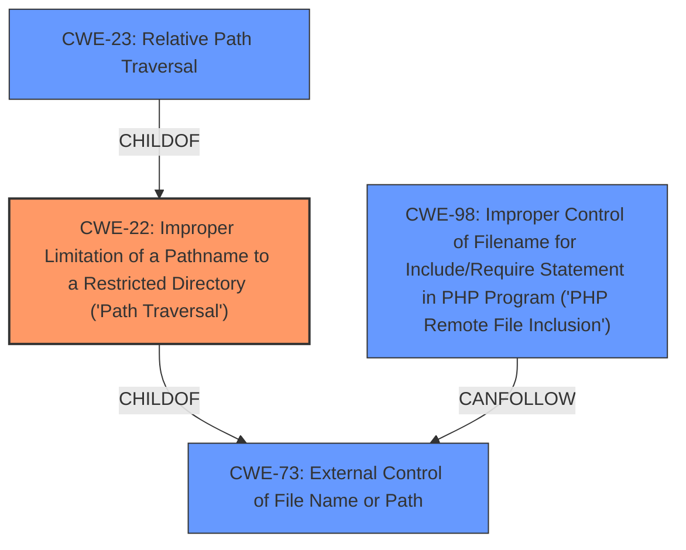

# Enhanced Analysis for CVE-2020-12112

# Summary
| CWE ID | CWE Name | Confidence | CWE Abstraction Level | CWE Vulnerability Mapping Label | CWE-Vulnerability Mapping Notes |
|---|---|---|---|---|---|
| CWE-22 | Improper Limitation of a Pathname to a Restricted Directory ('Path Traversal') | 1.0 | Base | Allowed | Primary CWE |
| CWE-73 | External Control of File Name or Path | 0.9 | Base | Allowed | Secondary Candidate |
| CWE-23 | Relative Path Traversal | 0.7 | Base | Allowed | Secondary Candidate |
| CWE-98 | Improper Control of Filename for Include/Require Statement in PHP Program ('PHP Remote File Inclusion') | 0.6 | Variant | Allowed | Secondary Candidate |

## Evidence and Confidence

*   **Confidence Score:** 0.9
*   **Evidence Strength:** HIGH

## Relationship Analysis
The primary CWE is CWE-22, which represents the **improper limitation of a pathname to a restricted directory**, leading to path traversal. CWE-73, **External Control of File Name or Path**, is a parent of CWE-22 and represents the broader issue of allowing user input to control file paths. CWE-23, **Relative Path Traversal**, is a child of CWE-22 and a more specific case involving "../" sequences. CWE-98, **Improper Control of Filename for Include/Require Statement in PHP Program ('PHP Remote File Inclusion')**, is a variant related to PHP applications and file inclusion.



## Vulnerability Chain
The vulnerability chain starts with **external control of the filename (CWE-73)**, leading to the **improper limitation of the pathname (CWE-22)**, which then results in a **path traversal (CWE-23)** and potentially a **local file inclusion (CWE-98)** if the application processes the included file.

## Summary of Analysis
The initial vulnerability description highlights a **Local File Inclusion** vulnerability. The provided CVE Reference Links Content Summary provides sufficient evidence to refine the classification. The analysis revealed that the **root cause** lies in the **improper sanitization** of the `presFilename` parameter, which allows for **path traversal**.

The primary CWE is CWE-22 because the **core weakness** is the **improper limitation of a pathname** allowing access to files outside the restricted directory. This aligns with the CWE-22 description: "The product uses external input to construct a pathname that is intended to identify a file or directory that is located underneath a restricted parent directory, but the product does not properly neutralize special elements within the pathname that can cause the pathname to resolve to a location that is outside of the restricted directory."

CWE-73 is also relevant as it describes the broader issue of **external control of file names or paths**. It states: "The product allows user input to control or influence paths or file names that are used in filesystem operations." This control is a prerequisite for the path traversal vulnerability.

CWE-23 is a more specific variant of CWE-22, focusing on the use of ".." sequences for path traversal. While the description mentions path traversal techniques, the evidence doesn't explicitly confirm the use of "../" sequences, so it's a secondary consideration.

CWE-98, **Improper Control of Filename for Include/Require Statement in PHP Program**, is considered because the vulnerability results in the inclusion of a local file. However, BigBlueButton is not a PHP application. It is considered a secondary candidate because it is a potential result of the path traversal.

The final selection prioritizes CWE-22 as the primary weakness because it best represents the **root cause** of the vulnerability which is the **improper limitation of a pathname**. The supporting CWEs are added to provide a broader context for the vulnerability and its potential consequences.

Relevant CWE Information:

# Enhanced Context (25 CWEs)
The following CWEs were identified as potentially relevant to this vulnerability:

## CWE-23: Relative Path Traversal
**Abstraction Level**: Base
**Similarity Score**: 0.80
**Source**: dense

**Description**:
The product uses external input to construct a pathname that should be within a restricted directory, but it does not properly neutralize sequences such as ".." that can resolve to a location that is outside of that directory.

**Mapping Guidance**:
- Usage: Allowed
- Rationale: This CWE entry is at the Base level of abstraction, which is a preferred level of abstraction for mapping to the root causes of vulnerabilities.

**Analysis:**
Considered because path traversal often involves ".." sequences. The "CVE Reference Links Content Summary" section does mention path traversal sequences, but the evidence does not explicitly state that "../" was used.

## CWE-36: Absolute Path Traversal
**Abstraction Level**: Base
**Similarity Score**: 0.79
**Source**: dense

**Description**:
The product uses external input to construct a pathname that should be within a restricted directory, but it does not properly neutralize absolute path sequences such as "/abs/path" that can resolve to a location that is outside of that directory.

**Mapping Guidance**:
- Usage: Allowed
- Rationale: This CWE entry is at the Base level of abstraction, which is a preferred level of abstraction for mapping to the root causes of vulnerabilities.

**Analysis:**
Not selected because the vulnerability description focuses on relative paths rather than absolute paths.

## CWE-24: Path Traversal: '../filedir'
**Abstraction Level**: Variant
**Similarity Score**: 0.79
**Source**: dense

**Description**:
The product uses external input to construct a pathname that should be within a restricted directory, but it does not properly neutralize "../" sequences that can resolve to a location that is outside of that directory.

**Mapping Guidance**:
- Usage: Allowed
- Rationale: This CWE entry is at the Variant level of abstraction, which is a preferred level of abstraction for mapping to the root causes of vulnerabilities.

**Analysis:**
Considered as a possibility as the "CVE Reference Links Content Summary" section does mention path traversal sequences. However, the evidence does not explicitly state that "../" was used.

## CWE-73: External Control of File Name or Path
**Abstraction Level**: Base
**Similarity Score**: 0.78
**Source**: dense

**Description**:
The product allows user input to control or influence paths or file names that are used in filesystem operations.

**Mapping Guidance**:
- Usage: Allowed
- Rationale: This CWE entry is at the Base level of abstraction, which is a preferred level of abstraction for mapping to the root causes of vulnerabilities.

**Analysis:**
Selected as a secondary CWE because the vulnerability involves user-supplied input (`presFilename`) influencing the file path.

## CWE-59: Improper Link Resolution Before File Access ('Link Following')
**Abstraction Level**: Base
**Similarity Score**: 0.77
**Source**: dense

**Description**:
The product attempts to access a file based on the filename, but it does not properly prevent that filename from identifying a link or shortcut that resolves to an unintended resource.

**Mapping Guidance**:
- Usage: Allowed
- Rationale: This CWE entry is at the Base level of abstraction, which is a preferred level of abstraction for mapping to the root causes of vulnerabilities.

**Analysis:**
Not selected because the vulnerability description does not mention any issues with symbolic links or link resolution.

## CWE-41: Improper Resolution of Path Equivalence
**Abstraction Level**: Base
**Similarity Score**: 0.77
**Source**: dense

**Description**:
The product is vulnerable to file system contents disclosure through path equivalence. Path equivalence involves the use of special characters in file and directory names. The associated manipulations are intended to generate multiple names for the same object.

**Mapping Guidance**:
- Usage: Allowed
- Rationale: This CWE entry is at the Base level of abstraction, which is a preferred level of abstraction for mapping to the root causes of vulnerabilities.

**Analysis:**
Not selected because the vulnerability description does not focus on path equivalence issues, but rather on path traversal.

## CWE-37: Path Traversal: '/absolute/pathname/here'
**Abstraction Level**: Variant
**Similarity Score**: 0.77
**Source**: dense

**Description**:
The product accepts input in the form of a slash absolute path ('/absolute/pathname/here') without appropriate validation, which can allow an attacker to traverse the file system to unintended locations


## CWE Relationship Analysis

Current CWEs represent these abstraction levels: .


### Vulnerability Chain Analysis

**Chain starting from CWE-36:**
- 36 (Absolute Path Traversal) - ROOT


**Chain starting from CWE-73:**
- 73 (External Control of File Name or Path) - ROOT


### CWE Relationship Diagram

```mermaid
graph TD
    classDef primary fill:#f96,stroke:#333,stroke-width:2px
    classDef secondary fill:#69f,stroke:#333
    classDef tertiary fill:#9e9,stroke:#333
```