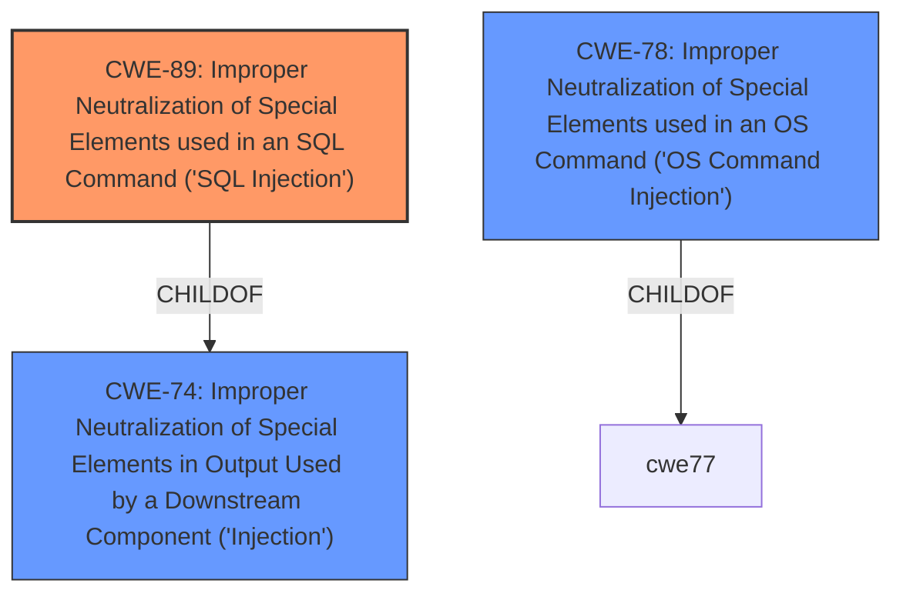

# Enhanced Analysis for CVE-2020-12271

# Summary
| CWE ID | CWE Name | Confidence | CWE Abstraction Level | CWE Vulnerability Mapping Label | CWE-Vulnerability Mapping Notes |
|---|---|---|---|---|---|
| CWE-89 | Improper Neutralization of Special Elements used in an SQL Command ('SQL Injection') | 1.0 | Base | Allowed | Primary CWE |
| CWE-78 | Improper Neutralization of Special Elements used in an OS Command ('OS Command Injection') | 0.5 | Base | Allowed | Secondary Candidate |

## Evidence and Confidence

*   **Confidence Score:** 0.8
*   **Evidence Strength:** HIGH

## Relationship Analysis
The primary relationship that impacted my decision was the hierarchical relationship between CWE-89 and its parent CWE-74 (Improper Neutralization of Special Elements in Output Used by a Downstream Component ('Injection')). While CWE-74 is a parent, CWE-89 provides a more specific and accurate representation of the **SQL injection** vulnerability. CWE-78 (OS Command Injection) was considered due to the remote code execution aspect, but the root cause is **SQL injection**, making CWE-89 the more appropriate primary classification.



## Vulnerability Chain
The vulnerability chain starts with the **SQL injection** vulnerability (CWE-89). Successful exploitation leads to remote code execution, which can be considered an impact but is not a separate CWE in this context because the **SQL injection** is the root cause that enables it. The **SQL injection** allows for exfiltration of usernames and hashed passwords.

## Summary of Analysis
The primary weakness is clearly a **SQL injection** vulnerability. The vulnerability description explicitly states this, and the CVE Reference Links Content Summary confirms it. The Retriever Results also rank CWE-89 as the top match.

The selection of CWE-89 is strongly based on the provided evidence: "**SQL injection** issue was found in SFOS 17.0, 17.1, 17.5, and 18.0 before 2020-04-25 on Sophos XG Firewall devices, as exploited in the wild in April 2020." The evidence clearly points to **SQL injection** as the root cause.

CWE-78 was considered because the **SQL injection** leads to remote code execution. However, since the initial and primary vulnerability is **SQL injection**, CWE-89 is the more appropriate primary classification.

The chosen CWE is at the optimal level of specificity. While CWE-74 (Improper Neutralization of Special Elements in Output Used by a Downstream Component ('Injection')) is a parent class, CWE-89 (Improper Neutralization of Special Elements used in an SQL Command ('SQL Injection')) is a base variant that directly addresses the specific type of injection occurring in this case.

Relevant CWE Information:

# Enhanced Context (25 CWEs)

## CWE-807: Reliance on Untrusted Inputs in a Security Decision
Was not selected because the primary issue is not related to relying on untrusted inputs for a security decision, but rather the **improper neutralization** of SQL commands.

## CWE-74: Improper Neutralization of Special Elements in Output Used by a Downstream Component ('Injection')
Was not selected as the primary CWE because although it is related to injection, CWE-89 is a more specific child that describes **SQL injection**.

## CWE-73: External Control of File Name or Path
Was not selected because the vulnerability is not related to file name or path manipulation.

## CWE-303: Incorrect Implementation of Authentication Algorithm
Was not selected because the vulnerability is not related to the implementation of an authentication algorithm.

## CWE-345: Insufficient Verification of Data Authenticity
Was not selected because the vulnerability is not related to the verification of data authenticity.

## CWE-41: Improper Resolution of Path Equivalence
Was not selected because the vulnerability is not related to path equivalence issues.

## CWE-184: Incomplete List of Disallowed Inputs
Was not selected because the vulnerability is not primarily about an incomplete list of disallowed inputs.

## CWE-668: Exposure of Resource to Wrong Sphere
Was not selected because the vulnerability is better represented by a more specific weakness than this high-level class.

## CWE-1289: Improper Validation of Unsafe Equivalence in Input
Was not selected because the vulnerability is not about the improper validation of unsafe equivalence in input.

## CWE-138: Improper Neutralization of Special Elements
Was not selected because CWE-89 is a more specific child class for **SQL injection**.

## CWE-22: Improper Limitation of a Pathname to a Restricted Directory ('Path Traversal')
Was not selected because the vulnerability is not related to path traversal.

## CWE-184: Incomplete List of Disallowed Inputs
Was not selected because the vulnerability is not related to an incomplete list of disallowed inputs.

## CWE-23: Relative Path Traversal
Was not selected because the vulnerability is not related to path traversal.

## CWE-116: Improper Encoding or Escaping of Output
Was not selected because the vulnerability is more directly related to **SQL injection** rather than general encoding or escaping issues.

## CWE-863: Incorrect Authorization
Was not selected because the vulnerability is not directly related to incorrect authorization.

## CWE-78: Improper Neutralization of Special Elements used in an OS Command ('OS Command Injection')
Was considered but only listed as a secondary candidate because the **SQL injection** leads to remote code execution, but the root cause is still **SQL injection** (CWE-89).

## CWE-98: Improper Control of Filename for Include/Require Statement in PHP Program ('PHP Remote File Inclusion')
Was not selected because the vulnerability is not related to PHP remote file inclusion.

## CWE-770: Allocation of Resources Without Limits or Throttling
Was not selected because the vulnerability is not related to resource allocation without limits or throttling.

## CWE-22: Improper Limitation of a Pathname to a Restricted Directory ('Path Traversal')
Was not selected because the vulnerability is not related to path traversal.

## CWE-190: Integer Overflow or Wraparound
Was not selected because the vulnerability is not related to integer overflow or wraparound.

## CWE-59: Improper Link Resolution Before File Access ('Link Following')
Was not selected because the vulnerability is not related to link following.

## CWE-434: Unrestricted Upload of File with Dangerous Type
Was not selected because the vulnerability is not related to unrestricted file uploads.

## CWE-88: Improper Neutralization of Argument Delimiters in a Command ('Argument Injection')
Was not selected because the vulnerability is not primarily about argument injection.

## CWE-426: Untrusted Search Path
Was not selected because the vulnerability is not related to untrusted search paths.

## CWE-1284: Improper Validation of Specified Quantity in Input
Was not selected because the vulnerability is not related to improper validation of a specified quantity in input.


## CWE Relationship Analysis

Current CWEs represent these abstraction levels: .


### Vulnerability Chain Analysis

**Chain starting from CWE-116:**
- 116 (Improper Encoding or Escaping of Output) - ROOT


**Chain starting from CWE-434:**
- 434 (Unrestricted Upload of File with Dangerous Type) - ROOT


### CWE Relationship Diagram

```mermaid
graph TD
    classDef primary fill:#f96,stroke:#333,stroke-width:2px
    classDef secondary fill:#69f,stroke:#333
    classDef tertiary fill:#9e9,stroke:#333
```