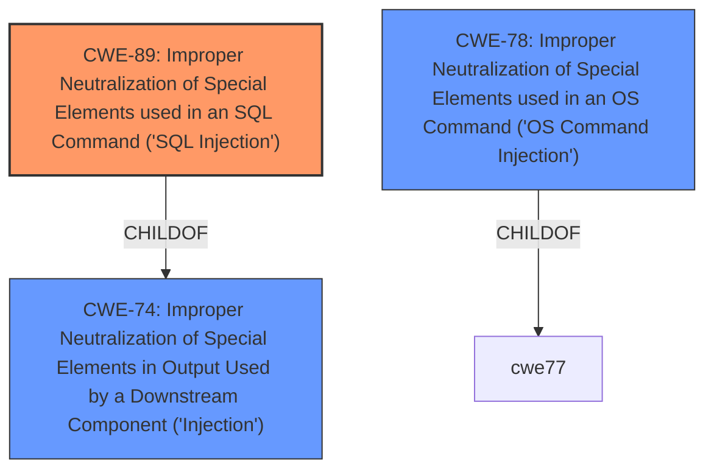

# Analysis for CVE-2020-12271

# Summary
| CWE ID | CWE Name | Confidence | CWE Abstraction Level | CWE Vulnerability Mapping Label | CWE-Vulnerability Mapping Notes |
|---|---|---|---|---|---|
| CWE-89 | Improper Neutralization of Special Elements used in an SQL Command ('SQL Injection') | 1.0 | Base | Allowed | Primary CWE |
| CWE-78 | Improper Neutralization of Special Elements used in an OS Command ('OS Command Injection') | 0.5 | Base | Allowed | Secondary Candidate |

## Evidence and Confidence

*   **Confidence Score:** 0.8
*   **Evidence Strength:** HIGH

## Relationship Analysis
The primary relationship that impacted my decision was the hierarchical relationship between CWE-89 and its parent CWE-74 (Improper Neutralization of Special Elements in Output Used by a Downstream Component ('Injection')). While CWE-74 is a parent, CWE-89 provides a more specific and accurate representation of the **SQL injection** vulnerability. CWE-78 (OS Command Injection) was considered due to the remote code execution aspect, but the root cause is **SQL injection**, making CWE-89 the more appropriate primary classification.



## Vulnerability Chain
The vulnerability chain starts with the **SQL injection** vulnerability (CWE-89). Successful exploitation leads to remote code execution, which can be considered an impact but is not a separate CWE in this context because the **SQL injection** is the root cause that enables it. The **SQL injection** allows for exfiltration of usernames and hashed passwords.

## Summary of Analysis
The primary weakness is clearly a **SQL injection** vulnerability. The vulnerability description explicitly states this, and the CVE Reference Links Content Summary confirms it. The Retriever Results also rank CWE-89 as the top match.

The selection of CWE-89 is strongly based on the provided evidence: "**SQL injection** issue was found in SFOS 17.0, 17.1, 17.5, and 18.0 before 2020-04-25 on Sophos XG Firewall devices, as exploited in the wild in April 2020." The evidence clearly points to **SQL injection** as the root cause.

CWE-78 was considered because the **SQL injection** leads to remote code execution. However, since the initial and primary vulnerability is **SQL injection**, CWE-89 is the more appropriate primary classification.

The chosen CWE is at the optimal level of specificity. While CWE-74 (Improper Neutralization of Special Elements in Output Used by a Downstream Component ('Injection')) is a parent class, CWE-89 (Improper Neutralization of Special Elements used in an SQL Command ('SQL Injection')) is a base variant that directly addresses the specific type of injection occurring in this case.

Relevant CWE Information:

# Enhanced Context (25 CWEs)

## CWE-807: Reliance on Untrusted Inputs in a Security Decision
Was not selected because the primary issue is not related to relying on untrusted inputs for a security decision, but rather the **improper neutralization** of SQL commands.

## CWE-74: Improper Neutralization of Special Elements in Output Used by a Downstream Component ('Injection')
Was not selected as the primary CWE because although it is related to injection, CWE-89 is a more specific child that describes **SQL injection**.

## CWE-73: External Control of File Name or Path
Was not selected because the vulnerability is not related to file name or path manipulation.

## CWE-303: Incorrect Implementation of Authentication Algorithm
Was not selected because the vulnerability is not related to the implementation of an authentication algorithm.

## CWE-345: Insufficient Verification of Data Authenticity
Was not selected because the vulnerability is not related to the verification of data authenticity.

## CWE-41: Improper Resolution of Path Equivalence
Was not selected because the vulnerability is not related to path equivalence issues.

## CWE-184: Incomplete List of Disallowed Inputs
Was not selected because the vulnerability is not primarily about an incomplete list of disallowed inputs.

## CWE-668: Exposure of Resource to Wrong Sphere
Was not selected because the vulnerability is better represented by a more specific weakness than this high-level class.

## CWE-1289: Improper Validation of Unsafe Equivalence in Input
Was not selected because the vulnerability is not about the improper validation of unsafe equivalence in input.

## CWE-138: Improper Neutralization of Special Elements
Was not selected because CWE-89 is a more specific child class for **SQL injection**.

## CWE-22: Improper Limitation of a Pathname to a Restricted Directory ('Path Traversal')
Was not selected because the vulnerability is not related to path traversal.

## CWE-184: Incomplete List of Disallowed Inputs
Was not selected because the vulnerability is not related to an incomplete list of disallowed inputs.

## CWE-23: Relative Path Traversal
Was not selected because the vulnerability is not related to path traversal.

## CWE-116: Improper Encoding or Escaping of Output
Was not selected because the vulnerability is more directly related to **SQL injection** rather than general encoding or escaping issues.

## CWE-863: Incorrect Authorization
Was not selected because the vulnerability is not directly related to incorrect authorization.

## CWE-78: Improper Neutralization of Special Elements used in an OS Command ('OS Command Injection')
Was considered but only listed as a secondary candidate because the **SQL injection** leads to remote code execution, but the root cause is still **SQL injection** (CWE-89).

## CWE-98: Improper Control of Filename for Include/Require Statement in PHP Program ('PHP Remote File Inclusion')
Was not selected because the vulnerability is not related to PHP remote file inclusion.

## CWE-770: Allocation of Resources Without Limits or Throttling
Was not selected because the vulnerability is not related to resource allocation without limits or throttling.

## CWE-22: Improper Limitation of a Pathname to a Restricted Directory ('Path Traversal')
Was not selected because the vulnerability is not related to path traversal.

## CWE-190: Integer Overflow or Wraparound
Was not selected because the vulnerability is not related to integer overflow or wraparound.

## CWE-59: Improper Link Resolution Before File Access ('Link Following')
Was not selected because the vulnerability is not related to link following.

## CWE-434: Unrestricted Upload of File with Dangerous Type
Was not selected because the vulnerability is not related to unrestricted file uploads.

## CWE-88: Improper Neutralization of Argument Delimiters in a Command ('Argument Injection')
Was not selected because the vulnerability is not primarily about argument injection.

## CWE-426: Untrusted Search Path
Was not selected because the vulnerability is not related to untrusted search paths.

## CWE-1284: Improper Validation of Specified Quantity in Input
Was not selected because the vulnerability is not related to improper validation of a specified quantity in input.

# Enhanced Query for CVE-2020-12271

## Vulnerability Description
A **SQL injection** issue was found in SFOS 17.0, 17.1, 17.5, and 18.0 before 2020-04-25 on Sophos XG Firewall devices, as exploited in the wild in April 2020. This affected devices configured with either the administration (HTTPS) service or the User Portal exposed on the WAN zone. A successful attack may have caused remote code execution that exfiltrated usernames and hashed passwords for the local device admin(s), portal admins, and user accounts used for remote access (but not external Active Directory or LDAP passwords)

### Vulnerability Description Key Phrases
- **rootcause:** **SQL injection**
- **impact:** remote code execution
- **product:** Sophos XG Firewall
- **version:** SFOS 17.0 and 17.1 and 17.5 and and 18.0 before 2020-04-25
- **component:** administration (HTTPS) service and User Portal

## CVE Reference Links Content Summary
The provided content is related to CVE-2020-12271, as it describes the exploitation of a zero-day SQL injection vulnerability in Sophos firewall products, which is the vulnerability addressed by the CVE.

**Root cause of vulnerability:**
- A zero-day SQL injection vulnerability in Sophos firewall products allowed attackers to execute remote code.

**Weaknesses/vulnerabilities present:**
- SQL injection vulnerability that allowed attackers to insert malicious commands into the database.
- Lack of proper input sanitization or validation that would have prevented the injection.
- The firewall's operating system did not filter out the SQL injection.
- The firewall stored an MD5 hash of the admin password for backward compatibility.

**Impact of exploitation:**
- Remote code execution on affected firewall devices.
- Installation of a sophisticated malware (Asnarök Trojan) that was designed for data exfiltration.
- Modification of firewall's operating system scripts for persistence.
- Potential theft of sensitive data from the firewall, including:
    - Firewall's license and serial number
    - User email addresses, names, usernames, encrypted passwords, and password hashes
    - VPN user lists and permissions
    - Internal database information such as IP address allocation
    - OS version, CPU information, memory, uptime, and network configuration
- Possible unauthorized access to the firewall by the attacker.

**Attack vectors:**
- Exploitation of the SQL injection vulnerability through the firewall's management interface.
- Network connections to malicious domains for downloading malware components.
- Use of shell scripts to execute commands and modify system files.

**Required attacker capabilities/position:**
- Ability to identify and exploit the SQL injection vulnerability in the Sophos firewall.
- Ability to host malicious files on a remote server.
- Network connectivity to the targeted firewalls.
- Knowledge of Linux shell scripting and ELF binary execution.

## Retriever Results

### Top Combined Results

| Rank | CWE ID | Name | Abstraction | Usage  | Retrievers | Individual Scores |
|------|--------|------|-------------|-------|------------|-------------------|
| 1 | 89 | Improper Neutralization of Special Elements used in an SQL Command ('SQL Injection') | Base | Allowed | alternate_terms | 1.000 |
| 2 | 22 | Improper Limitation of a Pathname to a Restricted Directory ('Path Traversal') | Base | Allowed | sparse | 0.474 |
| 3 | 287 | Improper Authentication | Class | Discouraged | sparse | 0.467 |
| 4 | 20 | Improper Input Validation | Class | Discouraged | sparse | 0.454 |
| 5 | 284 | Improper Access Control | Pillar | Discouraged | sparse | 0.446 |
| 6 | 78 | Improper Neutralization of Special Elements used in an OS Command ('OS Command Injection') | Base | Allowed | dense | 0.581 |
| 7 | 73 | External Control of File Name or Path | Base | Allowed | graph | 0.003 |
| 8 | 522 | Insufficiently Protected Credentials | Class | Allowed-with-Review | sparse | 0.446 |
| 9 | 532 | Insertion of Sensitive Information into Log File | Base | Allowed | sparse | 0.445 |
| 10 | 306 | Missing Authentication for Critical Function | Base | Allowed | sparse | 0.442 |


# Complete CWE Specifications


## CWE-89: Improper Neutralization of Special Elements used in an SQL Command ('SQL Injection')
**Abstraction:** Base
**Status:** Stable

### Description
The product constructs all or part of an SQL command using externally-influenced input from an upstream component, but it does not neutralize or incorrectly neutralizes special elements that could modify the intended SQL command when it is sent to a downstream component. Without sufficient removal or quoting of SQL syntax in user-controllable inputs, the generated SQL query can cause those inputs to be interpreted as SQL instead of ordinary user data.

### Extended Description
Not provided

### Alternative Terms
SQL injection: a common attack-oriented phrase
SQLi: a common abbreviation for "SQL injection"

### Relationships
ChildOf -> CWE-943
ChildOf -> CWE-74

### Mapping Guidance
**Usage:** Allowed
**Rationale:** This CWE entry is at the Base level of abstraction, which is a preferred level of abstraction for mapping to the root causes of vulnerabilities.
**Comments:** Carefully read both the name and description to ensure that this mapping is an appropriate fit. Do not try to 'force' a mapping to a lower-level Base/Variant simply to comply with this preferred level of abstraction.
**Reasons:**
- Acceptable-Use


### Additional Notes
**[Relationship]** SQL injection can be resultant from special character mismanagement, MAID, or denylist/allowlist problems. It can be primary to authentication errors.


### Observed Examples
- **CVE-2023-32530:** SQL injection in security product dashboard using crafted certificate fields
- **CVE-2021-42258:** SQL injection in time and billing software, as exploited in the wild per CISA KEV.
- **CVE-2021-27101:** SQL injection in file-transfer system via a crafted Host header, as exploited in the wild per CISA KEV.


## CWE-22: Improper Limitation of a Pathname to a Restricted Directory ('Path Traversal')
**Abstraction:** Base
**Status:** Stable

### Description
The product uses external input to construct a pathname that is intended to identify a file or directory that is located underneath a restricted parent directory, but the product does not properly neutralize special elements within the pathname that can cause the pathname to resolve to a location that is outside of the restricted directory.

### Extended Description


Many file operations are intended to take place within a restricted directory. By using special elements such as ".." and "/" separators, attackers can escape outside of the restricted location to access files or directories that are elsewhere on the system. One of the most common special elements is the "../" sequence, which in most modern operating systems is interpreted as the parent directory of the current location. This is referred to as relative path traversal. Path traversal also covers the use of absolute pathnames such as "/usr/local/bin" to access unexpected files. This is referred to as absolute path traversal.


### Alternative Terms
Directory traversal
Path traversal: "Path traversal" is preferred over "directory traversal," but both terms are attack-focused.

### Relationships
ChildOf -> CWE-706
ChildOf -> CWE-706
ChildOf -> CWE-668

### Mapping Guidance
**Usage:** Allowed
**Rationale:** This CWE entry is at the Base level of abstraction, which is a preferred level of abstraction for mapping to the root causes of vulnerabilities.
**Comments:** Carefully read both the name and description to ensure that this mapping is an appropriate fit. Do not try to 'force' a mapping to a lower-level Base/Variant simply to comply with this preferred level of abstraction.
**Reasons:**
- Acceptable-Use


### Additional Notes
**[Other]** In many programming languages, the injection of a null byte (the 0 or NUL) may allow an attacker to truncate a generated filename to apply to a wider range of files. For example, the product may add ".txt" to any pathname, thus limiting the attacker to text files, but a null injection may effectively remove this restriction.

**[Relationship]** Pathname equivalence can be regarded as a type of canonicalization error.

**[Relationship]** Some pathname equivalence issues are not directly related to directory traversal, rather are used to bypass security-relevant checks for whether a file/directory can be accessed by the attacker (e.g. a trailing "/" on a filename could bypass access rules that don't expect a trailing /, causing a server to provide the file when it normally would not).

**[Terminology]** 

Like other weaknesses, terminology is often based on the types of manipulations used, instead of the underlying weaknesses. Some people use "directory traversal" only to refer to the injection of ".." and equivalent sequences whose specific meaning is to traverse directories.


Other variants like "absolute pathname" and "drive letter" have the *effect* of directory traversal, but some people may not call it such, since it doesn't involve ".." or equivalent.


**[Research Gap]** Many variants of path traversal attacks are probably under-studied with respect to root cause. CWE-790 and CWE-182 begin to cover part of this gap.

**[Research Gap]** 

Incomplete diagnosis or reporting of vulnerabilities can make it difficult to know which variant is affected. For example, a researcher might say that "..\" is vulnerable, but not test "../" which may also be vulnerable.


Any combination of directory separators ("/", "\", etc.) and numbers of "." (e.g. "....") can produce unique variants; for example, the "//../" variant is not listed (CVE-2004-0325). See this entry's children and lower-level descendants.


### Observed Examples
- **CVE-2024-37032:** Large language model (LLM) management tool does not validate the format of a digest value (CWE-1287) from a private, untrusted model registry, enabling relative path traversal (CWE-23), a.k.a. Probllama
- **CVE-2024-4315:** Chain: API for text generation using Large Language Models (LLMs) does not include the "\" Windows folder separator in its denylist (CWE-184) when attempting to prevent Local File Inclusion via path traversal (CWE-22), allowing deletion of arbitrary files on Windows systems.
- **CVE-2022-45918:** Chain: a learning management tool debugger uses external input to locate previous session logs (CWE-73) and does not properly validate the given path (CWE-20), allowing for filesystem path traversal using "../" sequences (CWE-24)


## CWE-287: Improper Authentication
**Abstraction:** Class
**Status:** Draft

### Description
When an actor claims to have a given identity, the product does not prove or insufficiently proves that the claim is correct.

### Extended Description
Not provided

### Alternative Terms
authentification: An alternate term is "authentification", which appears to be most commonly used by people from non-English-speaking countries.
AuthN: "AuthN" is typically used as an abbreviation of "authentication" within the web application security community. It is also distinct from "AuthZ," which is an abbreviation of "authorization." The use of "Auth" as an abbreviation is discouraged, since it could be used for either authentication or authorization.
AuthC: "AuthC" is used as an abbreviation of "authentication," but it appears to used less frequently than "AuthN."

### Relationships
ChildOf -> CWE-284
ChildOf -> CWE-284

### Mapping Guidance
**Usage:** Discouraged
**Rationale:** This CWE entry might be misused when lower-level CWE entries are likely to be applicable. It is a level-1 Class (i.e., a child of a Pillar).
**Comments:** Consider children or descendants, beginning with CWE-1390: Weak Authentication or CWE-306: Missing Authentication for Critical Function.
**Reasons:**
- Frequent Misuse
**Suggested Alternatives:**
- CWE-1390: Weak Authentication
- CWE-306: Missing Authentication for Critical Function


### Additional Notes
**[Relationship]** This can be resultant from SQL injection vulnerabilities and other issues.

**[Maintenance]** The Taxonomy_Mappings to ISA/IEC 62443 were added in CWE 4.10, but they are still under review and might change in future CWE versions. These draft mappings were performed by members of the "Mapping CWE to 62443" subgroup of the CWE-CAPEC ICS/OT Special Interest Group (SIG), and their work is incomplete as of CWE 4.10. The mappings are included to facilitate discussion and review by the broader ICS/OT community, and they are likely to change in future CWE versions.


### Observed Examples
- **CVE-2022-35248:** Chat application skips validation when Central Authentication Service (CAS) is enabled, effectively removing the second factor from two-factor authentication
- **CVE-2022-36436:** Python-based authentication proxy does not enforce password authentication during the initial handshake, allowing the client to bypass authentication by specifying a 'None' authentication type.
- **CVE-2022-30034:** Chain: Web UI for a Python RPC framework does not use regex anchors to validate user login emails (CWE-777), potentially allowing bypass of OAuth (CWE-1390).


## CWE-20: Improper Input Validation
**Abstraction:** Class
**Status:** Stable

### Description
The product receives input or data, but it does
        not validate or incorrectly validates that the input has the
        properties that are required to process the data safely and
        correctly.

### Extended Description


Input validation is a frequently-used technique for checking potentially dangerous inputs in order to ensure that the inputs are safe for processing within the code, or when communicating with other components. When software does not validate input properly, an attacker is able to craft the input in a form that is not expected by the rest of the application. This will lead to parts of the system receiving unintended input, which may result in altered control flow, arbitrary control of a resource, or arbitrary code execution.


Input validation is not the only technique for processing input, however. Other techniques attempt to transform potentially-dangerous input into something safe, such as filtering (CWE-790) - which attempts to remove dangerous inputs - or encoding/escaping (CWE-116), which attempts to ensure that the input is not misinterpreted when it is included in output to another component. Other techniques exist as well (see CWE-138 for more examples.)


Input validation can be applied to:


  - raw data - strings, numbers, parameters, file contents, etc.

  - metadata - information about the raw data, such as headers or size

Data can be simple or structured. Structured data can be composed of many nested layers, composed of combinations of metadata and raw data, with other simple or structured data.

Many properties of raw data or metadata may need to be validated upon entry into the code, such as:


  - specified quantities such as size, length, frequency, price, rate, number of operations, time, etc.

  - implied or derived quantities, such as the actual size of a file instead of a specified size

  - indexes, offsets, or positions into more complex data structures

  - symbolic keys or other elements into hash tables, associative arrays, etc.

  - well-formedness, i.e. syntactic correctness - compliance with expected syntax 

  - lexical token correctness - compliance with rules for what is treated as a token

  - specified or derived type - the actual type of the input (or what the input appears to be)

  - consistency - between individual data elements, between raw data and metadata, between references, etc.

  - conformance to domain-specific rules, e.g. business logic 

  - equivalence - ensuring that equivalent inputs are treated the same

  - authenticity, ownership, or other attestations about the input, e.g. a cryptographic signature to prove the source of the data

Implied or derived properties of data must often be calculated or inferred by the code itself. Errors in deriving properties may be considered a contributing factor to improper input validation. 

Note that "input validation" has very different meanings to different people, or within different classification schemes. Caution must be used when referencing this CWE entry or mapping to it. For example, some weaknesses might involve inadvertently giving control to an attacker over an input when they should not be able to provide an input at all, but sometimes this is referred to as input validation.


Finally, it is important to emphasize that the distinctions between input validation and output escaping are often blurred, and developers must be careful to understand the difference, including how input validation is not always sufficient to prevent vulnerabilities, especially when less stringent data types must be supported, such as free-form text. Consider a SQL injection scenario in which a person's last name is inserted into a query. The name "O'Reilly" would likely pass the validation step since it is a common last name in the English language. However, this valid name cannot be directly inserted into the database because it contains the "'" apostrophe character, which would need to be escaped or otherwise transformed. In this case, removing the apostrophe might reduce the risk of SQL injection, but it would produce incorrect behavior because the wrong name would be recorded.


### Alternative Terms
None

### Relationships
ChildOf -> CWE-707
PeerOf -> CWE-345
CanPrecede -> CWE-22
CanPrecede -> CWE-41
CanPrecede -> CWE-74
CanPrecede -> CWE-119
CanPrecede -> CWE-770

### Mapping Guidance
**Usage:** Discouraged
**Rationale:** CWE-20 is commonly misused in low-information vulnerability reports when lower-level CWEs could be used instead, or when more details about the vulnerability are available [REF-1287]. It is not useful for trend analysis. It is also a level-1 Class (i.e., a child of a Pillar).
**Comments:** Consider lower-level children such as Improper Use of Validation Framework (CWE-1173) or improper validation involving specific types or properties of input such as Specified Quantity (CWE-1284); Specified Index, Position, or Offset (CWE-1285); Syntactic Correctness (CWE-1286); Specified Type (CWE-1287); Consistency within Input (CWE-1288); or Unsafe Equivalence (CWE-1289).
**Reasons:**
- Frequent Misuse
**Suggested Alternatives:**
- CWE-1284: Specified Quantity
- CWE-1285: Specified Index, Position, or Offset
- CWE-1286: Syntactic Correctness
- CWE-1287: Specified Type
- CWE-1288: Consistency within Input
- CWE-1289: Unsafe Equivalence
- CWE-116: Improper Encoding or Escaping of Output


### Additional Notes
**[Relationship]** 

CWE-116 and CWE-20 have a close association because, depending on the nature of the structured message, proper input validation can indirectly prevent special characters from changing the meaning of a structured message. For example, by validating that a numeric ID field should only contain the 0-9 characters, the programmer effectively prevents injection attacks.


**[Maintenance]** As of 2020, this entry is used more often than preferred, and it is a source of frequent confusion. It is being actively modified for CWE 4.1 and subsequent versions.

**[Maintenance]** Concepts such as validation, data transformation, and neutralization are being refined, so relationships between CWE-20 and other entries such as CWE-707 may change in future versions, along with an update to the Vulnerability Theory document.

**[Maintenance]** Input validation - whether missing or incorrect - is such an essential and widespread part of secure development that it is implicit in many different weaknesses. Traditionally, problems such as buffer overflows and XSS have been classified as input validation problems by many security professionals. However, input validation is not necessarily the only protection mechanism available for avoiding such problems, and in some cases it is not even sufficient. The CWE team has begun capturing these subtleties in chains within the Research Concepts view (CWE-1000), but more work is needed.

**[Terminology]** 

The "input validation" term is extremely common, but it is used in many different ways. In some cases its usage can obscure the real underlying weakness or otherwise hide chaining and composite relationships.


Some people use "input validation" as a general term that covers many different neutralization techniques for ensuring that input is appropriate, such as filtering, canonicalization, and escaping. Others use the term in a more narrow context to simply mean "checking if an input conforms to expectations without changing it." CWE uses this more narrow interpretation.


### Observed Examples
- **CVE-2024-37032:** Large language model (LLM) management tool does not validate the format of a digest value (CWE-1287) from a private, untrusted model registry, enabling relative path traversal (CWE-23), a.k.a. Probllama
- **CVE-2022-45918:** Chain: a learning management tool debugger uses external input to locate previous session logs (CWE-73) and does not properly validate the given path (CWE-20), allowing for filesystem path traversal using "../" sequences (CWE-24)
- **CVE-2021-30860:** Chain: improper input validation (CWE-20) leads to integer overflow (CWE-190) in mobile OS, as exploited in the wild per CISA KEV.


## CWE-284: Improper Access Control
**Abstraction:** Pillar
**Status:** Incomplete

### Description
The product does not restrict or incorrectly restricts access to a resource from an unauthorized actor.

### Extended Description


Access control involves the use of several protection mechanisms such as:


  - Authentication (proving the identity of an actor)

  - Authorization (ensuring that a given actor can access a resource), and

  - Accountability (tracking of activities that were performed)

When any mechanism is not applied or otherwise fails, attackers can compromise the security of the product by gaining privileges, reading sensitive information, executing commands, evading detection, etc.

There are two distinct behaviors that can introduce access control weaknesses:


  - Specification: incorrect privileges, permissions, ownership, etc. are explicitly specified for either the user or the resource (for example, setting a password file to be world-writable, or giving administrator capabilities to a guest user). This action could be performed by the program or the administrator.

  - Enforcement: the mechanism contains errors that prevent it from properly enforcing the specified access control requirements (e.g., allowing the user to specify their own privileges, or allowing a syntactically-incorrect ACL to produce insecure settings). This problem occurs within the program itself, in that it does not actually enforce the intended security policy that the administrator specifies.


### Alternative Terms
Authorization: The terms "access control" and "authorization" are often used interchangeably, although many people have distinct definitions. The CWE usage of "access control" is intended as a general term for the various mechanisms that restrict which users can access which resources, and "authorization" is more narrowly defined. It is unlikely that there will be community consensus on the use of these terms.

### Relationships
None

### Mapping Guidance
**Usage:** Discouraged
**Rationale:** CWE-284 is extremely high-level, a Pillar. Its name, "Improper Access Control," is often misused in low-information vulnerability reports [REF-1287] or by active use of the OWASP Top Ten, such as "A01:2021-Broken Access Control". It is not useful for trend analysis.
**Comments:** Consider using descendants of CWE-284 that are more specific to the kind of access control involved, such as those involving authorization (Missing Authorization (CWE-862), Incorrect Authorization (CWE-863), Incorrect Permission Assignment for Critical Resource (CWE-732), etc.); authentication (Missing Authentication (CWE-306) or Weak Authentication (CWE-1390)); Incorrect User Management (CWE-286); Improper Restriction of Communication Channel to Intended Endpoints (CWE-923); etc.
**Reasons:**
- Frequent Misuse
- Abstraction
**Suggested Alternatives:**
- CWE-862: Missing Authorization
- CWE-863: Incorrect Authorization
- CWE-732: Incorrect Permission Assignment for Critical Resource
- CWE-306: Missing Authentication
- CWE-1390: Weak Authentication
- CWE-923: Improper Restriction of Communication Channel to Intended Endpoints


### Additional Notes
**[Maintenance]** 

This entry needs more work. Possible sub-categories include:


  - Trusted group includes undesired entities (partially covered by CWE-286)

  - Group can perform undesired actions

  - ACL parse error does not fail closed


### Observed Examples
- **CVE-2022-24985:** A form hosting website only checks the session authentication status for a single form, making it possible to bypass authentication when there are multiple forms
- **CVE-2022-29238:** Access-control setting in web-based document collaboration tool is not properly implemented by the code, which prevents listing hidden directories but does not prevent direct requests to files in those directories.
- **CVE-2022-23607:** Python-based HTTP library did not scope cookies to a particular domain such that "supercookies" could be sent to any domain on redirect


## CWE-78: Improper Neutralization of Special Elements used in an OS Command ('OS Command Injection')
**Abstraction:** Base
**Status:** Stable

### Description
The product constructs all or part of an OS command using externally-influenced input from an upstream component, but it does not neutralize or incorrectly neutralizes special elements that could modify the intended OS command when it is sent to a downstream component.

### Extended Description


This weakness can lead to a vulnerability in environments in which the attacker does not have direct access to the operating system, such as in web applications. Alternately, if the weakness occurs in a privileged program, it could allow the attacker to specify commands that normally would not be accessible, or to call alternate commands with privileges that the attacker does not have. The problem is exacerbated if the compromised process does not follow the principle of least privilege, because the attacker-controlled commands may run with special system privileges that increases the amount of damage.


There are at least two subtypes of OS command injection:


  - The application intends to execute a single, fixed program that is under its own control. It intends to use externally-supplied inputs as arguments to that program. For example, the program might use system("nslookup [HOSTNAME]") to run nslookup and allow the user to supply a HOSTNAME, which is used as an argument. Attackers cannot prevent nslookup from executing. However, if the program does not remove command separators from the HOSTNAME argument, attackers could place the separators into the arguments, which allows them to execute their own program after nslookup has finished executing.

  - The application accepts an input that it uses to fully select which program to run, as well as which commands to use. The application simply redirects this entire command to the operating system. For example, the program might use "exec([COMMAND])" to execute the [COMMAND] that was supplied by the user. If the COMMAND is under attacker control, then the attacker can execute arbitrary commands or programs. If the command is being executed using functions like exec() and CreateProcess(), the attacker might not be able to combine multiple commands together in the same line.

From a weakness standpoint, these variants represent distinct programmer errors. In the first variant, the programmer clearly intends that input from untrusted parties will be part of the arguments in the command to be executed. In the second variant, the programmer does not intend for the command to be accessible to any untrusted party, but the programmer probably has not accounted for alternate ways in which malicious attackers can provide input.

### Alternative Terms
Shell injection
Shell metacharacters
OS Command Injection

### Relationships
ChildOf -> CWE-77
ChildOf -> CWE-74
ChildOf -> CWE-77
ChildOf -> CWE-77
CanAlsoBe -> CWE-88

### Mapping Guidance
**Usage:** Allowed
**Rationale:** This CWE entry is at the Base level of abstraction, which is a preferred level of abstraction for mapping to the root causes of vulnerabilities.
**Comments:** Carefully read both the name and description to ensure that this mapping is an appropriate fit. Do not try to 'force' a mapping to a lower-level Base/Variant simply to comply with this preferred level of abstraction.
**Reasons:**
- Acceptable-Use


### Additional Notes
**[Terminology]** The "OS command injection" phrase carries different meanings to different people. For some people, it only refers to cases in which the attacker injects command separators into arguments for an application-controlled program that is being invoked. For some people, it refers to any type of attack that can allow the attacker to execute OS commands of their own choosing. This usage could include untrusted search path weaknesses (CWE-426) that cause the application to find and execute an attacker-controlled program. Further complicating the issue is the case when argument injection (CWE-88) allows alternate command-line switches or options to be inserted into the command line, such as an "-exec" switch whose purpose may be to execute the subsequent argument as a command (this -exec switch exists in the UNIX "find" command, for example). In this latter case, however, CWE-88 could be regarded as the primary weakness in a chain with CWE-78.

**[Research Gap]** More investigation is needed into the distinction between the OS command injection variants, including the role with argument injection (CWE-88). Equivalent distinctions may exist in other injection-related problems such as SQL injection.


### Observed Examples
- **CVE-2020-10987:** OS command injection in Wi-Fi router, as exploited in the wild per CISA KEV.
- **CVE-2020-10221:** Template functionality in network configuration management tool allows OS command injection, as exploited in the wild per CISA KEV.
- **CVE-2020-9054:** Chain: improper input validation (CWE-20) in username parameter, leading to OS command injection (CWE-78), as exploited in the wild per CISA KEV.


## CWE-73: External Control of File Name or Path
**Abstraction:** Base
**Status:** Draft

### Description
The product allows user input to control or influence paths or file names that are used in filesystem operations.

### Extended Description


This could allow an attacker to access or modify system files or other files that are critical to the application.


Path manipulation errors occur when the following two conditions are met:

```
		1. An attacker can specify a path used in an operation on the filesystem.
		2. By specifying the resource, the attacker gains a capability that would not otherwise be permitted.
```
For example, the program may give the attacker the ability to overwrite the specified file or run with a configuration controlled by the attacker.

### Alternative Terms
None

### Relationships
ChildOf -> CWE-642
ChildOf -> CWE-610
ChildOf -> CWE-20
CanPrecede -> CWE-22
CanPrecede -> CWE-41
CanPrecede -> CWE-98
CanPrecede -> CWE-434
CanPrecede -> CWE-59

### Mapping Guidance
**Usage:** Allowed
**Rationale:** This CWE entry is at the Base level of abstraction, which is a preferred level of abstraction for mapping to the root causes of vulnerabilities.
**Comments:** Carefully read both the name and description to ensure that this mapping is an appropriate fit. Do not try to 'force' a mapping to a lower-level Base/Variant simply to comply with this preferred level of abstraction.
**Reasons:**
- Acceptable-Use


### Additional Notes
**[Maintenance]** CWE-114 is a Class, but it is listed a child of CWE-73 in view 1000. This suggests some abstraction problems that should be resolved in future versions.

**[Relationship]** 

The external control of filenames can be the primary link in chains with other file-related weaknesses, as seen in the CanPrecede relationships. This is because software systems use files for many different purposes: to execute programs, load code libraries, to store application data, to store configuration settings, record temporary data, act as signals or semaphores to other processes, etc.


However, those weaknesses do not always require external control. For example, link-following weaknesses (CWE-59) often involve pathnames that are not controllable by the attacker at all.


The external control can be resultant from other issues. For example, in PHP applications, the register_globals setting can allow an attacker to modify variables that the programmer thought were immutable, enabling file inclusion (CWE-98) and path traversal (CWE-22). Operating with excessive privileges (CWE-250) might allow an attacker to specify an input filename that is not directly readable by the attacker, but is accessible to the privileged program. A buffer overflow (CWE-119) might give an attacker control over nearby memory locations that are related to pathnames, but were not directly modifiable by the attacker.


### Observed Examples
- **CVE-2022-45918:** Chain: a learning management tool debugger uses external input to locate previous session logs (CWE-73) and does not properly validate the given path (CWE-20), allowing for filesystem path traversal using "../" sequences (CWE-24)
- **CVE-2008-5748:** Chain: external control of values for user's desired language and theme enables path traversal.
- **CVE-2008-5764:** Chain: external control of user's target language enables remote file inclusion.


## CWE-522: Insufficiently Protected Credentials
**Abstraction:** Class
**Status:** Incomplete

### Description
The product transmits or stores authentication credentials, but it uses an insecure method that is susceptible to unauthorized interception and/or retrieval.

### Extended Description
Not provided

### Alternative Terms
None

### Relationships
ChildOf -> CWE-1390
ChildOf -> CWE-287
ChildOf -> CWE-668

### Mapping Guidance
**Usage:** Allowed-with-Review
**Rationale:** This CWE entry is a Class and might have Base-level children that would be more appropriate
**Comments:** Examine children of this entry to see if there is a better fit
**Reasons:**
- Abstraction


### Observed Examples
- **CVE-2022-30018:** A messaging platform serializes all elements of User/Group objects, making private information available to adversaries
- **CVE-2022-29959:** Initialization file contains credentials that can be decoded using a "simple string transformation"
- **CVE-2022-35411:** Python-based RPC framework enables pickle functionality by default, allowing clients to unpickle untrusted data.


## CWE-532: Insertion of Sensitive Information into Log File
**Abstraction:** Base
**Status:** Incomplete

### Description
The product writes sensitive information to a log file.

### Extended Description
Not provided

### Alternative Terms
None

### Relationships
ChildOf -> CWE-538
ChildOf -> CWE-200

### Mapping Guidance
**Usage:** Allowed
**Rationale:** This CWE entry is at the Base level of abstraction, which is a preferred level of abstraction for mapping to the root causes of vulnerabilities.
**Comments:** Carefully read both the name and description to ensure that this mapping is an appropriate fit. Do not try to 'force' a mapping to a lower-level Base/Variant simply to comply with this preferred level of abstraction.
**Reasons:**
- Acceptable-Use


### Observed Examples
- **CVE-2017-9615:** verbose logging stores admin credentials in a world-readable log file
- **CVE-2018-1999036:** SSH password for private key stored in build log


## CWE-306: Missing Authentication for Critical Function
**Abstraction:** Base
**Status:** Draft

### Description
The product does not perform any authentication for functionality that requires a provable user identity or consumes a significant amount of resources.

### Extended Description
Not provided

### Alternative Terms
None

### Relationships
ChildOf -> CWE-287
ChildOf -> CWE-287

### Mapping Guidance
**Usage:** Allowed
**Rationale:** This CWE entry is at the Base level of abstraction, which is a preferred level of abstraction for mapping to the root causes of vulnerabilities.
**Comments:** Carefully read both the name and description to ensure that this mapping is an appropriate fit. Do not try to 'force' a mapping to a lower-level Base/Variant simply to comply with this preferred level of abstraction.
**Reasons:**
- Acceptable-Use


### Observed Examples
- **CVE-2022-31260:** Chain: a digital asset management program has an undisclosed backdoor in the legacy version of a PHP script (CWE-912) that could allow an unauthenticated user to export metadata (CWE-306)
- **CVE-2022-29951:** TCP-based protocol in Programmable Logic Controller (PLC) has no authentication.
- **CVE-2022-29952:** Condition Monitor firmware uses a protocol that does not require authentication.

