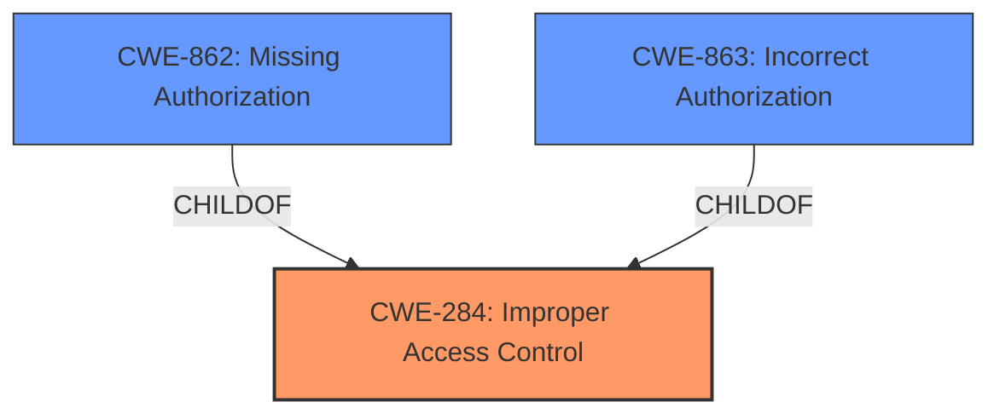

# Raw Analyzer Response for CVE-2020-12290

# Summary
| CWE ID | CWE Name | Confidence | CWE Abstraction Level | CWE Vulnerability Mapping Label | CWE-Vulnerability Mapping Notes |
|---|---|---|---|---|---|
| CWE-284 | Improper Access Control | 0.75 | Pillar | Discouraged | The weakness is due to **Improper access control** in Intel(R) Thunderbolt(TM) controllers that may allow an authenticated user to potentially enable denial of service via local access. |

## Evidence and Confidence

*   **Confidence Score:** 0.75
*   **Evidence Strength:** MEDIUM

## Relationship Analysis
The primary identified weakness is CWE-284, "Improper Access Control," which is a high-level Pillar. Given the limited information, it's challenging to pinpoint a more specific Base or Variant CWE. The relationships between CWE-284 and its potential children (like CWE-862, CWE-863) were considered, but there's insufficient detail to determine if the vulnerability is due to missing or incorrect authorization. Therefore, the decision remains at the Pillar level due to lack of specificity.

## Vulnerability Chain
The vulnerability chain starts with the **improper access control**, leading to a potential denial of service. The authenticated user is the attacker, with local access to Intel(R) Thunderbolt(TM) controllers.
  - Root Cause: **Improper Access Control**
  - Impact: Denial of Service

## Summary of Analysis
Initial analysis pointed towards **Improper Access Control**. The retriever results also included CWEs related to access control and privilege management.

The final decision to assign CWE-284 is based on the provided vulnerability description, which clearly states **"Improper access control"** as the root cause. The CVE reference links content summary reinforces this by explicitly stating "Improper access control" as the root cause and weakness.

The MITRE mapping guidance for CWE-284 discourages its use due to its high-level nature. However, without more specific information about the exact mechanism of **improper access control**, selecting a more specific CWE would be speculative. Therefore, CWE-284 is selected as the most appropriate, albeit high-level, representation of the vulnerability based on the available evidence.

Relevant CWE Information:

# Enhanced Context (25 CWEs)

## CWE-667: Improper Locking
**Abstraction Level**: Class
**Similarity Score**: 0.76
**Source**: dense

**Description**:
The product does not properly acquire or release a lock on a resource, leading to unexpected resource state changes and behaviors.

**Mapping Guidance**:
- Usage: Allowed-with-Review
- Rationale: This CWE entry is a Class and might have Base-level children that would be more appropriate
*Not Selected*: This doesn't fit the vulnerability description as it describes issues with locking mechanisms, not access control.

## CWE-653: Improper Isolation or Compartmentalization
**Abstraction Level**: Class
**Similarity Score**: 0.76
**Source**: dense

**Description**:
The product does not properly compartmentalize or isolate functionality, processes, or resources that require different privilege levels, rights, or permissions.

**Mapping Guidance**:
- Usage: Allowed
- Rationale: This CWE entry is at the Base level of abstraction, which is a preferred level of abstraction for mapping to the root causes of vulnerabilities.
*Not Selected*: While related to security boundaries, the description focuses on access control, making CWE-284 more relevant.

## CWE-691: Insufficient Control Flow Management
**Abstraction Level**: Pillar
**Similarity Score**: 0.75
**Source**: dense

**Description**:
The code does not sufficiently manage its control flow during execution, creating conditions in which the control flow can be modified in unexpected ways.

**Mapping Guidance**:
- Usage: Discouraged
- Rationale: This CWE entry is extremely high-level, a Pillar. However, classification research is limited for weaknesses of this type, so there can be gaps or organizational difficulties within CWE that force use of this weakness, even at such a high level of abstraction.
*Not Selected*: This is a high-level CWE and the vulnerability is more specifically related to access control.

## CWE-274: Improper Handling of Insufficient Privileges
**Abstraction Level**: Base
**Similarity Score**: 0.75
**Source**: dense

**Description**:
The product does not handle or incorrectly handles when it has insufficient privileges to perform an operation, leading to resultant weaknesses.

**Mapping Guidance**:
- Usage: Discouraged
- Rationale: This CWE entry could be deprecated in a future version of CWE.
*Not Selected*: The vulnerability description does not mention how the product handles insufficient privileges, so this CWE is not a good fit.

## CWE-664: Improper Control of a Resource Through its Lifetime
**Abstraction Level**: Pillar
**Similarity Score**: 0.75
**Source**: dense

**Description**:
The product does not maintain or incorrectly maintains control over a resource throughout its lifetime of creation, use, and release.

**Mapping Guidance**:
- Usage: Discouraged
- Rationale: This CWE entry is high-level when lower-level children are available.
*Not Selected*: This is a very general CWE, and access control is more relevant based on the description.

## CWE-668: Exposure of Resource to Wrong Sphere
**Abstraction Level**: Class
**Similarity Score**: 0.75
**Source**: dense

**Description**:
The product exposes a resource to the wrong control sphere, providing unintended actors with inappropriate access to the resource.

**Mapping Guidance**:
- Usage: Discouraged
- Rationale: CWE-668 is high-level and is often misused as a catch-all when lower-level CWE IDs might be applicable. It is sometimes used for low-information vulnerability reports [REF-1287]. It is a level-1 Class (i.e., a child of a Pillar). It is not useful for trend analysis.
*Not Selected*: While related to access control, it is high-level and the given vulnerability description does not specify a resource being exposed to the wrong sphere.

## CWE-41: Improper Resolution of Path Equivalence
**Abstraction Level**: Base
**Similarity Score**: 0.75
**Source**: dense

**Description**:
The product is vulnerable to file system contents disclosure through path equivalence. Path equivalence involves the use of special characters in file and directory names. The associated manipulations are intended to generate multiple names for the same object.

**Mapping Guidance**:
- Usage: Allowed
- Rationale: This CWE entry is at the Base level of abstraction, which is a preferred level of abstraction for mapping to the root causes of vulnerabilities.
*Not Selected*: This CWE describes path equivalence issues which is unrelated to the vulnerability description.

## CWE-754: Improper Check for Unusual or Exceptional Conditions
**Abstraction Level**: Class
**Similarity Score**: 0.74
**Source**: dense

**Description**:
The product does not check or incorrectly checks for unusual or exceptional conditions that are not expected to occur frequently during day to day operation of the product.

**Mapping Guidance**:
- Usage: Allowed-with-Review
- Rationale: This CWE entry is a Class and might have Base-level children that would be more appropriate
*Not Selected*: This CWE relates to checking for unusual conditions, which is not described in the vulnerability.

## CWE-1220: Insufficient Granularity of Access Control
**Abstraction Level**: Base
**Similarity Score**: 0.74
**Source**: dense

**Description**:
The product implements access controls via a policy or other feature with the intention to disable or restrict accesses (reads and/or writes) to assets in a system from untrusted agents. However, implemented access controls lack required granularity, which renders the control policy too broad because it allows accesses from unauthorized agents to the security-sensitive assets.

**Mapping Guidance**:
- Usage: Allowed
- Rationale: This CWE entry is at the Base level of abstraction, which is a preferred level of abstraction for mapping to the root causes of vulnerabilities.
*Not Selected*: Although related to access control, there is no information about granularity in the description

## CWE-280: Improper Handling of Insufficient Permissions or Privileges
**Abstraction Level**: Base
**Similarity Score**: 0.74
**Source**: dense

**Description**:
The product does not handle or incorrectly handles when it has insufficient privileges to access resources or functionality as specified by their permissions. This may cause it to follow unexpected code paths that may leave the product in an invalid state.

**Mapping Guidance**:
- Usage: Allowed
- Rationale: This CWE entry is at the Base level of abstraction, which is a preferred level