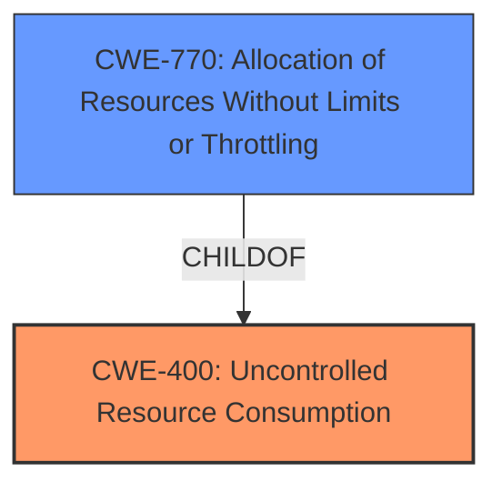

# Analysis for CVE-2020-12296

# Summary
| CWE ID | CWE Name | Confidence | CWE Abstraction Level | CWE Vulnerability Mapping Label | CWE-Vulnerability Mapping Notes |
|---|---|---|---|---|---|
| CWE-400 | Uncontrolled Resource Consumption | 0.9 | Class | Primary | Discouraged |
| CWE-770 | Allocation of Resources Without Limits or Throttling | 0.7 | Base | Secondary | Allowed |

## Evidence and Confidence

*   **Confidence Score:** 0.8
*   **Evidence Strength:** HIGH

## Relationship Analysis
The primary CWE selected is CWE-400, "Uncontrolled Resource Consumption," which is a Class-level CWE. A more specific potential child is CWE-770, "Allocation of Resources Without Limits or Throttling," which is at the Base level. Although the description mentions "uncontrolled resource consumption," the underlying issue seems to be related to the allocation of resources without proper limits.

## Vulnerability Chain
The vulnerability chain starts with the **uncontrolled resource consumption**, which directly leads to the denial of service.

## Summary of Analysis
The initial analysis identified CWE-400 as a strong candidate due to the "Uncontrolled resource consumption" phrase in the vulnerability description. The "CWE for similar CVE Descriptions" also listed CWE-400 as a top CWE. The retriever results also listed CWE-400 as the top candidate.

The final decision is based on the evidence of "Uncontrolled resource consumption" and the resulting denial of service. While CWE-400 is a Class-level CWE and is generally discouraged, it is the most appropriate high-level classification. A more specific issue could be the allocation of resources without proper limits or throttling (CWE-770), which is considered as a secondary candidate.

Relevant CWE Information:

# Enhanced Context (25 CWEs)

## CWE-664: Improper Control of a Resource Through its Lifetime
**Abstraction Level**: Pillar
**Similarity Score**: 0.78
**Source**: dense

**Description**:
The product does not maintain or incorrectly maintains control over a resource throughout its lifetime of creation, use, and release.

**Mapping Guidance**:
- Usage: Discouraged
- Rationale: This CWE entry is high-level when lower-level children are available.

## CWE-1220: Insufficient Granularity of Access Control
**Abstraction Level**: Base
**Similarity Score**: 0.77
**Source**: dense

**Description**:
The product implements access controls via a policy or other feature with the intention to disable or restrict accesses (reads and/or writes) to assets in a system from untrusted agents. However, implemented access controls lack required granularity, which renders the control policy too broad because it allows accesses from unauthorized agents to the security-sensitive assets.

**Mapping Guidance**:
- Usage: Allowed
- Rationale: This CWE entry is at the Base level of abstraction, which is a preferred level of abstraction for mapping to the root causes of vulnerabilities.

## CWE-691: Insufficient Control Flow Management
**Abstraction Level**: Pillar
**Similarity Score**: 0.77
**Source**: dense

**Description**:
The code does not sufficiently manage its control flow during execution, creating conditions in which the control flow can be modified in unexpected ways.

**Mapping Guidance**:
- Usage: Discouraged
- Rationale: This CWE entry is extremely high-level, a Pillar. However, classification research is limited for weaknesses of this type, so there can be gaps or organizational difficulties within CWE that force use of this weakness, even at such a high level of abstraction.

## CWE-653: Improper Isolation or Compartmentalization
**Abstraction Level**: Class
**Similarity Score**: 0.77
**Source**: dense

**Description**:
The product does not properly compartmentalize or isolate functionality, processes, or resources that require different privilege levels, rights, or permissions.

**Mapping Guidance**:
- Usage: Allowed
- Rationale: This CWE entry is at the Base level of abstraction, which is a preferred level of abstraction for mapping to the root causes of vulnerabilities.

## CWE-274: Improper Handling of Insufficient Privileges
**Abstraction Level**: Base
**Similarity Score**: 0.76
**Source**: dense

**Description**:
The product does not handle or incorrectly handles when it has insufficient privileges to perform an operation, leading to resultant weaknesses.

**Mapping Guidance**:
- Usage: Discouraged
- Rationale: This CWE entry could be deprecated in a future version of CWE.

## CWE-404: Improper Resource Shutdown or Release
**Abstraction Level**: Class
**Similarity Score**: 0.76
**Source**: dense

**Description**:
The product does not release or incorrectly releases a resource before it is made available for re-use.

**Mapping Guidance**:
- Usage: Allowed-with-Review
- Rationale: This CWE entry is a Class and might have Base-level children that would be more appropriate

## CWE-280: Improper Handling of Insufficient Permissions or Privileges
**Abstraction Level**: Base
**Similarity Score**: 0.75
**Source**: dense

**Description**:
The product does not handle or incorrectly handles when it has insufficient privileges to access resources or functionality as specified by their permissions. This may cause it to follow unexpected code paths that may leave the product in an invalid state.

**Mapping Guidance**:
- Usage: Allowed
- Rationale: This CWE entry is at the Base level of abstraction, which is a preferred level of abstraction for mapping to the root causes of vulnerabilities.

## CWE-668: Exposure of Resource to Wrong Sphere
**Abstraction Level**: Class
**Similarity Score**: 0.75
**Source**: dense

**Description**:
The product exposes a resource to the wrong control sphere, providing unintended actors with inappropriate access to the resource.

**Mapping Guidance**:
- Usage: Discouraged
- Rationale: CWE-668 is high-level and is often misused as a catch-all when lower-level CWE IDs might be applicable. It is sometimes used for low-information vulnerability reports [REF-1287]. It is a level-1 Class (i.e., a child of a Pillar). It is not useful for trend analysis.

## CWE-405: Asymmetric Resource Consumption (Amplification)
**Abstraction Level**: Class
**Similarity Score**: 0.75
**Source**: dense

**Description**:
The product does not properly control situations in which an adversary can cause the product to consume or produce excessive resources without requiring the adversary to invest equivalent work or otherwise prove authorization, i.e., the adversary's influence is "asymmetric."

**Mapping Guidance**:
- Usage: Allowed-with-Review
- Rationale: This CWE entry is a Class and might have Base-level children that would be more appropriate

## CWE-226: Sensitive Information in Resource Not Removed Before Reuse
**Abstraction Level**: Base
**Similarity Score**: 0.75
**Source**: dense

**Description**:
The product releases a resource such as memory or a file so that it can be made available for reuse, but it does not clear or "zeroize" the information contained in the resource before the product performs a critical state transition or makes the resource available for reuse by other entities.

**Mapping Guidance**:
- Usage: Allowed
- Rationale: This CWE entry is at the Base level of abstraction, which is a preferred level of abstraction for mapping to the root causes of vulnerabilities.

## CWE-770: Allocation of Resources Without Limits or Throttling
**Abstraction Level**: Base
**Similarity Score**: 5395.31
**Source**: sparse

**Description**:
The product allocates a reusable resource or group of resources on behalf of an actor without imposing any restrictions on the size or number of resources that can be allocated, in violation of the intended security policy for that actor.

**Mapping Guidance**:
- Usage: Allowed
- Rationale: This CWE entry is at the Base level of abstraction, which is a preferred level of abstraction for mapping to the root causes of vulnerabilities.

## CWE-1256: Improper Restriction of Software Interfaces to Hardware Features
**Abstraction Level**: Base
**Similarity Score**: 5370.65
**Source**: sparse

**Description**:
The product provides software-controllable
			device functionality for capabilities such as power and
			clock management, but it does not properly limit
			functionality that can lead to modification of
			hardware memory or register bits, or the ability to
			observe physical side channels.

**Mapping Guidance**:
- Usage: Allowed
- Rationale: This CWE entry is at the Base level of abstraction, which is a preferred level of abstraction for mapping to the root causes of vulnerabilities.

## CWE-863: Incorrect Authorization
**Abstraction Level**: Class
**Similarity Score**: 5244

# Enhanced Query for CVE-2020-12296

## Vulnerability Description
**Uncontrolled resource consumption** in some Intel(R) Thunderbolt(TM) controllers may allow an authenticated user to potentially enable denial of service via local access.

### Vulnerability Description Key Phrases
- **rootcause:** **Uncontrolled resource consumption**
- **impact:** denial of service
- **attacker:** authenticated user
- **product:** Intel(R) Thunderbolt(TM) controllers

### CWE for similar CVE Descriptions
### Primary CWE Match
CWE-427

#### Top CWEs
- CWE-427 (Count: 19)
- CWE-400 (Count: 18)
- CWE-755 (Count: 10)

## CVE Reference Links Content Summary
The provided content contains information about CVE-2020-12296.

**Root cause of vulnerability:**
Uncontrolled resource consumption in some Intel(R) Thunderbolt(TM) controllers.

**Weaknesses/vulnerabilities present:**
Uncontrolled resource consumption

**Impact of exploitation:**
Denial of service

**Attack vectors:**
Local access

**Required attacker capabilities/position:**
An authenticated user with local access to the system.

## Retriever Results

### Top Combined Results

| Rank | CWE ID | Name | Abstraction | Usage  | Retrievers | Individual Scores |
|------|--------|------|-------------|-------|------------|-------------------|
| 1 | 400 | Uncontrolled Resource Consumption | Class | Discouraged | sparse | 0.222 |
| 2 | 693 | Protection Mechanism Failure | Pillar | Discouraged | sparse | 0.210 |
| 3 | 691 | Insufficient Control Flow Management | Pillar | Discouraged | sparse | 0.186 |
| 4 | 248 | Uncaught Exception | Base | Allowed | sparse | 0.160 |
| 5 | 453 | Insecure Default Variable Initialization | Variant | Allowed | sparse | 0.159 |
| 6 | 1256 | Improper Restriction of Software Interfaces to Hardware Features | Base | Allowed | dense | 0.586 |
| 7 | 781 | Improper Address Validation in IOCTL with METHOD_NEITHER I/O Control Code | Variant | Allowed | graph | 0.002 |
| 8 | 772 | Missing Release of Resource after Effective Lifetime | Base | Allowed | sparse | 0.155 |
| 9 | 277 | Insecure Inherited Permissions | Variant | Allowed | sparse | 0.155 |
| 10 | 284 | Improper Access Control | Pillar | Discouraged | sparse | 0.152 |

# Complete CWE Specifications

## CWE-400: Uncontrolled Resource Consumption
**Abstraction:** Class
**Status:** Draft

### Description
The product does not properly control the allocation and maintenance of a limited resource, thereby enabling an actor to influence the amount of resources consumed, eventually leading to the exhaustion of available resources.

### Extended Description

Limited resources include memory, file system storage, database connection pool entries, and CPU. If an attacker can trigger the allocation of these limited resources, but the number or size of the resources is not controlled, then the attacker could cause a denial of service that consumes all available resources. This would prevent valid users from accessing the product, and it could potentially have an impact on the surrounding environment. For example, a memory exhaustion attack against an application could slow down the application as well as its host operating system.

There are at least three distinct scenarios which can commonly lead to resource exhaustion:

  - Lack of throttling for the number of allocated resources

  - Losing all references to a resource before reaching the shutdown stage

  - Not closing/returning a resource after processing

Resource exhaustion problems are often result due to an incorrect implementation of the following situations:

  - Error conditions and other exceptional circumstances.

  - Confusion over which part of the program is responsible for releasing the resource.

### Alternative Terms
Resource Exhaustion

### Relationships
ChildOf -> CWE-664

### Mapping Guidance
**Usage:** Discouraged
**Rationale:** CWE-400 is intended for incorrect behaviors in which the product is expected to track and restrict how many resources it consumes, but CWE-400 is often misused because it is conflated with the "technical impact" of vulnerabilities in which resource consumption occurs. It is sometimes used for low-information vulnerability reports. It is a level-1 Class (i.e., a child of a Pillar).
**Comments:** Closely analyze the specific mistake that is causing resource consumption, and perform a CWE mapping for that mistake. Consider children/descendants such as CWE-770: Allocation of Resources Without Limits or Throttling, CWE-771: Missing Reference to Active Allocated Resource, CWE-410: Insufficient Resource Pool, CWE-772: Missing Release of Resource after Effective Lifetime, CWE-834: Excessive Iteration, CWE-405: Asymmetric Resource Consumption (Amplification), and others.
**Reasons:**
- Frequent Misuse

### Additional Notes
**[Maintenance]** "Resource consumption" could be interpreted as a consequence instead of an insecure behavior, so this entry is being considered for modification. It appears to be referenced too frequently when more precise mappings are available. Some of its children, such as CWE-771, might be better considered as a chain.

**[Theoretical]** Vulnerability theory is largely about how behaviors and resources interact. "Resource exhaustion" can be regarded as either a consequence or an attack, depending on the perspective. This entry is an attempt to reflect the underlying weaknesses that enable these attacks (or consequences) to take place.

**[Other]** 

Database queries that take a long time to process are good DoS targets. An attacker would have to write a few lines of Perl code to generate enough traffic to exceed the site's ability to keep up. This would effectively prevent authorized users from using the site at all. Resources can be exploited simply by ensuring that the target machine must do much more work and consume more resources in order to service a request than the attacker must do to initiate a request.

A prime example of this can be found in old switches that were vulnerable to "macof" attacks (so named for a tool developed by Dugsong). These attacks flooded a switch with random IP and MAC address combinations, therefore exhausting the switch's cache, which held the information of which port corresponded to which MAC addresses. Once this cache was exhausted, the switch would fail in an insecure way and would begin to act simply as a hub, broadcasting all traffic on all ports and allowing for basic sniffing attacks.

**[Maintenance]** The Taxonomy_Mappings to ISA/IEC 62443 were added in CWE 4.10, but they are still under review and might change in future CWE versions. These draft mappings were performed by members of the "Mapping CWE to 62443" subgroup of the CWE-CAPEC ICS/OT Special Interest Group (SIG), and their work is incomplete as of CWE 4.10. The mappings are included to facilitate discussion and review by the broader ICS/OT community, and they are likely to change in future CWE versions.

### Observed Examples
- **CVE-2022-21668:** Chain: Python library does not limit the resources used to process images that specify a very large number of bands (CWE-1284), leading to excessive memory consumption (CWE-789) or an integer overflow (CWE-190).
- **CVE-2020-7218:** Go-based workload orchestrator does not limit resource usage with unauthenticated connections, allowing a DoS by flooding the service
- **CVE-2020-3566:** Resource exhaustion in distributed OS because of "insufficient" IGMP queue management, as exploited in the wild per CISA KEV.

## CWE-693: Protection Mechanism Failure
**Abstraction:** Pillar
**Status:** Draft

### Description
The product does not use or incorrectly uses a protection mechanism that provides sufficient defense against directed attacks against the product.

### Extended Description
This weakness covers three distinct situations. A "missing" protection mechanism occurs when the application does not define any mechanism against a certain class of attack. An "insufficient" protection mechanism might provide some defenses - for example, against the most common attacks - but it does not protect against everything that is intended. Finally, an "ignored" mechanism occurs when a mechanism is available and in active use within the product, but the developer has not applied it in some code path.

### Alternative Terms
None

### Relationships
None

### Mapping Guidance
**Usage:** Discouraged
**Rationale:** This CWE entry is extremely high-level, a Pillar.
**Comments:** Consider children or descendants of this entry instead.
**Reasons:**
- Abstraction

### Additional Notes
**[Research Gap]** The concept of protection mechanisms is well established, but protection mechanism failures have not been studied comprehensively. It is suspected that protection mechanisms can have significantly different types of weaknesses than the weaknesses that they are intended to prevent.

## CWE-691: Insufficient Control Flow Management
**Abstraction:** Pillar
**Status:** Draft

### Description
The code does not sufficiently manage its control flow during execution, creating conditions in which the control flow can be modified in unexpected ways.

### Extended Description
Not provided

### Alternative Terms
None

### Relationships
None

### Mapping Guidance
**Usage:** Discouraged
**Rationale:** This CWE entry is extremely high-level, a Pillar. However, classification research is limited for weaknesses of this type, so there can be gaps or organizational difficulties within CWE that force use of this weakness, even at such a high level of abstraction.
**Comments:** Where feasible, consider children or descendants of this entry instead.
**Reasons:**
- Abstraction

### Observed Examples
- **CVE-2019-9805:** Chain: Creation of the packet client occurs before initialization is complete (CWE-696) resulting in a read from uninitialized memory (CWE-908), causing memory corruption.
- **CVE-2014-1266:** chain: incorrect "goto" in Apple SSL product bypasses certificate validation, allowing Adversary-in-the-Middle (AITM) attack (Apple "goto fail" bug). CWE-705 (Incorrect Control Flow Scoping) -> CWE-561 (Dead Code) -> CWE-295 (Improper Certificate Validation) -> CWE-393 (Return of Wrong Status Code) -> CWE-300 (Channel Accessible by Non-Endpoint).
- **CVE-2011-1027:** Chain: off-by-one error (CWE-193) leads to infinite loop (CWE-835) using invalid hex-encoded characters.

## CWE-248: Uncaught Exception
**Abstraction:** Base
**Status:** Draft

### Description
An exception is thrown from a function, but it is not caught.

### Extended Description
When an exception is not caught, it may cause the program to crash or expose sensitive information.

### Alternative Terms
None

### Relationships
ChildOf -> CWE-705
ChildOf -> CWE-755
ChildOf -> CWE-703
ChildOf -> CWE-703

### Mapping Guidance
**Usage:** Allowed
**Rationale:** This CWE entry is at the Base level of abstraction, which is a preferred level of abstraction for mapping to the root causes of vulnerabilities.
**Comments:** Carefully read both the name and description to ensure that this mapping is an appropriate fit. Do not try to 'force' a mapping to a lower-level Base/Variant simply to comply with this preferred level of abstraction.
**Reasons:**
- Acceptable-Use

### Observed Examples
- **CVE-2023-41151:** SDK for OPC Unified Architecture (OPC UA) server has uncaught exception when a socket is blocked for writing but the server tries to send an error
- **CVE-2023-21087:** Java code in a smartphone OS can encounter a "boot loop" due to an uncaught exception

## CWE-453: Insecure Default Variable Initialization
**Abstraction:** Variant
**Status:** Draft

### Description
The product, by default, initializes an internal variable with an insecure or less secure value than is possible.

### Extended Description
Not provided

### Alternative Terms
None

### Relationships
ChildOf -> CWE-1188

### Mapping Guidance
**Usage:** Allowed
**Rationale:** This CWE entry is at the Variant level of abstraction, which is a preferred level of abstraction for mapping to the root causes of vulnerabilities.
**Comments:** Carefully read both the name and description to ensure that this mapping is an appropriate fit. Do not try to 'force' a mapping to a lower-level Base/Variant simply to comply with this preferred level of abstraction.
**Reasons:**
- Acceptable-Use

### Additional Notes
**[Maintenance]** This overlaps other categories, probably should be split into separate items.

### Observed Examples
- **CVE-2022-36349:** insecure default variable initialization in BIOS firmware for a hardware board allows DoS

## CWE-1256: Improper Restriction of Software Interfaces to Hardware Features
**Abstraction:** Base
**Status:** Stable

### Description
The product provides software-controllable
			device functionality for capabilities such as power and
			clock management, but it does not properly limit
			functionality that can lead to modification of
			hardware memory or register bits, or the ability to
			observe physical side channels.

### Extended Description

It is frequently assumed that physical attacks such as fault injection and side-channel analysis require an attacker to have physical access to the target device. This assumption may be false if the device has improperly secured power management features, or similar features. For mobile devices, minimizing power consumption is critical, but these devices run a wide variety of applications with different performance requirements. Software-controllable mechanisms to dynamically scale device voltage and frequency and monitor power consumption are common features in today's chipsets, but they also enable attackers to mount fault injection and side-channel attacks without having physical access to the device.

Fault injection attacks involve strategic manipulation of bits in a device to achieve a desired effect such as skipping an authentication step, elevating privileges, or altering the output of a cryptographic operation. Manipulation of the device clock and voltage supply is a well-known technique to inject faults and is cheap to implement with physical device access. Poorly protected power management features allow these attacks to be performed from software. Other features, such as the ability to write repeatedly to DRAM at a rapid rate from unprivileged software, can result in bit flips in other memory locations (Rowhammer, [REF-1083]).

Side channel analysis requires gathering measurement traces of physical quantities such as power consumption. Modern processors often include power metering capabilities in the hardware itself (e.g., Intel RAPL) which if not adequately protected enable attackers to gather measurements necessary for performing side-channel attacks from software.

### Alternative Terms
None

### Relationships
ChildOf -> CWE-285

### Mapping Guidance
**Usage:** Allowed
**Rationale:** This CWE entry is at the Base level of abstraction, which is a preferred level of abstraction for mapping to the root causes of vulnerabilities.
**Comments:** Carefully read both the name and description to ensure that this mapping is an appropriate fit. Do not try to 'force' a mapping to a lower-level Base/Variant simply to comply with this preferred level of abstraction.
**Reasons:**
- Acceptable-Use

### Observed Examples
- **CVE-2019-11157:** Plundervolt: Improper conditions check in voltage settings for some Intel(R) Processors may allow a privileged user to potentially enable escalation of privilege and/or information disclosure via local access [REF-1081].
- **CVE-2020-8694:** PLATYPUS Attack: Insufficient access control in the Linux kernel driver for some Intel processors allows information disclosure.
- **CVE-2020-8695:** Observable discrepancy in the RAPL interface for some Intel processors allows information disclosure.

## CWE-781: Improper Address Validation in IOCTL with METHOD_NEITHER I/O Control Code
**Abstraction:** Variant
**Status:** Draft

### Description
The product defines an IOCTL that uses METHOD_NEITHER for I/O, but it does not validate or incorrectly validates the addresses that are provided.

### Extended Description
When an IOCTL uses the METHOD_NEITHER option for I/O control, it is the responsibility of the IOCTL to validate the addresses that have been supplied to it. If validation is missing or incorrect, attackers can supply arbitrary memory addresses, leading to code execution or a denial of service.

### Alternative Terms
None

### Relationships
ChildOf -> CWE-1285
CanPrecede -> CWE-822

### Mapping Guidance
**Usage:** Allowed
**Rationale:** This CWE entry is at the Variant level of abstraction, which is a preferred level of abstraction for mapping to the root causes of vulnerabilities.
**Comments:** Carefully read both the name and description to ensure that this mapping is an appropriate fit. Do not try to 'force' a mapping to a lower-level Base/Variant simply to comply with this preferred level of abstraction.
**Reasons:**
- Acceptable-Use

### Additional Notes
**[Applicable Platform]** 

Because IOCTL functionality is typically performing low-level actions and closely interacts with the operating system, this weakness may only appear in code that is written in low-level languages.

**[Research Gap]** 

While this type of issue has been known since 2006, it is probably still under-studied and under-reported. Most of the focus has been on high-profile software and security products, but other kinds of system software also use drivers. Since exploitation requires the development of custom code, it requires some skill to find this weakness.

Because exploitation typically requires local privileges, it might not be a priority for active attackers. However, remote exploitation may be possible for software such as device drivers. Even when remote vectors are not available, it may be useful as the final privilege-escalation step in multi-stage remote attacks against application-layer software, or as the primary attack by a local user on a multi-user system.

### Observed Examples
- **CVE-2006-2373:** Driver for file-sharing and messaging protocol allows attackers to execute arbitrary code.
- **CVE-2009-0686:** Anti-virus product does not validate addresses, allowing attackers to gain SYSTEM privileges.
- **CVE-2009-0824:** DVD software allows attackers to cause a crash.

## CWE-772: Missing Release of Resource after Effective Lifetime
**Abstraction:** Base
**Status:** Draft

### Description
The product does not release a resource after its effective lifetime has ended, i.e., after the resource is no longer needed.

### Extended Description
When a resource is not released after use, it can allow attackers to cause a denial of service by causing the allocation of resources without triggering their release. Frequently-affected resources include memory, CPU, disk space, power or battery, etc.

### Alternative Terms
None

### Relationships
ChildOf -> CWE-404
ChildOf -> CWE-404
ChildOf -> CWE-404
ChildOf -> CWE-404

### Mapping Guidance
**Usage:** Allowed
**Rationale:** This CWE entry is at the Base level of abstraction, which is a preferred level of abstraction for mapping to the root causes of vulnerabilities.
**Comments:** Carefully read both the name and description to ensure that this mapping is an appropriate fit. Do not try to 'force' a mapping to a lower-level Base/Variant simply to comply with this preferred level of abstraction.
**Reasons:**
- Acceptable-Use

### Additional Notes
**[Maintenance]** "Resource exhaustion" (CWE-400) is currently treated as a weakness, although it is more like a category of weaknesses that all have the same type of consequence. While this entry treats CWE-400 as a parent in view 1000, the relationship is probably more appropriately described as a chain.

**[Theoretical]** Vulnerability theory is largely about how behaviors and resources interact. "Resource exhaustion" can be regarded as either a consequence or an attack, depending on the perspective. This entry is an attempt to reflect one of the underlying weaknesses that enable these attacks (or consequences) to take place.

### Observed Examples
- **CVE-2007-0897:** Chain: anti-virus product encounters a malformed file but returns from a function without closing a file descriptor (CWE-775) leading to file descriptor consumption (CWE-400) and failed scans.
- **CVE-2001-0830:** Sockets not properly closed when attacker repeatedly connects and disconnects from server.
- **CVE-1999-1127:** Does not shut down named pipe connections if malformed data is sent.

## CWE-277: Insecure Inherited Permissions
**Abstraction:** Variant
**Status:** Draft

### Description
A product defines a set of insecure permissions that are inherited by objects that are created by the program.

### Extended Description
Not provided

### Alternative Terms
None

### Relationships
ChildOf -> CWE-732

### Mapping Guidance
**Usage:** Allowed
**Rationale:** This CWE entry is at the Variant level of abstraction, which is a preferred level of abstraction for mapping to the root causes of vulnerabilities.
**Comments:** Carefully read both the name and description to ensure that this mapping is an appropriate fit. Do not try to 'force' a mapping to a lower-level Base/Variant simply to comply with this preferred level of abstraction.
**Reasons:**
- Acceptable-Use

### Observed Examples
- **CVE-2005-1841:** User's umask is used when creating temp files.
- **CVE-2002-1786:** Insecure umask for core dumps [is the umask preserved or assigned?].

## CWE-284: Improper Access Control
**Abstraction:** Pillar
**Status:** Incomplete

### Description
The product does not restrict or incorrectly restricts access to a resource from an unauthorized actor.

### Extended Description

Access control involves the use of several protection mechanisms such as:

  - Authentication (proving the identity of an actor)

  - Authorization (ensuring that a given actor can access a resource), and

  - Accountability (tracking of activities that were performed)

When any mechanism is not applied or otherwise fails, attackers can compromise the security of the product by gaining privileges, reading sensitive information, executing commands, evading detection, etc.

There are two distinct behaviors that can introduce access control weaknesses:

  - Specification: incorrect privileges, permissions, ownership, etc. are explicitly specified for either the user or the resource (for example, setting a password file to be world-writable, or giving administrator capabilities to a guest user). This action could be performed by the program or the administrator.

  - Enforcement: the mechanism contains errors that prevent it from properly enforcing the specified access control requirements (e.g., allowing the user to specify their own privileges, or allowing a syntactically-incorrect ACL to produce insecure settings). This problem occurs within the program itself, in that it does not actually enforce the intended security policy that the administrator specifies.

### Alternative Terms
Authorization: The terms "access control" and "authorization" are often used interchangeably, although many people have distinct definitions. The CWE usage of "access control" is intended as a general term for the various mechanisms that restrict which users can access which resources, and "authorization" is more narrowly defined. It is unlikely that there will be community consensus on the use of these terms.

### Relationships
None

### Mapping Guidance
**Usage:** Discouraged
**Rationale:** CWE-284 is extremely high-level, a Pillar. Its name, "Improper Access Control," is often misused in low-information vulnerability reports [REF-1287] or by active use of the OWASP Top Ten, such as "A01:2021-Broken Access Control". It is not useful for trend analysis.
**Comments:** Consider using descendants of CWE-284 that are more specific to the kind of access control involved, such as those involving authorization (Missing Authorization (CWE-862), Incorrect Authorization (CWE-863), Incorrect Permission Assignment for Critical Resource (CWE-732), etc.); authentication (Missing Authentication (CWE-306) or Weak Authentication (CWE-1390)); Incorrect User Management (CWE-286); Improper Restriction of Communication Channel to Intended Endpoints (CWE-923); etc.
**Reasons:**
- Frequent Misuse
- Abstraction
**Suggested Alternatives:**
- CWE-862: Missing Authorization
- CWE-863: Incorrect Authorization
- CWE-732: Incorrect Permission Assignment for Critical Resource
- CWE-306: Missing Authentication
- CWE-1390: Weak Authentication
- CWE-923: Improper Restriction of Communication Channel to Intended Endpoints

### Additional Notes
**[Maintenance]** 

This entry needs more work. Possible sub-categories include:

  - Trusted group includes undesired entities (partially covered by CWE-286)

  - Group can perform undesired actions

  - ACL parse error does not fail closed

### Observed Examples
- **CVE-2022-24985:** A form hosting website only checks the session authentication status for a single form, making it possible to bypass authentication when there are multiple forms
- **CVE-2022-29238:** Access-control setting in web-based document collaboration tool is not properly implemented by the code, which prevents listing hidden directories but does not prevent direct requests to files in those directories.
- **CVE-2022-23607:** Python-based HTTP library did not scope cookies to a particular domain such that "supercookies" could be sent to any domain on redirect

