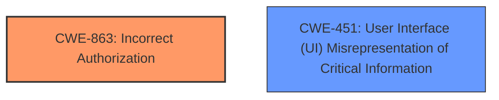

# Analysis for CVE-2020-12391

# Summary
| CWE ID | CWE Name | Confidence | CWE Abstraction Level | CWE Vulnerability Mapping Label | CWE-Vulnerability Mapping Notes |
|---|---|---|---|---|---|
| **CWE-863** | Incorrect Authorization | 0.8 | Class | Primary | Allowed-with-Review |
| CWE-451 | User Interface (UI) Misrepresentation of Critical Information | 0.6 | Class | Secondary | Allowed-with-Review |

## Evidence and Confidence

*   **Confidence Score:** 0.7
*   **Evidence Strength:** MEDIUM

## Relationship Analysis
The primary relationship influencing the selection was the hierarchical parent-child relationship. CWE-863, while a class, aligns well with the **incorrect authorization** aspect, but it lacks specific details. There are no strong chain relationships evident from the description. The analysis considered CWE-451 as a supporting element, relating to the misrepresentation of critical information within the UI. Abstraction levels were considered, and the selected CWEs represent the most fitting balance between specificity and generality given the available information.

## Vulnerability Chain
The chain of events starts with **incorrect inheritance** of CSP, leading to an **authorization bypass**, and finally resulting in the **execution of scripts that should have been blocked**.
  - The root cause is the **incorrect inheritance** of CSP.
  - The weakness is the **authorization bypass** (CWE-863).
  - The impact is the **execution of blocked scripts**.

## Summary of Analysis
The initial analysis identified CWE-863 as the most relevant due to the **authorization bypass**. This is supported by the "CVE Reference Links Content Summary" section, which states, "The primary vulnerability is a Content Security Policy (CSP) bypass." Additionally, the description mentions scripts being executed that "should have been blocked," indicating an **incorrect authorization** mechanism.

However, the vulnerability description also highlights that this bypass leads to the ability to execute scripts, which is a violation of the intended security policy. While the scripts execute with a unique opaque origin, the fact that they execute despite the CSP suggests a form of **misrepresentation** or **incorrect handling of security controls**, making CWE-451 a secondary consideration.

The selection of CWE-863 is primarily based on the explicit mention of the CSP bypass and the violation of intended security policy. The relationship graph highlights the association between authorization and UI representation. The selection of CWE-863 as a Class is due to the lack of a more specific Base or Variant CWE that precisely captures the nuances of the vulnerability within the provided context.
The evidence is moderate, with the CVE summary clearly stating "CSP Bypass".
"The vulnerability stems from how Firefox handles Content Security Policy (CSP) for documents loaded via `data:` URLs within `<object>` elements. Specifically, the CSP of the parent document was not being applied to these embedded documents."

Relevant CWE Information:

# Enhanced Context (25 CWEs)
The following CWEs were identified as potentially relevant to this vulnerability:

## CWE-1289: Improper Validation of Unsafe Equivalence in Input
**Abstraction Level**: Base
**Similarity Score**: 0.76
**Source**: dense

**Description**:
The product receives an input value that is used as a resource identifier or other type of reference, but it does not validate or incorrectly validates that the input is equivalent to a potentially-unsafe value.

**Mapping Guidance**:
- Usage: Allowed
- Rationale: This CWE entry is at the Base level of abstraction, which is a preferred level of abstraction for mapping to the root causes of vulnerabilities.

## CWE-345: Insufficient Verification of Data Authenticity
**Abstraction Level**: Class
**Similarity Score**: 0.75
**Source**: dense

**Description**:
The product does not sufficiently verify the origin or authenticity of data, in a way that causes it to accept invalid data.

**Mapping Guidance**:
- Usage: Discouraged
- Rationale: This CWE entry is a level-1 Class (i.e., a child of a Pillar). It might have lower-level children that would be more appropriate

## CWE-451: User Interface (UI) Misrepresentation of Critical Information
**Abstraction Level**: Class
**Similarity Score**: 0.75
**Source**: dense

**Description**:
The user interface (UI) does not properly represent critical information to the user, allowing the information - or its source - to be obscured or spoofed. This is often a component in phishing attacks.

**Mapping Guidance**:
- Usage: Allowed-with-Review
- Rationale: This CWE entry is a Class and might have Base-level children that would be more appropriate

## CWE-657: Violation of Secure Design Principles
**Abstraction Level**: Class
**Similarity Score**: 0.75
**Source**: dense

**Description**:
The product violates well-established principles for secure design.

**Mapping Guidance**:
- Usage: Discouraged
- Rationale: This CWE entry is a level-1 Class (i.e., a child of a Pillar). It might have lower-level children that would be more appropriate

## CWE-668: Exposure of Resource to Wrong Sphere
**Abstraction Level**: Class
**Similarity Score**: 0.75
**Source**: dense

**Description**:
The product exposes a resource to the wrong control sphere, providing unintended actors with inappropriate access to the resource.

**Mapping Guidance**:
- Usage: Discouraged
- Rationale: CWE-668 is high-level and is often misused as a catch-all when lower-level CWE IDs might be applicable. It is sometimes used for low-information vulnerability reports [REF-1287]. It is a level-1 Class (i.e., a child of a Pillar). It is not useful for trend analysis.

## CWE-358: Improperly Implemented Security Check for Standard
**Abstraction Level**: Base
**Similarity Score**: 0.74
**Source**: dense

**Description**:
The product does not implement or incorrectly implements one or more security-relevant checks as specified by the design of a standardized algorithm, protocol, or technique.

**Mapping Guidance**:
- Usage: Allowed
- Rationale: This CWE entry is at the Base level of abstraction, which is a preferred level of abstraction for mapping to the root causes of vulnerabilities.

## CWE-807: Reliance on Untrusted Inputs in a Security Decision
**Abstraction Level**: Base
**Similarity Score**: 0.74
**Source**: dense

**Description**:
The product uses a protection mechanism that relies on the existence or values of an input, but the input can be modified by an untrusted actor in a way that bypasses the protection mechanism.

**Mapping Guidance**:
- Usage: Allowed
- Rationale: This CWE entry is at the Base level of abstraction, which is a preferred level of abstraction for mapping to the root causes of vulnerabilities.

## CWE-297: Improper Validation of Certificate with Host Mismatch
**Abstraction Level**: Variant
**Similarity Score**: 0.74
**Source**: dense

**Description**:
The product communicates with a host that provides a certificate, but the product does not properly ensure that the certificate is actually associated with that host.

**Mapping Guidance**:
- Usage: Allowed
- Rationale: This CWE entry is at the Variant level of abstraction, which is a preferred level of abstraction for mapping to the root causes of vulnerabilities.

## CWE-347: Improper Verification of Cryptographic Signature
**Abstraction Level**: Base
**Similarity Score**: 0.74
**Source**: dense

**Description**:
The product does not verify, or incorrectly verifies, the cryptographic signature for data.

**Mapping Guidance**:
- Usage: Allowed
- Rationale: This CWE entry is at the Base level of abstraction, which is a preferred level of abstraction for mapping to the root causes of vulnerabilities.

## CWE-274: Improper Handling of Insufficient Privileges
**Abstraction Level**: Base
**Similarity Score**: 0.74
**Source**: dense

**Description**:
The product does not handle or incorrectly handles when it has insufficient privileges to perform an operation, leading to resultant weaknesses.

**Mapping Guidance**:
- Usage: Discouraged
- Rationale: This CWE entry could be deprecated in a future version of CWE.

## CWE-451: User Interface (UI) Misrepresentation of Critical Information
**Abstraction Level**: Class
**Similarity Score**: 7068.26
**Source**: sparse

**Description**:
The user interface (UI) does not properly represent critical information to the user, allowing the information - or its source - to be obscured or spoofed. This is often a component in phishing attacks.

**Mapping Guidance**:
- Usage: Allowed-with-Review
- Rationale: This CWE entry is a Class and might have Base-level children that would be more appropriate

## CWE-116: Improper Encoding or Escaping of Output
**Abstraction Level**: Class

# Enhanced Query for CVE-2020-12391

## Vulnerability Description
Documents formed using data URLs in an OBJECT element failed to inherit the CSP of the creating context. This allowed the execution of scripts that should have been blocked, albeit with a unique opaque origin. This vulnerability affects Firefox < 76.

### Vulnerability Description Key Phrases
- **impact:** execute scripts that should have been blocked
- **product:** Firefox
- **version:** < 76

## CVE Reference Links Content Summary
Based on the provided information, here's an analysis of CVE-2020-12391:

**Root Cause of Vulnerability:**

The vulnerability stems from how Firefox handles Content Security Policy (CSP) for documents loaded via `data:` URLs within `<object>` elements. Specifically, the CSP of the parent document was not being applied to these embedded documents.

**Weaknesses/Vulnerabilities Present:**

-   **CSP Bypass:** The primary vulnerability is a Content Security Policy (CSP) bypass. The intended security mechanism to restrict the execution of scripts was ineffective for `data:` URL documents within `<object>` elements.
-   **Incorrect Policy Inheritance:** The core issue is that `data:` URL documents loaded inside `<object>` elements failed to inherit the CSP of their parent document. This is in contrast to `<iframe>` elements, where the parent's CSP is correctly inherited.

**Impact of Exploitation:**

-   **Unrestricted Script Execution:** Successful exploitation allowed the execution of scripts within the embedded `<object>` content that should have been blocked by the parent's CSP.
-   **Potential for Self-Contained Exploits:** An attacker could leverage this to deliver self-contained exploits by embedding malicious `data:` URLs within `<object>` elements on a website with a restrictive CSP policy.
-   **Bypassing WebExtension Protections:**  This vulnerability could bypass security mechanisms that WebExtensions rely on to block scripts through CSP. Even though the embedded document has a null origin, it could still deliver a self-contained exploit.

**Attack Vectors:**

-   **Malicious HTML:** An attacker could craft a malicious HTML page containing a `<object>` element with a `data:` URL that includes malicious JavaScript.
-   **Website Compromise:** An attacker could compromise a legitimate website and inject the malicious HTML, potentially targeting users visiting the compromised website.

**Required Attacker Capabilities/Position:**

-   **Ability to Inject HTML:** An attacker would need the ability to inject HTML content into a webpage. This could be achieved through various means, such as:
    -   Compromising a website directly.
    -   Using a vulnerability in a website's code that allows for HTML injection.
    -   Convincing a user to visit a webpage containing the malicious code.
-   **Basic Web Development Knowledge:** The attacker would need to be familiar with HTML and the usage of `<object>` elements and `data:` URLs.

**Additional details:**
- This issue was classified as a "moderate" severity issue.
- The fix was implemented in Firefox 76 and not backported to older releases.
- The issue was initially reported in 2017 and fixed in 2020.

## Retriever Results

### Top Combined Results

| Rank | CWE ID | Name | Abstraction | Usage  | Retrievers | Individual Scores |
|------|--------|------|-------------|-------|------------|-------------------|
| 1 | 863 | Incorrect Authorization | Class | Allowed-with-Review | sparse | 0.071 |
| 2 | 116 | Improper Encoding or Escaping of Output | Class | Allowed-with-Review | sparse | 0.070 |
| 3 | 668 | Exposure of Resource to Wrong Sphere | Class | Discouraged | sparse | 0.069 |
| 4 | 787 | Out-of-bounds Write | Base | Allowed | sparse | 0.068 |
| 5 | 266 | Incorrect Privilege Assignment | Base | Allowed | sparse | 0.067 |
| 6 | 1385 | Missing Origin Validation in WebSockets | Variant | Allowed | dense | 0.538 |
| 7 | 825 | Expired Pointer Dereference | Base | Allowed | graph | 0.002 |
| 8 | 457 | Use of Uninitialized Variable | Variant | Allowed | sparse | 0.067 |
| 9 | 451 | User Interface (UI) Misrepresentation of Critical Information | Class | Allowed-with-Review | sparse | 0.067 |
| 10 | 347 | Improper Verification of Cryptographic Signature | Base | Allowed | sparse | 0.066 |

# Complete CWE Specifications

## CWE-863: Incorrect Authorization
**Abstraction:** Class
**Status:** Incomplete

### Description
The product performs an authorization check when an actor attempts to access a resource or perform an action, but it does not correctly perform the check.

### Extended Description
Not provided

### Alternative Terms
AuthZ: "AuthZ" is typically used as an abbreviation of "authorization" within the web application security community. It is distinct from "AuthN" (or, sometimes, "AuthC") which is an abbreviation of "authentication." The use of "Auth" as an abbreviation is discouraged, since it could be used for either authentication or authorization.

### Relationships
ChildOf -> CWE-285
ChildOf -> CWE-284

### Mapping Guidance
**Usage:** Allowed-with-Review
**Rationale:** This CWE entry is a Class and might have Base-level children that would be more appropriate
**Comments:** Examine children of this entry to see if there is a better fit
**Reasons:**
- Abstraction

### Additional Notes
**[Terminology]** 

Assuming a user with a given identity, authorization is the process of determining whether that user can access a given resource, based on the user's privileges and any permissions or other access-control specifications that apply to the resource.

### Observed Examples
- **CVE-2021-39155:** Chain: A microservice integration and management platform compares the hostname in the HTTP Host header in a case-sensitive way (CWE-178, CWE-1289), allowing bypass of the authorization policy (CWE-863) using a hostname with mixed case or other variations.
- **CVE-2019-15900:** Chain: sscanf() call is used to check if a username and group exists, but the return value of sscanf() call is not checked (CWE-252), causing an uninitialized variable to be checked (CWE-457), returning success to allow authorization bypass for executing a privileged (CWE-863).
- **CVE-2009-2213:** Gateway uses default "Allow" configuration for its authorization settings.

## CWE-116: Improper Encoding or Escaping of Output
**Abstraction:** Class
**Status:** Draft

### Description
The product prepares a structured message for communication with another component, but encoding or escaping of the data is either missing or done incorrectly. As a result, the intended structure of the message is not preserved.

### Extended Description

Improper encoding or escaping can allow attackers to change the commands that are sent to another component, inserting malicious commands instead.

Most products follow a certain protocol that uses structured messages for communication between components, such as queries or commands. These structured messages can contain raw data interspersed with metadata or control information. For example, "GET /index.html HTTP/1.1" is a structured message containing a command ("GET") with a single argument ("/index.html") and metadata about which protocol version is being used ("HTTP/1.1").

If an application uses attacker-supplied inputs to construct a structured message without properly encoding or escaping, then the attacker could insert special characters that will cause the data to be interpreted as control information or metadata. Consequently, the component that receives the output will perform the wrong operations, or otherwise interpret the data incorrectly.

### Alternative Terms
Output Sanitization
Output Validation
Output Encoding

### Relationships
ChildOf -> CWE-707
CanPrecede -> CWE-74

### Mapping Guidance
**Usage:** Allowed-with-Review
**Rationale:** This CWE entry is a Class and might have Base-level children that would be more appropriate
**Comments:** Examine children of this entry to see if there is a better fit
**Reasons:**
- Abstraction

### Additional Notes
**[Relationship]** This weakness is primary to all weaknesses related to injection (CWE-74) since the inherent nature of injection involves the violation of structured messages.

**[Relationship]** 

CWE-116 and CWE-20 have a close association because, depending on the nature of the structured message, proper input validation can indirectly prevent special characters from changing the meaning of a structured message. For example, by validating that a numeric ID field should only contain the 0-9 characters, the programmer effectively prevents injection attacks.

However, input validation is not always sufficient, especially when less stringent data types must be supported, such as free-form text. Consider a SQL injection scenario in which a last name is inserted into a query. The name "O'Reilly" would likely pass the validation step since it is a common last name in the English language. However, it cannot be directly inserted into the database because it contains the "'" apostrophe character, which would need to be escaped or otherwise neutralized. In this case, stripping the apostrophe might reduce the risk of SQL injection, but it would produce incorrect behavior because the wrong name would be recorded.

**[Terminology]** The usage of the "encoding" and "escaping" terms varies widely. For example, in some programming languages, the terms are used interchangeably, while other languages provide APIs that use both terms for different tasks. This overlapping usage extends to the Web, such as the "escape" JavaScript function whose purpose is stated to be encoding. The concepts of encoding and escaping predate the Web by decades. Given such a context, it is difficult for CWE to adopt a consistent vocabulary that will not be misinterpreted by some constituency.

**[Theoretical]** This is a data/directive boundary error in which data boundaries are not sufficiently enforced before it is sent to a different control sphere.

**[Research Gap]** While many published vulnerabilities are related to insufficient output encoding, there is such an emphasis on input validation as a protection mechanism that the underlying causes are rarely described. Within CVE, the focus is primarily on well-understood issues like cross-site scripting and SQL injection. It is likely that this weakness frequently occurs in custom protocols that support multiple encodings, which are not necessarily detectable with automated techniques.

### Observed Examples
- **CVE-2021-41232:** Chain: authentication routine in Go-based agile development product does not escape user name (CWE-116), allowing LDAP injection (CWE-90)
- **CVE-2008-4636:** OS command injection in backup software using shell metacharacters in a filename; correct behavior would require that this filename could not be changed.
- **CVE-2008-0769:** Web application does not set the charset when sending a page to a browser, allowing for XSS exploitation when a browser chooses an unexpected encoding.

## CWE-668: Exposure of Resource to Wrong Sphere
**Abstraction:** Class
**Status:** Draft

### Description
The product exposes a resource to the wrong control sphere, providing unintended actors with inappropriate access to the resource.

### Extended Description

Resources such as files and directories may be inadvertently exposed through mechanisms such as insecure permissions, or when a program accidentally operates on the wrong object. For example, a program may intend that private files can only be provided to a specific user. This effectively defines a control sphere that is intended to prevent attackers from accessing these private files. If the file permissions are insecure, then parties other than the user will be able to access those files.

A separate control sphere might effectively require that the user can only access the private files, but not any other files on the system. If the program does not ensure that the user is only requesting private files, then the user might be able to access other files on the system.

In either case, the end result is that a resource has been exposed to the wrong party.

### Alternative Terms
None

### Relationships
ChildOf -> CWE-664

### Mapping Guidance
**Usage:** Discouraged
**Rationale:** CWE-668 is high-level and is often misused as a catch-all when lower-level CWE IDs might be applicable. It is sometimes used for low-information vulnerability reports [REF-1287]. It is a level-1 Class (i.e., a child of a Pillar). It is not useful for trend analysis.
**Comments:** Closely analyze the specific mistake that is allowing the resource to be exposed, and perform a CWE mapping for that mistake.
**Reasons:**
- Frequent Misuse
- Abstraction

### Additional Notes
**[Theoretical]** A "control sphere" is a set of resources and behaviors that are accessible to a single actor, or a group of actors. A product's security model will typically define multiple spheres, possibly implicitly. For example, a server might define one sphere for "administrators" who can create new user accounts with subdirectories under /home/server/, and a second sphere might cover the set of users who can create or delete files within their own subdirectories. A third sphere might be "users who are authenticated to the operating system on which the product is installed." Each sphere has different sets of actors and allowable behaviors.

## CWE-787: Out-of-bounds Write
**Abstraction:** Base
**Status:** Draft

### Description
The product writes data past the end, or before the beginning, of the intended buffer.

### Extended Description
Not provided

### Alternative Terms
Memory Corruption: Often used to describe the consequences of writing to memory outside the bounds of a buffer, or to memory that is otherwise invalid.

### Relationships
ChildOf -> CWE-119
ChildOf -> CWE-119
ChildOf -> CWE-119
ChildOf -> CWE-119

### Mapping Guidance
**Usage:** Allowed
**Rationale:** This CWE entry is at the Base level of abstraction, which is a preferred level of abstraction for mapping to the root causes of vulnerabilities.
**Comments:** Carefully read both the name and description to ensure that this mapping is an appropriate fit. Do not try to 'force' a mapping to a lower-level Base/Variant simply to comply with this preferred level of abstraction.
**Reasons:**
- Acceptable-Use

### Observed Examples
- **CVE-2023-1017:** The reference implementation code for a Trusted Platform Module does not implement length checks on data, allowing for an attacker to write 2 bytes past the end of a buffer.
- **CVE-2021-21220:** Chain: insufficient input validation (CWE-20) in browser allows heap corruption (CWE-787), as exploited in the wild per CISA KEV.
- **CVE-2021-28664:** GPU kernel driver allows memory corruption because a user can obtain read/write access to read-only pages, as exploited in the wild per CISA KEV.

## CWE-266: Incorrect Privilege Assignment
**Abstraction:** Base
**Status:** Draft

### Description
A product incorrectly assigns a privilege to a particular actor, creating an unintended sphere of control for that actor.

### Extended Description
Not provided

### Alternative Terms
None

### Relationships
ChildOf -> CWE-269
CanAlsoBe -> CWE-286

### Mapping Guidance
**Usage:** Allowed
**Rationale:** This CWE entry is at the Base level of abstraction, which is a preferred level of abstraction for mapping to the root causes of vulnerabilities.
**Comments:** Carefully read both the name and description to ensure that this mapping is an appropriate fit. Do not try to 'force' a mapping to a lower-level Base/Variant simply to comply with this preferred level of abstraction.
**Reasons:**
- Acceptable-Use

### Observed Examples
- **CVE-1999-1193:** untrusted user placed in unix "wheel" group
- **CVE-2005-2741:** Product allows users to grant themselves certain rights that can be used to escalate privileges.
- **CVE-2005-2496:** Product uses group ID of a user instead of the group, causing it to run with different privileges. This is resultant from some other unknown issue.

## CWE-1385: Missing Origin Validation in WebSockets
**Abstraction:** Variant
**Status:** Incomplete

### Description
The product uses a WebSocket, but it does not properly verify that the source of data or communication is valid.

### Extended Description

WebSockets provide a bi-directional low latency communication (near real-time) between a client and a server. WebSockets are different than HTTP in that the connections are long-lived, as the channel will remain open until the client or the server is ready to send the message, whereas in HTTP, once the response occurs (which typically happens immediately), the transaction completes. 

A WebSocket can leverage the existing HTTP protocol over ports 80 and 443, but it is not limited to HTTP. WebSockets can make cross-origin requests that are not restricted by browser-based protection mechanisms such as the Same Origin Policy (SOP) or Cross-Origin Resource Sharing (CORS). Without explicit origin validation, this makes CSRF attacks more powerful.

### Alternative Terms
Cross-Site WebSocket hijacking (CSWSH): this term is used for attacks that exploit this weakness

### Relationships
ChildOf -> CWE-346

### Mapping Guidance
**Usage:** Allowed
**Rationale:** This CWE entry is at the Variant level of abstraction, which is a preferred level of abstraction for mapping to the root causes of vulnerabilities.
**Comments:** Carefully read both the name and description to ensure that this mapping is an appropriate fit. Do not try to 'force' a mapping to a lower-level Base/Variant simply to comply with this preferred level of abstraction.
**Reasons:**
- Acceptable-Use

### Observed Examples
- **CVE-2020-25095:** web console for SIEM product does not check Origin header, allowing Cross Site WebSocket Hijacking (CSWH)
- **CVE-2018-6651:** Chain: gaming client attempts to validate the Origin header, but only uses a substring, allowing Cross-Site WebSocket hijacking by forcing requests from an origin whose hostname is a substring of the valid origin.
- **CVE-2018-14730:** WebSocket server does not check the origin of requests, allowing attackers to steal developer's code using a ws://127.0.0.1:3123/ connection.

## CWE-825: Expired Pointer Dereference
**Abstraction:** Base
**Status:** Incomplete

### Description
The product dereferences a pointer that contains a location for memory that was previously valid, but is no longer valid.

### Extended Description
When a product releases memory, but it maintains a pointer to that memory, then the memory might be re-allocated at a later time. If the original pointer is accessed to read or write data, then this could cause the product to read or modify data that is in use by a different function or process. Depending on how the newly-allocated memory is used, this could lead to a denial of service, information exposure, or code execution.

### Alternative Terms
Dangling pointer

### Relationships
ChildOf -> CWE-119
ChildOf -> CWE-119
ChildOf -> CWE-119
ChildOf -> CWE-672
CanPrecede -> CWE-125
CanPrecede -> CWE-787

### Mapping Guidance
**Usage:** Allowed
**Rationale:** This CWE entry is at the Base level of abstraction, which is a preferred level of abstraction for mapping to the root causes of vulnerabilities.
**Comments:** Carefully read both the name and description to ensure that this mapping is an appropriate fit. Do not try to 'force' a mapping to a lower-level Base/Variant simply to comply with this preferred level of abstraction.
**Reasons:**
- Acceptable-Use

### Additional Notes
**[Maintenance]** There are close relationships between incorrect pointer dereferences and other weaknesses related to buffer operations. There may not be sufficient community agreement regarding these relationships. Further study is needed to determine when these relationships are chains, composites, perspective/layering, or other types of relationships. As of September 2010, most of the relationships are being captured as chains.

**[Terminology]** Many weaknesses related to pointer dereferences fall under the general term of "memory corruption" or "memory safety." As of September 2010, there is no commonly-used terminology that covers the lower-level variants.

### Observed Examples
- **CVE-2008-5013:** access of expired memory address leads to arbitrary code execution
- **CVE-2010-3257:** stale pointer issue leads to denial of service and possibly other consequences
- **CVE-2008-0062:** Chain: a message having an unknown message type may cause a reference to uninitialized memory resulting in a null pointer dereference (CWE-476) or dangling pointer (CWE-825), possibly crashing the system or causing heap corruption.

## CWE-457: Use of Uninitialized Variable
**Abstraction:** Variant
**Status:** Draft

### Description
The code uses a variable that has not been initialized, leading to unpredictable or unintended results.

### Extended Description
In some languages such as C and C++, stack variables are not initialized by default. They generally contain junk data with the contents of stack memory before the function was invoked. An attacker can sometimes control or read these contents. In other languages or conditions, a variable that is not explicitly initialized can be given a default value that has security implications, depending on the logic of the program. The presence of an uninitialized variable can sometimes indicate a typographic error in the code.

### Alternative Terms
None

### Relationships
ChildOf -> CWE-908
ChildOf -> CWE-665
ChildOf -> CWE-665

### Mapping Guidance
**Usage:** Allowed
**Rationale:** This CWE entry is at the Variant level of abstraction, which is a preferred level of abstraction for mapping to the root causes of vulnerabilities.
**Comments:** Carefully read both the name and description to ensure that this mapping is an appropriate fit. Do not try to 'force' a mapping to a lower-level Base/Variant simply to comply with this preferred level of abstraction.
**Reasons:**
- Acceptable-Use

### Observed Examples
- **CVE-2019-15900:** Chain: sscanf() call is used to check if a username and group exists, but the return value of sscanf() call is not checked (CWE-252), causing an uninitialized variable to be checked (CWE-457), returning success to allow authorization bypass for executing a privileged (CWE-863).
- **CVE-2008-3688:** Chain: A denial of service may be caused by an uninitialized variable (CWE-457) allowing an infinite loop (CWE-835) resulting from a connection to an unresponsive server.
- **CVE-2008-0081:** Uninitialized variable leads to code execution in popular desktop application.

## CWE-451: User Interface (UI) Misrepresentation of Critical Information
**Abstraction:** Class
**Status:** Draft

### Description
The user interface (UI) does not properly represent critical information to the user, allowing the information - or its source - to be obscured or spoofed. This is often a component in phishing attacks.

### Extended Description

If an attacker can cause the UI to display erroneous data, or to otherwise convince the user to display information that appears to come from a trusted source, then the attacker could trick the user into performing the wrong action. This is often a component in phishing attacks, but other kinds of problems exist. For example, if the UI is used to monitor the security state of a system or network, then omitting or obscuring an important indicator could prevent the user from detecting and reacting to a security-critical event.

UI misrepresentation can take many forms:

  - Incorrect indicator: incorrect information is displayed, which prevents the user from understanding the true state of the product or the environment the product is monitoring, especially of potentially-dangerous conditions or operations. This can be broken down into several different subtypes.

  - Overlay: an area of the display is intended to give critical information, but another process can modify the display by overlaying another element on top of it. The user is not interacting with the expected portion of the user interface. This is the problem that enables clickjacking attacks, although many other types of attacks exist that involve overlay.

  - Icon manipulation: the wrong icon, or the wrong color indicator, can be influenced (such as making a dangerous .EXE executable look like a harmless .GIF)

  - Timing: the product is performing a state transition or context switch that is presented to the user with an indicator, but a race condition can cause the wrong indicator to be used before the product has fully switched context. The race window could be extended indefinitely if the attacker can trigger an error.

  - Visual truncation: important information could be truncated from the display, such as a long filename with a dangerous extension that is not displayed in the GUI because the malicious portion is truncated. The use of excessive whitespace can also cause truncation, or place the potentially-dangerous indicator outside of the user's field of view (e.g. "filename.txt .exe"). A different type of truncation can occur when a portion of the information is removed due to reasons other than length, such as the accidental insertion of an end-of-input marker in the middle of an input, such as a NUL byte in a C-style string.

  - Visual distinction: visual information might be presented in a way that makes it difficult for the user to quickly and correctly distinguish between critical and unimportant segments of the display.

  - Homographs: letters from different character sets, fonts, or languages can appear very similar (i.e. may be visually equivalent) in a way that causes the human user to misread the text (for example, to conduct phishing attacks to trick a user into visiting a malicious web site with a visually-similar name as a trusted site). This can be regarded as a type of visual distinction issue.

### Alternative Terms
None

### Relationships
ChildOf -> CWE-684
ChildOf -> CWE-221
PeerOf -> CWE-346

### Mapping Guidance
**Usage:** Allowed-with-Review
**Rationale:** This CWE entry is a Class and might have Base-level children that would be more appropriate
**Comments:** Examine children of this entry to see if there is a better fit
**Reasons:**
- Abstraction

### Additional Notes
**[Maintenance]** This entry should be broken down into more precise entries. See extended description.

**[Research Gap]** Misrepresentation problems are frequently studied in web browsers, but there are no known efforts for classifying these kinds of problems in terms of the shortcomings of the interface. In addition, many misrepresentation issues are resultant.

### Observed Examples
- **CVE-2004-2227:** Web browser's filename selection dialog only shows the beginning portion of long filenames, which can trick users into launching executables with dangerous extensions.
- **CVE-2001-0398:** Attachment with many spaces in filename bypasses "dangerous content" warning and uses different icon. Likely resultant.
- **CVE-2001-0643:** Misrepresentation and equivalence issue.

## CWE-347: Improper Verification of Cryptographic Signature
**Abstraction:** Base
**Status:** Draft

### Description
The product does not verify, or incorrectly verifies, the cryptographic signature for data.

### Extended Description
Not provided

### Alternative Terms
None

### Relationships
ChildOf -> CWE-345
ChildOf -> CWE-345

### Mapping Guidance
**Usage:** Allowed
**Rationale:** This CWE entry is at the Base level of abstraction, which is a preferred level of abstraction for mapping to the root causes of vulnerabilities.
**Comments:** Carefully read both the name and description to ensure that this mapping is an appropriate fit. Do not try to 'force' a mapping to a lower-level Base/Variant simply to comply with this preferred level of abstraction.
**Reasons:**
- Acceptable-Use

### Observed Examples
- **CVE-2002-1796:** Does not properly verify signatures for "trusted" entities.
- **CVE-2005-2181:** Insufficient verification allows spoofing.
- **CVE-2005-2182:** Insufficient verification allows spoofing.

