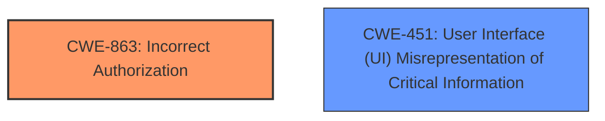

# Analysis Report for CVE-2020-12391

# Vulnerability Analysis Report: CVE-2020-12391

## Description


## Analysis (with Relationship Data)

# Summary
| CWE ID | CWE Name | Confidence | CWE Abstraction Level | CWE Vulnerability Mapping Label | CWE-Vulnerability Mapping Notes |
|---|---|---|---|---|---|
| **CWE-863** | Incorrect Authorization | 0.8 | Class | Primary | Allowed-with-Review |
| CWE-451 | User Interface (UI) Misrepresentation of Critical Information | 0.6 | Class | Secondary | Allowed-with-Review |

## Evidence and Confidence

*   **Confidence Score:** 0.7
*   **Evidence Strength:** MEDIUM

## Relationship Analysis
The primary relationship influencing the selection was the hierarchical parent-child relationship. CWE-863, while a class, aligns well with the **incorrect authorization** aspect, but it lacks specific details. There are no strong chain relationships evident from the description. The analysis considered CWE-451 as a supporting element, relating to the misrepresentation of critical information within the UI. Abstraction levels were considered, and the selected CWEs represent the most fitting balance between specificity and generality given the available information.



## Vulnerability Chain
The chain of events starts with **incorrect inheritance** of CSP, leading to an **authorization bypass**, and finally resulting in the **execution of scripts that should have been blocked**.
  - The root cause is the **incorrect inheritance** of CSP.
  - The weakness is the **authorization bypass** (CWE-863).
  - The impact is the **execution of blocked scripts**.

## Summary of Analysis
The initial analysis identified CWE-863 as the most relevant due to the **authorization bypass**. This is supported by the "CVE Reference Links Content Summary" section, which states, "The primary vulnerability is a Content Security Policy (CSP) bypass." Additionally, the description mentions scripts being executed that "should have been blocked," indicating an **incorrect authorization** mechanism.

However, the vulnerability description also highlights that this bypass leads to the ability to execute scripts, which is a violation of the intended security policy. While the scripts execute with a unique opaque origin, the fact that they execute despite the CSP suggests a form of **misrepresentation** or **incorrect handling of security controls**, making CWE-451 a secondary consideration.

The selection of CWE-863 is primarily based on the explicit mention of the CSP bypass and the violation of intended security policy. The relationship graph highlights the association between authorization and UI representation. The selection of CWE-863 as a Class is due to the lack of a more specific Base or Variant CWE that precisely captures the nuances of the vulnerability within the provided context.
The evidence is moderate, with the CVE summary clearly stating "CSP Bypass".
"The vulnerability stems from how Firefox handles Content Security Policy (CSP) for documents loaded via `data:` URLs within `<object>` elements. Specifically, the CSP of the parent document was not being applied to these embedded documents."

Relevant CWE Information:

# Enhanced Context (25 CWEs)
The following CWEs were identified as potentially relevant to this vulnerability:

## CWE-1289: Improper Validation of Unsafe Equivalence in Input
**Abstraction Level**: Base
**Similarity Score**: 0.76
**Source**: dense

**Description**:
The product receives an input value that is used as a resource identifier or other type of reference, but it does not validate or incorrectly validates that the input is equivalent to a potentially-unsafe value.

**Mapping Guidance**:
- Usage: Allowed
- Rationale: This CWE entry is at the Base level of abstraction, which is a preferred level of abstraction for mapping to the root causes of vulnerabilities.

## CWE-345: Insufficient Verification of Data Authenticity
**Abstraction Level**: Class
**Similarity Score**: 0.75
**Source**: dense

**Description**:
The product does not sufficiently verify the origin or authenticity of data, in a way that causes it to accept invalid data.

**Mapping Guidance**:
- Usage: Discouraged
- Rationale: This CWE entry is a level-1 Class (i.e., a child of a Pillar). It might have lower-level children that would be more appropriate

## CWE-451: User Interface (UI) Misrepresentation of Critical Information
**Abstraction Level**: Class
**Similarity Score**: 0.75
**Source**: dense

**Description**:
The user interface (UI) does not properly represent critical information to the user, allowing the information - or its source - to be obscured or spoofed. This is often a component in phishing attacks.

**Mapping Guidance**:
- Usage: Allowed-with-Review
- Rationale: This CWE entry is a Class and might have Base-level children that would be more appropriate

## CWE-657: Violation of Secure Design Principles
**Abstraction Level**: Class
**Similarity Score**: 0.75
**Source**: dense

**Description**:
The product violates well-established principles for secure design.

**Mapping Guidance**:
- Usage: Discouraged
- Rationale: This CWE entry is a level-1 Class (i.e., a child of a Pillar). It might have lower-level children that would be more appropriate

## CWE-668: Exposure of Resource to Wrong Sphere
**Abstraction Level**: Class
**Similarity Score**: 0.75
**Source**: dense

**Description**:
The product exposes a resource to the wrong control sphere, providing unintended actors with inappropriate access to the resource.

**Mapping Guidance**:
- Usage: Discouraged
- Rationale: CWE-668 is high-level and is often misused as a catch-all when lower-level CWE IDs might be applicable. It is sometimes used for low-information vulnerability reports [REF-1287]. It is a level-1 Class (i.e., a child of a Pillar). It is not useful for trend analysis.

## CWE-358: Improperly Implemented Security Check for Standard
**Abstraction Level**: Base
**Similarity Score**: 0.74
**Source**: dense

**Description**:
The product does not implement or incorrectly implements one or more security-relevant checks as specified by the design of a standardized algorithm, protocol, or technique.

**Mapping Guidance**:
- Usage: Allowed
- Rationale: This CWE entry is at the Base level of abstraction, which is a preferred level of abstraction for mapping to the root causes of vulnerabilities.

## CWE-807: Reliance on Untrusted Inputs in a Security Decision
**Abstraction Level**: Base
**Similarity Score**: 0.74
**Source**: dense

**Description**:
The product uses a protection mechanism that relies on the existence or values of an input, but the input can be modified by an untrusted actor in a way that bypasses the protection mechanism.

**Mapping Guidance**:
- Usage: Allowed
- Rationale: This CWE entry is at the Base level of abstraction, which is a preferred level of abstraction for mapping to the root causes of vulnerabilities.

## CWE-297: Improper Validation of Certificate with Host Mismatch
**Abstraction Level**: Variant
**Similarity Score**: 0.74
**Source**: dense

**Description**:
The product communicates with a host that provides a certificate, but the product does not properly ensure that the certificate is actually associated with that host.

**Mapping Guidance**:
- Usage: Allowed
- Rationale: This CWE entry is at the Variant level of abstraction, which is a preferred level of abstraction for mapping to the root causes of vulnerabilities.

## CWE-347: Improper Verification of Cryptographic Signature
**Abstraction Level**: Base
**Similarity Score**: 0.74
**Source**: dense

**Description**:
The product does not verify, or incorrectly verifies, the cryptographic signature for data.

**Mapping Guidance**:
- Usage: Allowed
- Rationale: This CWE entry is at the Base level of abstraction, which is a preferred level of abstraction for mapping to the root causes of vulnerabilities.

## CWE-274: Improper Handling of Insufficient Privileges
**Abstraction Level**: Base
**Similarity Score**: 0.74
**Source**: dense

**Description**:
The product does not handle or incorrectly handles when it has insufficient privileges to perform an operation, leading to resultant weaknesses.

**Mapping Guidance**:
- Usage: Discouraged
- Rationale: This CWE entry could be deprecated in a future version of CWE.

## CWE-451: User Interface (UI) Misrepresentation of Critical Information
**Abstraction Level**: Class
**Similarity Score**: 7068.26
**Source**: sparse

**Description**:
The user interface (UI) does not properly represent critical information to the user, allowing the information - or its source - to be obscured or spoofed. This is often a component in phishing attacks.

**Mapping Guidance**:
- Usage: Allowed-with-Review
- Rationale: This CWE entry is a Class and might have Base-level children that would be more appropriate

## CWE-116: Improper Encoding or Escaping of Output
**Abstraction Level**: Class


## CWE Relationship Analysis

Current CWEs represent these abstraction levels: .


### Vulnerability Chain Analysis

**Chain starting from CWE-657:**
- 657 (Violation of Secure Design Principles) - ROOT


**Chain starting from CWE-807:**
- 807 (Reliance on Untrusted Inputs in a Security Decision) - ROOT


### CWE Relationship Diagram

```mermaid
graph TD
    classDef primary fill:#f96,stroke:#333,stroke-width:2px
    classDef secondary fill:#69f,stroke:#333
    classDef tertiary fill:#9e9,stroke:#333
```


*Report generated on 2025-04-02 02:50:42*
