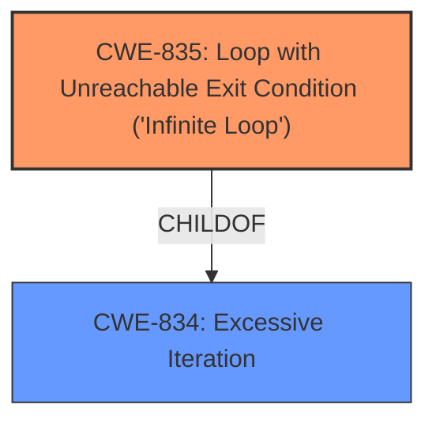

# Analysis for CVE-2020-12655

# Summary
| CWE ID    | CWE Name                                        | Confidence | CWE Abstraction Level | CWE Vulnerability Mapping Label | CWE-Vulnerability Mapping Notes |
| --------- | ----------------------------------------------- | ---------- | --------------------- | ------------------------------- | ------------------------------- |
| CWE-835   | Loop with Unreachable Exit Condition ('Infinite Loop') | 0.8        | Base                  | Primary CWE                     | Allowed                       |

## Evidence and Confidence

*   **Confidence Score:** 0.8
*   **Evidence Strength:** MEDIUM

## Relationship Analysis
The primary relationship influencing the decision is that CWE-835 is a Base level CWE, which is preferred, and that the vulnerability description explicitly mentions a "system hang", which aligns with the potential impact of an infinite loop.



## Vulnerability Chain
The vulnerability chain starts with the **improper handling of crafted XFS v5 metadata**, leading to an **infinite loop** during file sync operations, ultimately causing a **denial of service** due to a system hang.

## Summary of Analysis
The initial analysis focused on identifying the root cause of the vulnerability, which is the kernel's insufficient handling of crafted XFS v5 metadata. This leads to a denial of service due to a system hang. The Retriever results suggested several CWEs, including CWE-835 (Loop with Unreachable Exit Condition ('Infinite Loop')).

The evidence from the CVE description and reference links supports the selection of CWE-835. Specifically, the description mentions "sync of excessive duration" and "system hang," which align with the characteristics of an infinite loop. The git commit message also highlights that the vulnerability leads to a system hang during sync operations.

> CVE Reference Links Content Summary:
> **Root cause of vulnerability:** The vulnerability lies in how the XFS filesystem handles crafted volumes. Specifically, crafted XFS volumes could trigger a system hang due to issues in metadata processing during sync operations.

The final decision to assign CWE-835 is based on the direct evidence of a system hang caused by crafted metadata, the Base level abstraction of the CWE, and the Allowed Usage designation.

Relevant CWE Information:

# Enhanced Context (25 CWEs)

## CWE-226: Sensitive Information in Resource Not Removed Before Reuse
**Abstraction Level**: Base
**Similarity Score**: 0.78
**Source**: dense

**Description**:
The product releases a resource such as memory or a file so that it can be made available for reuse, but it does not clear or "zeroize" the information contained in the resource before the product performs a critical state transition or makes the resource available for reuse by other entities.

**Mapping Guidance**:
- Usage: Allowed
- Rationale: This CWE entry is at the Base level of abstraction, which is a preferred level of abstraction for mapping to the root causes of vulnerabilities.

## CWE-404: Improper Resource Shutdown or Release
**Abstraction Level**: Class
**Similarity Score**: 0.77
**Source**: dense

**Description**:
The product does not release or incorrectly releases a resource before it is made available for re-use.

**Mapping Guidance**:
- Usage: Allowed-with-Review
- Rationale: This CWE entry is a Class and might have Base-level children that would be more appropriate

## CWE-667: Improper Locking
**Abstraction Level**: Class
**Similarity Score**: 0.77
**Source**: dense

**Description**:
The product does not properly acquire or release a lock on a resource, leading to unexpected resource state changes and behaviors.

**Mapping Guidance**:
- Usage: Allowed-with-Review
- Rationale: This CWE entry is a Class and might have Base-level children that would be more appropriate

## CWE-789: Memory Allocation with Excessive Size Value
**Abstraction Level**: Variant
**Similarity Score**: 0.76
**Source**: dense

**Description**:
The product allocates memory based on an untrusted, large size value, but it does not ensure that the size is within expected limits, allowing arbitrary amounts of memory to be allocated.

**Mapping Guidance**:
- Usage: Allowed
- Rationale: This CWE entry is at the Variant level of abstraction, which is a preferred level of abstraction for mapping to the root causes of vulnerabilities.

## CWE-909: Missing Initialization of Resource
**Abstraction Level**: Class
**Similarity Score**: 0.76
**Source**: dense

**Description**:
The product does not initialize a critical resource.

**Mapping Guidance**:
- Usage: Allowed-with-Review
- Rationale: This CWE entry is a Class and might have Base-level children that would be more appropriate

## CWE-1325: Improperly Controlled Sequential Memory Allocation
**Abstraction Level**: Base
**Similarity Score**: 0.76
**Source**: dense

**Description**:
The product manages a group of objects or resources and performs a separate memory allocation for each object, but it does not properly limit the total amount of memory that is consumed by all of the combined objects.

**Mapping Guidance**:
- Usage: Allowed
- Rationale: This CWE entry is at the Base level of abstraction, which is a preferred level of abstraction for mapping to the root causes of vulnerabilities.

## CWE-664: Improper Control of a Resource Through its Lifetime
**Abstraction Level**: Pillar
**Similarity Score**: 0.75
**Source**: dense

**Description**:
The product does not maintain or incorrectly maintains control over a resource throughout its lifetime of creation, use, and release.

**Mapping Guidance**:
- Usage: Discouraged
- Rationale: This CWE entry is high-level when lower-level children are available.

## CWE-665: Improper Initialization
**Abstraction Level**: Class
**Similarity Score**: 0.75
**Source**: dense

**Description**:
The product does not initialize or incorrectly initializes a resource, which might leave the resource in an unexpected state when it is accessed or used.

**Mapping Guidance**:
- Usage: Discouraged
- Rationale: This CWE entry is a level-1 Class (i.e., a child of a Pillar). It might have lower-level children that would be more appropriate

## CWE-131: Incorrect Calculation of Buffer Size
**Abstraction Level**: Base
**Similarity Score**: 0.75
**Source**: dense

**Description**:
The product does not correctly calculate the size to be used when allocating a buffer, which could lead to a buffer overflow.

**Mapping Guidance**:
- Usage: Allowed
- Rationale: This CWE entry is at the Base level of abstraction, which is a preferred level of abstraction for mapping to the root causes of vulnerabilities.

## CWE-908: Use of Uninitialized Resource
**Abstraction Level**: Base
**Similarity Score**: 0.74
**Source**: dense

**Description**:
The product uses or accesses a resource that has not been initialized.

**Mapping Guidance**:
- Usage: Allowed
- Rationale: This CWE entry is at the Base level of abstraction, which is a preferred level of abstraction for mapping to the root causes of vulnerabilities.

## CWE-789: Memory Allocation with Excessive Size Value
**Abstraction Level**: Variant
**Similarity Score**: 5604.53
**Source**: sparse

**Description**:
The product allocates memory based on an untrusted, large size value, but it does not ensure that the size is within expected limits, allowing arbitrary amounts of memory to be allocated.

**Mapping Guidance**:
- Usage: Allowed
- Rationale: This CWE entry is at the Variant level of abstraction, which is a preferred level of abstraction for mapping to the root causes of vulnerabilities.

## CWE-1325: Improperly Controlled Sequential Memory Allocation
**Abstraction Level**: Base
**Similarity Score**: 5519.08
**Source**: sparse

**Description**:
The product manages a group of objects or resources and performs a separate memory allocation for each object, but it does not properly limit the total amount of memory that is consumed by all of the combined objects.

**Mapping Guidance**:
- Usage: Allowed
- Rationale: This CWE entry is at the Base level of abstraction, which is a preferred level of abstraction for mapping to the root causes of vulnerabilities.

## CWE-835: Loop with Unreachable Exit Condition ('Infinite Loop')
**Abstraction Level**: Base
**Similarity Score**: 5459.35
**Source**: sparse

**Description**:
The product contains an iteration or loop with an exit condition that cannot be reached, i.e., an infinite loop.

**Mapping Guidance**:
- Usage: Allowed
- Rationale: This CWE entry is at the Base level of abstraction, which is a preferred level of abstraction for mapping to the root causes of vulnerabilities.

## CWE-770: Allocation of Resources Without Limits or Th

# Enhanced Query for CVE-2020-12655

## Vulnerability Description
An issue was discovered in xfs_agf_verify in fs/xfs/libxfs/xfs_alloc.c in the Linux kernel through 5.6.10. Attackers may trigger a sync of excessive duration via an XFS v5 image with crafted metadata, aka CID-d0c7feaf8767.

### Vulnerability Description Key Phrases
- **impact:** excessive duration sync
- **vector:** XFS v5 image with crafted metadata
- **attacker:** attackers
- **product:** Linux kernel
- **version:** through 5.6.10
- **component:** xfs_agf_verify in fs/xfs/libxfs/xfs_alloc.c

## CVE Reference Links Content Summary
```
4. For relevant content, extract:
   - Root cause of vulnerability
   - Weaknesses/vulnerabilities present
   - Impact of exploitation
   - Attack vectors
   - Required attacker capabilities/position
```

## CVE-2020-12655

**Root cause of vulnerability:** The vulnerability lies in how the XFS filesystem handles crafted volumes. Specifically, crafted XFS volumes could trigger a system hang due to issues in metadata processing during sync operations.

**Weaknesses/vulnerabilities present:**  Improper handling of crafted XFS volumes, which can result in a system hang.

**Impact of exploitation:** An attacker is able to cause a denial of service by forcing a system hang.

**Attack vectors:** Mounting a specially crafted XFS volume.

**Required attacker capabilities/position:** The attacker needs the ability to mount a crafted XFS volume on the target system.

## Additional Details From the Documents

### Debian LTS Advisory DLA-2420-2
- The advisory mentions that "Zheng Bin reported that crafted XFS volumes could trigger a system hang".
- The impact is described as "An attacker able to mount such a volume could use this to cause a denial of service."

### Fedora Update Notifications
-   The Fedora updates indicate that the fix for CVE-2020-12655 addresses an issue described as "kernel: sync of excessive duration via an XFS v5 image with crafted metadata."

### Red Hat Bugzilla
- The bug description states: "An attacker who is able to mount a xfs filesystem can trigger a denial of service while attempting to sync a file located an XFS v5 image with crafted metadata."
- It also provides a reference to the upstream commit fixing the issue: <https://git.kernel.org/cgit/linux/kernel/git/torvalds/linux.git/commit/?id=d0c7feaf87678371c2c09b3709400be416b2dc62>.

### SUSE CVE page
- The SUSE page states "An attacker with the ability to mount an XFS filesystem can trigger a denial of service while attempting to sync a file located on an XFS v5 image with crafted metadata."
- It also notes that it "requires an attacker being able to have the system mount a crafted filesystem"
- The SUSE document rates this vulnerability as "Low" from a security impact perspective.

### Git Commit Message
- The git commit message for the fix describes the root cause in more detail: “We recently used fuzz(hydra) to test XFS and automatically generate tmp.img(XFS v5 format, but some metadata is wrong)".
- The message also highlights that the vulnerability leads to a system hang during sync operations.

Based on these extracted details, the vulnerability in CVE-2020-12655 is caused by the kernel's insufficient handling of crafted XFS v5 metadata, specifically during file sync operations, that may lead to a denial of service.
```

## Retriever Results

### Top Combined Results

| Rank | CWE ID | Name | Abstraction | Usage  | Retrievers | Individual Scores |
|------|--------|------|-------------|-------|------------|-------------------|
| 1 | 835 | Loop with Unreachable Exit Condition ('Infinite Loop') | Base | Allowed | sparse | 0.114 |
| 2 | 833 | Deadlock | Base | Allowed | sparse | 0.071 |
| 3 | 407 | Inefficient Algorithmic Complexity | Class | Allowed-with-Review | sparse | 0.068 |
| 4 | 122 | Heap-based Buffer Overflow | Variant | Allowed | sparse | 0.067 |
| 5 | 789 | Memory Allocation with Excessive Size Value | Variant | Allowed | sparse | 0.067 |
| 6 | 770 | Allocation of Resources Without Limits or Throttling | Base | Allowed | dense | 0.548 |
| 7 | 1325 | Improperly Controlled Sequential Memory Allocation | Base | Allowed | graph | 0.003 |
| 8 | 401 | Missing Release of Memory after Effective Lifetime | Variant | Allowed | sparse | 0.064 |
| 9 | 193 | Off-by-one Error | Base | Allowed | sparse | 0.064 |
| 10 | 909 | Missing Initialization of Resource | Class | Allowed-with-Review | sparse | 0.064 |


# Complete CWE Specifications


## CWE-835: Loop with Unreachable Exit Condition ('Infinite Loop')
**Abstraction:** Base
**Status:** Incomplete

### Description
The product contains an iteration or loop with an exit condition that cannot be reached, i.e., an infinite loop.

### Extended Description
Not provided

### Alternative Terms
None

### Relationships
ChildOf -> CWE-834
ChildOf -> CWE-834

### Mapping Guidance
**Usage:** Allowed
**Rationale:** This CWE entry is at the Base level of abstraction, which is a preferred level of abstraction for mapping to the root causes of vulnerabilities.
**Comments:** Carefully read both the name and description to ensure that this mapping is an appropriate fit. Do not try to 'force' a mapping to a lower-level Base/Variant simply to comply with this preferred level of abstraction.
**Reasons:**
- Acceptable-Use


### Observed Examples
- **CVE-2022-22224:** Chain: an operating system does not properly process malformed Open Shortest Path First (OSPF) Type/Length/Value Identifiers (TLV) (CWE-703), which can cause the process to enter an infinite loop (CWE-835)
- **CVE-2022-25304:** A Python machine communication platform did not account for receiving a malformed packet with a null size, causing the receiving function to never update the message buffer and be caught in an infinite loop.
- **CVE-2011-1027:** Chain: off-by-one error (CWE-193) leads to infinite loop (CWE-835) using invalid hex-encoded characters.


## CWE-833: Deadlock
**Abstraction:** Base
**Status:** Incomplete

### Description
The product contains multiple threads or executable segments that are waiting for each other to release a necessary lock, resulting in deadlock.

### Extended Description
Not provided

### Alternative Terms
None

### Relationships
ChildOf -> CWE-667
ChildOf -> CWE-662

### Mapping Guidance
**Usage:** Allowed
**Rationale:** This CWE entry is at the Base level of abstraction, which is a preferred level of abstraction for mapping to the root causes of vulnerabilities.
**Comments:** Carefully read both the name and description to ensure that this mapping is an appropriate fit. Do not try to 'force' a mapping to a lower-level Base/Variant simply to comply with this preferred level of abstraction.
**Reasons:**
- Acceptable-Use


### Observed Examples
- **CVE-1999-1476:** A bug in some Intel Pentium processors allow DoS (hang) via an invalid "CMPXCHG8B" instruction, causing a deadlock
- **CVE-2009-2857:** OS deadlock
- **CVE-2009-1961:** OS deadlock involving 3 separate functions


## CWE-407: Inefficient Algorithmic Complexity
**Abstraction:** Class
**Status:** Incomplete

### Description
An algorithm in a product has an inefficient worst-case computational complexity that may be detrimental to system performance and can be triggered by an attacker, typically using crafted manipulations that ensure that the worst case is being reached.

### Extended Description
Not provided

### Alternative Terms
Quadratic Complexity: Used when the algorithmic complexity is related to the square of the number of inputs (N^2)

### Relationships
ChildOf -> CWE-405

### Mapping Guidance
**Usage:** Allowed-with-Review
**Rationale:** This CWE entry is a Class and might have Base-level children that would be more appropriate
**Comments:** Examine children of this entry to see if there is a better fit
**Reasons:**
- Abstraction


### Observed Examples
- **CVE-2021-32617:** C++ library for image metadata has "quadratic complexity" issue with unnecessarily repetitive parsing each time an invalid character is encountered
- **CVE-2020-10735:** Python has "quadratic complexity" issue when converting string to int with many digits in unexpected bases
- **CVE-2020-5243:** server allows ReDOS with crafted User-Agent strings, due to overlapping capture groups that cause excessive backtracking.


## CWE-122: Heap-based Buffer Overflow
**Abstraction:** Variant
**Status:** Draft

### Description
A heap overflow condition is a buffer overflow, where the buffer that can be overwritten is allocated in the heap portion of memory, generally meaning that the buffer was allocated using a routine such as malloc().

### Extended Description
Not provided

### Alternative Terms
None

### Relationships
ChildOf -> CWE-788
ChildOf -> CWE-787

### Mapping Guidance
**Usage:** Allowed
**Rationale:** This CWE entry is at the Variant level of abstraction, which is a preferred level of abstraction for mapping to the root causes of vulnerabilities.
**Comments:** Carefully read both the name and description to ensure that this mapping is an appropriate fit. Do not try to 'force' a mapping to a lower-level Base/Variant simply to comply with this preferred level of abstraction.
**Reasons:**
- Acceptable-Use


### Additional Notes
**[Relationship]** Heap-based buffer overflows are usually just as dangerous as stack-based buffer overflows.


### Observed Examples
- **CVE-2021-43537:** Chain: in a web browser, an unsigned 64-bit integer is forcibly cast to a 32-bit integer (CWE-681) and potentially leading to an integer overflow (CWE-190). If an integer overflow occurs, this can cause heap memory corruption (CWE-122)
- **CVE-2007-4268:** Chain: integer signedness error (CWE-195) passes signed comparison, leading to heap overflow (CWE-122)
- **CVE-2009-2523:** Chain: product does not handle when an input string is not NULL terminated (CWE-170), leading to buffer over-read (CWE-125) or heap-based buffer overflow (CWE-122).


## CWE-789: Memory Allocation with Excessive Size Value
**Abstraction:** Variant
**Status:** Draft

### Description
The product allocates memory based on an untrusted, large size value, but it does not ensure that the size is within expected limits, allowing arbitrary amounts of memory to be allocated.

### Extended Description
Not provided

### Alternative Terms
Stack Exhaustion: When a weakness allocates excessive memory on the stack, it is often described as "stack exhaustion," which is a technical impact of the weakness. This technical impact is often encountered as a consequence of CWE-789 and/or CWE-1325.

### Relationships
ChildOf -> CWE-770
CanPrecede -> CWE-476

### Mapping Guidance
**Usage:** Allowed
**Rationale:** This CWE entry is at the Variant level of abstraction, which is a preferred level of abstraction for mapping to the root causes of vulnerabilities.
**Comments:** Carefully read both the name and description to ensure that this mapping is an appropriate fit. Do not try to 'force' a mapping to a lower-level Base/Variant simply to comply with this preferred level of abstraction.
**Reasons:**
- Acceptable-Use


### Additional Notes
**[Relationship]** This weakness can be closely associated with integer overflows (CWE-190). Integer overflow attacks would concentrate on providing an extremely large number that triggers an overflow that causes less memory to be allocated than expected. By providing a large value that does not trigger an integer overflow, the attacker could still cause excessive amounts of memory to be allocated.

**[Applicable Platform]** 

Uncontrolled memory allocation is possible in many languages, such as dynamic array allocation in perl or initial size parameters in Collections in Java. However, languages like C and C++ where programmers have the power to more directly control memory management will be more susceptible.


### Observed Examples
- **CVE-2022-21668:** Chain: Python library does not limit the resources used to process images that specify a very large number of bands (CWE-1284), leading to excessive memory consumption (CWE-789) or an integer overflow (CWE-190).
- **CVE-2010-3701:** program uses ::alloca() for encoding messages, but large messages trigger segfault
- **CVE-2008-1708:** memory consumption and daemon exit by specifying a large value in a length field


## CWE-770: Allocation of Resources Without Limits or Throttling
**Abstraction:** Base
**Status:** Incomplete

### Description
The product allocates a reusable resource or group of resources on behalf of an actor without imposing any restrictions on the size or number of resources that can be allocated, in violation of the intended security policy for that actor.

### Extended Description


Code frequently has to work with limited resources, so programmers must be careful to ensure that resources are not consumed too quickly, or too easily. Without use of quotas, resource limits, or other protection mechanisms, it can be easy for an attacker to consume many resources by rapidly making many requests, or causing larger resources to be used than is needed. When too many resources are allocated, or if a single resource is too large, then it can prevent the code from working correctly, possibly leading to a denial of service.


### Alternative Terms
None

### Relationships
ChildOf -> CWE-400
ChildOf -> CWE-665
ChildOf -> CWE-400

### Mapping Guidance
**Usage:** Allowed
**Rationale:** This CWE entry is at the Base level of abstraction, which is a preferred level of abstraction for mapping to the root causes of vulnerabilities.
**Comments:** Carefully read both the name and description to ensure that this mapping is an appropriate fit. Do not try to 'force' a mapping to a lower-level Base/Variant simply to comply with this preferred level of abstraction.
**Reasons:**
- Acceptable-Use


### Additional Notes
**[Relationship]** This entry is different from uncontrolled resource consumption (CWE-400) in that there are other weaknesses that are related to inability to control resource consumption, such as holding on to a resource too long after use, or not correctly keeping track of active resources so that they can be managed and released when they are finished (CWE-771).

**[Theoretical]** Vulnerability theory is largely about how behaviors and resources interact. "Resource exhaustion" can be regarded as either a consequence or an attack, depending on the perspective. This entry is an attempt to reflect one of the underlying weaknesses that enable these attacks (or consequences) to take place.


### Observed Examples
- **CVE-2022-21668:** Chain: Python library does not limit the resources used to process images that specify a very large number of bands (CWE-1284), leading to excessive memory consumption (CWE-789) or an integer overflow (CWE-190).
- **CVE-2009-4017:** Language interpreter does not restrict the number of temporary files being created when handling a MIME request with a large number of parts..
- **CVE-2009-2726:** Driver does not use a maximum width when invoking sscanf style functions, causing stack consumption.


## CWE-1325: Improperly Controlled Sequential Memory Allocation
**Abstraction:** Base
**Status:** Incomplete

### Description
The product manages a group of objects or resources and performs a separate memory allocation for each object, but it does not properly limit the total amount of memory that is consumed by all of the combined objects.

### Extended Description


While the product might limit the amount of memory that is allocated in a single operation for a single object (such as a malloc of an array), if an attacker can cause multiple objects to be allocated in separate operations, then this might cause higher total memory consumption than the developer intended, leading to a denial of service.


### Alternative Terms
Stack Exhaustion: When a weakness allocates excessive memory on the stack, it is often described as "stack exhaustion," which is a technical impact of the weakness. This technical impact is often encountered as a consequence of CWE-789 and/or CWE-1325.

### Relationships
ChildOf -> CWE-770
PeerOf -> CWE-789
CanPrecede -> CWE-476

### Mapping Guidance
**Usage:** Allowed
**Rationale:** This CWE entry is at the Base level of abstraction, which is a preferred level of abstraction for mapping to the root causes of vulnerabilities.
**Comments:** Carefully read both the name and description to ensure that this mapping is an appropriate fit. Do not try to 'force' a mapping to a lower-level Base/Variant simply to comply with this preferred level of abstraction.
**Reasons:**
- Acceptable-Use


### Observed Examples
- **CVE-2020-36049:** JavaScript-based packet decoder uses concatenation of many small strings, causing out-of-memory (OOM) condition
- **CVE-2019-20176:** Product allocates a new buffer on the stack for each file in a directory, allowing stack exhaustion
- **CVE-2013-1591:** Chain: an integer overflow (CWE-190) in the image size calculation causes an infinite loop (CWE-835) which sequentially allocates buffers without limits (CWE-1325) until the stack is full.


## CWE-401: Missing Release of Memory after Effective Lifetime
**Abstraction:** Variant
**Status:** Draft

### Description
The product does not sufficiently track and release allocated memory after it has been used, which slowly consumes remaining memory.

### Extended Description
This is often triggered by improper handling of malformed data or unexpectedly interrupted sessions. In some languages, developers are responsible for tracking memory allocation and releasing the memory. If there are no more pointers or references to the memory, then it can no longer be tracked and identified for release.

### Alternative Terms
Memory Leak

### Relationships
ChildOf -> CWE-772
ChildOf -> CWE-404
ChildOf -> CWE-404

### Mapping Guidance
**Usage:** Allowed
**Rationale:** This CWE entry is at the Variant level of abstraction, which is a preferred level of abstraction for mapping to the root causes of vulnerabilities.
**Comments:** Carefully read both the name and description to ensure that this mapping is an appropriate fit. Do not try to 'force' a mapping to a lower-level Base/Variant simply to comply with this preferred level of abstraction.
**Reasons:**
- Acceptable-Use


### Additional Notes
**[Relationship]** This is often a resultant weakness due to improper handling of malformed data or early termination of sessions.

**[Terminology]** "memory leak" has sometimes been used to describe other kinds of issues, e.g. for information leaks in which the contents of memory are inadvertently leaked (CVE-2003-0400 is one such example of this terminology conflict).


### Observed Examples
- **CVE-2005-3119:** Memory leak because function does not free() an element of a data structure.
- **CVE-2004-0427:** Memory leak when counter variable is not decremented.
- **CVE-2002-0574:** chain: reference count is not decremented, leading to memory leak in OS by sending ICMP packets.


## CWE-193: Off-by-one Error
**Abstraction:** Base
**Status:** Draft

### Description
A product calculates or uses an incorrect maximum or minimum value that is 1 more, or 1 less, than the correct value.

### Extended Description
Not provided

### Alternative Terms
off-by-five: An "off-by-five" error was reported for sudo in 2002 (CVE-2002-0184), but that is more like a "length calculation" error.

### Relationships
ChildOf -> CWE-682
ChildOf -> CWE-682
CanPrecede -> CWE-617
CanPrecede -> CWE-170
CanPrecede -> CWE-119

### Mapping Guidance
**Usage:** Allowed
**Rationale:** This CWE entry is at the Base level of abstraction, which is a preferred level of abstraction for mapping to the root causes of vulnerabilities.
**Comments:** Carefully read both the name and description to ensure that this mapping is an appropriate fit. Do not try to 'force' a mapping to a lower-level Base/Variant simply to comply with this preferred level of abstraction.
**Reasons:**
- Acceptable-Use


### Additional Notes
**[Relationship]** This is not always a buffer overflow. For example, an off-by-one error could be a factor in a partial comparison, a read from the wrong memory location, an incorrect conditional, etc.


### Observed Examples
- **CVE-2003-0252:** Off-by-one error allows remote attackers to cause a denial of service and possibly execute arbitrary code via requests that do not contain newlines.
- **CVE-2001-1391:** Off-by-one vulnerability in driver allows users to modify kernel memory.
- **CVE-2002-0083:** Off-by-one error allows local users or remote malicious servers to gain privileges.


## CWE-909: Missing Initialization of Resource
**Abstraction:** Class
**Status:** Incomplete

### Description
The product does not initialize a critical resource.

### Extended Description
Many resources require initialization before they can be properly used. If a resource is not initialized, it could contain unpredictable or expired data, or it could be initialized to defaults that are invalid. This can have security implications when the resource is expected to have certain properties or values.

### Alternative Terms
None

### Relationships
ChildOf -> CWE-665
ChildOf -> CWE-665
CanPrecede -> CWE-908

### Mapping Guidance
**Usage:** Allowed-with-Review
**Rationale:** This CWE entry is a Class and might have Base-level children that would be more appropriate
**Comments:** Examine children of this entry to see if there is a better fit
**Reasons:**
- Abstraction


### Observed Examples
- **CVE-2020-20739:** A variable that has its value set in a conditional statement is sometimes used when the conditional fails, sometimes causing data leakage
- **CVE-2005-1036:** Chain: Bypass of access restrictions due to improper authorization (CWE-862) of a user results from an improperly initialized (CWE-909) I/O permission bitmap

