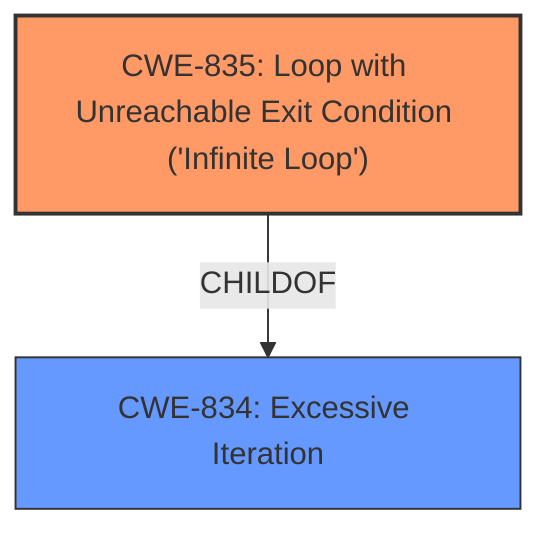

# Analysis Report for CVE-2020-12655

# Vulnerability Analysis Report: CVE-2020-12655

## Description


## Analysis (with Relationship Data)

# Summary
| CWE ID    | CWE Name                                        | Confidence | CWE Abstraction Level | CWE Vulnerability Mapping Label | CWE-Vulnerability Mapping Notes |
| --------- | ----------------------------------------------- | ---------- | --------------------- | ------------------------------- | ------------------------------- |
| CWE-835   | Loop with Unreachable Exit Condition ('Infinite Loop') | 0.8        | Base                  | Primary CWE                     | Allowed                       |

## Evidence and Confidence

*   **Confidence Score:** 0.8
*   **Evidence Strength:** MEDIUM

## Relationship Analysis
The primary relationship influencing the decision is that CWE-835 is a Base level CWE, which is preferred, and that the vulnerability description explicitly mentions a "system hang", which aligns with the potential impact of an infinite loop.



## Vulnerability Chain
The vulnerability chain starts with the **improper handling of crafted XFS v5 metadata**, leading to an **infinite loop** during file sync operations, ultimately causing a **denial of service** due to a system hang.

## Summary of Analysis
The initial analysis focused on identifying the root cause of the vulnerability, which is the kernel's insufficient handling of crafted XFS v5 metadata. This leads to a denial of service due to a system hang. The Retriever results suggested several CWEs, including CWE-835 (Loop with Unreachable Exit Condition ('Infinite Loop')).

The evidence from the CVE description and reference links supports the selection of CWE-835. Specifically, the description mentions "sync of excessive duration" and "system hang," which align with the characteristics of an infinite loop. The git commit message also highlights that the vulnerability leads to a system hang during sync operations.

> CVE Reference Links Content Summary:
> **Root cause of vulnerability:** The vulnerability lies in how the XFS filesystem handles crafted volumes. Specifically, crafted XFS volumes could trigger a system hang due to issues in metadata processing during sync operations.

The final decision to assign CWE-835 is based on the direct evidence of a system hang caused by crafted metadata, the Base level abstraction of the CWE, and the Allowed Usage designation.

Relevant CWE Information:

# Enhanced Context (25 CWEs)

## CWE-226: Sensitive Information in Resource Not Removed Before Reuse
**Abstraction Level**: Base
**Similarity Score**: 0.78
**Source**: dense

**Description**:
The product releases a resource such as memory or a file so that it can be made available for reuse, but it does not clear or "zeroize" the information contained in the resource before the product performs a critical state transition or makes the resource available for reuse by other entities.

**Mapping Guidance**:
- Usage: Allowed
- Rationale: This CWE entry is at the Base level of abstraction, which is a preferred level of abstraction for mapping to the root causes of vulnerabilities.

## CWE-404: Improper Resource Shutdown or Release
**Abstraction Level**: Class
**Similarity Score**: 0.77
**Source**: dense

**Description**:
The product does not release or incorrectly releases a resource before it is made available for re-use.

**Mapping Guidance**:
- Usage: Allowed-with-Review
- Rationale: This CWE entry is a Class and might have Base-level children that would be more appropriate

## CWE-667: Improper Locking
**Abstraction Level**: Class
**Similarity Score**: 0.77
**Source**: dense

**Description**:
The product does not properly acquire or release a lock on a resource, leading to unexpected resource state changes and behaviors.

**Mapping Guidance**:
- Usage: Allowed-with-Review
- Rationale: This CWE entry is a Class and might have Base-level children that would be more appropriate

## CWE-789: Memory Allocation with Excessive Size Value
**Abstraction Level**: Variant
**Similarity Score**: 0.76
**Source**: dense

**Description**:
The product allocates memory based on an untrusted, large size value, but it does not ensure that the size is within expected limits, allowing arbitrary amounts of memory to be allocated.

**Mapping Guidance**:
- Usage: Allowed
- Rationale: This CWE entry is at the Variant level of abstraction, which is a preferred level of abstraction for mapping to the root causes of vulnerabilities.

## CWE-909: Missing Initialization of Resource
**Abstraction Level**: Class
**Similarity Score**: 0.76
**Source**: dense

**Description**:
The product does not initialize a critical resource.

**Mapping Guidance**:
- Usage: Allowed-with-Review
- Rationale: This CWE entry is a Class and might have Base-level children that would be more appropriate

## CWE-1325: Improperly Controlled Sequential Memory Allocation
**Abstraction Level**: Base
**Similarity Score**: 0.76
**Source**: dense

**Description**:
The product manages a group of objects or resources and performs a separate memory allocation for each object, but it does not properly limit the total amount of memory that is consumed by all of the combined objects.

**Mapping Guidance**:
- Usage: Allowed
- Rationale: This CWE entry is at the Base level of abstraction, which is a preferred level of abstraction for mapping to the root causes of vulnerabilities.

## CWE-664: Improper Control of a Resource Through its Lifetime
**Abstraction Level**: Pillar
**Similarity Score**: 0.75
**Source**: dense

**Description**:
The product does not maintain or incorrectly maintains control over a resource throughout its lifetime of creation, use, and release.

**Mapping Guidance**:
- Usage: Discouraged
- Rationale: This CWE entry is high-level when lower-level children are available.

## CWE-665: Improper Initialization
**Abstraction Level**: Class
**Similarity Score**: 0.75
**Source**: dense

**Description**:
The product does not initialize or incorrectly initializes a resource, which might leave the resource in an unexpected state when it is accessed or used.

**Mapping Guidance**:
- Usage: Discouraged
- Rationale: This CWE entry is a level-1 Class (i.e., a child of a Pillar). It might have lower-level children that would be more appropriate

## CWE-131: Incorrect Calculation of Buffer Size
**Abstraction Level**: Base
**Similarity Score**: 0.75
**Source**: dense

**Description**:
The product does not correctly calculate the size to be used when allocating a buffer, which could lead to a buffer overflow.

**Mapping Guidance**:
- Usage: Allowed
- Rationale: This CWE entry is at the Base level of abstraction, which is a preferred level of abstraction for mapping to the root causes of vulnerabilities.

## CWE-908: Use of Uninitialized Resource
**Abstraction Level**: Base
**Similarity Score**: 0.74
**Source**: dense

**Description**:
The product uses or accesses a resource that has not been initialized.

**Mapping Guidance**:
- Usage: Allowed
- Rationale: This CWE entry is at the Base level of abstraction, which is a preferred level of abstraction for mapping to the root causes of vulnerabilities.

## CWE-789: Memory Allocation with Excessive Size Value
**Abstraction Level**: Variant
**Similarity Score**: 5604.53
**Source**: sparse

**Description**:
The product allocates memory based on an untrusted, large size value, but it does not ensure that the size is within expected limits, allowing arbitrary amounts of memory to be allocated.

**Mapping Guidance**:
- Usage: Allowed
- Rationale: This CWE entry is at the Variant level of abstraction, which is a preferred level of abstraction for mapping to the root causes of vulnerabilities.

## CWE-1325: Improperly Controlled Sequential Memory Allocation
**Abstraction Level**: Base
**Similarity Score**: 5519.08
**Source**: sparse

**Description**:
The product manages a group of objects or resources and performs a separate memory allocation for each object, but it does not properly limit the total amount of memory that is consumed by all of the combined objects.

**Mapping Guidance**:
- Usage: Allowed
- Rationale: This CWE entry is at the Base level of abstraction, which is a preferred level of abstraction for mapping to the root causes of vulnerabilities.

## CWE-835: Loop with Unreachable Exit Condition ('Infinite Loop')
**Abstraction Level**: Base
**Similarity Score**: 5459.35
**Source**: sparse

**Description**:
The product contains an iteration or loop with an exit condition that cannot be reached, i.e., an infinite loop.

**Mapping Guidance**:
- Usage: Allowed
- Rationale: This CWE entry is at the Base level of abstraction, which is a preferred level of abstraction for mapping to the root causes of vulnerabilities.

## CWE-770: Allocation of Resources Without Limits or Th


## CWE Relationship Analysis

Current CWEs represent these abstraction levels: .


### Vulnerability Chain Analysis

**Chain starting from CWE-667:**
- 667 (Improper Locking) - ROOT


**Chain starting from CWE-664:**
- 664 (Improper Control of a Resource Through its Lifetime) - ROOT


### CWE Relationship Diagram

```mermaid
graph TD
    classDef primary fill:#f96,stroke:#333,stroke-width:2px
    classDef secondary fill:#69f,stroke:#333
    classDef tertiary fill:#9e9,stroke:#333
```


*Report generated on 2025-04-02 11:34:31*
