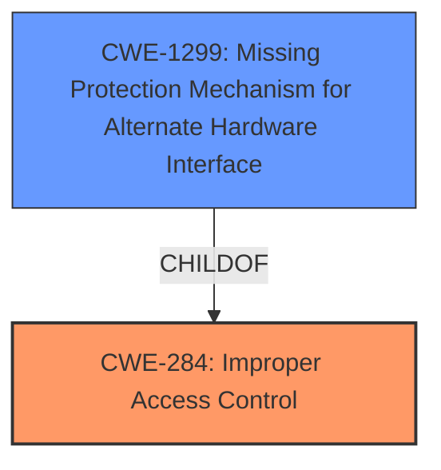

# Enhanced Analysis for CVE-2020-12729

# Summary
| CWE ID | CWE Name | Confidence | CWE Abstraction Level | CWE Vulnerability Mapping Label | CWE-Vulnerability Mapping Notes |
|---|---|---|---|---|---|
| CWE-284 | Improper Access Control | 0.75 | Pillar | Discouraged | The CWE is too high-level. |
| CWE-1299 | Missing Protection Mechanism for Alternate Hardware Interface | 0.75 | Base | Allowed | This CWE is a better fit because it explains the lack of protection on alternate paths to access control-protected assets. |

## Evidence and Confidence

*   **Confidence Score:** 0.75
*   **Evidence Strength:** MEDIUM

## Relationship Analysis
The primary relationship considered was the child-of relationship, specifically how CWE-1299 (Missing Protection Mechanism for Alternate Hardware Interface) is a child of CWE-284 (Improper Access Control). While the vulnerability description indicates a **lack of access control**, CWE-284 is a very high-level *Pillar* and the mapping guidance discourages its use. CWE-1299 offers a more specific explanation of the **lack of access control** by describing a missing protection mechanism for alternate paths to access control-protected assets.



## Vulnerability Chain
The vulnerability chain consists of a single point: the **lack of access control** leading to unauthorized reading of device descriptors.

## Summary of Analysis
The initial assessment considered CWE-284 due to the stated **lack of access control**. However, the mapping guidance for CWE-284 discourages its use because it is too high-level. After reviewing the retriever results, CWE-1299 (Missing Protection Mechanism for Alternate Hardware Interface) was identified as a more specific and appropriate match. It describes the **lack of protection** on alternate paths to access control-protected assets, which aligns well with the vulnerability description.
The provided evidence from the "Vulnerability Description Key Phrases" section indicates "**rootcause:** **lack of access control**" which supports the selection of CWE-1299.
The selection of CWE-1299 is at an optimal level of specificity because it's a *Base* level CWE and accurately represents the **lack of protection** on alternate access paths.

Relevant CWE Information:

# Enhanced Context (25 CWEs)
The following CWEs were identified as potentially relevant to this vulnerability:

## CWE-345: Insufficient Verification of Data Authenticity
**Abstraction Level**: Class
**Similarity Score**: 0.76
**Source**: dense

**Description**:
The product does not sufficiently verify the origin or authenticity of data, in a way that causes it to accept invalid data.

**Mapping Guidance**:
- Usage: Discouraged
- Rationale: This CWE entry is a level-1 Class (i.e., a child of a Pillar). It might have lower-level children that would be more appropriate


## CWE-1299: Missing Protection Mechanism for Alternate Hardware Interface
**Abstraction Level**: Base
**Similarity Score**: 0.76
**Source**: dense

**Description**:
The lack of protections on alternate paths to access
                control-protected assets (such as unprotected shadow registers
                and other external facing unguarded interfaces) allows an
                attacker to bypass existing protections to the asset that are
		only performed against the primary path.

**Mapping Guidance**:
- Usage: Allowed
- Rationale: This CWE entry is at the Base level of abstraction, which is a preferred level of abstraction for mapping to the root causes of vulnerabilities.


## CWE-404: Improper Resource Shutdown or Release
**Abstraction Level**: Class
**Similarity Score**: 0.76
**Source**: dense

**Description**:
The product does not release or incorrectly releases a resource before it is made available for re-use.

**Mapping Guidance**:
- Usage: Allowed-with-Review
- Rationale: This CWE entry is a Class and might have Base-level children that would be more appropriate


## CWE-1220: Insufficient Granularity of Access Control
**Abstraction Level**: Base
**Similarity Score**: 0.75
**Source**: dense

**Description**:
The product implements access controls via a policy or other feature with the intention to disable or restrict accesses (reads and/or writes) to assets in a system from untrusted agents. However, implemented access controls lack required granularity, which renders the control policy too broad because it allows accesses from unauthorized agents to the security-sensitive assets.

**Mapping Guidance**:
- Usage: Allowed
- Rationale: This CWE entry is at the Base level of abstraction, which is a preferred level of abstraction for mapping to the root causes of vulnerabilities.


## CWE-668: Exposure of Resource to Wrong Sphere
**Abstraction Level**: Class
**Similarity Score**: 0.75
**Source**: dense

**Description**:
The product exposes a resource to the wrong control sphere, providing unintended actors with inappropriate access to the resource.

**Mapping Guidance**:
- Usage: Discouraged
- Rationale: CWE-668 is high-level and is often misused as a catch-all when lower-level CWE IDs might be applicable. It is sometimes used for low-information vulnerability reports [REF-1287]. It is a level-1 Class (i.e., a child of a Pillar). It is not useful for trend analysis.


## CWE-667: Improper Locking
**Abstraction Level**: Class
**Similarity Score**: 0.75
**Source**: dense

**Description**:
The product does not properly acquire or release a lock on a resource, leading to unexpected resource state changes and behaviors.

**Mapping Guidance**:
- Usage: Allowed-with-Review
- Rationale: This CWE entry is a Class and might have Base-level children that would be more appropriate


## CWE-274: Improper Handling of Insufficient Privileges
**Abstraction Level**: Base
**Similarity Score**: 0.75
**Source**: dense

**Description**:
The product does not handle or incorrectly handles when it has insufficient privileges to perform an operation, leading to resultant weaknesses.

**Mapping Guidance**:
- Usage: Discouraged
- Rationale: This CWE entry could be deprecated in a future version of CWE.


## CWE-693: Protection Mechanism Failure
**Abstraction Level**: Pillar
**Similarity Score**: 0.75
**Source**: dense

**Description**:
The product does not use or incorrectly uses a protection mechanism that provides sufficient defense against directed attacks against the product.

**Mapping Guidance**:
- Usage: Discouraged
- Rationale: This CWE entry is extremely high-level, a Pillar.


## CWE-280: Improper Handling of Insufficient Permissions or Privileges 
**Abstraction Level**: Base
**Similarity Score**: 0.75
**Source**: dense

**Description**:
The product does not handle or incorrectly handles when it has insufficient privileges to access resources or functionality as specified by their permissions. This may cause it to follow unexpected code paths that may leave the product in an invalid state.

**Mapping Guidance**:
- Usage: Allowed
- Rationale: This CWE entry is at the Base level of abstraction, which is a preferred level of abstraction for mapping to the root causes of vulnerabilities.


## CWE-226: Sensitive Information in Resource Not Removed Before Reuse
**Abstraction Level**: Base
**Similarity Score**: 0.75
**Source**: dense

**Description**:
The product releases a resource such as memory or a file so that it can be made available for reuse, but it does not clear or "zeroize" the information contained in the resource before the product performs a critical state transition or makes the resource available for reuse by other entities.

**Mapping Guidance**:
- Usage: Allowed
- Rationale: This CWE entry is at the Base level of abstraction, which is a preferred level of abstraction for mapping to the root causes of vulnerabilities.


## CWE-1299: Missing Protection Mechanism for Alternate Hardware Interface
**Abstraction Level**: Base
**Similarity Score**: 5230.59
**Source**: sparse

**Description**:
The lack of protections on alternate paths to access
                control-protected assets (such as unprotected shadow registers
                and other external facing unguarded interfaces) allows an
                attacker to bypass existing protections to the asset that are
		only performed against the primary path.

**Mapping Guidance**:
- Usage: Allowed
- Rationale: This CWE entry is at the Base level of abstraction, which is a preferred level of abstraction for mapping to the root causes of vulnerabilities.


## CWE-119: Improper Restriction of Operations within the Bounds of a Memory Buffer
**Abstraction Level**: Class
**Similarity Score**: 5071.53
**Source**: sparse

**Description**:
The product performs operations on a memory buffer, but it reads from or writes to a memory location outside the buffer


## CWE Relationship Analysis

Current CWEs represent these abstraction levels: .


### Vulnerability Chain Analysis

**Chain starting from CWE-667:**
- 667 (Improper Locking) - ROOT


**Chain starting from CWE-404:**
- 404 (Improper Resource Shutdown or Release) - ROOT


### CWE Relationship Diagram

```mermaid
graph TD
    classDef primary fill:#f96,stroke:#333,stroke-width:2px
    classDef secondary fill:#69f,stroke:#333
    classDef tertiary fill:#9e9,stroke:#333
```