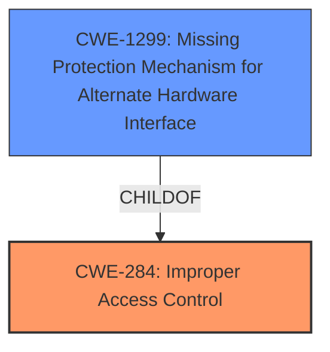

# Analysis for CVE-2020-12729

# Summary
| CWE ID | CWE Name | Confidence | CWE Abstraction Level | CWE Vulnerability Mapping Label | CWE-Vulnerability Mapping Notes |
|---|---|---|---|---|---|
| CWE-284 | Improper Access Control | 0.75 | Pillar | Discouraged | The CWE is too high-level. |
| CWE-1299 | Missing Protection Mechanism for Alternate Hardware Interface | 0.75 | Base | Allowed | This CWE is a better fit because it explains the lack of protection on alternate paths to access control-protected assets. |

## Evidence and Confidence

*   **Confidence Score:** 0.75
*   **Evidence Strength:** MEDIUM

## Relationship Analysis
The primary relationship considered was the child-of relationship, specifically how CWE-1299 (Missing Protection Mechanism for Alternate Hardware Interface) is a child of CWE-284 (Improper Access Control). While the vulnerability description indicates a **lack of access control**, CWE-284 is a very high-level *Pillar* and the mapping guidance discourages its use. CWE-1299 offers a more specific explanation of the **lack of access control** by describing a missing protection mechanism for alternate paths to access control-protected assets.

## Vulnerability Chain
The vulnerability chain consists of a single point: the **lack of access control** leading to unauthorized reading of device descriptors.

## Summary of Analysis
The initial assessment considered CWE-284 due to the stated **lack of access control**. However, the mapping guidance for CWE-284 discourages its use because it is too high-level. After reviewing the retriever results, CWE-1299 (Missing Protection Mechanism for Alternate Hardware Interface) was identified as a more specific and appropriate match. It describes the **lack of protection** on alternate paths to access control-protected assets, which aligns well with the vulnerability description.
The provided evidence from the "Vulnerability Description Key Phrases" section indicates "**rootcause:** **lack of access control**" which supports the selection of CWE-1299.
The selection of CWE-1299 is at an optimal level of specificity because it's a *Base* level CWE and accurately represents the **lack of protection** on alternate access paths.

Relevant CWE Information:

# Enhanced Context (25 CWEs)
The following CWEs were identified as potentially relevant to this vulnerability:

## CWE-345: Insufficient Verification of Data Authenticity
**Abstraction Level**: Class
**Similarity Score**: 0.76
**Source**: dense

**Description**:
The product does not sufficiently verify the origin or authenticity of data, in a way that causes it to accept invalid data.

**Mapping Guidance**:
- Usage: Discouraged
- Rationale: This CWE entry is a level-1 Class (i.e., a child of a Pillar). It might have lower-level children that would be more appropriate

## CWE-1299: Missing Protection Mechanism for Alternate Hardware Interface
**Abstraction Level**: Base
**Similarity Score**: 0.76
**Source**: dense

**Description**:
The lack of protections on alternate paths to access
                control-protected assets (such as unprotected shadow registers
                and other external facing unguarded interfaces) allows an
                attacker to bypass existing protections to the asset that are
		only performed against the primary path.

**Mapping Guidance**:
- Usage: Allowed
- Rationale: This CWE entry is at the Base level of abstraction, which is a preferred level of abstraction for mapping to the root causes of vulnerabilities.

## CWE-404: Improper Resource Shutdown or Release
**Abstraction Level**: Class
**Similarity Score**: 0.76
**Source**: dense

**Description**:
The product does not release or incorrectly releases a resource before it is made available for re-use.

**Mapping Guidance**:
- Usage: Allowed-with-Review
- Rationale: This CWE entry is a Class and might have Base-level children that would be more appropriate

## CWE-1220: Insufficient Granularity of Access Control
**Abstraction Level**: Base
**Similarity Score**: 0.75
**Source**: dense

**Description**:
The product implements access controls via a policy or other feature with the intention to disable or restrict accesses (reads and/or writes) to assets in a system from untrusted agents. However, implemented access controls lack required granularity, which renders the control policy too broad because it allows accesses from unauthorized agents to the security-sensitive assets.

**Mapping Guidance**:
- Usage: Allowed
- Rationale: This CWE entry is at the Base level of abstraction, which is a preferred level of abstraction for mapping to the root causes of vulnerabilities.

## CWE-668: Exposure of Resource to Wrong Sphere
**Abstraction Level**: Class
**Similarity Score**: 0.75
**Source**: dense

**Description**:
The product exposes a resource to the wrong control sphere, providing unintended actors with inappropriate access to the resource.

**Mapping Guidance**:
- Usage: Discouraged
- Rationale: CWE-668 is high-level and is often misused as a catch-all when lower-level CWE IDs might be applicable. It is sometimes used for low-information vulnerability reports [REF-1287]. It is a level-1 Class (i.e., a child of a Pillar). It is not useful for trend analysis.

## CWE-667: Improper Locking
**Abstraction Level**: Class
**Similarity Score**: 0.75
**Source**: dense

**Description**:
The product does not properly acquire or release a lock on a resource, leading to unexpected resource state changes and behaviors.

**Mapping Guidance**:
- Usage: Allowed-with-Review
- Rationale: This CWE entry is a Class and might have Base-level children that would be more appropriate

## CWE-274: Improper Handling of Insufficient Privileges
**Abstraction Level**: Base
**Similarity Score**: 0.75
**Source**: dense

**Description**:
The product does not handle or incorrectly handles when it has insufficient privileges to perform an operation, leading to resultant weaknesses.

**Mapping Guidance**:
- Usage: Discouraged
- Rationale: This CWE entry could be deprecated in a future version of CWE.

## CWE-693: Protection Mechanism Failure
**Abstraction Level**: Pillar
**Similarity Score**: 0.75
**Source**: dense

**Description**:
The product does not use or incorrectly uses a protection mechanism that provides sufficient defense against directed attacks against the product.

**Mapping Guidance**:
- Usage: Discouraged
- Rationale: This CWE entry is extremely high-level, a Pillar.

## CWE-280: Improper Handling of Insufficient Permissions or Privileges 
**Abstraction Level**: Base
**Similarity Score**: 0.75
**Source**: dense

**Description**:
The product does not handle or incorrectly handles when it has insufficient privileges to access resources or functionality as specified by their permissions. This may cause it to follow unexpected code paths that may leave the product in an invalid state.

**Mapping Guidance**:
- Usage: Allowed
- Rationale: This CWE entry is at the Base level of abstraction, which is a preferred level of abstraction for mapping to the root causes of vulnerabilities.

## CWE-226: Sensitive Information in Resource Not Removed Before Reuse
**Abstraction Level**: Base
**Similarity Score**: 0.75
**Source**: dense

**Description**:
The product releases a resource such as memory or a file so that it can be made available for reuse, but it does not clear or "zeroize" the information contained in the resource before the product performs a critical state transition or makes the resource available for reuse by other entities.

**Mapping Guidance**:
- Usage: Allowed
- Rationale: This CWE entry is at the Base level of abstraction, which is a preferred level of abstraction for mapping to the root causes of vulnerabilities.

## CWE-1299: Missing Protection Mechanism for Alternate Hardware Interface
**Abstraction Level**: Base
**Similarity Score**: 5230.59
**Source**: sparse

**Description**:
The lack of protections on alternate paths to access
                control-protected assets (such as unprotected shadow registers
                and other external facing unguarded interfaces) allows an
                attacker to bypass existing protections to the asset that are
		only performed against the primary path.

**Mapping Guidance**:
- Usage: Allowed
- Rationale: This CWE entry is at the Base level of abstraction, which is a preferred level of abstraction for mapping to the root causes of vulnerabilities.

## CWE-119: Improper Restriction of Operations within the Bounds of a Memory Buffer
**Abstraction Level**: Class
**Similarity Score**: 5071.53
**Source**: sparse

**Description**:
The product performs operations on a memory buffer, but it reads from or writes to a memory location outside the buffer

# Enhanced Query for CVE-2020-12729

## Vulnerability Description
MagicMotion Flamingo 2 has a **lack of access control** for reading from device descriptors.

### Vulnerability Description Key Phrases
- **rootcause:** **lack of access control**
- **impact:** read from device descriptors
- **product:** MagicMotion Flamingo
- **version:** 2

## CVE Reference Links Content Summary
UNRELATED

## Retriever Results

### Top Combined Results

| Rank | CWE ID | Name | Abstraction | Usage  | Retrievers | Individual Scores |
|------|--------|------|-------------|-------|------------|-------------------|
| 1 | 1299 | Missing Protection Mechanism for Alternate Hardware Interface | Base | Allowed | sparse | 0.110 |
| 2 | 284 | Improper Access Control | Pillar | Discouraged | sparse | 0.109 |
| 3 | 403 | Exposure of File Descriptor to Unintended Control Sphere ('File Descriptor Leak') | Base | Allowed | sparse | 0.107 |
| 4 | 119 | Improper Restriction of Operations within the Bounds of a Memory Buffer | Class | Discouraged | sparse | 0.106 |
| 5 | 1220 | Insufficient Granularity of Access Control | Base | Allowed | sparse | 0.104 |
| 6 | 921 | Storage of Sensitive Data in a Mechanism without Access Control | Base | Allowed | dense | 0.478 |
| 7 | 1260 | Improper Handling of Overlap Between Protected Memory Ranges | Base | Allowed | graph | 0.003 |
| 8 | 732 | Incorrect Permission Assignment for Critical Resource | Class | Allowed-with-Review | sparse | 0.099 |
| 9 | 306 | Missing Authentication for Critical Function | Base | Allowed | sparse | 0.097 |
| 10 | 347 | Improper Verification of Cryptographic Signature | Base | Allowed | sparse | 0.096 |

# Complete CWE Specifications

## CWE-1299: Missing Protection Mechanism for Alternate Hardware Interface
**Abstraction:** Base
**Status:** Draft

### Description
The lack of protections on alternate paths to access
                control-protected assets (such as unprotected shadow registers
                and other external facing unguarded interfaces) allows an
                attacker to bypass existing protections to the asset that are
		only performed against the primary path.

### Extended Description

An asset inside a chip might have access-control protections through one interface. However, if all paths to the asset are not protected, an attacker might compromise the asset through alternate paths. These alternate paths could be through shadow or mirror registers inside the IP core, or could be paths from other external-facing interfaces to the IP core or SoC.

Consider an SoC with various interfaces such as UART, SMBUS, PCIe, USB, etc. If access control is implemented for SoC internal registers only over the PCIe interface, then an attacker could still modify the SoC internal registers through alternate paths by coming through interfaces such as UART, SMBUS, USB, etc. 

Alternatively, attackers might be able to bypass existing protections by exploiting unprotected, shadow registers. Shadow registers and mirror registers typically refer to registers that can be accessed from multiple addresses. Writing to or reading from the aliased/mirrored address has the same effect as writing to the address of the main register. They are typically implemented within an IP core or SoC to temporarily hold certain data. These data will later be updated to the main register, and both registers will be in synch. If the shadow registers are not access-protected, attackers could simply initiate transactions to the shadow registers and compromise system security. 

### Alternative Terms
None

### Relationships
PeerOf -> CWE-1191
ChildOf -> CWE-420
ChildOf -> CWE-288

### Mapping Guidance
**Usage:** Allowed
**Rationale:** This CWE entry is at the Base level of abstraction, which is a preferred level of abstraction for mapping to the root causes of vulnerabilities.
**Comments:** Carefully read both the name and description to ensure that this mapping is an appropriate fit. Do not try to 'force' a mapping to a lower-level Base/Variant simply to comply with this preferred level of abstraction.
**Reasons:**
- Acceptable-Use

### Observed Examples
- **CVE-2022-38399:** Missing protection mechanism on serial connection allows for arbitrary OS command execution.
- **CVE-2020-9285:** Mini-PCI Express slot does not restrict direct memory access.
- **CVE-2020-8004:** When the internal flash is protected by blocking access on the Data Bus (DBUS), it can still be indirectly accessed through the Instruction Bus (IBUS).

## CWE-284: Improper Access Control
**Abstraction:** Pillar
**Status:** Incomplete

### Description
The product does not restrict or incorrectly restricts access to a resource from an unauthorized actor.

### Extended Description

Access control involves the use of several protection mechanisms such as:

  - Authentication (proving the identity of an actor)

  - Authorization (ensuring that a given actor can access a resource), and

  - Accountability (tracking of activities that were performed)

When any mechanism is not applied or otherwise fails, attackers can compromise the security of the product by gaining privileges, reading sensitive information, executing commands, evading detection, etc.

There are two distinct behaviors that can introduce access control weaknesses:

  - Specification: incorrect privileges, permissions, ownership, etc. are explicitly specified for either the user or the resource (for example, setting a password file to be world-writable, or giving administrator capabilities to a guest user). This action could be performed by the program or the administrator.

  - Enforcement: the mechanism contains errors that prevent it from properly enforcing the specified access control requirements (e.g., allowing the user to specify their own privileges, or allowing a syntactically-incorrect ACL to produce insecure settings). This problem occurs within the program itself, in that it does not actually enforce the intended security policy that the administrator specifies.

### Alternative Terms
Authorization: The terms "access control" and "authorization" are often used interchangeably, although many people have distinct definitions. The CWE usage of "access control" is intended as a general term for the various mechanisms that restrict which users can access which resources, and "authorization" is more narrowly defined. It is unlikely that there will be community consensus on the use of these terms.

### Relationships
None

### Mapping Guidance
**Usage:** Discouraged
**Rationale:** CWE-284 is extremely high-level, a Pillar. Its name, "Improper Access Control," is often misused in low-information vulnerability reports [REF-1287] or by active use of the OWASP Top Ten, such as "A01:2021-Broken Access Control". It is not useful for trend analysis.
**Comments:** Consider using descendants of CWE-284 that are more specific to the kind of access control involved, such as those involving authorization (Missing Authorization (CWE-862), Incorrect Authorization (CWE-863), Incorrect Permission Assignment for Critical Resource (CWE-732), etc.); authentication (Missing Authentication (CWE-306) or Weak Authentication (CWE-1390)); Incorrect User Management (CWE-286); Improper Restriction of Communication Channel to Intended Endpoints (CWE-923); etc.
**Reasons:**
- Frequent Misuse
- Abstraction
**Suggested Alternatives:**
- CWE-862: Missing Authorization
- CWE-863: Incorrect Authorization
- CWE-732: Incorrect Permission Assignment for Critical Resource
- CWE-306: Missing Authentication
- CWE-1390: Weak Authentication
- CWE-923: Improper Restriction of Communication Channel to Intended Endpoints

### Additional Notes
**[Maintenance]** 

This entry needs more work. Possible sub-categories include:

  - Trusted group includes undesired entities (partially covered by CWE-286)

  - Group can perform undesired actions

  - ACL parse error does not fail closed

### Observed Examples
- **CVE-2022-24985:** A form hosting website only checks the session authentication status for a single form, making it possible to bypass authentication when there are multiple forms
- **CVE-2022-29238:** Access-control setting in web-based document collaboration tool is not properly implemented by the code, which prevents listing hidden directories but does not prevent direct requests to files in those directories.
- **CVE-2022-23607:** Python-based HTTP library did not scope cookies to a particular domain such that "supercookies" could be sent to any domain on redirect

## CWE-403: Exposure of File Descriptor to Unintended Control Sphere ('File Descriptor Leak')
**Abstraction:** Base
**Status:** Draft

### Description
A process does not close sensitive file descriptors before invoking a child process, which allows the child to perform unauthorized I/O operations using those descriptors.

### Extended Description
When a new process is forked or executed, the child process inherits any open file descriptors. When the child process has fewer privileges than the parent process, this might introduce a vulnerability if the child process can access the file descriptor but does not have the privileges to access the associated file.

### Alternative Terms
File descriptor leak: While this issue is frequently called a file descriptor leak, the "leak" term is often used in two different ways - exposure of a resource, or consumption of a resource. Use of this term could cause confusion.

### Relationships
ChildOf -> CWE-402

### Mapping Guidance
**Usage:** Allowed
**Rationale:** This CWE entry is at the Base level of abstraction, which is a preferred level of abstraction for mapping to the root causes of vulnerabilities.
**Comments:** Carefully read both the name and description to ensure that this mapping is an appropriate fit. Do not try to 'force' a mapping to a lower-level Base/Variant simply to comply with this preferred level of abstraction.
**Reasons:**
- Acceptable-Use

### Observed Examples
- **CVE-2003-0740:** Server leaks a privileged file descriptor, allowing the server to be hijacked.
- **CVE-2004-1033:** File descriptor leak allows read of restricted files.
- **CVE-2000-0094:** Access to restricted resource using modified file descriptor for stderr.

## CWE-119: Improper Restriction of Operations within the Bounds of a Memory Buffer
**Abstraction:** Class
**Status:** Stable

### Description
The product performs operations on a memory buffer, but it reads from or writes to a memory location outside the buffer's intended boundary. This may result in read or write operations on unexpected memory locations that could be linked to other variables, data structures, or internal program data.

### Extended Description
Not provided

### Alternative Terms
Buffer Overflow: This term has many different meanings to different audiences. From a CWE mapping perspective, this term should be avoided where possible. Some researchers, developers, and tools intend for it to mean "write past the end of a buffer," whereas others use the same term to mean "any read or write outside the boundaries of a buffer, whether before the beginning of the buffer or after the end of the buffer." Others could mean "any action after the end of a buffer, whether it is a read or write." Since the term is commonly used for exploitation and for vulnerabilities, it further confuses things.
buffer overrun: Some prominent vendors and researchers use the term "buffer overrun," but most people use "buffer overflow." See the alternate term for "buffer overflow" for context.
memory safety: Generally used for techniques that avoid weaknesses related to memory access, such as those identified by CWE-119 and its descendants. However, the term is not formal, and there is likely disagreement between practitioners as to which weaknesses are implicitly covered by the "memory safety" term.

### Relationships
ChildOf -> CWE-118
ChildOf -> CWE-20

### Mapping Guidance
**Usage:** Discouraged
**Rationale:** CWE-119 is commonly misused in low-information vulnerability reports when lower-level CWEs could be used instead, or when more details about the vulnerability are available.
**Comments:** Look at CWE-119's children and consider mapping to CWEs such as CWE-787: Out-of-bounds Write, CWE-125: Out-of-bounds Read, or others.
**Reasons:**
- Frequent Misuse

### Additional Notes
**[Applicable Platform]** 

It is possible in any programming languages without memory management support to attempt an operation outside of the bounds of a memory buffer, but the consequences will vary widely depending on the language, platform, and chip architecture.

### Observed Examples
- **CVE-2021-22991:** Incorrect URI normalization in application traffic product leads to buffer overflow, as exploited in the wild per CISA KEV.
- **CVE-2020-29557:** Buffer overflow in Wi-Fi router web interface, as exploited in the wild per CISA KEV.
- **CVE-2009-2550:** Classic stack-based buffer overflow in media player using a long entry in a playlist

## CWE-1220: Insufficient Granularity of Access Control
**Abstraction:** Base
**Status:** Incomplete

### Description
The product implements access controls via a policy or other feature with the intention to disable or restrict accesses (reads and/or writes) to assets in a system from untrusted agents. However, implemented access controls lack required granularity, which renders the control policy too broad because it allows accesses from unauthorized agents to the security-sensitive assets.

### Extended Description

Integrated circuits and hardware engines can expose accesses to assets (device configuration, keys, etc.) to trusted firmware or a software module (commonly set by BIOS/bootloader). This access is typically access-controlled. Upon a power reset, the hardware or system usually starts with default values in registers, and the trusted firmware (Boot firmware) configures the necessary access-control protection.

A common weakness that can exist in such protection schemes is that access controls or policies are not granular enough. This condition allows agents beyond trusted agents to access assets and could lead to a loss of functionality or the ability to set up the device securely. This further results in security risks from leaked, sensitive, key material to modification of device configuration.

### Alternative Terms
None

### Relationships
ChildOf -> CWE-284

### Mapping Guidance
**Usage:** Allowed
**Rationale:** This CWE entry is at the Base level of abstraction, which is a preferred level of abstraction for mapping to the root causes of vulnerabilities.
**Comments:** Carefully read both the name and description to ensure that this mapping is an appropriate fit. Do not try to 'force' a mapping to a lower-level Base/Variant simply to comply with this preferred level of abstraction.
**Reasons:**
- Acceptable-Use

### Observed Examples
- **CVE-2022-24985:** A form hosting website only checks the session authentication status for a single form, making it possible to bypass authentication when there are multiple forms
- **CVE-2021-36934:** An operating system has an overly permission Access Control List onsome system files, including those related to user passwords

## CWE-921: Storage of Sensitive Data in a Mechanism without Access Control
**Abstraction:** Base
**Status:** Incomplete

### Description
The product stores sensitive information in a file system or device that does not have built-in access control.

### Extended Description

While many modern file systems or devices utilize some form of access control in order to restrict access to data, not all storage mechanisms have this capability. For example, memory cards, floppy disks, CDs, and USB devices are typically made accessible to any user within the system. This can become a problem when sensitive data is stored in these mechanisms in a multi-user environment, because anybody on the system can read or write this data.

On Android devices, external storage is typically globally readable and writable by other applications on the device. External storage may also be easily accessible through the mobile device's USB connection or physically accessible through the device's memory card port.

### Alternative Terms
None

### Relationships
ChildOf -> CWE-922

### Mapping Guidance
**Usage:** Allowed
**Rationale:** This CWE entry is at the Base level of abstraction, which is a preferred level of abstraction for mapping to the root causes of vulnerabilities.
**Comments:** Carefully read both the name and description to ensure that this mapping is an appropriate fit. Do not try to 'force' a mapping to a lower-level Base/Variant simply to comply with this preferred level of abstraction.
**Reasons:**
- Acceptable-Use

## CWE-1260: Improper Handling of Overlap Between Protected Memory Ranges
**Abstraction:** Base
**Status:** Stable

### Description
The product allows address regions to overlap, which can result in the bypassing of intended memory protection.

### Extended Description

Isolated memory regions and access control (read/write) policies are used by hardware to protect privileged software. Software components are often allowed to change or remap memory region definitions in order to enable flexible and dynamically changeable memory management by system software.

If a software component running at lower privilege can program a memory address region to overlap with other memory regions used by software running at higher privilege, privilege escalation may be available to attackers. The memory protection unit (MPU) logic can incorrectly handle such an address overlap and allow the lower-privilege software to read or write into the protected memory region, resulting in privilege escalation attack. An address overlap weakness can also be used to launch a denial of service attack on the higher-privilege software memory regions.

### Alternative Terms
None

### Relationships
ChildOf -> CWE-284
CanPrecede -> CWE-119

### Mapping Guidance
**Usage:** Allowed
**Rationale:** This CWE entry is at the Base level of abstraction, which is a preferred level of abstraction for mapping to the root causes of vulnerabilities.
**Comments:** Carefully read both the name and description to ensure that this mapping is an appropriate fit. Do not try to 'force' a mapping to a lower-level Base/Variant simply to comply with this preferred level of abstraction.
**Reasons:**
- Acceptable-Use

### Additional Notes
**[Maintenance]** As of CWE 4.6, CWE-1260 and CWE-1316 are siblings under view 1000, but CWE-1260 might be a parent of CWE-1316. More analysis is warranted.

### Observed Examples
- **CVE-2008-7096:** virtualization product allows compromise of hardware product by accessing certain remapping registers.
- **[REF-1100]:** processor design flaw allows ring 0 code to access more privileged rings by causing a register window to overlap a range of protected system RAM [REF-1100]

## CWE-732: Incorrect Permission Assignment for Critical Resource
**Abstraction:** Class
**Status:** Draft

### Description
The product specifies permissions for a security-critical resource in a way that allows that resource to be read or modified by unintended actors.

### Extended Description
When a resource is given a permission setting that provides access to a wider range of actors than required, it could lead to the exposure of sensitive information, or the modification of that resource by unintended parties. This is especially dangerous when the resource is related to program configuration, execution, or sensitive user data. For example, consider a misconfigured storage account for the cloud that can be read or written by a public or anonymous user.

### Alternative Terms
None

### Relationships
ChildOf -> CWE-285
ChildOf -> CWE-668

### Mapping Guidance
**Usage:** Allowed-with-Review
**Rationale:** While the name itself indicates an assignment of permissions for resources, this is often misused for vulnerabilities in which "permissions" are not checked, which is an "authorization" weakness (CWE-285 or descendants) within CWE's model [REF-1287].
**Comments:** Closely analyze the specific mistake that is allowing the resource to be exposed, and perform a CWE mapping for that mistake.
**Reasons:**
- Frequent Misuse

### Additional Notes
**[Maintenance]** The relationships between privileges, permissions, and actors (e.g. users and groups) need further refinement within the Research view. One complication is that these concepts apply to two different pillars, related to control of resources (CWE-664) and protection mechanism failures (CWE-693).

### Observed Examples
- **CVE-2022-29527:** Go application for cloud management creates a world-writable sudoers file that allows local attackers to inject sudo rules and escalate privileges to root by winning a race condition.
- **CVE-2009-3482:** Anti-virus product sets insecure "Everyone: Full Control" permissions for files under the "Program Files" folder, allowing attackers to replace executables with Trojan horses.
- **CVE-2009-3897:** Product creates directories with 0777 permissions at installation, allowing users to gain privileges and access a socket used for authentication.

## CWE-306: Missing Authentication for Critical Function
**Abstraction:** Base
**Status:** Draft

### Description
The product does not perform any authentication for functionality that requires a provable user identity or consumes a significant amount of resources.

### Extended Description
Not provided

### Alternative Terms
None

### Relationships
ChildOf -> CWE-287
ChildOf -> CWE-287

### Mapping Guidance
**Usage:** Allowed
**Rationale:** This CWE entry is at the Base level of abstraction, which is a preferred level of abstraction for mapping to the root causes of vulnerabilities.
**Comments:** Carefully read both the name and description to ensure that this mapping is an appropriate fit. Do not try to 'force' a mapping to a lower-level Base/Variant simply to comply with this preferred level of abstraction.
**Reasons:**
- Acceptable-Use

### Observed Examples
- **CVE-2022-31260:** Chain: a digital asset management program has an undisclosed backdoor in the legacy version of a PHP script (CWE-912) that could allow an unauthenticated user to export metadata (CWE-306)
- **CVE-2022-29951:** TCP-based protocol in Programmable Logic Controller (PLC) has no authentication.
- **CVE-2022-29952:** Condition Monitor firmware uses a protocol that does not require authentication.

## CWE-347: Improper Verification of Cryptographic Signature
**Abstraction:** Base
**Status:** Draft

### Description
The product does not verify, or incorrectly verifies, the cryptographic signature for data.

### Extended Description
Not provided

### Alternative Terms
None

### Relationships
ChildOf -> CWE-345
ChildOf -> CWE-345

### Mapping Guidance
**Usage:** Allowed
**Rationale:** This CWE entry is at the Base level of abstraction, which is a preferred level of abstraction for mapping to the root causes of vulnerabilities.
**Comments:** Carefully read both the name and description to ensure that this mapping is an appropriate fit. Do not try to 'force' a mapping to a lower-level Base/Variant simply to comply with this preferred level of abstraction.
**Reasons:**
- Acceptable-Use

### Observed Examples
- **CVE-2002-1796:** Does not properly verify signatures for "trusted" entities.
- **CVE-2005-2181:** Insufficient verification allows spoofing.
- **CVE-2005-2182:** Insufficient verification allows spoofing.

