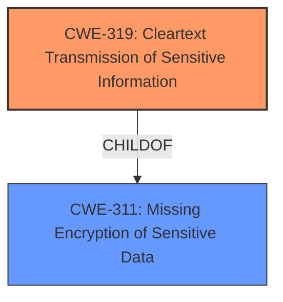

# Enhanced Analysis for CVE-2020-12730

# Summary
| CWE ID | CWE Name | Confidence | CWE Abstraction Level | CWE Vulnerability Mapping Label | CWE-Vulnerability Mapping Notes |
|---|---|---|---|---|---|
| CWE-319 | Cleartext Transmission of Sensitive Information | 1.0 | Base | Allowed | Primary CWE |

## Evidence and Confidence

*   **Confidence Score:** 1.0
*   **Evidence Strength:** HIGH

## Relationship Analysis
The primary relationship considered was the ChildOf relationship. CWE-319 (Cleartext Transmission of Sensitive Information) is a Base level CWE, which is the preferred level. This CWE is child of CWE-311 (Missing Encryption of Sensitive Data). The vulnerability clearly describes sensitive information being transmitted without encryption, making CWE-319 the most appropriate choice.



## Vulnerability Chain
The vulnerability chain consists of the **lack of BLE encryption** (CWE-319) leading to data sniffing and packet forgery. The **lack of encryption** is the root cause, and the sniffing and forgery are the impacts.

## Summary of Analysis
The initial analysis strongly suggests CWE-319 (Cleartext Transmission of Sensitive Information) as the primary CWE.

The **Vulnerability Description** states the product "MagicMotion Flamingo 2 **lacks BLE encryption**, enabling data sniffing and packet forgery." The **Vulnerability Description Key Phrases** section reinforces this by highlighting "**lacks BLE encryption**" as the **rootcause** and "data sniffing and packet forgery" as the impact. The **rootcause** matches the CWE-319 description: "The product transmits sensitive or security-critical data in cleartext in a communication channel that can be sniffed by unauthorized actors."

The Retriever Results list CWE-319 as the top combined result. The **Abstraction** level is Base, and the **Usage** is Allowed, aligning with preferred mapping practices.

The relationships show that CWE-319 is a child of CWE-311 (Missing Encryption of Sensitive Data), which is a more general category. Given the specific mention of cleartext transmission, CWE-319 is the more appropriate choice.

The evidence supports mapping this vulnerability to CWE-319 with high confidence. The selected CWE is at the optimal level of specificity, accurately representing the weakness and its impact.

Relevant CWE Information:

# Enhanced Context (25 CWEs)
The following CWEs were identified as potentially relevant to this vulnerability:

## CWE-757: Selection of Less-Secure Algorithm During Negotiation ('Algorithm Downgrade')
**Abstraction Level**: Base
**Similarity Score**: 0.82
**Source**: dense

**Description**:
A protocol or its implementation supports interaction between multiple actors and allows those actors to negotiate which algorithm should be used as a protection mechanism such as encryption or authentication, but it does not select the strongest algorithm that is available to both parties.

**Mapping Guidance**:
- Usage: Allowed
- Rationale: This CWE entry is at the Base level of abstraction, which is a preferred level of abstraction for mapping to the root causes of vulnerabilities.

**Why Not Used:** This vulnerability description indicates a **lack of encryption**, not the selection of a less secure algorithm.

## CWE-1240: Use of a Cryptographic Primitive with a Risky Implementation
**Abstraction Level**: Base
**Similarity Score**: 0.77
**Source**: dense

**Description**:
To fulfill the need for a cryptographic primitive, the product implements a cryptographic algorithm using a non-standard, unproven, or disallowed/non-compliant cryptographic implementation.

**Mapping Guidance**:
- Usage: Allowed
- Rationale: This CWE entry is at the Base level of abstraction, which is a preferred level of abstraction for mapping to the root causes of vulnerabilities.

**Why Not Used:** This vulnerability description indicates a **lack of encryption**, not a risky implementation.

## CWE-345: Insufficient Verification of Data Authenticity
**Abstraction Level**: Class
**Similarity Score**: 0.77
**Source**: dense

**Description**:
The product does not sufficiently verify the origin or authenticity of data, in a way that causes it to accept invalid data.

**Mapping Guidance**:
- Usage: Discouraged
- Rationale: This CWE entry is a level-1 Class (i.e., a child of a Pillar). It might have lower-level children that would be more appropriate

**Why Not Used:** The vulnerability is due to a **lack of encryption**, not insufficient verification of data authenticity.

## CWE-1391: Use of Weak Credentials
**Abstraction Level**: Class
**Similarity Score**: 0.76
**Source**: dense

**Description**:
The product uses weak credentials (such as a default key or hard-coded password) that can be calculated, derived, reused, or guessed by an attacker.

**Mapping Guidance**:
- Usage: Allowed-with-Review
- Rationale: This CWE entry is a Class and might have Base-level children that would be more appropriate

**Why Not Used:** The vulnerability is due to a **lack of encryption**, not the use of weak credentials.

## CWE-203: Observable Discrepancy
**Abstraction Level**: Base
**Similarity Score**: 0.76
**Source**: dense

**Description**:
The product behaves differently or sends different responses under different circumstances in a way that is observable to an unauthorized actor, which exposes security-relevant information about the state of the product, such as whether a particular operation was successful or not.

**Mapping Guidance**:
- Usage: Allowed
- Rationale: This CWE entry is at the Base level of abstraction, which is a preferred level of abstraction for mapping to the root causes of vulnerabilities.

**Why Not Used:** The vulnerability is due to a **lack of encryption**, not an observable discrepancy.

## CWE-807: Reliance on Untrusted Inputs in a Security Decision
**Abstraction Level**: Base
**Similarity Score**: 0.76
**Source**: dense

**Description**:
The product uses a protection mechanism that relies on the existence or values of an input, but the input can be modified by an untrusted actor in a way that bypasses the protection mechanism.

**Mapping Guidance**:
- Usage: Allowed
- Rationale: This CWE entry is at the Base level of abstraction, which is a preferred level of abstraction for mapping to the root causes of vulnerabilities.

**Why Not Used:** The vulnerability is due to a **lack of encryption**, not reliance on untrusted inputs.

## CWE-330: Use of Insufficiently Random Values
**Abstraction Level**: Class
**Similarity Score**: 0.76
**Source**: dense

**Description**:
The product uses insufficiently random numbers or values in a security context that depends on unpredictable numbers.

**Mapping Guidance**:
- Usage: Discouraged
- Rationale: This CWE entry is a level-1 Class (i.e., a child of a Pillar). It might have lower-level children that would be more appropriate

**Why Not Used:** The vulnerability is due to a **lack of encryption**, not the use of insufficiently random values.

## CWE-703: Improper Check or Handling of Exceptional Conditions
**Abstraction Level**: Pillar
**Similarity Score**: 0.76
**Source**: dense

**Description**:
The product does not properly anticipate or handle exceptional conditions that rarely occur during normal operation of the product.

**Mapping Guidance**:
- Usage: Discouraged
- Rationale: This CWE entry is extremely high-level, a Pillar.

**Why Not Used:** The vulnerability is due to a **lack of encryption**, not improper handling of exceptional conditions.

## CWE-319: Cleartext Transmission of Sensitive Information
**Abstraction Level**: Base
**Similarity Score**: 0.76
**Source**: dense

**Description**:
The product transmits sensitive or security-critical data in cleartext in a communication channel that can be sniffed by unauthorized actors.

**Mapping Guidance**:
- Usage: Allowed
- Rationale: This CWE entry is at the Base level of abstraction, which is a preferred level of abstraction for mapping to the root causes of vulnerabilities.

**Why Used:** This is the Primary CWE.

## CWE-326: Inadequate Encryption Strength
**Abstraction Level**: Class
**Similarity Score**: 0.76
**Source**: dense

**Description**:
The product stores or transmits sensitive data using an encryption scheme that is theoretically sound, but is not strong enough for the level of protection required.

**Mapping Guidance**:
- Usage: Allowed-with-Review
- Rationale: This CWE entry is a Class and might have Base-level children that would be more appropriate

**Why Not Used:** The vulnerability description indicates a **lack of encryption**, not inadequate encryption strength.

## CWE-319: Cleartext Transmission of Sensitive Information
**Abstraction Level**: Base
**Similarity Score**: 4479.33
**Source**: sparse

**Description**:
The product transmits


## CWE Relationship Analysis

Current CWEs represent these abstraction levels: .


### Vulnerability Chain Analysis

**Chain starting from CWE-311:**
- 311 (Missing Encryption of Sensitive Data) - ROOT


**Chain starting from CWE-807:**
- 807 (Reliance on Untrusted Inputs in a Security Decision) - ROOT


### CWE Relationship Diagram

```mermaid
graph TD
    classDef primary fill:#f96,stroke:#333,stroke-width:2px
    classDef secondary fill:#69f,stroke:#333
    classDef tertiary fill:#9e9,stroke:#333
```