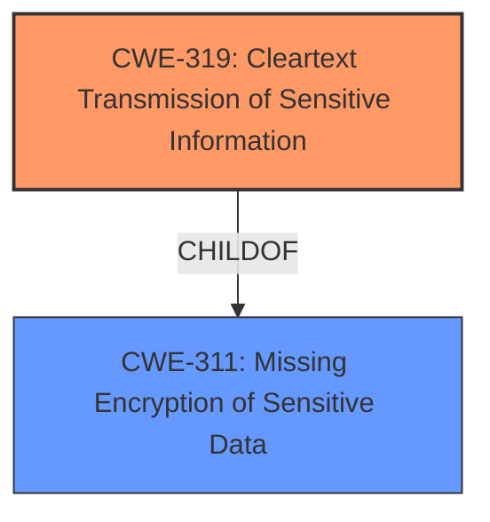

# Analysis for CVE-2020-12730

# Summary
| CWE ID | CWE Name | Confidence | CWE Abstraction Level | CWE Vulnerability Mapping Label | CWE-Vulnerability Mapping Notes |
|---|---|---|---|---|---|
| CWE-319 | Cleartext Transmission of Sensitive Information | 1.0 | Base | Allowed | Primary CWE |

## Evidence and Confidence

*   **Confidence Score:** 1.0
*   **Evidence Strength:** HIGH

## Relationship Analysis
The primary relationship considered was the ChildOf relationship. CWE-319 (Cleartext Transmission of Sensitive Information) is a Base level CWE, which is the preferred level. This CWE is child of CWE-311 (Missing Encryption of Sensitive Data). The vulnerability clearly describes sensitive information being transmitted without encryption, making CWE-319 the most appropriate choice.

## Vulnerability Chain
The vulnerability chain consists of the **lack of BLE encryption** (CWE-319) leading to data sniffing and packet forgery. The **lack of encryption** is the root cause, and the sniffing and forgery are the impacts.

## Summary of Analysis
The initial analysis strongly suggests CWE-319 (Cleartext Transmission of Sensitive Information) as the primary CWE.

The **Vulnerability Description** states the product "MagicMotion Flamingo 2 **lacks BLE encryption**, enabling data sniffing and packet forgery." The **Vulnerability Description Key Phrases** section reinforces this by highlighting "**lacks BLE encryption**" as the **rootcause** and "data sniffing and packet forgery" as the impact. The **rootcause** matches the CWE-319 description: "The product transmits sensitive or security-critical data in cleartext in a communication channel that can be sniffed by unauthorized actors."

The Retriever Results list CWE-319 as the top combined result. The **Abstraction** level is Base, and the **Usage** is Allowed, aligning with preferred mapping practices.

The relationships show that CWE-319 is a child of CWE-311 (Missing Encryption of Sensitive Data), which is a more general category. Given the specific mention of cleartext transmission, CWE-319 is the more appropriate choice.

The evidence supports mapping this vulnerability to CWE-319 with high confidence. The selected CWE is at the optimal level of specificity, accurately representing the weakness and its impact.

Relevant CWE Information:

# Enhanced Context (25 CWEs)
The following CWEs were identified as potentially relevant to this vulnerability:

## CWE-757: Selection of Less-Secure Algorithm During Negotiation ('Algorithm Downgrade')
**Abstraction Level**: Base
**Similarity Score**: 0.82
**Source**: dense

**Description**:
A protocol or its implementation supports interaction between multiple actors and allows those actors to negotiate which algorithm should be used as a protection mechanism such as encryption or authentication, but it does not select the strongest algorithm that is available to both parties.

**Mapping Guidance**:
- Usage: Allowed
- Rationale: This CWE entry is at the Base level of abstraction, which is a preferred level of abstraction for mapping to the root causes of vulnerabilities.

**Why Not Used:** This vulnerability description indicates a **lack of encryption**, not the selection of a less secure algorithm.

## CWE-1240: Use of a Cryptographic Primitive with a Risky Implementation
**Abstraction Level**: Base
**Similarity Score**: 0.77
**Source**: dense

**Description**:
To fulfill the need for a cryptographic primitive, the product implements a cryptographic algorithm using a non-standard, unproven, or disallowed/non-compliant cryptographic implementation.

**Mapping Guidance**:
- Usage: Allowed
- Rationale: This CWE entry is at the Base level of abstraction, which is a preferred level of abstraction for mapping to the root causes of vulnerabilities.

**Why Not Used:** This vulnerability description indicates a **lack of encryption**, not a risky implementation.

## CWE-345: Insufficient Verification of Data Authenticity
**Abstraction Level**: Class
**Similarity Score**: 0.77
**Source**: dense

**Description**:
The product does not sufficiently verify the origin or authenticity of data, in a way that causes it to accept invalid data.

**Mapping Guidance**:
- Usage: Discouraged
- Rationale: This CWE entry is a level-1 Class (i.e., a child of a Pillar). It might have lower-level children that would be more appropriate

**Why Not Used:** The vulnerability is due to a **lack of encryption**, not insufficient verification of data authenticity.

## CWE-1391: Use of Weak Credentials
**Abstraction Level**: Class
**Similarity Score**: 0.76
**Source**: dense

**Description**:
The product uses weak credentials (such as a default key or hard-coded password) that can be calculated, derived, reused, or guessed by an attacker.

**Mapping Guidance**:
- Usage: Allowed-with-Review
- Rationale: This CWE entry is a Class and might have Base-level children that would be more appropriate

**Why Not Used:** The vulnerability is due to a **lack of encryption**, not the use of weak credentials.

## CWE-203: Observable Discrepancy
**Abstraction Level**: Base
**Similarity Score**: 0.76
**Source**: dense

**Description**:
The product behaves differently or sends different responses under different circumstances in a way that is observable to an unauthorized actor, which exposes security-relevant information about the state of the product, such as whether a particular operation was successful or not.

**Mapping Guidance**:
- Usage: Allowed
- Rationale: This CWE entry is at the Base level of abstraction, which is a preferred level of abstraction for mapping to the root causes of vulnerabilities.

**Why Not Used:** The vulnerability is due to a **lack of encryption**, not an observable discrepancy.

## CWE-807: Reliance on Untrusted Inputs in a Security Decision
**Abstraction Level**: Base
**Similarity Score**: 0.76
**Source**: dense

**Description**:
The product uses a protection mechanism that relies on the existence or values of an input, but the input can be modified by an untrusted actor in a way that bypasses the protection mechanism.

**Mapping Guidance**:
- Usage: Allowed
- Rationale: This CWE entry is at the Base level of abstraction, which is a preferred level of abstraction for mapping to the root causes of vulnerabilities.

**Why Not Used:** The vulnerability is due to a **lack of encryption**, not reliance on untrusted inputs.

## CWE-330: Use of Insufficiently Random Values
**Abstraction Level**: Class
**Similarity Score**: 0.76
**Source**: dense

**Description**:
The product uses insufficiently random numbers or values in a security context that depends on unpredictable numbers.

**Mapping Guidance**:
- Usage: Discouraged
- Rationale: This CWE entry is a level-1 Class (i.e., a child of a Pillar). It might have lower-level children that would be more appropriate

**Why Not Used:** The vulnerability is due to a **lack of encryption**, not the use of insufficiently random values.

## CWE-703: Improper Check or Handling of Exceptional Conditions
**Abstraction Level**: Pillar
**Similarity Score**: 0.76
**Source**: dense

**Description**:
The product does not properly anticipate or handle exceptional conditions that rarely occur during normal operation of the product.

**Mapping Guidance**:
- Usage: Discouraged
- Rationale: This CWE entry is extremely high-level, a Pillar.

**Why Not Used:** The vulnerability is due to a **lack of encryption**, not improper handling of exceptional conditions.

## CWE-319: Cleartext Transmission of Sensitive Information
**Abstraction Level**: Base
**Similarity Score**: 0.76
**Source**: dense

**Description**:
The product transmits sensitive or security-critical data in cleartext in a communication channel that can be sniffed by unauthorized actors.

**Mapping Guidance**:
- Usage: Allowed
- Rationale: This CWE entry is at the Base level of abstraction, which is a preferred level of abstraction for mapping to the root causes of vulnerabilities.

**Why Used:** This is the Primary CWE.

## CWE-326: Inadequate Encryption Strength
**Abstraction Level**: Class
**Similarity Score**: 0.76
**Source**: dense

**Description**:
The product stores or transmits sensitive data using an encryption scheme that is theoretically sound, but is not strong enough for the level of protection required.

**Mapping Guidance**:
- Usage: Allowed-with-Review
- Rationale: This CWE entry is a Class and might have Base-level children that would be more appropriate

**Why Not Used:** The vulnerability description indicates a **lack of encryption**, not inadequate encryption strength.

## CWE-319: Cleartext Transmission of Sensitive Information
**Abstraction Level**: Base
**Similarity Score**: 4479.33
**Source**: sparse

**Description**:
The product transmits

# Enhanced Query for CVE-2020-12730

## Vulnerability Description
MagicMotion Flamingo 2 **lacks BLE encryption**, enabling data sniffing and packet forgery.

### Vulnerability Description Key Phrases
- **rootcause:** **lacks BLE encryption**
- **impact:** data sniffing and packet forgery
- **product:** MagicMotion Flamingo 2

## CVE Reference Links Content Summary
UNRELATED

## Retriever Results

### Top Combined Results

| Rank | CWE ID | Name | Abstraction | Usage  | Retrievers | Individual Scores |
|------|--------|------|-------------|-------|------------|-------------------|
| 1 | 319 | Cleartext Transmission of Sensitive Information | Base | Allowed | sparse | 0.134 |
| 2 | 1277 | Firmware Not Updateable | Base | Allowed | sparse | 0.075 |
| 3 | 326 | Inadequate Encryption Strength | Class | Allowed-with-Review | sparse | 0.068 |
| 4 | 306 | Missing Authentication for Critical Function | Base | Allowed | sparse | 0.062 |
| 5 | 170 | Improper Null Termination | Base | Allowed | sparse | 0.061 |
| 6 | 1319 | Improper Protection against Electromagnetic Fault Injection (EM-FI) | Base | Allowed | dense | 0.463 |
| 7 | 193 | Off-by-one Error | Base | Allowed | graph | 0.002 |
| 8 | 197 | Numeric Truncation Error | Base | Allowed | sparse | 0.061 |
| 9 | 325 | Missing Cryptographic Step | Base | Allowed | sparse | 0.056 |
| 10 | 757 | Selection of Less-Secure Algorithm During Negotiation ('Algorithm Downgrade') | Base | Allowed | sparse | 0.052 |

# Complete CWE Specifications

## CWE-319: Cleartext Transmission of Sensitive Information
**Abstraction:** Base
**Status:** Draft

### Description
The product transmits sensitive or security-critical data in cleartext in a communication channel that can be sniffed by unauthorized actors.

### Extended Description

Many communication channels can be "sniffed" (monitored) by adversaries during data transmission. For example, in networking, packets can traverse many intermediary nodes from the source to the destination, whether across the internet, an internal network, the cloud, etc. Some actors might have privileged access to a network interface or any link along the channel, such as a router, but they might not be authorized to collect the underlying data. As a result, network traffic could be sniffed by adversaries, spilling security-critical data.

Applicable communication channels are not limited to software products. Applicable channels include hardware-specific technologies such as internal hardware networks and external debug channels, supporting remote JTAG debugging. When mitigations are not applied to combat adversaries within the product's threat model, this weakness significantly lowers the difficulty of exploitation by such adversaries.

When full communications are recorded or logged, such as with a packet dump, an adversary could attempt to obtain the dump long after the transmission has occurred and try to "sniff" the cleartext from the recorded communications in the dump itself. Even if the information is encoded in a way that is not human-readable, certain techniques could determine which encoding is being used, then decode the information. 

### Alternative Terms
None

### Relationships
ChildOf -> CWE-311
ChildOf -> CWE-311

### Mapping Guidance
**Usage:** Allowed
**Rationale:** This CWE entry is at the Base level of abstraction, which is a preferred level of abstraction for mapping to the root causes of vulnerabilities.
**Comments:** Carefully read both the name and description to ensure that this mapping is an appropriate fit. Do not try to 'force' a mapping to a lower-level Base/Variant simply to comply with this preferred level of abstraction.
**Reasons:**
- Acceptable-Use

### Additional Notes
**[Maintenance]** The Taxonomy_Mappings to ISA/IEC 62443 were added in CWE 4.10, but they are still under review and might change in future CWE versions. These draft mappings were performed by members of the "Mapping CWE to 62443" subgroup of the CWE-CAPEC ICS/OT Special Interest Group (SIG), and their work is incomplete as of CWE 4.10. The mappings are included to facilitate discussion and review by the broader ICS/OT community, and they are likely to change in future CWE versions.

### Observed Examples
- **CVE-2022-29519:** Programmable Logic Controller (PLC) sends sensitive information in plaintext, including passwords and session tokens.
- **CVE-2022-30312:** Building Controller uses a protocol that transmits authentication credentials in plaintext.
- **CVE-2022-31204:** Programmable Logic Controller (PLC) sends password in plaintext.

## CWE-1277: Firmware Not Updateable
**Abstraction:** Base
**Status:** Draft

### Description
The product does not provide its
			users with the ability to update or patch its
			firmware to address any vulnerabilities or
			weaknesses that may be present.

### Extended Description
Without the ability to patch or update firmware, consumers will be left vulnerable to exploitation of any known vulnerabilities, or any vulnerabilities that are discovered in the future. This can expose consumers to permanent risk throughout the entire lifetime of the device, which could be years or decades. Some external protective measures and mitigations might be employed to aid in preventing or reducing the risk of malicious attack, but the root weakness cannot be corrected.

### Alternative Terms
None

### Relationships
ChildOf -> CWE-1329

### Mapping Guidance
**Usage:** Allowed
**Rationale:** This CWE entry is at the Base level of abstraction, which is a preferred level of abstraction for mapping to the root causes of vulnerabilities.
**Comments:** Carefully read both the name and description to ensure that this mapping is an appropriate fit. Do not try to 'force' a mapping to a lower-level Base/Variant simply to comply with this preferred level of abstraction.
**Reasons:**
- Acceptable-Use

### Additional Notes
**[Terminology]** The "firmware" term does not have a single commonly-shared definition, so there may be variations in how this CWE entry is interpreted during mapping.

### Observed Examples
- **CVE-2020-9054:** Chain: network-attached storage (NAS) device has a critical OS command injection (CWE-78) vulnerability that is actively exploited to place IoT devices into a botnet, but some products are "end-of-support" and cannot be patched (CWE-1277). [REF-1097]
- **[REF-1095]:** A hardware "smart lock" has weak key generation that allows attackers to steal the key by BLE sniffing, but the device's firmware cannot be upgraded and hence remains vulnerable [REF-1095].

## CWE-326: Inadequate Encryption Strength
**Abstraction:** Class
**Status:** Draft

### Description
The product stores or transmits sensitive data using an encryption scheme that is theoretically sound, but is not strong enough for the level of protection required.

### Extended Description
A weak encryption scheme can be subjected to brute force attacks that have a reasonable chance of succeeding using current attack methods and resources.

### Alternative Terms
None

### Relationships
ChildOf -> CWE-693

### Mapping Guidance
**Usage:** Allowed-with-Review
**Rationale:** This CWE entry is a Class and might have Base-level children that would be more appropriate
**Comments:** Examine children of this entry to see if there is a better fit
**Reasons:**
- Abstraction

### Observed Examples
- **CVE-2001-1546:** Weak encryption
- **CVE-2004-2172:** Weak encryption (chosen plaintext attack)
- **CVE-2002-1682:** Weak encryption

## CWE-306: Missing Authentication for Critical Function
**Abstraction:** Base
**Status:** Draft

### Description
The product does not perform any authentication for functionality that requires a provable user identity or consumes a significant amount of resources.

### Extended Description
Not provided

### Alternative Terms
None

### Relationships
ChildOf -> CWE-287
ChildOf -> CWE-287

### Mapping Guidance
**Usage:** Allowed
**Rationale:** This CWE entry is at the Base level of abstraction, which is a preferred level of abstraction for mapping to the root causes of vulnerabilities.
**Comments:** Carefully read both the name and description to ensure that this mapping is an appropriate fit. Do not try to 'force' a mapping to a lower-level Base/Variant simply to comply with this preferred level of abstraction.
**Reasons:**
- Acceptable-Use

### Observed Examples
- **CVE-2022-31260:** Chain: a digital asset management program has an undisclosed backdoor in the legacy version of a PHP script (CWE-912) that could allow an unauthenticated user to export metadata (CWE-306)
- **CVE-2022-29951:** TCP-based protocol in Programmable Logic Controller (PLC) has no authentication.
- **CVE-2022-29952:** Condition Monitor firmware uses a protocol that does not require authentication.

## CWE-170: Improper Null Termination
**Abstraction:** Base
**Status:** Incomplete

### Description
The product does not terminate or incorrectly terminates a string or array with a null character or equivalent terminator.

### Extended Description
Null termination errors frequently occur in two different ways. An off-by-one error could cause a null to be written out of bounds, leading to an overflow. Or, a program could use a strncpy() function call incorrectly, which prevents a null terminator from being added at all. Other scenarios are possible.

### Alternative Terms
None

### Relationships
ChildOf -> CWE-707
CanPrecede -> CWE-120
CanPrecede -> CWE-126
CanAlsoBe -> CWE-147
PeerOf -> CWE-464
PeerOf -> CWE-463
ChildOf -> CWE-20

### Mapping Guidance
**Usage:** Allowed
**Rationale:** This CWE entry is at the Base level of abstraction, which is a preferred level of abstraction for mapping to the root causes of vulnerabilities.
**Comments:** Carefully read both the name and description to ensure that this mapping is an appropriate fit. Do not try to 'force' a mapping to a lower-level Base/Variant simply to comply with this preferred level of abstraction.
**Reasons:**
- Acceptable-Use

### Additional Notes
**[Relationship]** Factors: this is usually resultant from other weaknesses such as off-by-one errors, but it can be primary to boundary condition violations such as buffer overflows. In buffer overflows, it can act as an expander for assumed-immutable data.

**[Relationship]** Overlaps missing input terminator.

**[Applicable Platform]** 

Conceptually, this does not just apply to the C language; any language or representation that involves a terminator could have this type of problem.

**[Maintenance]** As currently described, this entry is more like a category than a weakness.

### Observed Examples
- **CVE-2000-0312:** Attacker does not null-terminate argv[] when invoking another program.
- **CVE-2003-0777:** Interrupted step causes resultant lack of null termination.
- **CVE-2004-1072:** Fault causes resultant lack of null termination, leading to buffer expansion.

## CWE-1319: Improper Protection against Electromagnetic Fault Injection (EM-FI)
**Abstraction:** Base
**Status:** Incomplete

### Description
The device is susceptible to electromagnetic fault injection attacks, causing device internal information to be compromised or security mechanisms to be bypassed.

### Extended Description

Electromagnetic fault injection may allow an attacker to locally and dynamically modify the signals (both internal and external) of an integrated circuit. EM-FI attacks consist of producing a local, transient magnetic field near the device, inducing current in the device wires. A typical EMFI setup is made up of a pulse injection circuit that generates a high current transient in an EMI coil, producing an abrupt magnetic pulse which couples to the target producing faults in the device, which can lead to:

  - Bypassing security mechanisms such as secure JTAG or Secure Boot

  - Leaking device information

  - Modifying program flow

  - Perturbing secure hardware modules (e.g. random number generators)

### Alternative Terms
None

### Relationships
ChildOf -> CWE-693

### Mapping Guidance
**Usage:** Allowed
**Rationale:** This CWE entry is at the Base level of abstraction, which is a preferred level of abstraction for mapping to the root causes of vulnerabilities.
**Comments:** Carefully read both the name and description to ensure that this mapping is an appropriate fit. Do not try to 'force' a mapping to a lower-level Base/Variant simply to comply with this preferred level of abstraction.
**Reasons:**
- Acceptable-Use

### Additional Notes
**[Maintenance]** This entry is attack-oriented and may require significant modification in future versions, or even deprecation. It is not clear whether there is really a design "mistake" that enables such attacks, so this is not necessarily a weakness and may be more appropriate for CAPEC.

### Observed Examples
- **CVE-2020-27211:** Chain: microcontroller system-on-chip uses a register value stored in flash to set product protection state on the memory bus and does not contain protection against fault injection (CWE-1319) which leads to an incorrect initialization of the memory bus (CWE-1419) causing the product to be in an unprotected state.

## CWE-193: Off-by-one Error
**Abstraction:** Base
**Status:** Draft

### Description
A product calculates or uses an incorrect maximum or minimum value that is 1 more, or 1 less, than the correct value.

### Extended Description
Not provided

### Alternative Terms
off-by-five: An "off-by-five" error was reported for sudo in 2002 (CVE-2002-0184), but that is more like a "length calculation" error.

### Relationships
ChildOf -> CWE-682
ChildOf -> CWE-682
CanPrecede -> CWE-617
CanPrecede -> CWE-170
CanPrecede -> CWE-119

### Mapping Guidance
**Usage:** Allowed
**Rationale:** This CWE entry is at the Base level of abstraction, which is a preferred level of abstraction for mapping to the root causes of vulnerabilities.
**Comments:** Carefully read both the name and description to ensure that this mapping is an appropriate fit. Do not try to 'force' a mapping to a lower-level Base/Variant simply to comply with this preferred level of abstraction.
**Reasons:**
- Acceptable-Use

### Additional Notes
**[Relationship]** This is not always a buffer overflow. For example, an off-by-one error could be a factor in a partial comparison, a read from the wrong memory location, an incorrect conditional, etc.

### Observed Examples
- **CVE-2003-0252:** Off-by-one error allows remote attackers to cause a denial of service and possibly execute arbitrary code via requests that do not contain newlines.
- **CVE-2001-1391:** Off-by-one vulnerability in driver allows users to modify kernel memory.
- **CVE-2002-0083:** Off-by-one error allows local users or remote malicious servers to gain privileges.

## CWE-197: Numeric Truncation Error
**Abstraction:** Base
**Status:** Incomplete

### Description
Truncation errors occur when a primitive is cast to a primitive of a smaller size and data is lost in the conversion.

### Extended Description
When a primitive is cast to a smaller primitive, the high order bits of the large value are lost in the conversion, potentially resulting in an unexpected value that is not equal to the original value. This value may be required as an index into a buffer, a loop iterator, or simply necessary state data. In any case, the value cannot be trusted and the system will be in an undefined state. While this method may be employed viably to isolate the low bits of a value, this usage is rare, and truncation usually implies that an implementation error has occurred.

### Alternative Terms
None

### Relationships
ChildOf -> CWE-681
ChildOf -> CWE-681
ChildOf -> CWE-681
CanAlsoBe -> CWE-195
CanAlsoBe -> CWE-196
CanAlsoBe -> CWE-192
CanAlsoBe -> CWE-194

### Mapping Guidance
**Usage:** Allowed
**Rationale:** This CWE entry is at the Base level of abstraction, which is a preferred level of abstraction for mapping to the root causes of vulnerabilities.
**Comments:** Carefully read both the name and description to ensure that this mapping is an appropriate fit. Do not try to 'force' a mapping to a lower-level Base/Variant simply to comply with this preferred level of abstraction.
**Reasons:**
- Acceptable-Use

### Additional Notes
**[Research Gap]** This weakness has traditionally been under-studied and under-reported, although vulnerabilities in popular software have been published in 2008 and 2009.

### Observed Examples
- **CVE-2020-17087:** Chain: integer truncation (CWE-197) causes small buffer allocation (CWE-131) leading to out-of-bounds write (CWE-787) in kernel pool, as exploited in the wild per CISA KEV.
- **CVE-2009-0231:** Integer truncation of length value leads to heap-based buffer overflow.
- **CVE-2008-3282:** Size of a particular type changes for 64-bit platforms, leading to an integer truncation in document processor causes incorrect index to be generated.

## CWE-325: Missing Cryptographic Step
**Abstraction:** Base
**Status:** Draft

### Description
The product does not implement a required step in a cryptographic algorithm, resulting in weaker encryption than advertised by the algorithm.

### Extended Description
Not provided

### Alternative Terms
None

### Relationships
ChildOf -> CWE-573
PeerOf -> CWE-358

### Mapping Guidance
**Usage:** Allowed
**Rationale:** This CWE entry is at the Base level of abstraction, which is a preferred level of abstraction for mapping to the root causes of vulnerabilities.
**Comments:** Carefully read both the name and description to ensure that this mapping is an appropriate fit. Do not try to 'force' a mapping to a lower-level Base/Variant simply to comply with this preferred level of abstraction.
**Reasons:**
- Acceptable-Use

### Additional Notes
**[Relationship]** Overlaps incomplete/missing security check.

**[Relationship]** Can be resultant.

### Observed Examples
- **CVE-2001-1585:** Missing challenge-response step allows authentication bypass using public key.

## CWE-757: Selection of Less-Secure Algorithm During Negotiation ('Algorithm Downgrade')
**Abstraction:** Base
**Status:** Incomplete

### Description
A protocol or its implementation supports interaction between multiple actors and allows those actors to negotiate which algorithm should be used as a protection mechanism such as encryption or authentication, but it does not select the strongest algorithm that is available to both parties.

### Extended Description
When a security mechanism can be forced to downgrade to use a less secure algorithm, this can make it easier for attackers to compromise the product by exploiting weaker algorithm. The victim might not be aware that the less secure algorithm is being used. For example, if an attacker can force a communications channel to use cleartext instead of strongly-encrypted data, then the attacker could read the channel by sniffing, instead of going through extra effort of trying to decrypt the data using brute force techniques.

### Alternative Terms
None

### Relationships
ChildOf -> CWE-693

### Mapping Guidance
**Usage:** Allowed
**Rationale:** This CWE entry is at the Base level of abstraction, which is a preferred level of abstraction for mapping to the root causes of vulnerabilities.
**Comments:** Carefully read both the name and description to ensure that this mapping is an appropriate fit. Do not try to 'force' a mapping to a lower-level Base/Variant simply to comply with this preferred level of abstraction.
**Reasons:**
- Acceptable-Use

### Additional Notes
**[Relationship]** This is related to CWE-300, although not all downgrade attacks necessarily require an entity that redirects or interferes with the network. See examples.

### Observed Examples
- **CVE-2006-4302:** Attacker can select an older version of the software to exploit its vulnerabilities.
- **CVE-2006-4407:** Improper prioritization of encryption ciphers during negotiation leads to use of a weaker cipher.
- **CVE-2005-2969:** chain: SSL/TLS implementation disables a verification step (CWE-325) that enables a downgrade attack to a weaker protocol.

