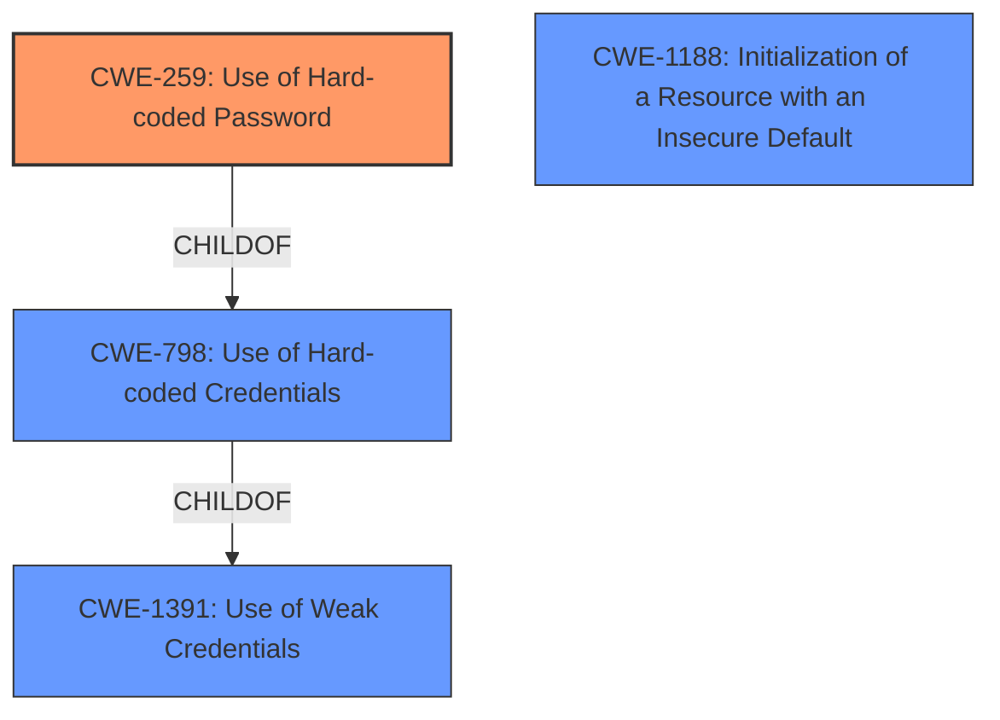

# Analysis for CVE-2020-12732

# Summary
| CWE ID | CWE Name | Confidence | CWE Abstraction Level | CWE Vulnerability Mapping Label | CWE-Vulnerability Mapping Notes |
|---|---|---|---|---|---|
| CWE-259 | Use of Hard-coded Password | 1.0 | Variant | Allowed | Primary CWE |
| CWE-798 | Use of Hard-coded Credentials | 0.8 | Base | Allowed | Secondary Candidate |
| CWE-1391 | Use of Weak Credentials | 0.7 | Class | Allowed-with-Review | Secondary Candidate |
| CWE-1188 | Initialization of a Resource with an Insecure Default | 0.6 | Base | Allowed | Secondary Candidate |

## Evidence and Confidence

*   **Confidence Score:** 0.9
*   **Evidence Strength:** HIGH

## Relationship Analysis
The primary CWE selected is CWE-259, which is a Variant of CWE-798 (Use of Hard-coded Credentials). CWE-798 itself is a child of CWE-1391 (Use of Weak Credentials). This hierarchical relationship shows a progression from general weak credentials to the specific case of hard-coded credentials, and further to the specific case of hard-coded passwords. The vulnerability description clearly indicates a hard-coded password, justifying the choice of the Variant CWE-259.

## Vulnerability Chain
The chain of weaknesses starts with the **use of a hard-coded password**, which leads to **improper authentication** and finally results in **unauthorized access**.
  - Root Cause: **Use of Hard-coded Password (CWE-259)**
  - Weakness: Improper Authentication (Implied, but not explicitly stated, CWE-287 which is discouraged)
  - Impact: Unauthorized Access

## Summary of Analysis
The initial assessment identified several candidate CWEs, including CWE-798, CWE-1391, and CWE-259. Based on the vulnerability description, the DEPSTECH WiFi Digital Microscope 3 has a **default SSID of Jetion_xxxxxxxx with a password of 12345678**. This clearly indicates the **use of a hard-coded password**.

The retriever results also support this conclusion, with CWE-259 having a high score in the dense retriever.

The selection of CWE-259 is based on the fact that it is a Variant that specifically addresses the **use of hard-coded passwords**, providing a more precise classification than its parent CWEs. The mapping guidance for CWE-259 allows its usage, further solidifying the decision.

CWE-798 was considered as a parent, but it is less specific as it covers all types of credentials not only passwords.

CWE-1391 was also considered but this is a Class and therefore too high level.

CWE-1188 was considered and while this is related to default values, the key aspect of this vulnerability is the password is both default and hardcoded.

Relevant CWE Information:

# Enhanced Context (25 CWEs)
The following CWEs were identified as potentially relevant to this vulnerability:

## CWE-798: Use of Hard-coded Credentials
**Abstraction Level**: Base
**Similarity Score**: 5955.80
**Source**: sparse

**Description**:
The product contains hard-coded credentials, such as a password or cryptographic key.

**Mapping Guidance**:
- Usage: Allowed
- Rationale: This CWE entry is at the Base level of abstraction, which is a preferred level of abstraction for mapping to the root causes of vulnerabilities.

## CWE-1391: Use of Weak Credentials
**Abstraction Level**: Class
**Similarity Score**: 5945.82
**Source**: sparse

**Description**:
The product uses weak credentials (such as a default key or hard-coded password) that can be calculated, derived, reused, or guessed by an attacker.

**Mapping Guidance**:
- Usage: Allowed-with-Review
- Rationale: This CWE entry is a Class and might have Base-level children that would be more appropriate

## CWE-259: Use of Hard-coded Password
**Abstraction Level**: Variant
**Similarity Score**: 5874.76
**Source**: sparse

**Description**:
The product contains a hard-coded password, which it uses for its own inbound authentication or for outbound communication to external components.

**Mapping Guidance**:
- Usage: Allowed
- Rationale: This CWE entry is at the Variant level of abstraction, which is a preferred level of abstraction for mapping to the root causes of vulnerabilities.