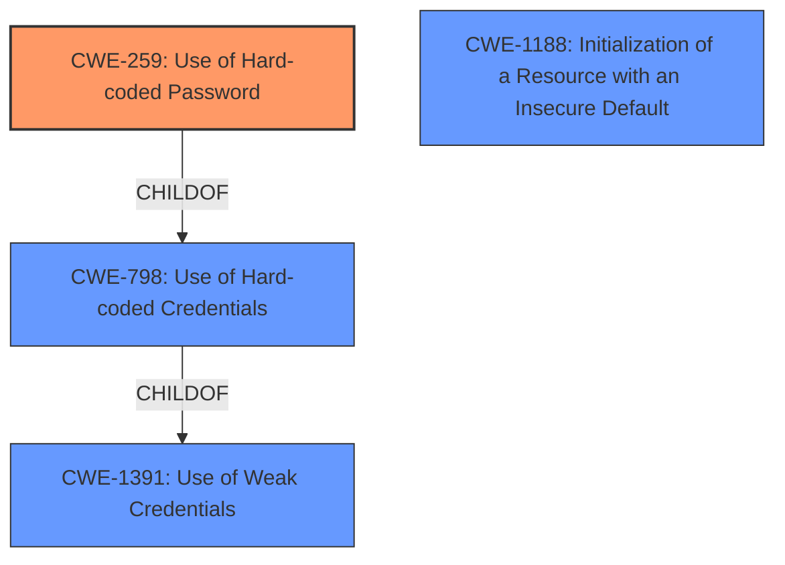

# Analysis for CVE-2020-12732

# Summary
| CWE ID | CWE Name | Confidence | CWE Abstraction Level | CWE Vulnerability Mapping Label | CWE-Vulnerability Mapping Notes |
|---|---|---|---|---|---|
| CWE-259 | Use of Hard-coded Password | 1.0 | Variant | Allowed | Primary CWE |
| CWE-798 | Use of Hard-coded Credentials | 0.8 | Base | Allowed | Secondary Candidate |
| CWE-1391 | Use of Weak Credentials | 0.7 | Class | Allowed-with-Review | Secondary Candidate |
| CWE-1188 | Initialization of a Resource with an Insecure Default | 0.6 | Base | Allowed | Secondary Candidate |

## Evidence and Confidence

*   **Confidence Score:** 0.9
*   **Evidence Strength:** HIGH

## Relationship Analysis
The primary CWE selected is CWE-259, which is a Variant of CWE-798 (Use of Hard-coded Credentials). CWE-798 itself is a child of CWE-1391 (Use of Weak Credentials). This hierarchical relationship shows a progression from general weak credentials to the specific case of hard-coded credentials, and further to the specific case of hard-coded passwords. The vulnerability description clearly indicates a hard-coded password, justifying the choice of the Variant CWE-259.



## Vulnerability Chain
The chain of weaknesses starts with the **use of a hard-coded password**, which leads to **improper authentication** and finally results in **unauthorized access**.
  - Root Cause: **Use of Hard-coded Password (CWE-259)**
  - Weakness: Improper Authentication (Implied, but not explicitly stated, CWE-287 which is discouraged)
  - Impact: Unauthorized Access

## Summary of Analysis
The initial assessment identified several candidate CWEs, including CWE-798, CWE-1391, and CWE-259. Based on the vulnerability description, the DEPSTECH WiFi Digital Microscope 3 has a **default SSID of Jetion_xxxxxxxx with a password of 12345678**. This clearly indicates the **use of a hard-coded password**.

The retriever results also support this conclusion, with CWE-259 having a high score in the dense retriever.

The selection of CWE-259 is based on the fact that it is a Variant that specifically addresses the **use of hard-coded passwords**, providing a more precise classification than its parent CWEs. The mapping guidance for CWE-259 allows its usage, further solidifying the decision.

CWE-798 was considered as a parent, but it is less specific as it covers all types of credentials not only passwords.

CWE-1391 was also considered but this is a Class and therefore too high level.

CWE-1188 was considered and while this is related to default values, the key aspect of this vulnerability is the password is both default and hardcoded.

Relevant CWE Information:

# Enhanced Context (25 CWEs)
The following CWEs were identified as potentially relevant to this vulnerability:

## CWE-798: Use of Hard-coded Credentials
**Abstraction Level**: Base
**Similarity Score**: 5955.80
**Source**: sparse

**Description**:
The product contains hard-coded credentials, such as a password or cryptographic key.

**Mapping Guidance**:
- Usage: Allowed
- Rationale: This CWE entry is at the Base level of abstraction, which is a preferred level of abstraction for mapping to the root causes of vulnerabilities.

## CWE-1391: Use of Weak Credentials
**Abstraction Level**: Class
**Similarity Score**: 5945.82
**Source**: sparse

**Description**:
The product uses weak credentials (such as a default key or hard-coded password) that can be calculated, derived, reused, or guessed by an attacker.

**Mapping Guidance**:
- Usage: Allowed-with-Review
- Rationale: This CWE entry is a Class and might have Base-level children that would be more appropriate

## CWE-259: Use of Hard-coded Password
**Abstraction Level**: Variant
**Similarity Score**: 5874.76
**Source**: sparse

**Description**:
The product contains a hard-coded password, which it uses for its own inbound authentication or for outbound communication to external components.

**Mapping Guidance**:
- Usage: Allowed
- Rationale: This CWE entry is at the Variant level of abstraction, which is a preferred level of abstraction for mapping to the root causes of vulnerabilities.

# Enhanced Query for CVE-2020-12732

## Vulnerability Description
DEPSTECH WiFi Digital Microscope 3 has a default SSID of Jetion_xxxxxxxx with a password of 12345678.

### Vulnerability Description Key Phrases
- **product:** DEPSTECH WiFi Digital Microscope
- **version:** 3
- **component:** SSID and password

## CVE Reference Links Content Summary
The provided content is a GitHub page displaying a PDF file. It doesn't contain any information about a vulnerability or CVE-2020-12732.

Response: UNRELATED

## Retriever Results

### Top Combined Results

| Rank | CWE ID | Name | Abstraction | Usage  | Retrievers | Individual Scores |
|------|--------|------|-------------|-------|------------|-------------------|
| 1 | 1188 | Initialization of a Resource with an Insecure Default | Base | Allowed | sparse | 0.060 |
| 2 | 1391 | Use of Weak Credentials | Class | Allowed-with-Review | sparse | 0.030 |
| 3 | 306 | Missing Authentication for Critical Function | Base | Allowed | sparse | 0.029 |
| 4 | 532 | Insertion of Sensitive Information into Log File | Base | Allowed | sparse | 0.028 |
| 5 | 287 | Improper Authentication | Class | Discouraged | sparse | 0.027 |
| 6 | 259 | Use of Hard-coded Password | Variant | Allowed | dense | 0.380 |
| 7 | 613 | Insufficient Session Expiration | Base | Allowed | graph | 0.002 |
| 8 | 798 | Use of Hard-coded Credentials | Base | Allowed | sparse | 0.027 |
| 9 | 328 | Use of Weak Hash | Base | Allowed | sparse | 0.027 |
| 10 | 912 | Hidden Functionality | Class | Allowed-with-Review | sparse | 0.027 |


# Complete CWE Specifications


## CWE-1188: Initialization of a Resource with an Insecure Default
**Abstraction:** Base
**Status:** Incomplete

### Description
The product initializes or sets a resource with a default that is intended to be changed by the administrator, but the default is not secure.

### Extended Description


Developers often choose default values that leave the product as open and easy to use as possible out-of-the-box, under the assumption that the administrator can (or should) change the default value. However, this ease-of-use comes at a cost when the default is insecure and the administrator does not change it.


### Alternative Terms
None

### Relationships
ChildOf -> CWE-1419
ChildOf -> CWE-665

### Mapping Guidance
**Usage:** Allowed
**Rationale:** This CWE entry is at the Base level of abstraction, which is a preferred level of abstraction for mapping to the root causes of vulnerabilities.
**Comments:** Carefully read both the name and description to ensure that this mapping is an appropriate fit. Do not try to 'force' a mapping to a lower-level Base/Variant simply to comply with this preferred level of abstraction.
**Reasons:**
- Acceptable-Use


### Additional Notes
**[Maintenance]** This entry improves organization of concepts under initialization. The typical CWE model is to cover "Missing" and "Incorrect" behaviors. Arguably, this entry could be named as "Incorrect" instead of "Insecure." This might be changed in the near future.


### Observed Examples
- **CVE-2022-36349:** insecure default variable initialization in BIOS firmware for a hardware board allows DoS
- **CVE-2022-42467:** A generic database browser interface has a default mode that exposes a web server to the network, allowing queries to the database.


## CWE-1391: Use of Weak Credentials
**Abstraction:** Class
**Status:** Incomplete

### Description
The product uses weak credentials (such as a default key or hard-coded password) that can be calculated, derived, reused, or guessed by an attacker.

### Extended Description


By design, authentication protocols try to ensure that attackers must perform brute force attacks if they do not know the credentials such as a key or password. However, when these credentials are easily predictable or even fixed (as with default or hard-coded passwords and keys), then the attacker can defeat the mechanism without relying on brute force.


Credentials may be weak for different reasons, such as:


  - Hard-coded (i.e., static and unchangeable by the administrator)

  - Default (i.e., the same static value across different deployments/installations, but able to be changed by the administrator)

  - Predictable (i.e., generated in a way that produces unique credentials across deployments/installations, but can still be guessed with reasonable efficiency)

Even if a new, unique credential is intended to be generated for each product installation, if the generation is predictable, then that may also simplify guessing attacks.

### Alternative Terms
None

### Relationships
ChildOf -> CWE-1390

### Mapping Guidance
**Usage:** Allowed-with-Review
**Rationale:** This CWE entry is a Class and might have Base-level children that would be more appropriate
**Comments:** Examine children of this entry to see if there is a better fit
**Reasons:**
- Abstraction


### Observed Examples
- **[REF-1374]:** Chain: JavaScript-based cryptocurrency library can fall back to the insecure Math.random() function instead of reporting a failure (CWE-392), thus reducing the entropy (CWE-332) and leading to generation of non-unique cryptographic keys for Bitcoin wallets (CWE-1391)
- **CVE-2022-30270:** Remote Terminal Unit (RTU) uses default credentials for some SSH accounts
- **CVE-2022-29965:** Distributed Control System (DCS) uses a deterministic algorithm to generate utility passwords


## CWE-306: Missing Authentication for Critical Function
**Abstraction:** Base
**Status:** Draft

### Description
The product does not perform any authentication for functionality that requires a provable user identity or consumes a significant amount of resources.

### Extended Description
Not provided

### Alternative Terms
None

### Relationships
ChildOf -> CWE-287
ChildOf -> CWE-287

### Mapping Guidance
**Usage:** Allowed
**Rationale:** This CWE entry is at the Base level of abstraction, which is a preferred level of abstraction for mapping to the root causes of vulnerabilities.
**Comments:** Carefully read both the name and description to ensure that this mapping is an appropriate fit. Do not try to 'force' a mapping to a lower-level Base/Variant simply to comply with this preferred level of abstraction.
**Reasons:**
- Acceptable-Use


### Observed Examples
- **CVE-2022-31260:** Chain: a digital asset management program has an undisclosed backdoor in the legacy version of a PHP script (CWE-912) that could allow an unauthenticated user to export metadata (CWE-306)
- **CVE-2022-29951:** TCP-based protocol in Programmable Logic Controller (PLC) has no authentication.
- **CVE-2022-29952:** Condition Monitor firmware uses a protocol that does not require authentication.


## CWE-532: Insertion of Sensitive Information into Log File
**Abstraction:** Base
**Status:** Incomplete

### Description
The product writes sensitive information to a log file.

### Extended Description
Not provided

### Alternative Terms
None

### Relationships
ChildOf -> CWE-538
ChildOf -> CWE-200

### Mapping Guidance
**Usage:** Allowed
**Rationale:** This CWE entry is at the Base level of abstraction, which is a preferred level of abstraction for mapping to the root causes of vulnerabilities.
**Comments:** Carefully read both the name and description to ensure that this mapping is an appropriate fit. Do not try to 'force' a mapping to a lower-level Base/Variant simply to comply with this preferred level of abstraction.
**Reasons:**
- Acceptable-Use


### Observed Examples
- **CVE-2017-9615:** verbose logging stores admin credentials in a world-readable log file
- **CVE-2018-1999036:** SSH password for private key stored in build log


## CWE-287: Improper Authentication
**Abstraction:** Class
**Status:** Draft

### Description
When an actor claims to have a given identity, the product does not prove or insufficiently proves that the claim is correct.

### Extended Description
Not provided

### Alternative Terms
authentification: An alternate term is "authentification", which appears to be most commonly used by people from non-English-speaking countries.
AuthN: "AuthN" is typically used as an abbreviation of "authentication" within the web application security community. It is also distinct from "AuthZ," which is an abbreviation of "authorization." The use of "Auth" as an abbreviation is discouraged, since it could be used for either authentication or authorization.
AuthC: "AuthC" is used as an abbreviation of "authentication," but it appears to used less frequently than "AuthN."

### Relationships
ChildOf -> CWE-284
ChildOf -> CWE-284

### Mapping Guidance
**Usage:** Discouraged
**Rationale:** This CWE entry might be misused when lower-level CWE entries are likely to be applicable. It is a level-1 Class (i.e., a child of a Pillar).
**Comments:** Consider children or descendants, beginning with CWE-1390: Weak Authentication or CWE-306: Missing Authentication for Critical Function.
**Reasons:**
- Frequent Misuse
**Suggested Alternatives:**
- CWE-1390: Weak Authentication
- CWE-306: Missing Authentication for Critical Function


### Additional Notes
**[Relationship]** This can be resultant from SQL injection vulnerabilities and other issues.

**[Maintenance]** The Taxonomy_Mappings to ISA/IEC 62443 were added in CWE 4.10, but they are still under review and might change in future CWE versions. These draft mappings were performed by members of the "Mapping CWE to 62443" subgroup of the CWE-CAPEC ICS/OT Special Interest Group (SIG), and their work is incomplete as of CWE 4.10. The mappings are included to facilitate discussion and review by the broader ICS/OT community, and they are likely to change in future CWE versions.


### Observed Examples
- **CVE-2022-35248:** Chat application skips validation when Central Authentication Service (CAS) is enabled, effectively removing the second factor from two-factor authentication
- **CVE-2022-36436:** Python-based authentication proxy does not enforce password authentication during the initial handshake, allowing the client to bypass authentication by specifying a 'None' authentication type.
- **CVE-2022-30034:** Chain: Web UI for a Python RPC framework does not use regex anchors to validate user login emails (CWE-777), potentially allowing bypass of OAuth (CWE-1390).


## CWE-259: Use of Hard-coded Password
**Abstraction:** Variant
**Status:** Draft

### Description
The product contains a hard-coded password, which it uses for its own inbound authentication or for outbound communication to external components.

### Extended Description


A hard-coded password typically leads to a significant authentication failure that can be difficult for the system administrator to detect. Once detected, it can be difficult to fix, so the administrator may be forced into disabling the product entirely. There are two main variations:

```
		Inbound: the product contains an authentication mechanism that checks for a hard-coded password.
		Outbound: the product connects to another system or component, and it contains hard-coded password for connecting to that component.
```
In the Inbound variant, a default administration account is created, and a simple password is hard-coded into the product and associated with that account. This hard-coded password is the same for each installation of the product, and it usually cannot be changed or disabled by system administrators without manually modifying the program, or otherwise patching the product. If the password is ever discovered or published (a common occurrence on the Internet), then anybody with knowledge of this password can access the product. Finally, since all installations of the product will have the same password, even across different organizations, this enables massive attacks such as worms to take place.

The Outbound variant applies to front-end systems that authenticate with a back-end service. The back-end service may require a fixed password which can be easily discovered. The programmer may simply hard-code those back-end credentials into the front-end product. Any user of that program may be able to extract the password. Client-side systems with hard-coded passwords pose even more of a threat, since the extraction of a password from a binary is usually very simple.


### Alternative Terms
None

### Relationships
ChildOf -> CWE-798
ChildOf -> CWE-798
ChildOf -> CWE-798
PeerOf -> CWE-321
PeerOf -> CWE-257

### Mapping Guidance
**Usage:** Allowed
**Rationale:** This CWE entry is at the Variant level of abstraction, which is a preferred level of abstraction for mapping to the root causes of vulnerabilities.
**Comments:** Carefully read both the name and description to ensure that this mapping is an appropriate fit. Do not try to 'force' a mapping to a lower-level Base/Variant simply to comply with this preferred level of abstraction.
**Reasons:**
- Acceptable-Use


### Additional Notes
**[Maintenance]** This entry could be split into multiple variants: an inbound variant (as seen in the second demonstrative example) and an outbound variant (as seen in the first demonstrative example). These variants are likely to have different consequences, detectability, etc. More importantly, from a vulnerability theory perspective, they could be characterized as different behaviors.


### Observed Examples
- **CVE-2022-29964:** Distributed Control System (DCS) has hard-coded passwords for local shell access
- **CVE-2021-37555:** Telnet service for IoT feeder for dogs and cats has hard-coded password [REF-1288]
- **CVE-2021-35033:** Firmware for a WiFi router uses a hard-coded password for a BusyBox shell, allowing bypass of authentication through the UART port


## CWE-613: Insufficient Session Expiration
**Abstraction:** Base
**Status:** Incomplete

### Description
According to WASC, "Insufficient Session Expiration is when a web site permits an attacker to reuse old session credentials or session IDs for authorization."

### Extended Description
Not provided

### Alternative Terms
None

### Relationships
ChildOf -> CWE-672
ChildOf -> CWE-672
CanPrecede -> CWE-287

### Mapping Guidance
**Usage:** Allowed
**Rationale:** This CWE entry is at the Base level of abstraction, which is a preferred level of abstraction for mapping to the root causes of vulnerabilities.
**Comments:** Carefully read both the name and description to ensure that this mapping is an appropriate fit. Do not try to 'force' a mapping to a lower-level Base/Variant simply to comply with this preferred level of abstraction.
**Reasons:**
- Acceptable-Use


### Additional Notes
**[Other]** The lack of proper session expiration may improve the likely success of certain attacks. For example, an attacker may intercept a session ID, possibly via a network sniffer or Cross-site Scripting attack. Although short session expiration times do not help if a stolen token is immediately used, they will protect against ongoing replaying of the session ID. In another scenario, a user might access a web site from a shared computer (such as at a library, Internet cafe, or open work environment). Insufficient Session Expiration could allow an attacker to use the browser's back button to access web pages previously accessed by the victim.


## CWE-798: Use of Hard-coded Credentials
**Abstraction:** Base
**Status:** Draft

### Description
The product contains hard-coded credentials, such as a password or cryptographic key.

### Extended Description


There are two main variations:


  - Inbound: the product contains an authentication mechanism that checks the input credentials against a hard-coded set of credentials. In this variant, a default administration account is created, and a simple password is hard-coded into the product and associated with that account. This hard-coded password is the same for each installation of the product, and it usually cannot be changed or disabled by system administrators without manually modifying the program, or otherwise patching the product. It can also be difficult for the administrator to detect.

  - Outbound: the product connects to another system or component, and it contains hard-coded credentials for connecting to that component. This variant applies to front-end systems that authenticate with a back-end service. The back-end service may require a fixed password that can be easily discovered. The programmer may simply hard-code those back-end credentials into the front-end product.


### Alternative Terms
None

### Relationships
ChildOf -> CWE-1391
ChildOf -> CWE-287
ChildOf -> CWE-344
ChildOf -> CWE-671
PeerOf -> CWE-257

### Mapping Guidance
**Usage:** Allowed
**Rationale:** This CWE entry is at the Base level of abstraction, which is a preferred level of abstraction for mapping to the root causes of vulnerabilities.
**Comments:** Carefully read both the name and description to ensure that this mapping is an appropriate fit. Do not try to 'force' a mapping to a lower-level Base/Variant simply to comply with this preferred level of abstraction.
**Reasons:**
- Acceptable-Use


### Additional Notes
**[Maintenance]** The Taxonomy_Mappings to ISA/IEC 62443 were added in CWE 4.10, but they are still under review and might change in future CWE versions. These draft mappings were performed by members of the "Mapping CWE to 62443" subgroup of the CWE-CAPEC ICS/OT Special Interest Group (SIG), and their work is incomplete as of CWE 4.10. The mappings are included to facilitate discussion and review by the broader ICS/OT community, and they are likely to change in future CWE versions.


### Observed Examples
- **CVE-2022-29953:** Condition Monitor firmware has a maintenance interface with hard-coded credentials
- **CVE-2022-29960:** Engineering Workstation uses hard-coded cryptographic keys that could allow for unathorized filesystem access and privilege escalation
- **CVE-2022-29964:** Distributed Control System (DCS) has hard-coded passwords for local shell access


## CWE-328: Use of Weak Hash
**Abstraction:** Base
**Status:** Draft

### Description
The product uses an algorithm that produces a digest (output value) that does not meet security expectations for a hash function that allows an adversary to reasonably determine the original input (preimage attack), find another input that can produce the same hash (2nd preimage attack), or find multiple inputs that evaluate to the same hash (birthday attack).

### Extended Description


A hash function is defined as an algorithm that maps arbitrarily sized data into a fixed-sized digest (output) such that the following properties hold:


  1. The algorithm is not invertible (also called "one-way" or "not reversible")

  1. The algorithm is deterministic; the same input produces the same digest every time

 Building on this definition, a cryptographic hash function must also ensure that a malicious actor cannot leverage the hash function to have a reasonable chance of success at determining any of the following:

  1. the original input (preimage attack), given only the digest

  1. another input that can produce the same digest (2nd preimage attack), given the original input

  1. a set of two or more inputs that evaluate to the same digest (birthday attack), given the actor can arbitrarily choose the inputs to be hashed and can do so a reasonable amount of times

What is regarded as "reasonable" varies by context and threat model, but in general, "reasonable" could cover any attack that is more efficient than brute force (i.e., on average, attempting half of all possible combinations). Note that some attacks might be more efficient than brute force but are still not regarded as achievable in the real world.

Any algorithm that does not meet the above conditions will generally be considered weak for general use in hashing.


In addition to algorithmic weaknesses, a hash function can be made weak by using the hash in a security context that breaks its security guarantees. For example, using a hash function without a salt for storing passwords (that are sufficiently short) could enable an adversary to create a "rainbow table" [REF-637] to recover the password under certain conditions; this attack works against such hash functions as MD5, SHA-1, and SHA-2.


### Alternative Terms
None

### Relationships
ChildOf -> CWE-326
ChildOf -> CWE-327

### Mapping Guidance
**Usage:** Allowed
**Rationale:** This CWE entry is at the Base level of abstraction, which is a preferred level of abstraction for mapping to the root causes of vulnerabilities.
**Comments:** Carefully read both the name and description to ensure that this mapping is an appropriate fit. Do not try to 'force' a mapping to a lower-level Base/Variant simply to comply with this preferred level of abstraction.
**Reasons:**
- Acceptable-Use


### Additional Notes
**[Maintenance]** Since CWE 4.4, various cryptography-related entries including CWE-328 have been slated for extensive research, analysis, and community consultation to define consistent terminology, improve relationships, and reduce overlap or duplication. As of CWE 4.6, this work is still ongoing.


### Observed Examples
- **CVE-2022-30320:** Programmable Logic Controller (PLC) uses a protocol with a cryptographically insecure hashing algorithm for passwords.
- **CVE-2005-4900:** SHA-1 algorithm is not collision-resistant.
- **CVE-2020-25685:** DNS product uses a weak hash (CRC32 or SHA-1) of the query name, allowing attacker to forge responses by computing domain names with the same hash.


## CWE-912: Hidden Functionality
**Abstraction:** Class
**Status:** Incomplete

### Description
The product contains functionality that is not documented, not part of the specification, and not accessible through an interface or command sequence that is obvious to the product's users or administrators.

### Extended Description
Hidden functionality can take many forms, such as intentionally malicious code, "Easter Eggs" that contain extraneous functionality such as games, developer-friendly shortcuts that reduce maintenance or support costs such as hard-coded accounts, etc. From a security perspective, even when the functionality is not intentionally malicious or damaging, it can increase the product's attack surface and expose additional weaknesses beyond what is already exposed by the intended functionality. Even if it is not easily accessible, the hidden functionality could be useful for attacks that modify the control flow of the application.

### Alternative Terms
None

### Relationships
ChildOf -> CWE-684

### Mapping Guidance
**Usage:** Allowed-with-Review
**Rationale:** This CWE entry is a Class and might have Base-level children that would be more appropriate
**Comments:** Examine children of this entry to see if there is a better fit
**Reasons:**
- Abstraction


### Observed Examples
- **CVE-2022-31260:** Chain: a digital asset management program has an undisclosed backdoor in the legacy version of a PHP script (CWE-912) that could allow an unauthenticated user to export metadata (CWE-306)
- **CVE-2022-3203:** A wireless access point manual specifies that the only method of configuration is via web interface (CWE-1059), but there is an undisclosed telnet server that was activated by default (CWE-912).

