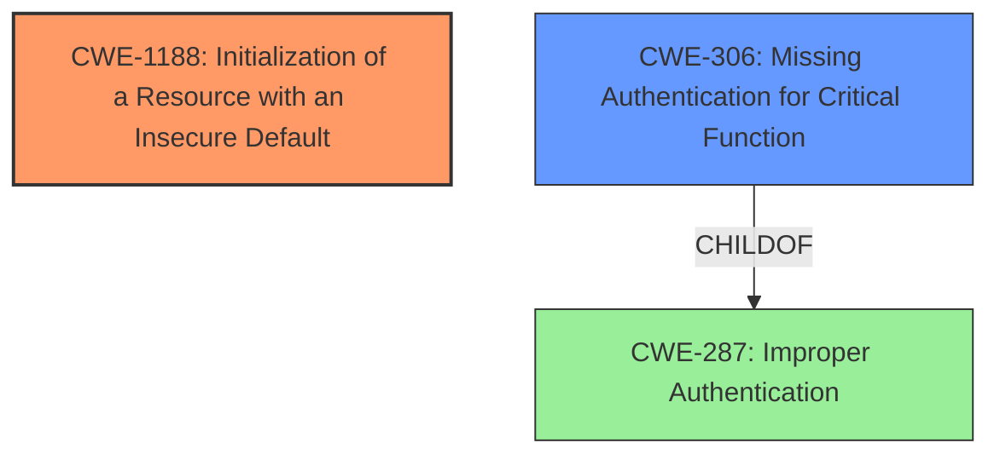

# Analysis for CVE-2020-12734

# Summary
| CWE ID | CWE Name | Confidence | CWE Abstraction Level | CWE Vulnerability Mapping Label | CWE-Vulnerability Mapping Notes |
|---|---|---|---|---|---|
| CWE-1188 | Initialization of a Resource with an Insecure Default | 0.8 | Base | Allowed | Primary CWE: The device has no way to reset to factory default settings, so it initializes with an insecure configuration that allows attackers to take control. |
| CWE-306 | Missing Authentication for Critical Function | 0.6 | Base | Allowed | Secondary CWE: The vulnerability allows changing the SSID and password without authentication. |

## Evidence and Confidence

*   **Confidence Score:** 0.7
*   **Evidence Strength:** MEDIUM

## Relationship Analysis
The primary relationship is that CWE-1188 (Initialization of a Resource with an Insecure Default) describes the root cause of the vulnerability, as the device lacks a mechanism to reset to secure factory settings. This insecure default state allows the device to be easily compromised. CWE-306 (Missing Authentication for Critical Function) is a secondary issue, as the critical function of changing the SSID and password lacks proper authentication.



## Vulnerability Chain
The chain of events starts with the **ROOTCAUSE** of the **insecure default initialization** (CWE-1188) because there is no factory reset. This leads to the **WEAKNESS** of **missing authentication** (CWE-306) when changing the SSID and password, which ultimately allows a remote attacker to change the device's settings and demand ransom.

## Summary of Analysis
The initial assessment identified CWE-1188 as the primary weakness because the lack of a factory reset mechanism leaves the device vulnerable from the start. The additional weakness is CWE-306 which allows the settings to be changed.

*   Evidence for CWE-1188: "there is no way to reset to Factory Default settings."
*   Evidence for CWE-306: "change the SSID and password" without authentication.

The graph relationships helped clarify the connection between the authentication and authorization issues and the overall risk posed by the insecure default configuration. The selected CWEs are at the optimal level of specificity, providing a detailed understanding of the vulnerability's root cause and potential impacts.

Relevant CWE Information:

# Enhanced Context (25 CWEs)
The following CWEs were identified as potentially relevant to this vulnerability:

## CWE-204: Observable Response Discrepancy
**Abstraction Level**: Base
**Similarity Score**: 0.78
**Source**: dense

**Description**:
The product provides different responses to incoming requests in a way that reveals internal state information to an unauthorized actor outside of the intended control sphere.

**Mapping Guidance**:
- Usage: Allowed
- Rationale: This CWE entry is at the Base level of abstraction, which is a preferred level of abstraction for mapping to the root causes of vulnerabilities.

## CWE-807: Reliance on Untrusted Inputs in a Security Decision
**Abstraction Level**: Base
**Similarity Score**: 0.77
**Source**: dense

**Description**:
The product uses a protection mechanism that relies on the existence or values of an input, but the input can be modified by an untrusted actor in a way that bypasses the protection mechanism.

**Mapping Guidance**:
- Usage: Allowed
- Rationale: This CWE entry is at the Base level of abstraction, which is a preferred level of abstraction for mapping to the root causes of vulnerabilities.

## CWE-41: Improper Resolution of Path Equivalence
**Abstraction Level**: Base
**Similarity Score**: 0.77
**Source**: dense

**Description**:
The product is vulnerable to file system contents disclosure through path equivalence. Path equivalence involves the use of special characters in file and directory names. The associated manipulations are intended to generate multiple names for the same object.

**Mapping Guidance**:
- Usage: Allowed
- Rationale: This CWE entry is at the Base level of abstraction, which is a preferred level of abstraction for mapping to the root causes of vulnerabilities.

## CWE-668: Exposure of Resource to Wrong Sphere
**Abstraction Level**: Class
**Similarity Score**: 0.77
**Source**: dense

**Description**:
The product exposes a resource to the wrong control sphere, providing unintended actors with inappropriate access to the resource.

**Mapping Guidance**:
- Usage: Discouraged
- Rationale: CWE-668 is high-level and is often misused as a catch-all when lower-level CWE IDs might be applicable. It is sometimes used for low-information vulnerability reports [REF-1287]. It is a level-1 Class (i.e., a child of a Pillar). It is not useful for trend analysis.

## CWE-74: Improper Neutralization of Special Elements in Output Used by a Downstream Component ('Injection')
**Abstraction Level**: Class
**Similarity Score**: 0.76
**Source**: dense

**Description**:
The product constructs all or part of a command, data structure, or record using externally-influenced input from an upstream component, but it does not neutralize or incorrectly neutralizes special elements that could modify how it is parsed or interpreted when it is sent to a downstream component.

**Mapping Guidance**:
- Usage: Discouraged
- Rationale: CWE-74 is high-level and often misused when lower-level weaknesses are more appropriate.

## CWE-799: Improper Control of Interaction Frequency
**Abstraction Level**: Class
**Similarity Score**: 0.76
**Source**: dense

**Description**:
The product does not properly limit the number or frequency of interactions that it has with an actor, such as the number of incoming requests.

**Mapping Guidance**:
- Usage: Allowed-with-Review
- Rationale: This CWE entry is a Class and might have Base-level children that would be more appropriate

## CWE-1390: Weak Authentication
**Abstraction Level**: Class
**Similarity Score**: 0.75
**Source**: dense

**Description**:
The product uses an authentication mechanism to restrict access to specific users or identities, but the mechanism does not sufficiently prove that the claimed identity is correct.

**Mapping Guidance**:
- Usage: Allowed-with-Review
- Rationale: This CWE entry is a Class and might have Base-level children that would be more appropriate

## CWE-472: External Control of Assumed-Immutable Web Parameter
**Abstraction Level**: Base
**Similarity Score**: 0.75
**Source**: dense

**Description**:
The web application does not sufficiently verify inputs that are assumed to be immutable but are actually externally controllable, such as hidden form fields.

**Mapping Guidance**:
- Usage: Allowed
- Rationale: This CWE entry is at the Base level of abstraction, which is a preferred level of abstraction for mapping to the root causes of vulnerabilities.

## CWE-1391: Use of Weak Credentials
**Abstraction Level**: Class
**Similarity Score**: 0.75
**Source**: dense

**Description**:
The product uses weak credentials (such as a default key or hard-coded password) that can be calculated, derived, reused, or guessed by an attacker.

**Mapping Guidance**:
- Usage: Allowed-with-Review
- Rationale: This CWE entry is a Class and might have Base-level children that would be more appropriate

## CWE-405: Asymmetric Resource Consumption (Amplification)
**Abstraction Level**: Class
**Similarity Score**: 0.75
**Source**: dense

**Description**:
The product does not properly control situations in which an adversary can cause the product to consume or produce excessive resources without requiring the adversary to invest equivalent work or otherwise prove authorization, i.e., the adversary's influence is "asymmetric."

**Mapping Guidance**:
- Usage: Allowed-with-Review
- Rationale: This CWE entry is a Class and might have Base-level children that would be more appropriate

## CWE-798: Use of Hard-coded Credentials
**Abstraction Level**: Base
**Similarity Score**: 5307.65
**Source**: sparse

**Description**:
The product contains hard-coded credentials, such as a password or cryptographic key.

**Mapping Guidance**:
- Usage: Allowed
- Rationale: This CWE entry is at the Base level of abstraction, which is a preferred level of abstraction for mapping to the root causes of vulnerabilities.

## CWE-259: Use of Hard-coded Password
**Abstraction Level**: Variant
**Similarity Score**: 5281.66
**Source**: sparse

**Description**:
The product contains a hard-coded password, which it uses for

# Enhanced Query for CVE-2020-12734

## Vulnerability Description
DEPSTECH WiFi Digital Microscope 3 allows remote attackers to change the SSID and password, and demand a ransom payment from the rightful device owner, because there is no way to reset to Factory Default settings.

### Vulnerability Description Key Phrases
- **impact:** change SSID and password and demand ransom payment
- **attacker:** remote attackers
- **product:** DEPSTECH WiFi Digital Microscope 3

## CVE Reference Links Content Summary
UNRELATED

## Retriever Results

### Top Combined Results

| Rank | CWE ID | Name | Abstraction | Usage  | Retrievers | Individual Scores |
|------|--------|------|-------------|-------|------------|-------------------|
| 1 | 1188 | Initialization of a Resource with an Insecure Default | Base | Allowed | sparse | 0.080 |
| 2 | 862 | Missing Authorization | Class | Allowed-with-Review | sparse | 0.064 |
| 3 | 306 | Missing Authentication for Critical Function | Base | Allowed | sparse | 0.062 |
| 4 | 287 | Improper Authentication | Class | Discouraged | sparse | 0.057 |
| 5 | 285 | Improper Authorization | Class | Discouraged | sparse | 0.057 |
| 6 | 259 | Use of Hard-coded Password | Variant | Allowed | dense | 0.499 |
| 7 | 321 | Use of Hard-coded Cryptographic Key | Variant | Allowed | graph | 0.003 |
| 8 | 266 | Incorrect Privilege Assignment | Base | Allowed | sparse | 0.057 |
| 9 | 352 | Cross-Site Request Forgery (CSRF) | Compound | Allowed | sparse | 0.056 |
| 10 | 204 | Observable Response Discrepancy | Base | Allowed | sparse | 0.055 |


# Complete CWE Specifications


## CWE-1188: Initialization of a Resource with an Insecure Default
**Abstraction:** Base
**Status:** Incomplete

### Description
The product initializes or sets a resource with a default that is intended to be changed by the administrator, but the default is not secure.

### Extended Description


Developers often choose default values that leave the product as open and easy to use as possible out-of-the-box, under the assumption that the administrator can (or should) change the default value. However, this ease-of-use comes at a cost when the default is insecure and the administrator does not change it.


### Alternative Terms
None

### Relationships
ChildOf -> CWE-1419
ChildOf -> CWE-665

### Mapping Guidance
**Usage:** Allowed
**Rationale:** This CWE entry is at the Base level of abstraction, which is a preferred level of abstraction for mapping to the root causes of vulnerabilities.
**Comments:** Carefully read both the name and description to ensure that this mapping is an appropriate fit. Do not try to 'force' a mapping to a lower-level Base/Variant simply to comply with this preferred level of abstraction.
**Reasons:**
- Acceptable-Use


### Additional Notes
**[Maintenance]** This entry improves organization of concepts under initialization. The typical CWE model is to cover "Missing" and "Incorrect" behaviors. Arguably, this entry could be named as "Incorrect" instead of "Insecure." This might be changed in the near future.


### Observed Examples
- **CVE-2022-36349:** insecure default variable initialization in BIOS firmware for a hardware board allows DoS
- **CVE-2022-42467:** A generic database browser interface has a default mode that exposes a web server to the network, allowing queries to the database.


## CWE-862: Missing Authorization
**Abstraction:** Class
**Status:** Incomplete

### Description
The product does not perform an authorization check when an actor attempts to access a resource or perform an action.

### Extended Description
Not provided

### Alternative Terms
AuthZ: "AuthZ" is typically used as an abbreviation of "authorization" within the web application security community. It is distinct from "AuthN" (or, sometimes, "AuthC") which is an abbreviation of "authentication." The use of "Auth" as an abbreviation is discouraged, since it could be used for either authentication or authorization.

### Relationships
ChildOf -> CWE-285
ChildOf -> CWE-284

### Mapping Guidance
**Usage:** Allowed-with-Review
**Rationale:** This CWE entry is a Class and might have Base-level children that would be more appropriate
**Comments:** Examine children of this entry to see if there is a better fit
**Reasons:**
- Abstraction


### Additional Notes
**[Terminology]** Assuming a user with a given identity, authorization is the process of determining whether that user can access a given resource, based on the user's privileges and any permissions or other access-control specifications that apply to the resource.


### Observed Examples
- **CVE-2022-24730:** Go-based continuous deployment product does not check that a user has certain privileges to update or create an app, allowing adversaries to read sensitive repository information
- **CVE-2009-3168:** Web application does not restrict access to admin scripts, allowing authenticated users to reset administrative passwords.
- **CVE-2009-3597:** Web application stores database file under the web root with insufficient access control (CWE-219), allowing direct request.


## CWE-306: Missing Authentication for Critical Function
**Abstraction:** Base
**Status:** Draft

### Description
The product does not perform any authentication for functionality that requires a provable user identity or consumes a significant amount of resources.

### Extended Description
Not provided

### Alternative Terms
None

### Relationships
ChildOf -> CWE-287
ChildOf -> CWE-287

### Mapping Guidance
**Usage:** Allowed
**Rationale:** This CWE entry is at the Base level of abstraction, which is a preferred level of abstraction for mapping to the root causes of vulnerabilities.
**Comments:** Carefully read both the name and description to ensure that this mapping is an appropriate fit. Do not try to 'force' a mapping to a lower-level Base/Variant simply to comply with this preferred level of abstraction.
**Reasons:**
- Acceptable-Use


### Observed Examples
- **CVE-2022-31260:** Chain: a digital asset management program has an undisclosed backdoor in the legacy version of a PHP script (CWE-912) that could allow an unauthenticated user to export metadata (CWE-306)
- **CVE-2022-29951:** TCP-based protocol in Programmable Logic Controller (PLC) has no authentication.
- **CVE-2022-29952:** Condition Monitor firmware uses a protocol that does not require authentication.


## CWE-287: Improper Authentication
**Abstraction:** Class
**Status:** Draft

### Description
When an actor claims to have a given identity, the product does not prove or insufficiently proves that the claim is correct.

### Extended Description
Not provided

### Alternative Terms
authentification: An alternate term is "authentification", which appears to be most commonly used by people from non-English-speaking countries.
AuthN: "AuthN" is typically used as an abbreviation of "authentication" within the web application security community. It is also distinct from "AuthZ," which is an abbreviation of "authorization." The use of "Auth" as an abbreviation is discouraged, since it could be used for either authentication or authorization.
AuthC: "AuthC" is used as an abbreviation of "authentication," but it appears to used less frequently than "AuthN."

### Relationships
ChildOf -> CWE-284
ChildOf -> CWE-284

### Mapping Guidance
**Usage:** Discouraged
**Rationale:** This CWE entry might be misused when lower-level CWE entries are likely to be applicable. It is a level-1 Class (i.e., a child of a Pillar).
**Comments:** Consider children or descendants, beginning with CWE-1390: Weak Authentication or CWE-306: Missing Authentication for Critical Function.
**Reasons:**
- Frequent Misuse
**Suggested Alternatives:**
- CWE-1390: Weak Authentication
- CWE-306: Missing Authentication for Critical Function


### Additional Notes
**[Relationship]** This can be resultant from SQL injection vulnerabilities and other issues.

**[Maintenance]** The Taxonomy_Mappings to ISA/IEC 62443 were added in CWE 4.10, but they are still under review and might change in future CWE versions. These draft mappings were performed by members of the "Mapping CWE to 62443" subgroup of the CWE-CAPEC ICS/OT Special Interest Group (SIG), and their work is incomplete as of CWE 4.10. The mappings are included to facilitate discussion and review by the broader ICS/OT community, and they are likely to change in future CWE versions.


### Observed Examples
- **CVE-2022-35248:** Chat application skips validation when Central Authentication Service (CAS) is enabled, effectively removing the second factor from two-factor authentication
- **CVE-2022-36436:** Python-based authentication proxy does not enforce password authentication during the initial handshake, allowing the client to bypass authentication by specifying a 'None' authentication type.
- **CVE-2022-30034:** Chain: Web UI for a Python RPC framework does not use regex anchors to validate user login emails (CWE-777), potentially allowing bypass of OAuth (CWE-1390).


## CWE-285: Improper Authorization
**Abstraction:** Class
**Status:** Draft

### Description
The product does not perform or incorrectly performs an authorization check when an actor attempts to access a resource or perform an action.

### Extended Description


Assuming a user with a given identity, authorization is the process of determining whether that user can access a given resource, based on the user's privileges and any permissions or other access-control specifications that apply to the resource.


When access control checks are not applied consistently - or not at all - users are able to access data or perform actions that they should not be allowed to perform. This can lead to a wide range of problems, including information exposures, denial of service, and arbitrary code execution.


### Alternative Terms
AuthZ: "AuthZ" is typically used as an abbreviation of "authorization" within the web application security community. It is distinct from "AuthN" (or, sometimes, "AuthC") which is an abbreviation of "authentication." The use of "Auth" as an abbreviation is discouraged, since it could be used for either authentication or authorization.

### Relationships
ChildOf -> CWE-284
ChildOf -> CWE-284

### Mapping Guidance
**Usage:** Discouraged
**Rationale:** CWE-285 is high-level and lower-level CWEs can frequently be used instead. It is a level-1 Class (i.e., a child of a Pillar).
**Comments:** Look at CWE-285's children and consider mapping to CWEs such as CWE-862: Missing Authorization, CWE-863: Incorrect Authorization, CWE-732: Incorrect Permission Assignment for Critical Resource, or others.
**Reasons:**
- Abstraction
**Suggested Alternatives:**
- CWE-862: Missing Authorization
- CWE-863: Incorrect Authorization
- CWE-732: Incorrect Permission Assignment for Critical Resource


### Observed Examples
- **CVE-2022-24730:** Go-based continuous deployment product does not check that a user has certain privileges to update or create an app, allowing adversaries to read sensitive repository information
- **CVE-2009-3168:** Web application does not restrict access to admin scripts, allowing authenticated users to reset administrative passwords.
- **CVE-2009-2960:** Web application does not restrict access to admin scripts, allowing authenticated users to modify passwords of other users.


## CWE-259: Use of Hard-coded Password
**Abstraction:** Variant
**Status:** Draft

### Description
The product contains a hard-coded password, which it uses for its own inbound authentication or for outbound communication to external components.

### Extended Description


A hard-coded password typically leads to a significant authentication failure that can be difficult for the system administrator to detect. Once detected, it can be difficult to fix, so the administrator may be forced into disabling the product entirely. There are two main variations:

```
		Inbound: the product contains an authentication mechanism that checks for a hard-coded password.
		Outbound: the product connects to another system or component, and it contains hard-coded password for connecting to that component.
```
In the Inbound variant, a default administration account is created, and a simple password is hard-coded into the product and associated with that account. This hard-coded password is the same for each installation of the product, and it usually cannot be changed or disabled by system administrators without manually modifying the program, or otherwise patching the product. If the password is ever discovered or published (a common occurrence on the Internet), then anybody with knowledge of this password can access the product. Finally, since all installations of the product will have the same password, even across different organizations, this enables massive attacks such as worms to take place.

The Outbound variant applies to front-end systems that authenticate with a back-end service. The back-end service may require a fixed password which can be easily discovered. The programmer may simply hard-code those back-end credentials into the front-end product. Any user of that program may be able to extract the password. Client-side systems with hard-coded passwords pose even more of a threat, since the extraction of a password from a binary is usually very simple.


### Alternative Terms
None

### Relationships
ChildOf -> CWE-798
ChildOf -> CWE-798
ChildOf -> CWE-798
PeerOf -> CWE-321
PeerOf -> CWE-257

### Mapping Guidance
**Usage:** Allowed
**Rationale:** This CWE entry is at the Variant level of abstraction, which is a preferred level of abstraction for mapping to the root causes of vulnerabilities.
**Comments:** Carefully read both the name and description to ensure that this mapping is an appropriate fit. Do not try to 'force' a mapping to a lower-level Base/Variant simply to comply with this preferred level of abstraction.
**Reasons:**
- Acceptable-Use


### Additional Notes
**[Maintenance]** This entry could be split into multiple variants: an inbound variant (as seen in the second demonstrative example) and an outbound variant (as seen in the first demonstrative example). These variants are likely to have different consequences, detectability, etc. More importantly, from a vulnerability theory perspective, they could be characterized as different behaviors.


### Observed Examples
- **CVE-2022-29964:** Distributed Control System (DCS) has hard-coded passwords for local shell access
- **CVE-2021-37555:** Telnet service for IoT feeder for dogs and cats has hard-coded password [REF-1288]
- **CVE-2021-35033:** Firmware for a WiFi router uses a hard-coded password for a BusyBox shell, allowing bypass of authentication through the UART port


## CWE-321: Use of Hard-coded Cryptographic Key
**Abstraction:** Variant
**Status:** Draft

### Description
The use of a hard-coded cryptographic key significantly increases the possibility that encrypted data may be recovered.

### Extended Description
Not provided

### Alternative Terms
None

### Relationships
ChildOf -> CWE-798
ChildOf -> CWE-798
ChildOf -> CWE-798

### Mapping Guidance
**Usage:** Allowed
**Rationale:** This CWE entry is at the Variant level of abstraction, which is a preferred level of abstraction for mapping to the root causes of vulnerabilities.
**Comments:** Carefully read both the name and description to ensure that this mapping is an appropriate fit. Do not try to 'force' a mapping to a lower-level Base/Variant simply to comply with this preferred level of abstraction.
**Reasons:**
- Acceptable-Use


### Additional Notes
**[Other]** The main difference between the use of hard-coded passwords and the use of hard-coded cryptographic keys is the false sense of security that the former conveys. Many people believe that simply hashing a hard-coded password before storage will protect the information from malicious users. However, many hashes are reversible (or at least vulnerable to brute force attacks) -- and further, many authentication protocols simply request the hash itself, making it no better than a password.

**[Maintenance]** The Taxonomy_Mappings to ISA/IEC 62443 were added in CWE 4.10, but they are still under review and might change in future CWE versions. These draft mappings were performed by members of the "Mapping CWE to 62443" subgroup of the CWE-CAPEC ICS/OT Special Interest Group (SIG), and their work is incomplete as of CWE 4.10. The mappings are included to facilitate discussion and review by the broader ICS/OT community, and they are likely to change in future CWE versions.


### Observed Examples
- **CVE-2022-29960:** Engineering Workstation uses hard-coded cryptographic keys that could allow for unathorized filesystem access and privilege escalation
- **CVE-2022-30271:** Remote Terminal Unit (RTU) uses a hard-coded SSH private key that is likely to be used by default.
- **CVE-2020-10884:** WiFi router service has a hard-coded encryption key, allowing root access


## CWE-266: Incorrect Privilege Assignment
**Abstraction:** Base
**Status:** Draft

### Description
A product incorrectly assigns a privilege to a particular actor, creating an unintended sphere of control for that actor.

### Extended Description
Not provided

### Alternative Terms
None

### Relationships
ChildOf -> CWE-269
CanAlsoBe -> CWE-286

### Mapping Guidance
**Usage:** Allowed
**Rationale:** This CWE entry is at the Base level of abstraction, which is a preferred level of abstraction for mapping to the root causes of vulnerabilities.
**Comments:** Carefully read both the name and description to ensure that this mapping is an appropriate fit. Do not try to 'force' a mapping to a lower-level Base/Variant simply to comply with this preferred level of abstraction.
**Reasons:**
- Acceptable-Use


### Observed Examples
- **CVE-1999-1193:** untrusted user placed in unix "wheel" group
- **CVE-2005-2741:** Product allows users to grant themselves certain rights that can be used to escalate privileges.
- **CVE-2005-2496:** Product uses group ID of a user instead of the group, causing it to run with different privileges. This is resultant from some other unknown issue.


## CWE-352: Cross-Site Request Forgery (CSRF)
**Abstraction:** Compound
**Status:** Stable

### Description
The web application does not, or can not, sufficiently verify whether a well-formed, valid, consistent request was intentionally provided by the user who submitted the request.

### Extended Description
When a web server is designed to receive a request from a client without any mechanism for verifying that it was intentionally sent, then it might be possible for an attacker to trick a client into making an unintentional request to the web server which will be treated as an authentic request. This can be done via a URL, image load, XMLHttpRequest, etc. and can result in exposure of data or unintended code execution.

### Alternative Terms
Session Riding
Cross Site Reference Forgery
XSRF

### Relationships
ChildOf -> CWE-345
ChildOf -> CWE-345
Requires -> CWE-346
Requires -> CWE-441
Requires -> CWE-642
Requires -> CWE-613

### Mapping Guidance
**Usage:** Allowed
**Rationale:** This is a well-known Composite of multiple weaknesses that must all occur simultaneously, although it is attack-oriented in nature.
**Comments:** While attack-oriented composites are supported in CWE, they have not been a focus of research. There is a chance that future research or CWE scope clarifications will change or deprecate them. Perform root-cause analysis to determine if other weaknesses allow CSRF attacks to occur, and map to those weaknesses. For example, predictable CSRF tokens might allow bypass of CSRF protection mechanisms; if this occurs, they might be better characterized as randomness/predictability weaknesses.
**Reasons:**
- Other


### Additional Notes
**[Relationship]** 

There can be a close relationship between XSS and CSRF (CWE-352). An attacker might use CSRF in order to trick the victim into submitting requests to the server in which the requests contain an XSS payload. A well-known example of this was the Samy worm on MySpace [REF-956]. The worm used XSS to insert malicious HTML sequences into a user's profile and add the attacker as a MySpace friend. MySpace friends of that victim would then execute the payload to modify their own profiles, causing the worm to propagate exponentially. Since the victims did not intentionally insert the malicious script themselves, CSRF was a root cause.


**[Theoretical]** 

The CSRF topology is multi-channel:


  - Attacker (as outsider) to intermediary (as user). The interaction point is either an external or internal channel.

  - Intermediary (as user) to server (as victim). The activation point is an internal channel.


### Observed Examples
- **CVE-2004-1703:** Add user accounts via a URL in an img tag
- **CVE-2004-1995:** Add user accounts via a URL in an img tag
- **CVE-2004-1967:** Arbitrary code execution by specifying the code in a crafted img tag or URL


## CWE-204: Observable Response Discrepancy
**Abstraction:** Base
**Status:** Incomplete

### Description
The product provides different responses to incoming requests in a way that reveals internal state information to an unauthorized actor outside of the intended control sphere.

### Extended Description
This issue frequently occurs during authentication, where a difference in failed-login messages could allow an attacker to determine if the username is valid or not. These exposures can be inadvertent (bug) or intentional (design).

### Alternative Terms
None

### Relationships
ChildOf -> CWE-203

### Mapping Guidance
**Usage:** Allowed
**Rationale:** This CWE entry is at the Base level of abstraction, which is a preferred level of abstraction for mapping to the root causes of vulnerabilities.
**Comments:** Carefully read both the name and description to ensure that this mapping is an appropriate fit. Do not try to 'force' a mapping to a lower-level Base/Variant simply to comply with this preferred level of abstraction.
**Reasons:**
- Acceptable-Use


### Additional Notes
**[Relationship]** can overlap errors related to escalated privileges


### Observed Examples
- **CVE-2002-2094:** This, and others, use ".." attacks and monitor error responses, so there is overlap with directory traversal.
- **CVE-2001-1483:** Enumeration of valid usernames based on inconsistent responses
- **CVE-2001-1528:** Account number enumeration via inconsistent responses.

