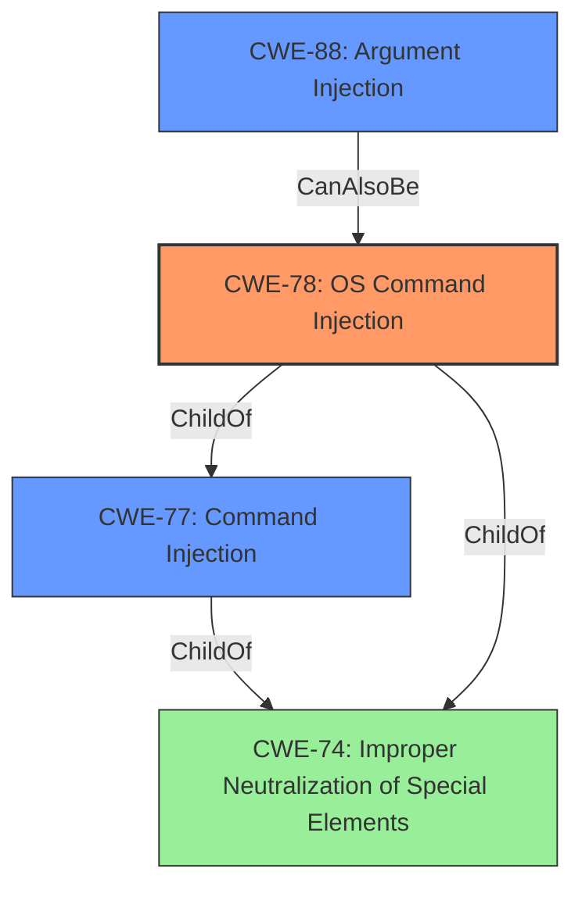

# Enhanced Analysis for CVE-2020-12775

# Summary
| CWE ID | CWE Name | Confidence | CWE Abstraction Level | CWE Vulnerability Mapping Label | CWE-Vulnerability Mapping Notes |
|---|---|---|---|---|---|
| CWE-78 | Improper Neutralization of Special Elements used in an OS Command ('OS Command Injection') | 1.0 | Base | Allowed | Primary CWE |
| CWE-77 | Improper Neutralization of Special Elements used in a Command ('Command Injection') | 0.7 | Class | Allowed-with-Review | Secondary Candidate |
| CWE-88 | Improper Neutralization of Argument Delimiters in a Command ('Argument Injection') | 0.6 | Base | Allowed | Secondary Candidate |

## Evidence and Confidence

*   **Confidence Score:** 0.9
*   **Evidence Strength:** HIGH

## Relationship Analysis
The primary CWE is CWE-78, which is a more specific form of CWE-77. CWE-78 focuses specifically on OS commands, whereas CWE-77 is a broader class that includes other types of commands. CWE-88 describes the case where command arguments are not properly delimited, which can lead to command injection.



## Vulnerability Chain
The vulnerability chain starts with the **lack of filtering special characters** in web URLs, leading to **command injection** and culminating in the execution of arbitrary system commands, disruption of the system, or termination of service.

## Summary of Analysis
The initial assessment identified **command injection** due to the **lack of filtering of special characters**. The primary CWE selected is CWE-78, because the vulnerability description explicitly mentions that the attacker can execute arbitrary system commands. This aligns with the description of CWE-78, which focuses on OS command injection. CWE-77 is considered as a broader class, but CWE-78 is more specific and accurate. CWE-88 is considered because arguments may not be properly delimited.

The evidence supporting this assessment comes directly from the vulnerability description: "Hicos citizen certificate client-side component **does not filter special characters for command parameters** in specific web URLs. An unauthenticated remote attacker can exploit this vulnerability to perform **command injection** attack to execute arbitrary system command, disrupt system or terminate service."

The decision to select CWE-78 is based on the specificity of the description matching the CWE's focus on OS commands, as well as the retriever results that listed CWE-78 as a strong candidate.

Relevant CWE Information:

# Enhanced Context (25 CWEs)
The following CWEs were identified as potentially relevant to this vulnerability:

## CWE-80: Improper Neutralization of Script-Related HTML Tags in a Web Page (Basic XSS)
**Abstraction Level**: Variant
**Similarity Score**: 0.77
**Source**: dense

**Description**:
The product receives input from an upstream component, but it does not neutralize or incorrectly neutralizes special characters such as "<", ">", and "&" that could be interpreted as web-scripting elements when they are sent to a downstream component that processes web pages.

**Mapping Guidance**:
- Usage: Allowed
- Rationale: This CWE entry is at the Variant level of abstraction, which is a preferred level of abstraction for mapping to the root causes of vulnerabilities.

## CWE-74: Improper Neutralization of Special Elements in Output Used by a Downstream Component ('Injection')
**Abstraction Level**: Class
**Similarity Score**: 0.76
**Source**: dense

**Description**:
The product constructs all or part of a command, data structure, or record using externally-influenced input from an upstream component, but it does not neutralize or incorrectly neutralizes special elements that could modify how it is parsed or interpreted when it is sent to a downstream component.

**Mapping Guidance**:
- Usage: Discouraged
- Rationale: CWE-74 is high-level and often misused when lower-level weaknesses are more appropriate.

## CWE-943: Improper Neutralization of Special Elements in Data Query Logic
**Abstraction Level**: Class
**Similarity Score**: 0.75
**Source**: dense

**Description**:
The product generates a query intended to access or manipulate data in a data store such as a database, but it does not neutralize or incorrectly neutralizes special elements that can modify the intended logic of the query.

**Mapping Guidance**:
- Usage: Allowed-with-Review
- Rationale: This CWE entry is a Class and might have Base-level children that would be more appropriate

## CWE-917: Improper Neutralization of Special Elements used in an Expression Language Statement ('Expression Language Injection')
**Abstraction Level**: Base
**Similarity Score**: 0.73
**Source**: dense

**Description**:
The product constructs all or part of an expression language (EL) statement in a framework such as a Java Server Page (JSP) using externally-influenced input from an upstream component, but it does not neutralize or incorrectly neutralizes special elements that could modify the intended EL statement before it is executed.

**Mapping Guidance**:
- Usage: Allowed
- Rationale: This CWE entry is at the Base level of abstraction, which is a preferred level of abstraction for mapping to the root causes of vulnerabilities.

## CWE-1289: Improper Validation of Unsafe Equivalence in Input
**Abstraction Level**: Base
**Similarity Score**: 0.73
**Source**: dense

**Description**:
The product receives an input value that is used as a resource identifier or other type of reference, but it does not validate or incorrectly validates that the input is equivalent to a potentially-unsafe value.

**Mapping Guidance**:
- Usage: Allowed
- Rationale: This CWE entry is at the Base level of abstraction, which is a preferred level of abstraction for mapping to the root causes of vulnerabilities.

## CWE-138: Improper Neutralization of Special Elements
**Abstraction Level**: Class
**Similarity Score**: 0.73
**Source**: dense

**Description**:
The product receives input from an upstream component, but it does not neutralize or incorrectly neutralizes special elements that could be interpreted as control elements or syntactic markers when they are sent to a downstream component.

**Mapping Guidance**:
- Usage: Discouraged
- Rationale: This CWE entry is a level-1 Class (i.e., a child of a Pillar). It might have lower-level children that would be more appropriate

## CWE-184: Incomplete List of Disallowed Inputs
**Abstraction Level**: Base
**Similarity Score**: 0.73
**Source**: dense

**Description**:
The product implements a protection mechanism that relies on a list of inputs (or properties of inputs) that are not allowed by policy or otherwise require other action to neutralize before additional processing takes place, but the list is incomplete.

**Mapping Guidance**:
- Usage: Allowed
- Rationale: This CWE entry is at the Base level of abstraction, which is a preferred level of abstraction for mapping to the root causes of vulnerabilities.

## CWE-116: Improper Encoding or Escaping of Output
**Abstraction Level**: Class
**Similarity Score**: 0.72
**Source**: dense

**Description**:
The product prepares a structured message for communication with another component, but encoding or escaping of the data is either missing or done incorrectly. As a result, the intended structure of the message is not preserved.

**Mapping Guidance**:
- Usage: Allowed-with-Review
- Rationale: This CWE entry is a Class and might have Base-level children that would be more appropriate

## CWE-1236: Improper Neutralization of Formula Elements in a CSV File
**Abstraction Level**: Base
**Similarity Score**: 0.72
**Source**: dense

**Description**:
The product saves user-provided information into a Comma-Separated Value (CSV) file, but it does not neutralize or incorrectly neutralizes special elements that could be interpreted as a command when the file is opened by a spreadsheet product.

**Mapping Guidance**:
- Usage: Allowed
- Rationale: This CWE entry is at the Base level of abstraction, which is a preferred level of abstraction for mapping to the root causes of vulnerabilities.

## CWE-162: Improper Neutralization of Trailing Special Elements
**Abstraction Level**: Variant
**Similarity Score**: 0.72
**Source**: dense

**Description**:
The product receives input from an upstream component, but it does not neutralize or incorrectly neutralizes trailing special elements that could be interpreted in unexpected ways when they are sent to a downstream component.

**Mapping Guidance**:
- Usage: Allowed
- R


## CWE Relationship Analysis

Current CWEs represent these abstraction levels: .


### Vulnerability Chain Analysis

**Chain starting from CWE-88:**
- 88 (Improper Neutralization of Argument Delimiters in a Command ('Argument Injection')) - ROOT


**Chain starting from CWE-80:**
- 80 (Improper Neutralization of Script-Related HTML Tags in a Web Page (Basic XSS)) - ROOT


### CWE Relationship Diagram

```mermaid
graph TD
    classDef primary fill:#f96,stroke:#333,stroke-width:2px
    classDef secondary fill:#69f,stroke:#333
    classDef tertiary fill:#9e9,stroke:#333
```