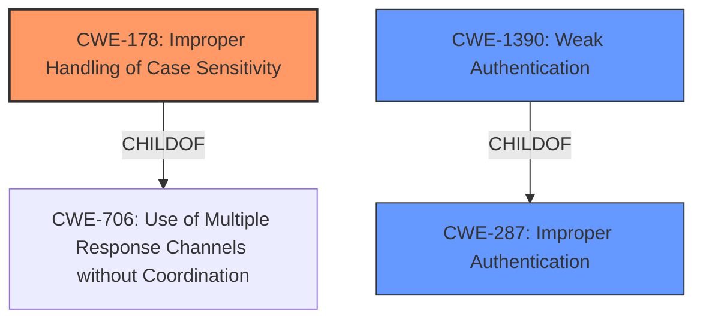

# Raw Analyzer Response for CVE-2020-12812

# Summary
| CWE ID    | CWE Name                                          | Confidence | CWE Abstraction Level | CWE Vulnerability Mapping Label | CWE-Vulnerability Mapping Notes |
| :-------- | :------------------------------------------------ | :--------- | :-------------------- | :------------------------------ | :------------------------------ |
| CWE-178   | Improper Handling of Case Sensitivity             | 0.9        | Base                  | Allowed                         | Primary CWE                     |
| CWE-287   | Improper Authentication                           | 0.7        | Class                 | Discouraged                     | Secondary Candidate             |
| CWE-1390  | Weak Authentication                               | 0.6        | Class                 | Allowed-with-Review             | Secondary Candidate             |

## Evidence and Confidence

*   **Confidence Score:** 0.8
*   **Evidence Strength:** HIGH

## Relationship Analysis
The primary relationship influencing the decision is the hierarchical structure. CWE-178 **Improper Handling of Case Sensitivity** is a base CWE, which is preferred. CWE-287 **Improper Authentication** and CWE-1390 **Weak Authentication** are both class level CWEs and parent CWEs of CWE-178. The vulnerability is caused by the **improper handling of case sensitivity**, so CWE-178 is the most specific and appropriate choice.

## Vulnerability Chain
The vulnerability chain starts with the **improper handling of case sensitivity** (CWE-178), which leads to **improper authentication** (CWE-287) and ultimately allows a user to log in without the second factor of authentication.

## Summary of Analysis
The initial analysis considered the retriever results, which suggested CWE-178, CWE-287 and CWE-1390 as potential candidates. The final decision was primarily influenced by the evidence provided in the vulnerability description and CVE Reference Links Content Summary, which highlighted the **improper handling of case sensitivity** as the root cause.

The evidence from the "Vulnerability Description" states: "An **improper authentication vulnerability** in SSL VPN in FortiOS...may result in a user being able to log in successfully without being prompted for the second factor of authentication (FortiToken) if they changed the case of their username."

The evidence from the "CVE Reference Links Content Summary" states: "The vulnerability stems from the system's failure to properly handle username case sensitivity during authentication. If a user alters the case of their username (e.g., from "User" to "user"), they might bypass the multi-factor authentication (MFA) process."

The graph relationships further supported the selection of CWE-178 as the most specific and appropriate choice, as it is a base CWE that directly addresses the root cause of the vulnerability. CWE-287 and CWE-1390 are more general classifications that do not capture the specific weakness of **improper handling of case sensitivity**.

The selected CWEs are at the optimal level of specificity, as they accurately represent the root cause of the vulnerability and provide sufficient information for understanding and mitigating the weakness.

Relevant CWE Information:

# Enhanced Context (25 CWEs)
The following CWEs were identified as potentially relevant to this vulnerability:

## CWE-178: Improper Handling of Case Sensitivity
**Abstraction Level**: Base
**Similarity Score**: 0.395 (sparse), 4694.55 (sparse), 3.31 (graph)

**Description**:
The product does not properly account for differences in case sensitivity when accessing or determining the properties of a resource, leading to inconsistent results.

**Mapping Guidance**:
- Usage: Allowed
- Rationale: This CWE entry is at the Base level of abstraction, which is a preferred level of abstraction for mapping to the root causes of vulnerabilities.

**Technical Explanation:**
The vulnerability stems from the system's failure to properly handle username case sensitivity during authentication.

**Security Implications:**
An attacker can bypass multi-factor authentication by simply changing the case of their username.

**Relationships:**
ChildOf -> CWE-706
CanPrecede -> CWE-433
CanPrecede -> CWE-289

## CWE-287: Improper Authentication
**Abstraction Level**: Class
**Similarity Score**: 0.323 (sparse), 4508.81 (sparse)

**Description**:
When an actor claims to have a given identity, the product does not prove or insufficiently proves that the claim is correct.

**Mapping Guidance**:
- Usage: Discouraged
- Rationale: This CWE entry might be misused when lower-level CWE entries are likely to be applicable. It is a level-1 Class (i.e., a child of a Pillar).
- Suggested Alternatives: CWE-1390: Weak Authentication or CWE-306: Missing Authentication for Critical Function

**Technical Explanation:**
The product does not properly authenticate users due to the case sensitivity issue.

**Security Implications:**
Unauthorized access to the system.

**Relationships:**
ChildOf -> CWE-284
CanPrecede -> CWE-613

## CWE-1390: Weak Authentication
**Abstraction Level**: Class
**Similarity Score**: 0.310 (sparse), 4602.64 (sparse)

**Description**:
The product uses an authentication mechanism to restrict access to specific users or identities, but the mechanism does not sufficiently prove that the claimed identity is correct.

**Mapping Guidance**:
- Usage: Allowed-with-Review
- Rationale: This CWE entry is a Class and might have Base-level children that would be more appropriate
- Comments: Examine children of this entry to see if there is a better fit

**Technical Explanation:**
The authentication mechanism is weak due to the case sensitivity issue.

**Security Implications:**
Attackers may be able to bypass authentication faster and/or with less effort than expected.

**Relationships:**
ChildOf -> CWE-287

## CWEs Considered but Not Used:
- CWE-347 **Improper Verification of Cryptographic Signature**: This CWE is not applicable because the vulnerability does not involve cryptographic signatures.
- CWE-345 **Insufficient Verification of Data Authenticity**: This CWE is not applicable because the vulnerability is specifically related to case sensitivity rather than general data authenticity.
- CWE-288 **Authentication Bypass Using an Alternate Path or Channel**: This CWE is not applicable because the vulnerability does not involve an alternate path or channel for authentication.
- CWE-613 **Insufficient Session Expiration**: This CWE is not applicable because the vulnerability is not related to session expiration.
- CWE-303 **Incorrect Implementation of Authentication Algorithm**: This CWE is not applicable because the vulnerability is not due to an incorrect implementation of an authentication algorithm, but rather the **improper handling of case sensitivity**.
- CWE-863 **Incorrect Authorization**: This CWE is not applicable because the vulnerability is related to authentication, not authorization.
- CWE-285 **Improper Authorization**: This CWE is not applicable because the vulnerability is related to authentication, not authorization.