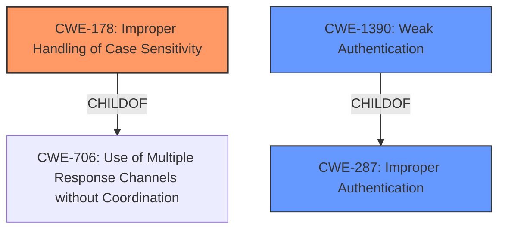

# Analysis for CVE-2020-12812

# Summary
| CWE ID    | CWE Name                                          | Confidence | CWE Abstraction Level | CWE Vulnerability Mapping Label | CWE-Vulnerability Mapping Notes |
| :-------- | :------------------------------------------------ | :--------- | :-------------------- | :------------------------------ | :------------------------------ |
| CWE-178   | Improper Handling of Case Sensitivity             | 0.9        | Base                  | Allowed                         | Primary CWE                     |
| CWE-287   | Improper Authentication                           | 0.7        | Class                 | Discouraged                     | Secondary Candidate             |
| CWE-1390  | Weak Authentication                               | 0.6        | Class                 | Allowed-with-Review             | Secondary Candidate             |

## Evidence and Confidence

*   **Confidence Score:** 0.8
*   **Evidence Strength:** HIGH

## Relationship Analysis
The primary relationship influencing the decision is the hierarchical structure. CWE-178 **Improper Handling of Case Sensitivity** is a base CWE, which is preferred. CWE-287 **Improper Authentication** and CWE-1390 **Weak Authentication** are both class level CWEs and parent CWEs of CWE-178. The vulnerability is caused by the **improper handling of case sensitivity**, so CWE-178 is the most specific and appropriate choice.

## Vulnerability Chain
The vulnerability chain starts with the **improper handling of case sensitivity** (CWE-178), which leads to **improper authentication** (CWE-287) and ultimately allows a user to log in without the second factor of authentication.

## Summary of Analysis
The initial analysis considered the retriever results, which suggested CWE-178, CWE-287 and CWE-1390 as potential candidates. The final decision was primarily influenced by the evidence provided in the vulnerability description and CVE Reference Links Content Summary, which highlighted the **improper handling of case sensitivity** as the root cause.

The evidence from the "Vulnerability Description" states: "An **improper authentication vulnerability** in SSL VPN in FortiOS...may result in a user being able to log in successfully without being prompted for the second factor of authentication (FortiToken) if they changed the case of their username."

The evidence from the "CVE Reference Links Content Summary" states: "The vulnerability stems from the system's failure to properly handle username case sensitivity during authentication. If a user alters the case of their username (e.g., from "User" to "user"), they might bypass the multi-factor authentication (MFA) process."

The graph relationships further supported the selection of CWE-178 as the most specific and appropriate choice, as it is a base CWE that directly addresses the root cause of the vulnerability. CWE-287 and CWE-1390 are more general classifications that do not capture the specific weakness of **improper handling of case sensitivity**.

The selected CWEs are at the optimal level of specificity, as they accurately represent the root cause of the vulnerability and provide sufficient information for understanding and mitigating the weakness.

Relevant CWE Information:

# Enhanced Context (25 CWEs)
The following CWEs were identified as potentially relevant to this vulnerability:

## CWE-178: Improper Handling of Case Sensitivity
**Abstraction Level**: Base
**Similarity Score**: 0.395 (sparse), 4694.55 (sparse), 3.31 (graph)

**Description**:
The product does not properly account for differences in case sensitivity when accessing or determining the properties of a resource, leading to inconsistent results.

**Mapping Guidance**:
- Usage: Allowed
- Rationale: This CWE entry is at the Base level of abstraction, which is a preferred level of abstraction for mapping to the root causes of vulnerabilities.

**Technical Explanation:**
The vulnerability stems from the system's failure to properly handle username case sensitivity during authentication.

**Security Implications:**
An attacker can bypass multi-factor authentication by simply changing the case of their username.

**Relationships:**
ChildOf -> CWE-706
CanPrecede -> CWE-433
CanPrecede -> CWE-289

## CWE-287: Improper Authentication
**Abstraction Level**: Class
**Similarity Score**: 0.323 (sparse), 4508.81 (sparse)

**Description**:
When an actor claims to have a given identity, the product does not prove or insufficiently proves that the claim is correct.

**Mapping Guidance**:
- Usage: Discouraged
- Rationale: This CWE entry might be misused when lower-level CWE entries are likely to be applicable. It is a level-1 Class (i.e., a child of a Pillar).
- Suggested Alternatives: CWE-1390: Weak Authentication or CWE-306: Missing Authentication for Critical Function

**Technical Explanation:**
The product does not properly authenticate users due to the case sensitivity issue.

**Security Implications:**
Unauthorized access to the system.

**Relationships:**
ChildOf -> CWE-284
CanPrecede -> CWE-613

## CWE-1390: Weak Authentication
**Abstraction Level**: Class
**Similarity Score**: 0.310 (sparse), 4602.64 (sparse)

**Description**:
The product uses an authentication mechanism to restrict access to specific users or identities, but the mechanism does not sufficiently prove that the claimed identity is correct.

**Mapping Guidance**:
- Usage: Allowed-with-Review
- Rationale: This CWE entry is a Class and might have Base-level children that would be more appropriate
- Comments: Examine children of this entry to see if there is a better fit

**Technical Explanation:**
The authentication mechanism is weak due to the case sensitivity issue.

**Security Implications:**
Attackers may be able to bypass authentication faster and/or with less effort than expected.

**Relationships:**
ChildOf -> CWE-287

## CWEs Considered but Not Used:
- CWE-347 **Improper Verification of Cryptographic Signature**: This CWE is not applicable because the vulnerability does not involve cryptographic signatures.
- CWE-345 **Insufficient Verification of Data Authenticity**: This CWE is not applicable because the vulnerability is specifically related to case sensitivity rather than general data authenticity.
- CWE-288 **Authentication Bypass Using an Alternate Path or Channel**: This CWE is not applicable because the vulnerability does not involve an alternate path or channel for authentication.
- CWE-613 **Insufficient Session Expiration**: This CWE is not applicable because the vulnerability is not related to session expiration.
- CWE-303 **Incorrect Implementation of Authentication Algorithm**: This CWE is not applicable because the vulnerability is not due to an incorrect implementation of an authentication algorithm, but rather the **improper handling of case sensitivity**.
- CWE-863 **Incorrect Authorization**: This CWE is not applicable because the vulnerability is related to authentication, not authorization.
- CWE-285 **Improper Authorization**: This CWE is not applicable because the vulnerability is related to authentication, not authorization.

# Enhanced Query for CVE-2020-12812

## Vulnerability Description
An **improper authentication vulnerability** in SSL VPN in FortiOS 6.4.0, 6.2.0 to 6.2.3, 6.0.9 and below may result in a user being able to log in successfully without being prompted for the second factor of authentication (FortiToken) if they changed the case of their username.

### Vulnerability Description Key Phrases
- **rootcause:** **improper authentication vulnerability**
- **impact:** log in without second factor
- **vector:** change username case
- **attacker:** user
- **product:** FortiOS
- **version:** 6.4.0 and 6.2.0 to 6.2.3 and 6.0.9 and below
- **component:** SSL VPN

## CVE Reference Links Content Summary
Based on the provided content, here's an analysis of the vulnerability described in CVE-2020-12812:

**Root Cause of Vulnerability:**
- Improper authentication in FortiOS SSL VPN.

**Weaknesses/Vulnerabilities:**
- The vulnerability stems from the system's failure to properly handle username case sensitivity during authentication. If a user alters the case of their username (e.g., from "User" to "user"), they might bypass the multi-factor authentication (MFA) process.

**Impact of Exploitation:**
- Successful exploitation allows an attacker to gain unauthorized access to the SSL VPN without providing the second factor of authentication (FortiToken). This can lead to the compromise of internal network resources and data.

**Attack Vectors:**
- The attack vector is through the SSL VPN login interface.

**Required Attacker Capabilities/Position:**
- The attacker needs to have a valid username and password.
- The attacker must be aware of this vulnerability and attempt to log in with a modified username case.
- The attacker needs to be in a position to access the vulnerable SSL VPN service.

**Additional details:**
- The vulnerability is described in Fortinet's advisory: <https://kb.fortinet.com/kb/documentLink.do?externalID=FD37033>
- The affected FortiOS versions are: 6.4.0, 6.2.0 to 6.2.3, 6.0.9 and below
- The fix is to upgrade to version 6.4.1 or later, 6.2.4 or later, 6.0.10 or later.
- The vulnerability was assigned a CVSS v3 score of 5.2
- The component is described as "SSL-VPN"
- The impact is categorized as "Improper access control".

## Retriever Results

### Top Combined Results

| Rank | CWE ID | Name | Abstraction | Usage  | Retrievers | Individual Scores |
|------|--------|------|-------------|-------|------------|-------------------|
| 1 | 178 | Improper Handling of Case Sensitivity | Base | Allowed | sparse | 0.395 |
| 2 | 287 | Improper Authentication | Class | Discouraged | sparse | 0.323 |
| 3 | 1390 | Weak Authentication | Class | Allowed-with-Review | sparse | 0.310 |
| 4 | 347 | Improper Verification of Cryptographic Signature | Base | Allowed | sparse | 0.310 |
| 5 | 345 | Insufficient Verification of Data Authenticity | Class | Discouraged | sparse | 0.291 |
| 6 | 288 | Authentication Bypass Using an Alternate Path or Channel | Base | Allowed | dense | 0.520 |
| 7 | 613 | Insufficient Session Expiration | Base | Allowed | graph | 0.002 |
| 8 | 303 | Incorrect Implementation of Authentication Algorithm | Base | Allowed | sparse | 0.288 |
| 9 | 863 | Incorrect Authorization | Class | Allowed-with-Review | sparse | 0.286 |
| 10 | 285 | Improper Authorization | Class | Discouraged | sparse | 0.285 |

# Complete CWE Specifications

## CWE-178: Improper Handling of Case Sensitivity
**Abstraction:** Base
**Status:** Incomplete

### Description
The product does not properly account for differences in case sensitivity when accessing or determining the properties of a resource, leading to inconsistent results.

### Extended Description

Improperly handled case sensitive data can lead to several possible consequences, including:

  - case-insensitive passwords reducing the size of the key space, making brute force attacks easier

  - bypassing filters or access controls using alternate names

  - multiple interpretation errors using alternate names.

### Alternative Terms
None

### Relationships
ChildOf -> CWE-706
ChildOf -> CWE-706
CanPrecede -> CWE-433
CanPrecede -> CWE-289

### Mapping Guidance
**Usage:** Allowed
**Rationale:** This CWE entry is at the Base level of abstraction, which is a preferred level of abstraction for mapping to the root causes of vulnerabilities.
**Comments:** Carefully read both the name and description to ensure that this mapping is an appropriate fit. Do not try to 'force' a mapping to a lower-level Base/Variant simply to comply with this preferred level of abstraction.
**Reasons:**
- Acceptable-Use

### Additional Notes
**[Research Gap]** These are probably under-studied in Windows and Mac environments, where file names are case-insensitive and thus are subject to equivalence manipulations involving case.

### Observed Examples
- **CVE-2000-0499:** Application server allows attackers to bypass execution of a jsp page and read the source code using an upper case JSP extension in the request.
- **CVE-2000-0497:** The server is case sensitive, so filetype handlers treat .jsp and .JSP as different extensions. JSP source code may be read because .JSP defaults to the filetype "text".
- **CVE-2000-0498:** The server is case sensitive, so filetype handlers treat .jsp and .JSP as different extensions. JSP source code may be read because .JSP defaults to the filetype "text".

## CWE-287: Improper Authentication
**Abstraction:** Class
**Status:** Draft

### Description
When an actor claims to have a given identity, the product does not prove or insufficiently proves that the claim is correct.

### Extended Description
Not provided

### Alternative Terms
authentification: An alternate term is "authentification", which appears to be most commonly used by people from non-English-speaking countries.
AuthN: "AuthN" is typically used as an abbreviation of "authentication" within the web application security community. It is also distinct from "AuthZ," which is an abbreviation of "authorization." The use of "Auth" as an abbreviation is discouraged, since it could be used for either authentication or authorization.
AuthC: "AuthC" is used as an abbreviation of "authentication," but it appears to used less frequently than "AuthN."

### Relationships
ChildOf -> CWE-284
ChildOf -> CWE-284

### Mapping Guidance
**Usage:** Discouraged
**Rationale:** This CWE entry might be misused when lower-level CWE entries are likely to be applicable. It is a level-1 Class (i.e., a child of a Pillar).
**Comments:** Consider children or descendants, beginning with CWE-1390: Weak Authentication or CWE-306: Missing Authentication for Critical Function.
**Reasons:**
- Frequent Misuse
**Suggested Alternatives:**
- CWE-1390: Weak Authentication
- CWE-306: Missing Authentication for Critical Function

### Additional Notes
**[Relationship]** This can be resultant from SQL injection vulnerabilities and other issues.

**[Maintenance]** The Taxonomy_Mappings to ISA/IEC 62443 were added in CWE 4.10, but they are still under review and might change in future CWE versions. These draft mappings were performed by members of the "Mapping CWE to 62443" subgroup of the CWE-CAPEC ICS/OT Special Interest Group (SIG), and their work is incomplete as of CWE 4.10. The mappings are included to facilitate discussion and review by the broader ICS/OT community, and they are likely to change in future CWE versions.

### Observed Examples
- **CVE-2022-35248:** Chat application skips validation when Central Authentication Service (CAS) is enabled, effectively removing the second factor from two-factor authentication
- **CVE-2022-36436:** Python-based authentication proxy does not enforce password authentication during the initial handshake, allowing the client to bypass authentication by specifying a 'None' authentication type.
- **CVE-2022-30034:** Chain: Web UI for a Python RPC framework does not use regex anchors to validate user login emails (CWE-777), potentially allowing bypass of OAuth (CWE-1390).

## CWE-1390: Weak Authentication
**Abstraction:** Class
**Status:** Incomplete

### Description
The product uses an authentication mechanism to restrict access to specific users or identities, but the mechanism does not sufficiently prove that the claimed identity is correct.

### Extended Description

Attackers may be able to bypass weak authentication faster and/or with less effort than expected.

### Alternative Terms
None

### Relationships
ChildOf -> CWE-287

### Mapping Guidance
**Usage:** Allowed-with-Review
**Rationale:** This CWE entry is a Class and might have Base-level children that would be more appropriate
**Comments:** Examine children of this entry to see if there is a better fit
**Reasons:**
- Abstraction

### Observed Examples
- **CVE-2022-30034:** Chain: Web UI for a Python RPC framework does not use regex anchors to validate user login emails (CWE-777), potentially allowing bypass of OAuth (CWE-1390).
- **CVE-2022-35248:** Chat application skips validation when Central Authentication Service (CAS) is enabled, effectively removing the second factor from two-factor authentication
- **CVE-2021-3116:** Chain: Python-based HTTP Proxy server uses the wrong boolean operators (CWE-480) causing an incorrect comparison (CWE-697) that identifies an authN failure if all three conditions are met instead of only one, allowing bypass of the proxy authentication (CWE-1390)

## CWE-347: Improper Verification of Cryptographic Signature
**Abstraction:** Base
**Status:** Draft

### Description
The product does not verify, or incorrectly verifies, the cryptographic signature for data.

### Extended Description
Not provided

### Alternative Terms
None

### Relationships
ChildOf -> CWE-345
ChildOf -> CWE-345

### Mapping Guidance
**Usage:** Allowed
**Rationale:** This CWE entry is at the Base level of abstraction, which is a preferred level of abstraction for mapping to the root causes of vulnerabilities.
**Comments:** Carefully read both the name and description to ensure that this mapping is an appropriate fit. Do not try to 'force' a mapping to a lower-level Base/Variant simply to comply with this preferred level of abstraction.
**Reasons:**
- Acceptable-Use

### Observed Examples
- **CVE-2002-1796:** Does not properly verify signatures for "trusted" entities.
- **CVE-2005-2181:** Insufficient verification allows spoofing.
- **CVE-2005-2182:** Insufficient verification allows spoofing.

## CWE-345: Insufficient Verification of Data Authenticity
**Abstraction:** Class
**Status:** Draft

### Description
The product does not sufficiently verify the origin or authenticity of data, in a way that causes it to accept invalid data.

### Extended Description
Not provided

### Alternative Terms
None

### Relationships
ChildOf -> CWE-693

### Mapping Guidance
**Usage:** Discouraged
**Rationale:** This CWE entry is a level-1 Class (i.e., a child of a Pillar). It might have lower-level children that would be more appropriate
**Comments:** Examine children of this entry to see if there is a better fit
**Reasons:**
- Abstraction

### Additional Notes
**[Relationship]** "origin validation" could fall under this.

**[Maintenance]** The specific ways in which the origin is not properly identified should be laid out as separate weaknesses. In some sense, this is more like a category.

### Observed Examples
- **CVE-2022-30260:** Distributed Control System (DCS) does not sign firmware images and only relies on insecure checksums for integrity checks
- **CVE-2022-30267:** Distributed Control System (DCS) does not sign firmware images and only relies on insecure checksums for integrity checks
- **CVE-2022-30272:** Remote Terminal Unit (RTU) does not use signatures for firmware images and relies on insecure checksums

## CWE-288: Authentication Bypass Using an Alternate Path or Channel
**Abstraction:** Base
**Status:** Incomplete

### Description
The product requires authentication, but the product has an alternate path or channel that does not require authentication.

### Extended Description
Not provided

### Alternative Terms
None

### Relationships
ChildOf -> CWE-306
ChildOf -> CWE-284
PeerOf -> CWE-420

### Mapping Guidance
**Usage:** Allowed
**Rationale:** This CWE entry is at the Base level of abstraction, which is a preferred level of abstraction for mapping to the root causes of vulnerabilities.
**Comments:** Carefully read both the name and description to ensure that this mapping is an appropriate fit. Do not try to 'force' a mapping to a lower-level Base/Variant simply to comply with this preferred level of abstraction.
**Reasons:**
- Acceptable-Use

### Additional Notes
**[Relationship]** overlaps Unprotected Alternate Channel

### Observed Examples
- **CVE-2000-1179:** Router allows remote attackers to read system logs without authentication by directly connecting to the login screen and typing certain control characters.
- **CVE-1999-1454:** Attackers with physical access to the machine may bypass the password prompt by pressing the ESC (Escape) key.
- **CVE-1999-1077:** OS allows local attackers to bypass the password protection of idled sessions via the programmer's switch or CMD-PWR keyboard sequence, which brings up a debugger that the attacker can use to disable the lock.

## CWE-613: Insufficient Session Expiration
**Abstraction:** Base
**Status:** Incomplete

### Description
According to WASC, "Insufficient Session Expiration is when a web site permits an attacker to reuse old session credentials or session IDs for authorization."

### Extended Description
Not provided

### Alternative Terms
None

### Relationships
ChildOf -> CWE-672
ChildOf -> CWE-672
CanPrecede -> CWE-287

### Mapping Guidance
**Usage:** Allowed
**Rationale:** This CWE entry is at the Base level of abstraction, which is a preferred level of abstraction for mapping to the root causes of vulnerabilities.
**Comments:** Carefully read both the name and description to ensure that this mapping is an appropriate fit. Do not try to 'force' a mapping to a lower-level Base/Variant simply to comply with this preferred level of abstraction.
**Reasons:**
- Acceptable-Use

### Additional Notes
**[Other]** The lack of proper session expiration may improve the likely success of certain attacks. For example, an attacker may intercept a session ID, possibly via a network sniffer or Cross-site Scripting attack. Although short session expiration times do not help if a stolen token is immediately used, they will protect against ongoing replaying of the session ID. In another scenario, a user might access a web site from a shared computer (such as at a library, Internet cafe, or open work environment). Insufficient Session Expiration could allow an attacker to use the browser's back button to access web pages previously accessed by the victim.

## CWE-303: Incorrect Implementation of Authentication Algorithm
**Abstraction:** Base
**Status:** Draft

### Description
The requirements for the product dictate the use of an established authentication algorithm, but the implementation of the algorithm is incorrect.

### Extended Description
This incorrect implementation may allow authentication to be bypassed.

### Alternative Terms
None

### Relationships
ChildOf -> CWE-1390

### Mapping Guidance
**Usage:** Allowed
**Rationale:** This CWE entry is at the Base level of abstraction, which is a preferred level of abstraction for mapping to the root causes of vulnerabilities.
**Comments:** Carefully read both the name and description to ensure that this mapping is an appropriate fit. Do not try to 'force' a mapping to a lower-level Base/Variant simply to comply with this preferred level of abstraction.
**Reasons:**
- Acceptable-Use

### Observed Examples
- **CVE-2003-0750:** Conditional should have been an 'or' not an 'and'.

## CWE-863: Incorrect Authorization
**Abstraction:** Class
**Status:** Incomplete

### Description
The product performs an authorization check when an actor attempts to access a resource or perform an action, but it does not correctly perform the check.

### Extended Description
Not provided

### Alternative Terms
AuthZ: "AuthZ" is typically used as an abbreviation of "authorization" within the web application security community. It is distinct from "AuthN" (or, sometimes, "AuthC") which is an abbreviation of "authentication." The use of "Auth" as an abbreviation is discouraged, since it could be used for either authentication or authorization.

### Relationships
ChildOf -> CWE-285
ChildOf -> CWE-284

### Mapping Guidance
**Usage:** Allowed-with-Review
**Rationale:** This CWE entry is a Class and might have Base-level children that would be more appropriate
**Comments:** Examine children of this entry to see if there is a better fit
**Reasons:**
- Abstraction

### Additional Notes
**[Terminology]** 

Assuming a user with a given identity, authorization is the process of determining whether that user can access a given resource, based on the user's privileges and any permissions or other access-control specifications that apply to the resource.

### Observed Examples
- **CVE-2021-39155:** Chain: A microservice integration and management platform compares the hostname in the HTTP Host header in a case-sensitive way (CWE-178, CWE-1289), allowing bypass of the authorization policy (CWE-863) using a hostname with mixed case or other variations.
- **CVE-2019-15900:** Chain: sscanf() call is used to check if a username and group exists, but the return value of sscanf() call is not checked (CWE-252), causing an uninitialized variable to be checked (CWE-457), returning success to allow authorization bypass for executing a privileged (CWE-863).
- **CVE-2009-2213:** Gateway uses default "Allow" configuration for its authorization settings.

## CWE-285: Improper Authorization
**Abstraction:** Class
**Status:** Draft

### Description
The product does not perform or incorrectly performs an authorization check when an actor attempts to access a resource or perform an action.

### Extended Description

Assuming a user with a given identity, authorization is the process of determining whether that user can access a given resource, based on the user's privileges and any permissions or other access-control specifications that apply to the resource.

When access control checks are not applied consistently - or not at all - users are able to access data or perform actions that they should not be allowed to perform. This can lead to a wide range of problems, including information exposures, denial of service, and arbitrary code execution.

### Alternative Terms
AuthZ: "AuthZ" is typically used as an abbreviation of "authorization" within the web application security community. It is distinct from "AuthN" (or, sometimes, "AuthC") which is an abbreviation of "authentication." The use of "Auth" as an abbreviation is discouraged, since it could be used for either authentication or authorization.

### Relationships
ChildOf -> CWE-284
ChildOf -> CWE-284

### Mapping Guidance
**Usage:** Discouraged
**Rationale:** CWE-285 is high-level and lower-level CWEs can frequently be used instead. It is a level-1 Class (i.e., a child of a Pillar).
**Comments:** Look at CWE-285's children and consider mapping to CWEs such as CWE-862: Missing Authorization, CWE-863: Incorrect Authorization, CWE-732: Incorrect Permission Assignment for Critical Resource, or others.
**Reasons:**
- Abstraction
**Suggested Alternatives:**
- CWE-862: Missing Authorization
- CWE-863: Incorrect Authorization
- CWE-732: Incorrect Permission Assignment for Critical Resource

### Observed Examples
- **CVE-2022-24730:** Go-based continuous deployment product does not check that a user has certain privileges to update or create an app, allowing adversaries to read sensitive repository information
- **CVE-2009-3168:** Web application does not restrict access to admin scripts, allowing authenticated users to reset administrative passwords.
- **CVE-2009-2960:** Web application does not restrict access to admin scripts, allowing authenticated users to modify passwords of other users.

