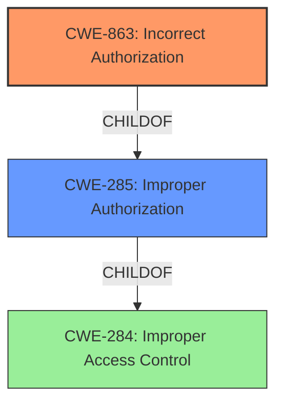

# Enhanced Analysis for CVE-2020-12850

# Summary
| CWE ID | CWE Name | Confidence | CWE Abstraction Level | CWE Vulnerability Mapping Label | CWE-Vulnerability Mapping Notes |
|---|---|---|---|---|---|
| CWE-863 | Incorrect Authorization | 0.9 | Class | Primary | Allowed-with-Review |

## Evidence and Confidence

*   **Confidence Score:** 0.9
*   **Evidence Strength:** HIGH

## Relationship Analysis
The primary CWE selected is CWE-863, Incorrect Authorization, which is a Class-level CWE. It is a child of CWE-285 (Improper Authorization) and CWE-284 (Improper Access Control), which are higher-level classifications. There are no specific child CWEs of CWE-863 that more accurately describe the vulnerability, justifying the selection of the Class-level CWE.



## Vulnerability Chain
The vulnerability chain consists of an **improper policy restriction** leading to the ability to execute privileged commands using sudo. The root cause is the misconfiguration in the policy, and the impact is unauthorized privilege escalation.

## Summary of Analysis
The initial assessment identified that the **improper policy restriction** allowed the 'pydio' user to execute privileged commands using sudo. The vulnerability description explicitly states that prior versions had a looser policy restriction, while version 2.0.4 aimed to restrict the 'pydio' user's privileges. However, the **incorrect authorization** in version 2.0.4 allowed for unintended privilege escalation.

The selection of CWE-863 is based on the evidence provided, which points to an **incorrect authorization** mechanism. The retriever results also support this choice, with CWE-863 being a top match. The MITRE mapping guidance suggests that CWE-863 is Allowed-with-Review, advising examination of its children for a more specific fit. However, no child CWE provides a more precise description of the vulnerability.

The analysis is based on the provided vulnerability description and the retriever results, with high confidence in the assessment.

Relevant CWE Information:

# Enhanced Context (25 CWEs)
The following CWEs were identified as potentially relevant to this vulnerability:

## CWE-274: Improper Handling of Insufficient Privileges
**Abstraction Level**: Base
**Similarity Score**: 0.78
**Source**: dense

**Description**:
The product does not handle or incorrectly handles when it has insufficient privileges to perform an operation, leading to resultant weaknesses.

**Mapping Guidance**:
- Usage: Discouraged
- Rationale: This CWE entry could be deprecated in a future version of CWE.

## CWE-280: Improper Handling of Insufficient Permissions or Privileges 
**Abstraction Level**: Base
**Similarity Score**: 0.77
**Source**: dense

**Description**:
The product does not handle or incorrectly handles when it has insufficient privileges to access resources or functionality as specified by their permissions. This may cause it to follow unexpected code paths that may leave the product in an invalid state.

**Mapping Guidance**:
- Usage: Allowed
- Rationale: This CWE entry is at the Base level of abstraction, which is a preferred level of abstraction for mapping to the root causes of vulnerabilities.

## CWE-653: Improper Isolation or Compartmentalization
**Abstraction Level**: Class
**Similarity Score**: 0.76
**Source**: dense

**Description**:
The product does not properly compartmentalize or isolate functionality, processes, or resources that require different privilege levels, rights, or permissions.

**Mapping Guidance**:
- Usage: Allowed
- Rationale: This CWE entry is at the Base level of abstraction, which is a preferred level of abstraction for mapping to the root causes of vulnerabilities.

## CWE-266: Incorrect Privilege Assignment
**Abstraction Level**: Base
**Similarity Score**: 0.76
**Source**: dense

**Description**:
A product incorrectly assigns a privilege to a particular actor, creating an unintended sphere of control for that actor.

**Mapping Guidance**:
- Usage: Allowed
- Rationale: This CWE entry is at the Base level of abstraction, which is a preferred level of abstraction for mapping to the root causes of vulnerabilities.

## CWE-1220: Insufficient Granularity of Access Control
**Abstraction Level**: Base
**Similarity Score**: 0.76
**Source**: dense

**Description**:
The product implements access controls via a policy or other feature with the intention to disable or restrict accesses (reads and/or writes) to assets in a system from untrusted agents. However, implemented access controls lack required granularity, which renders the control policy too broad because it allows accesses from unauthorized agents to the security-sensitive assets.

**Mapping Guidance**:
- Usage: Allowed
- Rationale: This CWE entry is at the Base level of abstraction, which is a preferred level of abstraction for mapping to the root causes of vulnerabilities.

## CWE-267: Privilege Defined With Unsafe Actions
**Abstraction Level**: Base
**Similarity Score**: 0.75
**Source**: dense

**Description**:
A particular privilege, role, capability, or right can be used to perform unsafe actions that were not intended, even when it is assigned to the correct entity.

**Mapping Guidance**:
- Usage: Allowed
- Rationale: This CWE entry is at the Base level of abstraction, which is a preferred level of abstraction for mapping to the root causes of vulnerabilities.

## CWE-639: Authorization Bypass Through User-Controlled Key
**Abstraction Level**: Base
**Similarity Score**: 0.75
**Source**: dense

**Description**:
The system's authorization functionality does not prevent one user from gaining access to another user's data or record by modifying the key value identifying the data.

**Mapping Guidance**:
- Usage: Allowed
- Rationale: This CWE entry is at the Base level of abstraction, which is a preferred level of abstraction for mapping to the root causes of vulnerabilities.

## CWE-668: Exposure of Resource to Wrong Sphere
**Abstraction Level**: Class
**Similarity Score**: 0.75
**Source**: dense

**Description**:
The product exposes a resource to the wrong control sphere, providing unintended actors with inappropriate access to the resource.

**Mapping Guidance**:
- Usage: Discouraged
- Rationale: CWE-668 is high-level and is often misused as a catch-all when lower-level CWE IDs might be applicable. It is sometimes used for low-information vulnerability reports [REF-1287]. It is a level-1 Class (i.e., a child of a Pillar). It is not useful for trend analysis.

## CWE-664: Improper Control of a Resource Through its Lifetime
**Abstraction Level**: Pillar
**Similarity Score**: 0.74
**Source**: dense

**Description**:
The product does not maintain or incorrectly maintains control over a resource throughout its lifetime of creation, use, and release.

**Mapping Guidance**:
- Usage: Discouraged
- Rationale: This CWE entry is high-level when lower-level children are available.

## CWE-691: Insufficient Control Flow Management
**Abstraction Level**: Pillar
**Similarity Score**: 0.74
**Source**: dense

**Description**:
The code does not sufficiently manage its control flow during execution, creating conditions in which the control flow can be modified in unexpected ways.

**Mapping Guidance**:
- Usage: Discouraged
- Rationale: This CWE entry is extremely high-level, a Pillar. However, classification research is limited for weaknesses of this type, so there can be gaps or organizational difficulties within CWE that force use of this weakness, even at such a high level of abstraction.

## CWE-863: Incorrect Authorization
**Abstraction Level**: Class
**Similarity Score**: 5311.89
**Source**: sparse

**Description**:
The product performs an authorization check when an actor attempts to access a resource or perform an action, but it does not correctly perform the check.

**Mapping Guidance**:
- Usage: Allowed-with-Review
- Rationale: This CWE entry is a Class and might have Base-level children that would be more appropriate

## CWE-285: Improper Authorization
**Abstraction Level**: Class
**Similarity Score**: 5250.98
**Source**: sparse

**Description**:
The product does not perform or incorrectly performs an authorization check when an actor attempts to access a resource or perform an action.

**Mapping Guidance**:
- Usage: Discouraged
- Rationale: CWE-285 is high-level and lower-level CWEs can frequently be used instead. It is a level-1 Class (i.e., a


## CWE Relationship Analysis

Current CWEs represent these abstraction levels: .


### Vulnerability Chain Analysis

**Chain starting from CWE-691:**
- 691 (Insufficient Control Flow Management) - ROOT


**Chain starting from CWE-664:**
- 664 (Improper Control of a Resource Through its Lifetime) - ROOT


### CWE Relationship Diagram

```mermaid
graph TD
    classDef primary fill:#f96,stroke:#333,stroke-width:2px
    classDef secondary fill:#69f,stroke:#333
    classDef tertiary fill:#9e9,stroke:#333
```