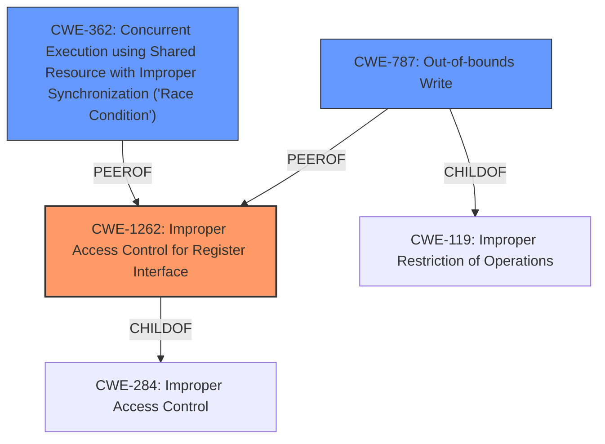

# Raw Analyzer Response for CVE-2020-12888

# Summary
| CWE ID | CWE Name | Confidence | CWE Abstraction Level | CWE Vulnerability Mapping Label | CWE-Vulnerability Mapping Notes |
|---|---|---|---|---|---|
| CWE-1262 | Improper Access Control for Register Interface | 0.8 | Base | Allowed | Primary CWE |
| CWE-362 | Concurrent Execution using Shared Resource with Improper Synchronization ('Race Condition') | 0.6 | Class | Allowed-with-Review | Secondary Candidate |
| CWE-787 | Out-of-bounds Write | 0.5 | Base | Allowed | Secondary Candidate |

## Evidence and Confidence

*   **Confidence Score:** 0.7
*   **Evidence Strength:** HIGH

## Relationship Analysis
The primary CWE is CWE-1262, which focuses on improper access control to register interfaces. The vulnerability description explicitly mentions the **mishandling attempts to access disabled memory space** which aligns with the intended use of the register. CWE-362 and CWE-787 were considered due to the potential for race conditions when accessing shared resources and the possibility of out-of-bounds writes as a consequence of improper access control, respectively.

## Vulnerability Chain
The vulnerability chain starts with the **mishandling attempts to access disabled memory space** due to **improper access control** (CWE-1262). This leads to potential race conditions (CWE-362) where multiple processes attempt to access the same memory space. The lack of proper synchronization can potentially result in an out-of-bounds write (CWE-787) or other memory corruption issues, ultimately causing a denial-of-service.

## Summary of Analysis
The initial analysis focused on identifying the root cause of the vulnerability. The vulnerability description highlights the **mishandling attempts to access disabled memory space**, which strongly suggests a problem with access control. The CVE Reference Links Content Summary supports this, stating that the driver allows users or virtual machines to disable a device's memory space while still mapped into a process's address space. This **lack of proper checks** and handling when a device's memory space is disabled leads to the vulnerability.

Based on the provided evidence, CWE-1262 (Improper Access Control for Register Interface) is the most appropriate primary CWE. The retriever results also list CWE-1262 with a high score, supporting its relevance. The description of CWE-1262 aligns well with the vulnerability, as it involves improper access control to memory-mapped I/O registers that act as an interface to hardware functionality.

CWE-362 and CWE-787 were considered as secondary CWEs due to the potential for race conditions and out-of-bounds writes, respectively. However, the primary issue is the lack of proper access control, which makes CWE-1262 the most accurate representation of the root cause.

The selected CWEs are at the optimal level of specificity. CWE-1262 is a Base-level CWE, which is preferred for mapping root causes of vulnerabilities. While there might be more specific variants of CWE-1262, the provided evidence does not support a more detailed classification.

Relevant CWE Information:

# Enhanced Context (25 CWEs)
The following CWEs were identified as potentially relevant to this vulnerability:

## CWE-667: Improper Locking
**Abstraction Level**: Class
**Similarity Score**: 0.79
**Source**: dense

**Description**:
The product does not properly acquire or release a lock on a resource, leading to unexpected resource state changes and behaviors.

**Mapping Guidance**:
- Usage: Allowed-with-Review
- Rationale: This CWE entry is a Class and might have Base-level children that would be more appropriate

*Considered but not selected:* This CWE is related to synchronization issues, which could be a consequence of improper access control, but it is not the primary root cause.

## CWE-131: Incorrect Calculation of Buffer Size
**Abstraction Level**: Base
**Similarity Score**: 0.78
**Source**: dense

**Description**:
The product does not correctly calculate the size to be used when allocating a buffer, which could lead to a buffer overflow.

**Mapping Guidance**:
- Usage: Allowed
- Rationale: This CWE entry is at the Base level of abstraction, which is a preferred level of abstraction for mapping to the root causes of vulnerabilities.

*Considered but not selected:* This CWE is related to buffer overflows, which are not directly mentioned in the vulnerability description.

## CWE-125: Out-of-bounds Read
**Abstraction Level**: Base
**Similarity Score**: 0.78
**Source**: dense

**Description**:
The product reads data past the end, or before the beginning, of the intended buffer.

**Mapping Guidance**:
- Usage: Allowed
- Rationale: This CWE entry is at the Base level of abstraction, which is a preferred level of abstraction for mapping to the root causes of vulnerabilities.

*Considered but not selected:* This CWE is related to out-of-bounds reads, which are not explicitly mentioned in the vulnerability description.

## CWE-362: Concurrent Execution using Shared Resource with Improper Synchronization ('Race Condition')
**Abstraction Level**: Class
**Similarity Score**: 0.77
**Source**: dense

**Description**:
The product contains a concurrent code sequence that requires temporary, exclusive access to a shared resource, but a timing window exists in which the shared resource can be modified by another code sequence operating concurrently.

**Mapping Guidance**:
- Usage: Allowed-with-Review
- Rationale: This CWE entry is a Class and might have Base-level children that would be more appropriate

*Selected as a Secondary CWE:* This CWE is considered because the **mishandling attempts to access disabled memory space** might lead to race conditions if multiple processes are trying to access the same memory.

## CWE-191: Integer Underflow (Wrap or Wraparound)
**Abstraction Level**: Base
**Similarity Score**: 0.77
**Source**: dense

**Description**:
The product subtracts one value from another, such that the result is less than the minimum allowable integer value, which produces a value that is not equal to the correct result.

**Mapping Guidance**:
- Usage: Allowed
- Rationale: This CWE entry is at the Base level of abstraction, which is a preferred level of abstraction for mapping to the root causes of vulnerabilities.

*Considered but not selected:* Integer underflows are not related to the vulnerability description.

## CWE-805: Buffer Access with Incorrect Length Value
**Abstraction Level**: Base
**Similarity Score**: 0.77
**Source**: dense

**Description**:
The product uses a sequential operation to read or write a buffer, but it uses an incorrect length value that causes it to access memory that is outside of the bounds of the buffer.

**Mapping Guidance**:
- Usage: Allowed
- Rationale: This CWE entry is at the Base level of abstraction, which is a preferred level of abstraction for mapping to the root causes of vulnerabilities.

*Considered but not selected:* Incorrect length values for buffer access are not mentioned in the vulnerability description.

## CWE-404: Improper Resource Shutdown or Release
**Abstraction Level**: Class
**Similarity Score**: 0.77
**Source**: dense

**Description**:
The product does not release or incorrectly releases a resource before it is made available for re-use.

**Mapping Guidance**:
- Usage: Allowed-with-Review
- Rationale: This CWE entry is a Class and might have Base-level children that would be more appropriate

*Considered but not selected:* Improper resource shutdown or release is not related to the vulnerability description.

## CWE-119: Improper Restriction of Operations within the Bounds of a Memory Buffer
**Abstraction Level**: Class
**Similarity Score**: 0.77
**Source**: dense

**Description**:
The product performs operations on a memory buffer, but it reads from or writes to a memory location outside the buffer's intended boundary. This may result in read or write operations on unexpected memory locations that could be linked to other variables, data structures, or internal program data.

**Mapping Guidance**:
- Usage: Discour