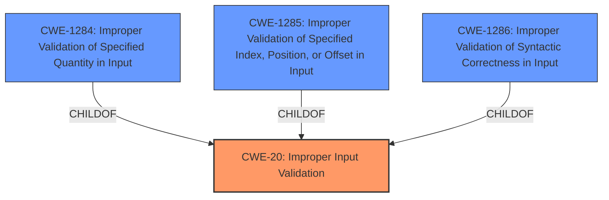

# Enhanced Analysis for CVE-2020-12946

# Summary
| CWE ID  | CWE Name | Confidence | CWE Abstraction Level | CWE Vulnerability Mapping Label | CWE-Vulnerability Mapping Notes |
|-----------------|------------------------------------------------------------|----------------|-------------------------|-----------------------------------|-------------------------------------------------------|
| CWE-20 | Improper Input Validation | 0.8 | Class | Primary | Discouraged |
| CWE-1284 | Improper Validation of Specified Quantity in Input | 0.6 | Base | Secondary Candidate | Allowed |

## Evidence and Confidence

*   **Confidence Score:** 0.7
*   **Evidence Strength:** MEDIUM

## Relationship Analysis
The primary relationship considered was the parent-child relationship between CWE-20 and its children, particularly CWE-1284. CWE-20 is a class-level CWE that describes the general case of improper input validation. Several potential child CWEs, such as CWE-1284, CWE-1285, and CWE-1286, were considered for more specific mapping. Although the description mentions **insufficient input validation**, it does not specify the type of input that is not being validated. Since the impact includes loss of integrity and denial of service, it suggests that the quantity or size of the TPM commands may be the issue, which aligns with CWE-1284.



## Vulnerability Chain
The vulnerability chain starts with **insufficient input validation** (CWE-20 or a more specific child) in the ASP firmware, which leads to a potential loss of integrity and denial of service. The lack of validation allows attackers to send specially crafted TPM commands, resulting in a failure of the system.

## Summary of Analysis
The initial assessment focused on identifying the root cause of the vulnerability, which is **insufficient input validation**. The evidence supports this with the key phrase "**Insufficient input validation**" and the CVE Reference Links Content Summary stating "**Root cause of vulnerability: Insufficient input validation** in the AMD Secure Processor (ASP) firmware for discrete Trusted Platform Module (TPM) commands."

CWE-20 (Improper Input Validation) is the primary candidate, but its mapping guidance discourages its use due to its high-level nature. However, the provided description lacks specific details about which type of input validation is missing. The impact (loss of integrity and denial of service) suggests that the quantity or size of the TPM commands may not be properly validated. Therefore, CWE-1284 (Improper Validation of Specified Quantity in Input) is considered a secondary candidate.

The selection of CWE-20 is based on the explicit mention of **insufficient input validation** as the root cause. The potential involvement of quantity-related issues influenced the consideration of CWE-1284. Without further information, it is difficult to definitively select a more specific CWE. Therefore, CWE-20 is chosen as the primary CWE, with CWE-1284 as a secondary consideration.

Relevant CWE Information:

# Enhanced Context (25 CWEs)
The following CWEs were identified as potentially relevant to this vulnerability:

## CWE-1289: Improper Validation of Unsafe Equivalence in Input
**Abstraction Level**: Base
**Similarity Score**: 0.77
**Source**: dense

**Description**:
The product receives an input value that is used as a resource identifier or other type of reference, but it does not validate or incorrectly validates that the input is equivalent to a potentially-unsafe value.

**Mapping Guidance**:
- Usage: Allowed
- Rationale: This CWE entry is at the Base level of abstraction, which is a preferred level of abstraction for mapping to the root causes of vulnerabilities.

## CWE-41: Improper Resolution of Path Equivalence
**Abstraction Level**: Base
**Similarity Score**: 0.75
**Source**: dense

**Description**:
The product is vulnerable to file system contents disclosure through path equivalence. Path equivalence involves the use of special characters in file and directory names. The associated manipulations are intended to generate multiple names for the same object.

**Mapping Guidance**:
- Usage: Allowed
- Rationale: This CWE entry is at the Base level of abstraction, which is a preferred level of abstraction for mapping to the root causes of vulnerabilities.

## CWE-184: Incomplete List of Disallowed Inputs
**Abstraction Level**: Base
**Similarity Score**: 0.74
**Source**: dense

**Description**:
The product implements a protection mechanism that relies on a list of inputs (or properties of inputs) that are not allowed by policy or otherwise require other action to neutralize before additional processing takes place, but the list is incomplete.

**Mapping Guidance**:
- Usage: Allowed
- Rationale: This CWE entry is at the Base level of abstraction, which is a preferred level of abstraction for mapping to the root causes of vulnerabilities.

## CWE-691: Insufficient Control Flow Management
**Abstraction Level**: Pillar
**Similarity Score**: 0.74
**Source**: dense

**Description**:
The code does not sufficiently manage its control flow during execution, creating conditions in which the control flow can be modified in unexpected ways.

**Mapping Guidance**:
- Usage: Discouraged
- Rationale: This CWE entry is extremely high-level, a Pillar. However, classification research is limited for weaknesses of this type, so there can be gaps or organizational difficulties within CWE that force use of this weakness, even at such a high level of abstraction.

## CWE-1173: Improper Use of Validation Framework
**Abstraction Level**: Base
**Similarity Score**: 0.74
**Source**: dense

**Description**:
The product does not use, or incorrectly uses, an input validation framework that is provided by the source language or an independent library.

**Mapping Guidance**:
- Usage: Allowed
- Rationale: This CWE entry is at the Base level of abstraction, which is a preferred level of abstraction for mapping to the root causes of vulnerabilities.

## CWE-138: Improper Neutralization of Special Elements
**Abstraction Level**: Class
**Similarity Score**: 0.74
**Source**: dense

**Description**:
The product receives input from an upstream component, but it does not neutralize or incorrectly neutralizes special elements that could be interpreted as control elements or syntactic markers when they are sent to a downstream component.

**Mapping Guidance**:
- Usage: Discouraged
- Rationale: This CWE entry is a level-1 Class (i.e., a child of a Pillar). It might have lower-level children that would be more appropriate

## CWE-807: Reliance on Untrusted Inputs in a Security Decision
**Abstraction Level**: Base
**Similarity Score**: 0.73
**Source**: dense

**Description**:
The product uses a protection mechanism that relies on the existence or values of an input, but the input can be modified by an untrusted actor in a way that bypasses the protection mechanism.

**Mapping Guidance**:
- Usage: Allowed
- Rationale: This CWE entry is at the Base level of abstraction, which is a preferred level of abstraction for mapping to the root causes of vulnerabilities.

## CWE-668: Exposure of Resource to Wrong Sphere
**Abstraction Level**: Class
**Similarity Score**: 0.73
**Source**: dense

**Description**:
The product exposes a resource to the wrong control sphere, providing unintended actors with inappropriate access to the resource.

**Mapping Guidance**:
- Usage: Discouraged
- Rationale: CWE-668 is high-level and is often misused as a catch-all when lower-level CWE IDs might be applicable. It is sometimes used for low-information vulnerability reports [REF-1287]. It is a level-1 Class (i.e., a child of a Pillar). It is not useful for trend analysis.

## CWE-23: Relative Path Traversal
**Abstraction Level**: Base
**Similarity Score**: 0.73
**Source**: dense

**Description**:
The product uses external input to construct a pathname that should be within a restricted directory, but it does not properly neutralize sequences such as ".." that can resolve to a location that is outside of that directory.

**Mapping Guidance**:
- Usage: Allowed
- Rationale: This CWE entry is at the Base level of abstraction, which is a preferred level of abstraction for mapping to the root causes of vulnerabilities.

## CWE-703: Improper Check or Handling of Exceptional Conditions
**


## CWE Relationship Analysis

Current CWEs represent these abstraction levels: .


### Vulnerability Chain Analysis

**Chain starting from CWE-691:**
- 691 (Insufficient Control Flow Management) - ROOT


**Chain starting from CWE-41:**
- 41 (Improper Resolution of Path Equivalence) - ROOT


### CWE Relationship Diagram

```mermaid
graph TD
    classDef primary fill:#f96,stroke:#333,stroke-width:2px
    classDef secondary fill:#69f,stroke:#333
    classDef tertiary fill:#9e9,stroke:#333
```