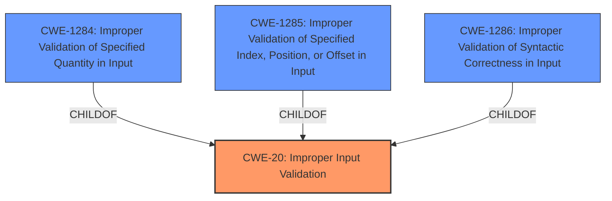

# Analysis for CVE-2020-12946

# Summary
| CWE ID  | CWE Name | Confidence | CWE Abstraction Level | CWE Vulnerability Mapping Label | CWE-Vulnerability Mapping Notes |
|-----------------|------------------------------------------------------------|----------------|-------------------------|-----------------------------------|-------------------------------------------------------|
| CWE-20 | Improper Input Validation | 0.8 | Class | Primary | Discouraged |
| CWE-1284 | Improper Validation of Specified Quantity in Input | 0.6 | Base | Secondary Candidate | Allowed |

## Evidence and Confidence

*   **Confidence Score:** 0.7
*   **Evidence Strength:** MEDIUM

## Relationship Analysis
The primary relationship considered was the parent-child relationship between CWE-20 and its children, particularly CWE-1284. CWE-20 is a class-level CWE that describes the general case of improper input validation. Several potential child CWEs, such as CWE-1284, CWE-1285, and CWE-1286, were considered for more specific mapping. Although the description mentions **insufficient input validation**, it does not specify the type of input that is not being validated. Since the impact includes loss of integrity and denial of service, it suggests that the quantity or size of the TPM commands may be the issue, which aligns with CWE-1284.

## Vulnerability Chain
The vulnerability chain starts with **insufficient input validation** (CWE-20 or a more specific child) in the ASP firmware, which leads to a potential loss of integrity and denial of service. The lack of validation allows attackers to send specially crafted TPM commands, resulting in a failure of the system.

## Summary of Analysis
The initial assessment focused on identifying the root cause of the vulnerability, which is **insufficient input validation**. The evidence supports this with the key phrase "**Insufficient input validation**" and the CVE Reference Links Content Summary stating "**Root cause of vulnerability: Insufficient input validation** in the AMD Secure Processor (ASP) firmware for discrete Trusted Platform Module (TPM) commands."

CWE-20 (Improper Input Validation) is the primary candidate, but its mapping guidance discourages its use due to its high-level nature. However, the provided description lacks specific details about which type of input validation is missing. The impact (loss of integrity and denial of service) suggests that the quantity or size of the TPM commands may not be properly validated. Therefore, CWE-1284 (Improper Validation of Specified Quantity in Input) is considered a secondary candidate.

The selection of CWE-20 is based on the explicit mention of **insufficient input validation** as the root cause. The potential involvement of quantity-related issues influenced the consideration of CWE-1284. Without further information, it is difficult to definitively select a more specific CWE. Therefore, CWE-20 is chosen as the primary CWE, with CWE-1284 as a secondary consideration.

Relevant CWE Information:

# Enhanced Context (25 CWEs)
The following CWEs were identified as potentially relevant to this vulnerability:

## CWE-1289: Improper Validation of Unsafe Equivalence in Input
**Abstraction Level**: Base
**Similarity Score**: 0.77
**Source**: dense

**Description**:
The product receives an input value that is used as a resource identifier or other type of reference, but it does not validate or incorrectly validates that the input is equivalent to a potentially-unsafe value.

**Mapping Guidance**:
- Usage: Allowed
- Rationale: This CWE entry is at the Base level of abstraction, which is a preferred level of abstraction for mapping to the root causes of vulnerabilities.

## CWE-41: Improper Resolution of Path Equivalence
**Abstraction Level**: Base
**Similarity Score**: 0.75
**Source**: dense

**Description**:
The product is vulnerable to file system contents disclosure through path equivalence. Path equivalence involves the use of special characters in file and directory names. The associated manipulations are intended to generate multiple names for the same object.

**Mapping Guidance**:
- Usage: Allowed
- Rationale: This CWE entry is at the Base level of abstraction, which is a preferred level of abstraction for mapping to the root causes of vulnerabilities.

## CWE-184: Incomplete List of Disallowed Inputs
**Abstraction Level**: Base
**Similarity Score**: 0.74
**Source**: dense

**Description**:
The product implements a protection mechanism that relies on a list of inputs (or properties of inputs) that are not allowed by policy or otherwise require other action to neutralize before additional processing takes place, but the list is incomplete.

**Mapping Guidance**:
- Usage: Allowed
- Rationale: This CWE entry is at the Base level of abstraction, which is a preferred level of abstraction for mapping to the root causes of vulnerabilities.

## CWE-691: Insufficient Control Flow Management
**Abstraction Level**: Pillar
**Similarity Score**: 0.74
**Source**: dense

**Description**:
The code does not sufficiently manage its control flow during execution, creating conditions in which the control flow can be modified in unexpected ways.

**Mapping Guidance**:
- Usage: Discouraged
- Rationale: This CWE entry is extremely high-level, a Pillar. However, classification research is limited for weaknesses of this type, so there can be gaps or organizational difficulties within CWE that force use of this weakness, even at such a high level of abstraction.

## CWE-1173: Improper Use of Validation Framework
**Abstraction Level**: Base
**Similarity Score**: 0.74
**Source**: dense

**Description**:
The product does not use, or incorrectly uses, an input validation framework that is provided by the source language or an independent library.

**Mapping Guidance**:
- Usage: Allowed
- Rationale: This CWE entry is at the Base level of abstraction, which is a preferred level of abstraction for mapping to the root causes of vulnerabilities.

## CWE-138: Improper Neutralization of Special Elements
**Abstraction Level**: Class
**Similarity Score**: 0.74
**Source**: dense

**Description**:
The product receives input from an upstream component, but it does not neutralize or incorrectly neutralizes special elements that could be interpreted as control elements or syntactic markers when they are sent to a downstream component.

**Mapping Guidance**:
- Usage: Discouraged
- Rationale: This CWE entry is a level-1 Class (i.e., a child of a Pillar). It might have lower-level children that would be more appropriate

## CWE-807: Reliance on Untrusted Inputs in a Security Decision
**Abstraction Level**: Base
**Similarity Score**: 0.73
**Source**: dense

**Description**:
The product uses a protection mechanism that relies on the existence or values of an input, but the input can be modified by an untrusted actor in a way that bypasses the protection mechanism.

**Mapping Guidance**:
- Usage: Allowed
- Rationale: This CWE entry is at the Base level of abstraction, which is a preferred level of abstraction for mapping to the root causes of vulnerabilities.

## CWE-668: Exposure of Resource to Wrong Sphere
**Abstraction Level**: Class
**Similarity Score**: 0.73
**Source**: dense

**Description**:
The product exposes a resource to the wrong control sphere, providing unintended actors with inappropriate access to the resource.

**Mapping Guidance**:
- Usage: Discouraged
- Rationale: CWE-668 is high-level and is often misused as a catch-all when lower-level CWE IDs might be applicable. It is sometimes used for low-information vulnerability reports [REF-1287]. It is a level-1 Class (i.e., a child of a Pillar). It is not useful for trend analysis.

## CWE-23: Relative Path Traversal
**Abstraction Level**: Base
**Similarity Score**: 0.73
**Source**: dense

**Description**:
The product uses external input to construct a pathname that should be within a restricted directory, but it does not properly neutralize sequences such as ".." that can resolve to a location that is outside of that directory.

**Mapping Guidance**:
- Usage: Allowed
- Rationale: This CWE entry is at the Base level of abstraction, which is a preferred level of abstraction for mapping to the root causes of vulnerabilities.

## CWE-703: Improper Check or Handling of Exceptional Conditions
**

# Enhanced Query for CVE-2020-12946

## Vulnerability Description
**Insufficient input validation** in ASP firmware for discrete TPM commands could allow a potential loss of integrity and denial of service.

### Vulnerability Description Key Phrases
- **rootcause:** **Insufficient input validation**
- **impact:** loss of integrity and denial of service
- **product:** ASP firmware
- **component:** discrete TPM commands

## CVE Reference Links Content Summary
Based on the provided document, here's the information regarding CVE-2020-12946:

**Root cause of vulnerability:**
Insufficient input validation in the AMD Secure Processor (ASP) firmware for discrete Trusted Platform Module (TPM) commands.

**Weaknesses/vulnerabilities present:**
Lack of proper validation of input data when processing discrete TPM commands in ASP firmware.

**Impact of exploitation:**
A successful exploit could lead to a loss of integrity and denial of service.

**Attack vectors:**
The vulnerability can be triggered through sending specially crafted TPM commands to the ASP firmware.

**Required attacker capabilities/position:**
An attacker needs to be able to send commands to the ASP firmware. The document does not provide detail on if this is a local or remote capability, but given the nature of the commands and the target, the attacker would likely need some level of access to the system.

**Additional Notes:**
- This vulnerability is rated as medium severity with a CVSS score of 6.8.
- The vulnerability is mitigated by updating to the listed AGESA PI software version for the affected platforms.
- The report indicates that the vulnerability was discovered during security reviews in collaboration with Google, Microsoft, and Oracle.

## Retriever Results

### Top Combined Results

| Rank | CWE ID | Name | Abstraction | Usage  | Retrievers | Individual Scores |
|------|--------|------|-------------|-------|------------|-------------------|
| 1 | 20 | Improper Input Validation | Class | Discouraged | sparse | 0.152 |
| 2 | 1285 | Improper Validation of Specified Index, Position, or Offset in Input | Base | Allowed | sparse | 0.148 |
| 3 | 345 | Insufficient Verification of Data Authenticity | Class | Discouraged | sparse | 0.136 |
| 4 | 1284 | Improper Validation of Specified Quantity in Input | Base | Allowed | sparse | 0.131 |
| 5 | 691 | Insufficient Control Flow Management | Pillar | Discouraged | sparse | 0.125 |
| 6 | 554 | ASP.NET Misconfiguration: Not Using Input Validation Framework | Variant | Allowed | dense | 0.577 |
| 7 | 22 | Improper Limitation of a Pathname to a Restricted Directory ('Path Traversal') | Base | Allowed | graph | 0.002 |
| 8 | 1173 | Improper Use of Validation Framework | Base | Allowed | sparse | 0.122 |
| 9 | 119 | Improper Restriction of Operations within the Bounds of a Memory Buffer | Class | Discouraged | sparse | 0.121 |
| 10 | 112 | Missing XML Validation | Base | Allowed | sparse | 0.120 |

# Complete CWE Specifications

## CWE-20: Improper Input Validation
**Abstraction:** Class
**Status:** Stable

### Description
The product receives input or data, but it does
        not validate or incorrectly validates that the input has the
        properties that are required to process the data safely and
        correctly.

### Extended Description

Input validation is a frequently-used technique for checking potentially dangerous inputs in order to ensure that the inputs are safe for processing within the code, or when communicating with other components. When software does not validate input properly, an attacker is able to craft the input in a form that is not expected by the rest of the application. This will lead to parts of the system receiving unintended input, which may result in altered control flow, arbitrary control of a resource, or arbitrary code execution.

Input validation is not the only technique for processing input, however. Other techniques attempt to transform potentially-dangerous input into something safe, such as filtering (CWE-790) - which attempts to remove dangerous inputs - or encoding/escaping (CWE-116), which attempts to ensure that the input is not misinterpreted when it is included in output to another component. Other techniques exist as well (see CWE-138 for more examples.)

Input validation can be applied to:

  - raw data - strings, numbers, parameters, file contents, etc.

  - metadata - information about the raw data, such as headers or size

Data can be simple or structured. Structured data can be composed of many nested layers, composed of combinations of metadata and raw data, with other simple or structured data.

Many properties of raw data or metadata may need to be validated upon entry into the code, such as:

  - specified quantities such as size, length, frequency, price, rate, number of operations, time, etc.

  - implied or derived quantities, such as the actual size of a file instead of a specified size

  - indexes, offsets, or positions into more complex data structures

  - symbolic keys or other elements into hash tables, associative arrays, etc.

  - well-formedness, i.e. syntactic correctness - compliance with expected syntax 

  - lexical token correctness - compliance with rules for what is treated as a token

  - specified or derived type - the actual type of the input (or what the input appears to be)

  - consistency - between individual data elements, between raw data and metadata, between references, etc.

  - conformance to domain-specific rules, e.g. business logic 

  - equivalence - ensuring that equivalent inputs are treated the same

  - authenticity, ownership, or other attestations about the input, e.g. a cryptographic signature to prove the source of the data

Implied or derived properties of data must often be calculated or inferred by the code itself. Errors in deriving properties may be considered a contributing factor to improper input validation. 

Note that "input validation" has very different meanings to different people, or within different classification schemes. Caution must be used when referencing this CWE entry or mapping to it. For example, some weaknesses might involve inadvertently giving control to an attacker over an input when they should not be able to provide an input at all, but sometimes this is referred to as input validation.

Finally, it is important to emphasize that the distinctions between input validation and output escaping are often blurred, and developers must be careful to understand the difference, including how input validation is not always sufficient to prevent vulnerabilities, especially when less stringent data types must be supported, such as free-form text. Consider a SQL injection scenario in which a person's last name is inserted into a query. The name "O'Reilly" would likely pass the validation step since it is a common last name in the English language. However, this valid name cannot be directly inserted into the database because it contains the "'" apostrophe character, which would need to be escaped or otherwise transformed. In this case, removing the apostrophe might reduce the risk of SQL injection, but it would produce incorrect behavior because the wrong name would be recorded.

### Alternative Terms
None

### Relationships
ChildOf -> CWE-707
PeerOf -> CWE-345
CanPrecede -> CWE-22
CanPrecede -> CWE-41
CanPrecede -> CWE-74
CanPrecede -> CWE-119
CanPrecede -> CWE-770

### Mapping Guidance
**Usage:** Discouraged
**Rationale:** CWE-20 is commonly misused in low-information vulnerability reports when lower-level CWEs could be used instead, or when more details about the vulnerability are available [REF-1287]. It is not useful for trend analysis. It is also a level-1 Class (i.e., a child of a Pillar).
**Comments:** Consider lower-level children such as Improper Use of Validation Framework (CWE-1173) or improper validation involving specific types or properties of input such as Specified Quantity (CWE-1284); Specified Index, Position, or Offset (CWE-1285); Syntactic Correctness (CWE-1286); Specified Type (CWE-1287); Consistency within Input (CWE-1288); or Unsafe Equivalence (CWE-1289).
**Reasons:**
- Frequent Misuse
**Suggested Alternatives:**
- CWE-1284: Specified Quantity
- CWE-1285: Specified Index, Position, or Offset
- CWE-1286: Syntactic Correctness
- CWE-1287: Specified Type
- CWE-1288: Consistency within Input
- CWE-1289: Unsafe Equivalence
- CWE-116: Improper Encoding or Escaping of Output

### Additional Notes
**[Relationship]** 

CWE-116 and CWE-20 have a close association because, depending on the nature of the structured message, proper input validation can indirectly prevent special characters from changing the meaning of a structured message. For example, by validating that a numeric ID field should only contain the 0-9 characters, the programmer effectively prevents injection attacks.

**[Maintenance]** As of 2020, this entry is used more often than preferred, and it is a source of frequent confusion. It is being actively modified for CWE 4.1 and subsequent versions.

**[Maintenance]** Concepts such as validation, data transformation, and neutralization are being refined, so relationships between CWE-20 and other entries such as CWE-707 may change in future versions, along with an update to the Vulnerability Theory document.

**[Maintenance]** Input validation - whether missing or incorrect - is such an essential and widespread part of secure development that it is implicit in many different weaknesses. Traditionally, problems such as buffer overflows and XSS have been classified as input validation problems by many security professionals. However, input validation is not necessarily the only protection mechanism available for avoiding such problems, and in some cases it is not even sufficient. The CWE team has begun capturing these subtleties in chains within the Research Concepts view (CWE-1000), but more work is needed.

**[Terminology]** 

The "input validation" term is extremely common, but it is used in many different ways. In some cases its usage can obscure the real underlying weakness or otherwise hide chaining and composite relationships.

Some people use "input validation" as a general term that covers many different neutralization techniques for ensuring that input is appropriate, such as filtering, canonicalization, and escaping. Others use the term in a more narrow context to simply mean "checking if an input conforms to expectations without changing it." CWE uses this more narrow interpretation.

### Observed Examples
- **CVE-2024-37032:** Large language model (LLM) management tool does not validate the format of a digest value (CWE-1287) from a private, untrusted model registry, enabling relative path traversal (CWE-23), a.k.a. Probllama
- **CVE-2022-45918:** Chain: a learning management tool debugger uses external input to locate previous session logs (CWE-73) and does not properly validate the given path (CWE-20), allowing for filesystem path traversal using "../" sequences (CWE-24)
- **CVE-2021-30860:** Chain: improper input validation (CWE-20) leads to integer overflow (CWE-190) in mobile OS, as exploited in the wild per CISA KEV.

## CWE-1285: Improper Validation of Specified Index, Position, or Offset in Input
**Abstraction:** Base
**Status:** Incomplete

### Description
The product receives input that is expected to specify an index, position, or offset into an indexable resource such as a buffer or file, but it does not validate or incorrectly validates that the specified index/position/offset has the required properties.

### Extended Description

Often, indexable resources such as memory buffers or files can be accessed using a specific position, index, or offset, such as an index for an array or a position for a file. When untrusted input is not properly validated before it is used as an index, attackers could access (or attempt to access) unauthorized portions of these resources. This could be used to cause buffer overflows, excessive resource allocation, or trigger unexpected failures. 

### Alternative Terms
None

### Relationships
ChildOf -> CWE-20

### Mapping Guidance
**Usage:** Allowed
**Rationale:** This CWE entry is at the Base level of abstraction, which is a preferred level of abstraction for mapping to the root causes of vulnerabilities.
**Comments:** Carefully read both the name and description to ensure that this mapping is an appropriate fit. Do not try to 'force' a mapping to a lower-level Base/Variant simply to comply with this preferred level of abstraction.
**Reasons:**
- Acceptable-Use

### Additional Notes
**[Maintenance]** This entry is still under development and will continue to see updates and content improvements.

### Observed Examples
- **CVE-2005-0369:** large ID in packet used as array index
- **CVE-2001-1009:** negative array index as argument to POP LIST command

## CWE-345: Insufficient Verification of Data Authenticity
**Abstraction:** Class
**Status:** Draft

### Description
The product does not sufficiently verify the origin or authenticity of data, in a way that causes it to accept invalid data.

### Extended Description
Not provided

### Alternative Terms
None

### Relationships
ChildOf -> CWE-693

### Mapping Guidance
**Usage:** Discouraged
**Rationale:** This CWE entry is a level-1 Class (i.e., a child of a Pillar). It might have lower-level children that would be more appropriate
**Comments:** Examine children of this entry to see if there is a better fit
**Reasons:**
- Abstraction

### Additional Notes
**[Relationship]** "origin validation" could fall under this.

**[Maintenance]** The specific ways in which the origin is not properly identified should be laid out as separate weaknesses. In some sense, this is more like a category.

### Observed Examples
- **CVE-2022-30260:** Distributed Control System (DCS) does not sign firmware images and only relies on insecure checksums for integrity checks
- **CVE-2022-30267:** Distributed Control System (DCS) does not sign firmware images and only relies on insecure checksums for integrity checks
- **CVE-2022-30272:** Remote Terminal Unit (RTU) does not use signatures for firmware images and relies on insecure checksums

## CWE-1284: Improper Validation of Specified Quantity in Input
**Abstraction:** Base
**Status:** Incomplete

### Description
The product receives input that is expected to specify a quantity (such as size or length), but it does not validate or incorrectly validates that the quantity has the required properties.

### Extended Description

Specified quantities include size, length, frequency, price, rate, number of operations, time, and others. Code may rely on specified quantities to allocate resources, perform calculations, control iteration, etc. When the quantity is not properly validated, then attackers can specify malicious quantities to cause excessive resource allocation, trigger unexpected failures, enable buffer overflows, etc.

### Alternative Terms
None

### Relationships
ChildOf -> CWE-20
ChildOf -> CWE-20
CanPrecede -> CWE-789

### Mapping Guidance
**Usage:** Allowed
**Rationale:** This CWE entry is at the Base level of abstraction, which is a preferred level of abstraction for mapping to the root causes of vulnerabilities.
**Comments:** Carefully read both the name and description to ensure that this mapping is an appropriate fit. Do not try to 'force' a mapping to a lower-level Base/Variant simply to comply with this preferred level of abstraction.
**Reasons:**
- Acceptable-Use

### Additional Notes
**[Maintenance]** This entry is still under development and will continue to see updates and content improvements.

### Observed Examples
- **CVE-2022-21668:** Chain: Python library does not limit the resources used to process images that specify a very large number of bands (CWE-1284), leading to excessive memory consumption (CWE-789) or an integer overflow (CWE-190).
- **CVE-2008-1440:** lack of validation of length field leads to infinite loop
- **CVE-2008-2374:** lack of validation of string length fields allows memory consumption or buffer over-read

## CWE-691: Insufficient Control Flow Management
**Abstraction:** Pillar
**Status:** Draft

### Description
The code does not sufficiently manage its control flow during execution, creating conditions in which the control flow can be modified in unexpected ways.

### Extended Description
Not provided

### Alternative Terms
None

### Relationships
None

### Mapping Guidance
**Usage:** Discouraged
**Rationale:** This CWE entry is extremely high-level, a Pillar. However, classification research is limited for weaknesses of this type, so there can be gaps or organizational difficulties within CWE that force use of this weakness, even at such a high level of abstraction.
**Comments:** Where feasible, consider children or descendants of this entry instead.
**Reasons:**
- Abstraction

### Observed Examples
- **CVE-2019-9805:** Chain: Creation of the packet client occurs before initialization is complete (CWE-696) resulting in a read from uninitialized memory (CWE-908), causing memory corruption.
- **CVE-2014-1266:** chain: incorrect "goto" in Apple SSL product bypasses certificate validation, allowing Adversary-in-the-Middle (AITM) attack (Apple "goto fail" bug). CWE-705 (Incorrect Control Flow Scoping) -> CWE-561 (Dead Code) -> CWE-295 (Improper Certificate Validation) -> CWE-393 (Return of Wrong Status Code) -> CWE-300 (Channel Accessible by Non-Endpoint).
- **CVE-2011-1027:** Chain: off-by-one error (CWE-193) leads to infinite loop (CWE-835) using invalid hex-encoded characters.

## CWE-554: ASP.NET Misconfiguration: Not Using Input Validation Framework
**Abstraction:** Variant
**Status:** Draft

### Description
The ASP.NET application does not use an input validation framework.

### Extended Description
Not provided

### Alternative Terms
None

### Relationships
ChildOf -> CWE-1173

### Mapping Guidance
**Usage:** Allowed
**Rationale:** This CWE entry is at the Variant level of abstraction, which is a preferred level of abstraction for mapping to the root causes of vulnerabilities.
**Comments:** Carefully read both the name and description to ensure that this mapping is an appropriate fit. Do not try to 'force' a mapping to a lower-level Base/Variant simply to comply with this preferred level of abstraction.
**Reasons:**
- Acceptable-Use

## CWE-22: Improper Limitation of a Pathname to a Restricted Directory ('Path Traversal')
**Abstraction:** Base
**Status:** Stable

### Description
The product uses external input to construct a pathname that is intended to identify a file or directory that is located underneath a restricted parent directory, but the product does not properly neutralize special elements within the pathname that can cause the pathname to resolve to a location that is outside of the restricted directory.

### Extended Description

Many file operations are intended to take place within a restricted directory. By using special elements such as ".." and "/" separators, attackers can escape outside of the restricted location to access files or directories that are elsewhere on the system. One of the most common special elements is the "../" sequence, which in most modern operating systems is interpreted as the parent directory of the current location. This is referred to as relative path traversal. Path traversal also covers the use of absolute pathnames such as "/usr/local/bin" to access unexpected files. This is referred to as absolute path traversal.

### Alternative Terms
Directory traversal
Path traversal: "Path traversal" is preferred over "directory traversal," but both terms are attack-focused.

### Relationships
ChildOf -> CWE-706
ChildOf -> CWE-706
ChildOf -> CWE-668

### Mapping Guidance
**Usage:** Allowed
**Rationale:** This CWE entry is at the Base level of abstraction, which is a preferred level of abstraction for mapping to the root causes of vulnerabilities.
**Comments:** Carefully read both the name and description to ensure that this mapping is an appropriate fit. Do not try to 'force' a mapping to a lower-level Base/Variant simply to comply with this preferred level of abstraction.
**Reasons:**
- Acceptable-Use

### Additional Notes
**[Other]** In many programming languages, the injection of a null byte (the 0 or NUL) may allow an attacker to truncate a generated filename to apply to a wider range of files. For example, the product may add ".txt" to any pathname, thus limiting the attacker to text files, but a null injection may effectively remove this restriction.

**[Relationship]** Pathname equivalence can be regarded as a type of canonicalization error.

**[Relationship]** Some pathname equivalence issues are not directly related to directory traversal, rather are used to bypass security-relevant checks for whether a file/directory can be accessed by the attacker (e.g. a trailing "/" on a filename could bypass access rules that don't expect a trailing /, causing a server to provide the file when it normally would not).

**[Terminology]** 

Like other weaknesses, terminology is often based on the types of manipulations used, instead of the underlying weaknesses. Some people use "directory traversal" only to refer to the injection of ".." and equivalent sequences whose specific meaning is to traverse directories.

Other variants like "absolute pathname" and "drive letter" have the *effect* of directory traversal, but some people may not call it such, since it doesn't involve ".." or equivalent.

**[Research Gap]** Many variants of path traversal attacks are probably under-studied with respect to root cause. CWE-790 and CWE-182 begin to cover part of this gap.

**[Research Gap]** 

Incomplete diagnosis or reporting of vulnerabilities can make it difficult to know which variant is affected. For example, a researcher might say that "..\" is vulnerable, but not test "../" which may also be vulnerable.

Any combination of directory separators ("/", "\", etc.) and numbers of "." (e.g. "....") can produce unique variants; for example, the "//../" variant is not listed (CVE-2004-0325). See this entry's children and lower-level descendants.

### Observed Examples
- **CVE-2024-37032:** Large language model (LLM) management tool does not validate the format of a digest value (CWE-1287) from a private, untrusted model registry, enabling relative path traversal (CWE-23), a.k.a. Probllama
- **CVE-2024-4315:** Chain: API for text generation using Large Language Models (LLMs) does not include the "\" Windows folder separator in its denylist (CWE-184) when attempting to prevent Local File Inclusion via path traversal (CWE-22), allowing deletion of arbitrary files on Windows systems.
- **CVE-2022-45918:** Chain: a learning management tool debugger uses external input to locate previous session logs (CWE-73) and does not properly validate the given path (CWE-20), allowing for filesystem path traversal using "../" sequences (CWE-24)

## CWE-1173: Improper Use of Validation Framework
**Abstraction:** Base
**Status:** Draft

### Description
The product does not use, or incorrectly uses, an input validation framework that is provided by the source language or an independent library.

### Extended Description
Many modern coding languages provide developers with input validation frameworks to make the task of input validation easier and less error-prone. These frameworks will automatically check all input against specified criteria and direct execution to error handlers when invalid input is received. The improper use (i.e., an incorrect implementation or missing altogether) of these frameworks is not directly exploitable, but can lead to an exploitable condition if proper input validation is not performed later in the product. Not using provided input validation frameworks can also hurt the maintainability of code as future developers may not recognize the downstream input validation being used in the place of the validation framework.

### Alternative Terms
None

### Relationships
ChildOf -> CWE-20

### Mapping Guidance
**Usage:** Allowed
**Rationale:** This CWE entry is at the Base level of abstraction, which is a preferred level of abstraction for mapping to the root causes of vulnerabilities.
**Comments:** Carefully read both the name and description to ensure that this mapping is an appropriate fit. Do not try to 'force' a mapping to a lower-level Base/Variant simply to comply with this preferred level of abstraction.
**Reasons:**
- Acceptable-Use

## CWE-119: Improper Restriction of Operations within the Bounds of a Memory Buffer
**Abstraction:** Class
**Status:** Stable

### Description
The product performs operations on a memory buffer, but it reads from or writes to a memory location outside the buffer's intended boundary. This may result in read or write operations on unexpected memory locations that could be linked to other variables, data structures, or internal program data.

### Extended Description
Not provided

### Alternative Terms
Buffer Overflow: This term has many different meanings to different audiences. From a CWE mapping perspective, this term should be avoided where possible. Some researchers, developers, and tools intend for it to mean "write past the end of a buffer," whereas others use the same term to mean "any read or write outside the boundaries of a buffer, whether before the beginning of the buffer or after the end of the buffer." Others could mean "any action after the end of a buffer, whether it is a read or write." Since the term is commonly used for exploitation and for vulnerabilities, it further confuses things.
buffer overrun: Some prominent vendors and researchers use the term "buffer overrun," but most people use "buffer overflow." See the alternate term for "buffer overflow" for context.
memory safety: Generally used for techniques that avoid weaknesses related to memory access, such as those identified by CWE-119 and its descendants. However, the term is not formal, and there is likely disagreement between practitioners as to which weaknesses are implicitly covered by the "memory safety" term.

### Relationships
ChildOf -> CWE-118
ChildOf -> CWE-20

### Mapping Guidance
**Usage:** Discouraged
**Rationale:** CWE-119 is commonly misused in low-information vulnerability reports when lower-level CWEs could be used instead, or when more details about the vulnerability are available.
**Comments:** Look at CWE-119's children and consider mapping to CWEs such as CWE-787: Out-of-bounds Write, CWE-125: Out-of-bounds Read, or others.
**Reasons:**
- Frequent Misuse

### Additional Notes
**[Applicable Platform]** 

It is possible in any programming languages without memory management support to attempt an operation outside of the bounds of a memory buffer, but the consequences will vary widely depending on the language, platform, and chip architecture.

### Observed Examples
- **CVE-2021-22991:** Incorrect URI normalization in application traffic product leads to buffer overflow, as exploited in the wild per CISA KEV.
- **CVE-2020-29557:** Buffer overflow in Wi-Fi router web interface, as exploited in the wild per CISA KEV.
- **CVE-2009-2550:** Classic stack-based buffer overflow in media player using a long entry in a playlist

## CWE-112: Missing XML Validation
**Abstraction:** Base
**Status:** Draft

### Description
The product accepts XML from an untrusted source but does not validate the XML against the proper schema.

### Extended Description
Most successful attacks begin with a violation of the programmer's assumptions. By accepting an XML document without validating it against a DTD or XML schema, the programmer leaves a door open for attackers to provide unexpected, unreasonable, or malicious input.

### Alternative Terms
None

### Relationships
ChildOf -> CWE-1286
ChildOf -> CWE-20

### Mapping Guidance
**Usage:** Allowed
**Rationale:** This CWE entry is at the Base level of abstraction, which is a preferred level of abstraction for mapping to the root causes of vulnerabilities.
**Comments:** Carefully read both the name and description to ensure that this mapping is an appropriate fit. Do not try to 'force' a mapping to a lower-level Base/Variant simply to comply with this preferred level of abstraction.
**Reasons:**
- Acceptable-Use

