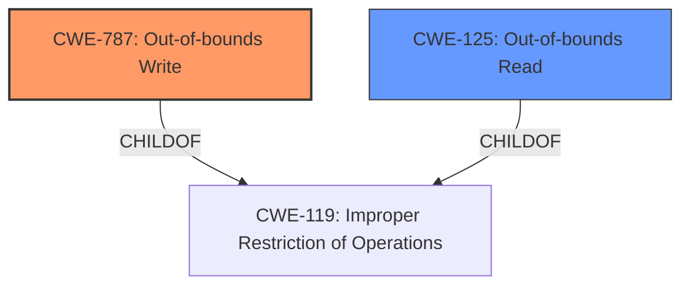

# Raw Analyzer Response for CVE-2020-12980

# Summary
| CWE ID    | CWE Name                                                                   | Confidence | CWE Abstraction Level | CWE Vulnerability Mapping Label | CWE-Vulnerability Mapping Notes |
| --------- | -------------------------------------------------------------------------- | ---------- | ----------------------- | ------------------------------- | ------------------------------- |
| CWE-787   | Out-of-bounds Write                                                        | 1          | Base                    | Primary                         | Allowed                        |
| CWE-125   | Out-of-bounds Read                                                         | 1          | Base                    | Secondary                       | Allowed                        |

## Evidence and Confidence

*   **Confidence Score:** 1
*   **Evidence Strength:** HIGH

## Relationship Analysis
The primary CWE is CWE-787 **Out-of-bounds Write**, which is a Base level CWE and child of CWE-119 **Improper Restriction of Operations within the Bounds of a Memory Buffer**. The secondary CWE is CWE-125 **Out-of-bounds Read**, which is also a Base level CWE and a child of CWE-119. Both CWE-787 and CWE-125 represent specific types of memory access errors.

## Vulnerability Chain
The vulnerability chain starts with an **improper memory access** due to the driver's failure to validate the boundaries of the memory buffer. This leads to both an **out-of-bounds read** and an **out-of-bounds write**, which can then result in **escalation of privilege** or **denial of service**.

## Summary of Analysis
The initial analysis identified the presence of both an **out-of-bounds write and read** vulnerability in the AMD Graphics Driver. The vulnerability description clearly states that the **weakness** is an **out of bounds write and read**, which aligns directly with CWE-787 **Out-of-bounds Write** and CWE-125 **Out-of-bounds Read**. The "CVE Reference Links Content Summary" confirms this by stating that the root cause is an **out-of-bounds write and read** vulnerability. The retriever results also list CWE-787 and CWE-125 as potential candidates.

The selection of CWE-787 and CWE-125 is based on the specific evidence provided in the vulnerability description and the CVE reference summary. Both CWEs are at the Base level of abstraction, which is the preferred level for mapping.

Relevant CWE Information:

# Enhanced Context (25 CWEs)

## CWE-131: Incorrect Calculation of Buffer Size
**Abstraction Level**: Base
**Similarity Score**: 0.79
**Source**: dense

**Description**:
The product does not correctly calculate the size to be used when allocating a buffer, which could lead to a buffer overflow.

**Mapping Guidance**:
- Usage: Allowed
- Rationale: This CWE entry is at the Base level of abstraction, which is a preferred level of abstraction for mapping to the root causes of vulnerabilities.
*This CWE was considered, however, there is no evidence in the description that an incorrect calculation of the buffer size took place. The root cause of the vulnerability is an out-of-bounds write and read.*

## CWE-805: Buffer Access with Incorrect Length Value
**Abstraction Level**: Base
**Similarity Score**: 0.78
**Source**: dense

**Description**:
The product uses a sequential operation to read or write a buffer, but it uses an incorrect length value that causes it to access memory that is outside of the bounds of the buffer.

**Mapping Guidance**:
- Usage: Allowed
- Rationale: This CWE entry is at the Base level of abstraction, which is a preferred level of abstraction for mapping to the root causes of vulnerabilities.
*This CWE was considered, however, there is no evidence in the description that the buffer access uses an incorrect length value.*

## CWE-191: Integer Underflow (Wrap or Wraparound)
**Abstraction Level**: Base
**Similarity Score**: 0.78
**Source**: dense

**Description**:
The product subtracts one value from another, such that the result is less than the minimum allowable integer value, which produces a value that is not equal to the correct result.

**Mapping Guidance**:
- Usage: Allowed
- Rationale: This CWE entry is at the Base level of abstraction, which is a preferred level of abstraction for mapping to the root causes of vulnerabilities.
*This CWE was considered, however, there is no evidence in the description that an integer underflow caused this vulnerability.*

## CWE-681: Incorrect Conversion between Numeric Types
**Abstraction Level**: Base
**Similarity Score**: 0.76
**Source**: dense

**Description**:
When converting from one data type to another, such as long to integer, data can be omitted or translated in a way that produces unexpected values. If the resulting values are used in a sensitive context, then dangerous behaviors may occur.

**Mapping Guidance**:
- Usage: Allowed
- Rationale: This CWE entry is at the Base level of abstraction, which is a preferred level of abstraction for mapping to the root causes of vulnerabilities.
*This CWE was considered, however, there is no evidence in the description that an incorrect conversion between numeric types caused this vulnerability.*

## CWE-125: Out-of-bounds Read
**Abstraction Level**: Base
**Similarity Score**: 0.76
**Source**: dense

**Description**:
The product reads data past the end, or before the beginning, of the intended buffer.

**Mapping Guidance**:
- Usage: Allowed
- Rationale: This CWE entry is at the Base level of abstraction, which is a preferred level of abstraction for mapping to the root causes of vulnerabilities.
*This is a secondary CWE due to the vulnerability having an out-of-bounds read.*

## CWE-680: Integer Overflow to Buffer Overflow
**Abstraction Level**: Compound
**Similarity Score**: 0.76
**Source**: dense

**Description**:
The product performs a calculation to determine how much memory to allocate, but an integer overflow can occur that causes less memory to be allocated than expected, leading to a buffer overflow.

**Mapping Guidance**:
- Usage: Discouraged
- Rationale: This CWE entry is a named chain, which combines multiple weaknesses.
*This CWE was considered, however, there is no evidence in the description that an integer overflow occurred, leading to a buffer overflow.*

## CWE-126: Buffer Over-read
**Abstraction Level**: Variant
**Similarity Score**: 0.76
**Source**: dense

**Description**:
The product reads from a buffer using buffer access mechanisms such as indexes or pointers that reference memory locations after the targeted buffer.

**Mapping Guidance**:
- Usage: Allowed
- Rationale: This CWE entry is at the Variant level of abstraction, which is a preferred level of abstraction for mapping to the root causes of vulnerabilities.
*This CWE was considered, it is a more specific variant of CWE-125, however, there is no evidence to indicate if the read occurred after the targeted buffer.*

## CWE-129: Improper Validation of Array Index
**Abstraction Level**: Variant
**Similarity Score**: 0.76
**Source**: dense

**Description**:
The product uses untrusted input when calculating or using an array index, but the product does not validate or incorrectly validates the index to ensure the index references a valid position within the array.

**Mapping Guidance**:
- Usage: Allowed
- Rationale: This CWE entry is at the Variant level of abstraction, which is a preferred level of abstraction for mapping to the root causes of vulnerabilities.
*This CWE was considered, however, there is no evidence to suggest that the vulnerability relates to improper validation of an array index.*

## CWE-124: Buffer Underwrite ('Buffer Underflow')
**Abstraction Level**: Base
**Similarity Score**: 0.76
**Source**: dense

**Description**:
The product writes to a buffer using an index or pointer that references a memory location prior to the beginning of the buffer.

**Mapping Guidance**:
- Usage: Allowed
- Rationale: This CWE entry is at the Base level of abstraction, which is a preferred level of abstraction for mapping to the root causes of vulnerabilities.
*This CWE was considered, there is no information that the out-of-bounds write had a buffer underwrite.*

## CWE-193: Off-by-one Error
**Abstraction Level**: Base
**Similarity Score**: 0.76
**Source**: dense

**Description**:
A product calculates or uses an incorrect maximum or minimum value that is 1 more, or 1 less, than the correct value.

**Mapping Guidance**:
- Usage: Allowed
- Rationale: