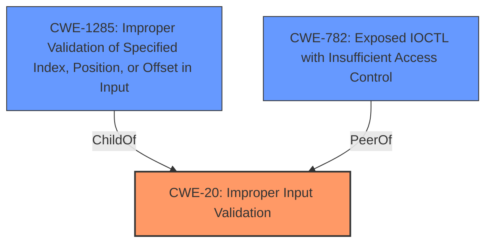

# Raw Analyzer Response for CVE-2020-12981

# Summary
| CWE ID  | CWE Name                                                        | Confidence | CWE Abstraction Level | CWE Vulnerability Mapping Label | CWE-Vulnerability Mapping Notes |
| ------- | --------------------------------------------------------------- | ---------- | --------------------- | ------------------------------- | ------------------------------- |
| CWE-20  | Improper Input Validation                                       | 0.90       | Class                 | Primary                         | Discouraged                   |
| CWE-782 | Exposed IOCTL with Insufficient Access Control                  | 0.60       | Variant               | Secondary                       | Allowed                         |
| CWE-1285 | Improper Validation of Specified Index, Position, or Offset in Input | 0.50       | Base                 | Secondary                       | Allowed                         |

## Evidence and Confidence

*   **Confidence Score:** 0.75
*   **Evidence Strength:** HIGH

## Relationship Analysis
The primary CWE selected is CWE-20 (Improper Input Validation), a Class-level CWE. While normally discouraged, in this case it reflects the high-level description of the vulnerability, where **insufficient input validation** is the root cause. CWE-20 is a parent of CWE-1285 (Improper Validation of Specified Index, Position, or Offset in Input). We also considered CWE-782 (Exposed IOCTL with Insufficient Access Control) which is related to the AMD Graphics Driver context.

## Vulnerability Chain
The vulnerability chain starts with the **insufficient input validation** (CWE-20) in the AMD Graphics Driver, which allows unprivileged users to unload the driver, leading to memory corruption in high-privileged processes. This, in turn, leads to potential escalation of privileges or denial of service.
  - CWE-20 (Improper Input Validation) -> Memory Corruption -> Escalation of Privilege / Denial of Service

## Summary of Analysis
Initially, the analysis focused on identifying the root cause and potential impact of the vulnerability. The vulnerability description clearly states "**insufficient input validation**" as the primary weakness. The retriever results also listed CWE-20, CWE-1285, and CWE-782 as potential candidates.

The AMD Security Bulletin states: "**Root cause of vulnerability:** Insufficient input validation in the AMD Graphics Driver for Windows 10."

The selection of CWE-20 as the primary CWE is based on the explicit mention of **insufficient input validation** in both the vulnerability description and the CVE reference. While CWE-20 is generally discouraged due to its high-level nature, in this specific case, it accurately reflects the provided information.

CWE-782 (Exposed IOCTL with Insufficient Access Control) was considered as a secondary CWE due to the vulnerability residing within the AMD Graphics Driver, which likely involves IOCTLs for communication. However, without specific details about an exposed IOCTL, this remains a speculative but plausible classification.

CWE-1285 (Improper Validation of Specified Index, Position, or Offset in Input) was also considered because it is a child of CWE-20 and represents a more specific type of input validation issue. However, the available information does not provide enough detail to confirm whether the input validation failure relates to an index, position, or offset, so its confidence is low.

Relevant CWE Information:

# Enhanced Context (25 CWEs)
The following CWEs were identified as potentially relevant to this vulnerability:

## CWE-274: Improper Handling of Insufficient Privileges
**Abstraction Level**: Base
**Similarity Score**: 0.78
**Source**: dense

**Description**:
The product does not handle or incorrectly handles when it has insufficient privileges to perform an operation, leading to resultant weaknesses.

**Mapping Guidance**:
- Usage: Discouraged
- Rationale: This CWE entry could be deprecated in a future version of CWE.

## CWE-653: Improper Isolation or Compartmentalization
**Abstraction Level**: Class
**Similarity Score**: 0.77
**Source**: dense

**Description**:
The product does not properly compartmentalize or isolate functionality, processes, or resources that require different privilege levels, rights, or permissions.

**Mapping Guidance**:
- Usage: Allowed
- Rationale: This CWE entry is at the Base level of abstraction, which is a preferred level of abstraction for mapping to the root causes of vulnerabilities.

## CWE-266: Incorrect Privilege Assignment
**Abstraction Level**: Base
**Similarity Score**: 0.77
**Source**: dense

**Description**:
A product incorrectly assigns a privilege to a particular actor, creating an unintended sphere of control for that actor.

**Mapping Guidance**:
- Usage: Allowed
- Rationale: This CWE entry is at the Base level of abstraction, which is a preferred level of abstraction for mapping to the root causes of vulnerabilities.

## CWE-280: Improper Handling of Insufficient Permissions or Privileges 
**Abstraction Level**: Base
**Similarity Score**: 0.76
**Source**: dense

**Description**:
The product does not handle or incorrectly handles when it has insufficient privileges to access resources or functionality as specified by their permissions. This may cause it to follow unexpected code paths that may leave the product in an invalid state.

**Mapping Guidance**:
- Usage: Allowed
- Rationale: This CWE entry is at the Base level of abstraction, which is a preferred level of abstraction for mapping to the root causes of vulnerabilities.

## CWE-267: Privilege Defined With Unsafe Actions
**Abstraction Level**: Base
**Similarity Score**: 0.75
**Source**: dense

**Description**:
A particular privilege, role, capability, or right can be used to perform unsafe actions that were not intended, even when it is assigned to the correct entity.

**Mapping Guidance**:
- Usage: Allowed
- Rationale: This CWE entry is at the Base level of abstraction, which is a preferred level of abstraction for mapping to the root causes of vulnerabilities.

## CWE-667: Improper Locking
**Abstraction Level**: Class
**Similarity Score**: 0.75
**Source**: dense

**Description**:
The product does not properly acquire or release a lock on a resource, leading to unexpected resource state changes and behaviors.

**Mapping Guidance**:
- Usage: Allowed-with-Review
- Rationale: This CWE entry is a Class and might have Base-level children that would be more appropriate

## CWE-404: Improper Resource Shutdown or Release
**Abstraction Level**: Class
**Similarity Score**: 0.74
**Source**: dense

**Description**:
The product does not release or incorrectly releases a resource before it is made available for re-use.

**Mapping Guidance**:
- Usage: Allowed-with-Review
- Rationale: This CWE entry is a Class and might have Base-level children that would be more appropriate

## CWE-668: Exposure of Resource to Wrong Sphere
**Abstraction Level**: Class
**Similarity Score**: 0.74
**Source**: dense

**Description**:
The product exposes a resource to the wrong control sphere, providing unintended actors with inappropriate access to the resource.

**Mapping Guidance**:
- Usage: Discouraged
- Rationale: CWE-668 is high-level and is often misused as a catch-all when lower-level CWE IDs might be applicable. It is sometimes used for low-information vulnerability reports [REF-1287]. It is a level-1 Class (i.e., a child of a Pillar). It is not useful for trend analysis.

## CWE-664: Improper Control of a Resource Through its Lifetime
**Abstraction Level**: Pillar
**Similarity Score**: 0.74
**Source**: dense

**Description**:
The product does not maintain or incorrectly maintains control over a resource throughout its lifetime of creation, use, and release.

**Mapping Guidance**:
- Usage: Discouraged
- Rationale: This CWE entry is high-level when lower-level children are available.

## CWE-1289: Improper Validation of Unsafe Equivalence in Input
**Abstraction Level**: Base
**Similarity Score**: 0.74
**Source**: dense

**Description**:
The product receives an input value that is used as a resource identifier or other type of reference, but it does not validate or incorrectly validates that the input is equivalent to a potentially-unsafe value.

**Mapping Guidance**:
- Usage: Allowed
- Rationale: This CWE entry is at the Base level of abstraction, which is a preferred level of abstraction for mapping to the root causes of vulnerabilities.

## CWE-367: Time-of-check Time-of-use (TOCTOU) Race Condition